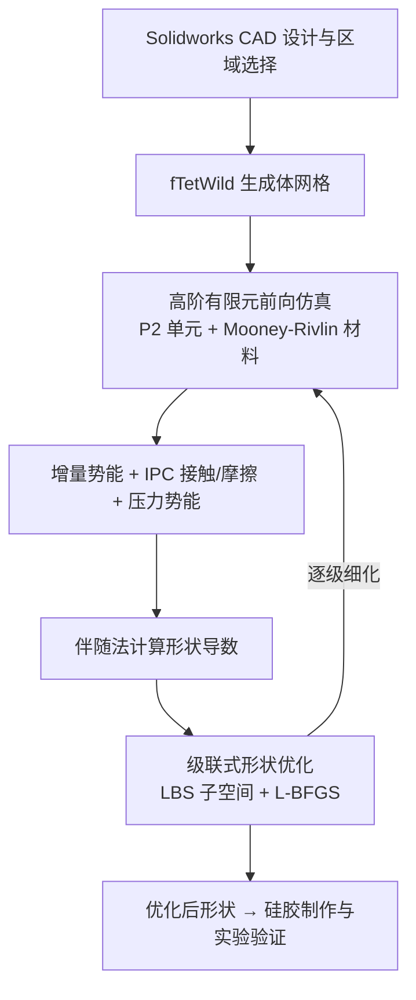

## 一句话总结

提出一套基于可微仿真的计算设计流水线，通过优化气动软体机器人内部气腔的形状，让机器人在充气后达到指定的形变、位姿或接触力，并通过硅胶实物制作验证。

## 研究背景

嵌入软材料中的气腔是构建软体机器人的主流方式，可用于抓取易碎物体、在复杂地形中移动或在充放气时呈现指定形状。但设计满足艺术与功能需求的气动软体驱动器仍然困难，尤其是在设计阶段就需要考虑摩擦接触的情况。

已有工作大多依赖手工试错或仿真驱动的探索，优化驱动的设计方法关注较少，且缺乏能在富接触场景下做出显著设计变更的技术。本文的目标是构建一个可微仿真框架，用于软体机器人的形状优化，使其在与环境交互时满足用户指定的几何与力学要求。作者对仿真器提出三点要求：一是对可形变模型的高精度仿真以贴近真实行为，二是对任意几何的鲁棒摩擦接触支持，三是对依赖数千个参数的时变仿真的高效形状导数计算。

## 方法

整体框架建立在 Huang 等人提出的可微增量势能求解器之上，作者在其基础上增加了气动驱动的压力势能、面向接触力与形变的目标函数，并设计了级联式形状优化以及从 CAD 到有限元模型的建模管线。

关键设计如下。

前向仿真采用增量势能接触（IPC）弹性动力学，下一时间步的位移通过一个无约束非线性能量最小化求得：

$$u_{t+1} = \arg\min_{u} E(u, u_t, v_t) + B(x + u) + D(x + u)$$

其中 $E$ 是时间步进增量势能，$B$ 是接触屏障势能，$D$ 是摩擦耗散势能。仿真使用二次（P2）高阶单元与 Mooney-Rivlin 材料，作者的细化研究表明线性（P1）单元存在严重的锁定现象，需要二次单元才能忠实捕捉气动软体的大形变。

压力边界条件是核心贡献之一。给定气腔从体积 $V_0$ 充到 $V_1$ 所做的功为：

$$W = \int_{V_0}^{V_1} P(V)\, dV$$

在等压情形下，气腔 $\Omega(x+u)$ 的势能写为：

$$E_p(x, u) = P \cdot \bigl(V(\Omega(x + u)) - V(\Omega(x))\bigr)$$

该项被加入 IPC 势能，其梯度与 Hessian 借助散度定理将体积转化为表面积分来计算。由于气腔需要留孔连接外部气泵，作者利用 Dirichlet 边界固定开口边界的性质，使该公式同样适用于开放曲面。

接触力目标方面，作者指出直接积分表面牵引力 $T = \hat{n} \cdot \sigma$ 只在细网格上准确，粗网格上会产生与力平衡不一致的伪造力。因此改用接触势能的梯度作为代理，它对离散化更不敏感：

$$J_c(x, u) = -\sum_{k \in C} \left\lVert \frac{\partial}{\partial x} b(d_k(x + u)) \right\rVert_2^2$$

其中 $C$ 是所有发生碰撞的图元对集合，$d_k$ 为图元对间的点距，$b$ 为屏障势能。此外还引入了最小壁厚目标（满足制造约束）与形状匹配目标（匹配充气后的目标几何）。

级联式形状优化用于应对问题规模大、局部极小多的困难。作者用线性混合蒙皮（LBS）子空间参数化静止位姿的形变，权重采用有界双调和权重（BBW）。优化从少量控制点开始，逐轮增加采样点数量 $n_{i+1} = n_i \cdot a$，先在低分辨率下探索大尺度形状变化，再逐步细化高频细节。实验表明该策略比在全网格顶点空间上直接优化能达到显著更低的能量。

## 实验结果

作者在两个艺术类与两个功能类例子上验证方法。青蛙与手指用于匹配艺术目标形变，夹爪与蠕虫用于功能优化。夹爪与蠕虫的定量结果如下：

| 例子 | 目标 | 基线 | 优化后 |
| --- | --- | --- | --- |
| 夹爪 | 对圆柱的总接触力 | 5.2 N | 9.5 N |
| 夹爪（消融：仅形状匹配 vs 加接触力目标） | 总接触力 | 约 6 N | 约 9.5 N |
| 蠕虫 | 前向移动速度 | 20 cm/min | 31 cm/min（约快 50%） |

青蛙例子中，优化后气腔能让脖颈在充气（55 kPa）时鼓起而面部与四肢基本不动，与实物行为高度吻合；手指例子中，仅用单个气腔、单一各向同性材料，优化设计在 120 kPa 下就实现了指尖位移约为手指长度 50% 的弯曲目标。压力实现通过硅胶闭腔压缩实验得到定量验证。

## 亮点与局限

亮点在于将高阶有限元的高精度仿真、IPC 摩擦接触与伴随法形状导数统一到气动软体设计中，并用真实硅胶实物验证了整条流水线；用接触势能梯度替代牵引力作为优化代理，以及级联 LBS 子空间优化，都是应对离散化敏感性与局部极小的实用设计；CAD 到有限元的管线降低了迭代成本。

局限主要是计算成本高，复杂场景（大形变、富接触）的前向仿真单次可达数十分钟，夹爪与蠕虫的总优化时间分别约 168 与 134 小时。方法目前固定驱动参数、面向离线设计，蠕虫例子因多气腔精确压力控制的复杂性未做实物制作。

## 延伸思考

作者指出的自然延伸是将驱动参数（如压力控制）纳入设计优化，同时求解最优形状与最优控制，文中已用一个简单 2D 步行者展示了对压力控制的可微性。更进一步，传感器布置与驱动是对偶且紧密相关的问题，把设计、驱动与感知协同优化，有望推动通用、自主软体机器人的快速制造。此外，如何降低高精度仿真的计算成本（例如模型降阶或代理模型）是让该流水线更实用的关键方向。
