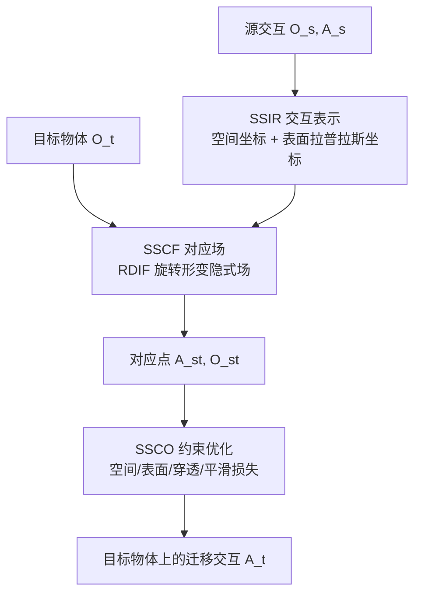

## 一句话总结

本文提出交互迁移（interaction transfer）的新方法：把一段源交互用"空间 + 表面"联合表示（SSIR）刻画，再借助可学习的旋转形变隐式场把源物体空间中的智能体点和物体点对应到目标物体空间（SSCF），最后在这些对应点与交互表示的约束下优化智能体姿态（SSCO），从而在几何与拓扑差异较大的同类物体间实现更准确、更合理的交互迁移。

## 研究背景

交互（interaction）是理解 3D 物体的核心，在游戏、影视、AR/VR 与机器人中都有广泛应用。但让智能体自动推断并执行与 3D 物体的交互仍然困难：传统做法要么靠美术手工设计，要么靠动作捕捉记录，成本高、难以规模化。

本文关注的思路是"交互迁移"——不直接推断交互，而是把已有的交互数据适配到几何结构相似的新物体上。要注意它与常见的"动作重定向（motion retargeting）"不同：重定向是把姿态从一个角色迁到另一个体型不同的角色，而物体不变；本文则是智能体（agent）不变，交互的物体在变，目标是让智能体在新物体上呈现与源交互相似的空间关系。当智能体是人体或手这类可形变的参数化模型时，这个问题尤其棘手。

已有方法主要分两派，各有短板：

- 表面对应派：用稠密表面对应把接触点从源物体迁到目标物体，再用接触点引导姿态优化。但接触点通常是局部且稀疏的，结果对表面对应的质量非常敏感。
- 空间对应派：Kim 等人直接把智能体所有点映射到目标空间中的期望位置，但需要网格输入和复杂预处理（要转成亏格零的水密网格）；Simeonov 等人的神经描述子场（NDF）在物体的 SE(3) 等变神经场中通过特征匹配优化智能体全局位姿，提供全局连续的点迁移，但不显式考虑局部细节，且 NDF 基于点的占据（occupancy）学习、面向简单二指夹爪设计，难以支撑人体、手这类可形变智能体的复杂交互。

本文的动机就是把两派统一起来：既保留全局空间关系，又保留局部表面细节。

## 核心方法

方法分三步：交互表示（SSIR）、对应场（SSCF）、约束优化（SSCO）。

记物体点云为 $O = \{o_i\}$，可形变智能体为 $A(\Pi, \Theta) = \{a_i\}$，由刚体变换 $\Pi$ 与关节角 $\Theta = \{\theta_i\}$ 参数化。给定源交互 $(O_s, A_s)$ 和目标物体 $O_t$，目标是求解智能体参数 $A_t = (\Pi_t, \Theta_t)$，使 $O_t$ 与 $A_t$ 的交互相似于源交互。

### SSIR：空间与表面联合的交互表示

SSIR 同时编码交互的全局位置与局部几何细节。

- 空间部分：用智能体点相对物体中心的空间坐标 $A_s - c_s$ 表示。由于假设所有物体都以原点为中心，空间表示可简记为 $A_s$，用来编码智能体在物体空间中的全局位置。
- 表面部分：用基于图的拉普拉斯坐标 $\delta_i^s$ 描述每个智能体表面点的局部几何，它能保留局部拓扑、抑制形变时的自穿插。具体做法是对 $(O_s, A_s)$ 所有点做 Delaunay 四面体化，用四面体的边构造图连接 $G$，拉普拉斯坐标定义为智能体点与其图邻域点线性组合之差：

$$\delta_i^s = \mathcal{L}_G(a_i^s) = a_i^s - \sum_{j \in \mathcal{N}_A(i)} w_{ij} a_j^s - \sum_{j \in \mathcal{N}_{O_s}(i)} w_{ij} o_j^s$$

$$\text{s.t.} \quad \sum_{j \in \mathcal{N}_A(i)} w_{ij} + \sum_{j \in \mathcal{N}_{O_s}(i)} w_{ij} = 1$$

其中 $\mathcal{N}_A(i)$、$\mathcal{N}_{O_s}(i)$ 分别是 $a_i^s$ 在智能体点和源物体点中的图邻域，权重 $w_{ij}$ 与边长成反比并归一化。注意邻域既包含智能体自身的点，也包含源物体的点，因此这个表示天然编码了智能体表面相对物体的局部关系。

### SSCF：空间与表面对应场

对应场基于 DIF（Deformed Implicit Field）。DIF 用两个神经场 $T$ 和 $D$ 表示物体的有向距离场（SDF）：$T: p \to s$ 是同类物体共享的模板 SDF 场，$D: (p, \alpha) \to (v, \Delta s)$ 是以形状码 $\alpha$ 为条件的形变与修正场，某点 SDF 为 $s = T(p + v) + \Delta s$。

本文提出 RDIF（Rotated and Deformed Implicit Field），把 DIF 扩展到任意旋转的物体——这在交互迁移中很常见。RDIF 增加一个形状编码器 $E: O \to (\bar{\alpha}, R)$，输出旋转不变的形状码 $\bar{\alpha}$ 和把物体对齐到模板场的旋转矩阵 $R$，查询点 $p$ 的 SDF 定义为：

$$s = T(Rp + v) + \Delta s$$

为了对同一物体的任意旋转实例都产生相同的 $\bar{\alpha}$，编码器由两个用旋转等变的 Vector Neuron（VN）层实现的子模块组成：$E_\alpha: O \to \alpha$ 与 $E_R: \alpha \to R$。VN 层的输入输出都是 3D 向量矩阵，输入上的旋转可跨网络传递，即 $E_\alpha(O R^T) = E_\alpha(O) R^T$；再用 $E_R$ 从 $E_\alpha$ 的输出提取 $R$，旋转不变的形状码构造为 $\bar{\alpha} = E_\alpha(O R^T) R = E_\alpha(O)$。网络以自监督方式训练：同一点在旋转前后共享同样的真值 SDF，因此无需旋转真值就能学到规范姿态（canonical pose）和每个输入的对齐旋转，训练损失沿用 DIF。

点对应：把 RDIF 学到的模板场当作对应场。记查询点在模板场中的旋转形变后位置为 $\tilde{p} = \bar{p} + v = Rp + v$。

- 物体点对应：把源物体表面点 $o_i^s$ 对应到模板场中距离最近的目标物体表面点：

$$o_i^{st} = o_j^t, \quad \text{where} \quad j = \arg\min_{j} \lVert \tilde{o}_i^s - \tilde{o}_j^t \rVert$$

- 智能体点对应：智能体点在物体空间中而非表面，因此在目标物体周围稠密采样一组空间点 $X^t$ 来计算最近对应：

$$a_i^{st} = x_j^t, \quad \text{where} \quad j = \arg\min_{j} \lVert \tilde{a}_i^s - \tilde{x}_j^t \rVert$$

这一步同时给出了表面对应（物体点）与空间对应（智能体点），是"空间 + 表面"统一的关键。

### SSCO：空间与表面约束的优化

拿到源交互 $(A_s, O_s)$ 与对应点 $(A_{st}, O_{st})$ 后，在智能体参数空间 $\{\Theta, \Pi\}$ 上优化，用四类损失引导：

空间损失，把对应的智能体点作为当前智能体点的直接位置参考：

$$L_{\text{spatial}}(\Theta, \Pi) = \sum_i \lVert a_i - a_i^{st} \rVert^2$$

表面损失，用源拉普拉斯坐标保持当前智能体表面相对 $O_{st}$ 的局部细节（$R_i$ 用于对齐法向，因为拉普拉斯坐标不是旋转不变的）：

$$L_{\text{surface}}(\Theta, \Pi) = \sum_i \lVert \mathcal{L}_G(a_i) - R_i \delta_i^s \rVert^2$$

穿透损失，检测落在智能体内部的物体点 $O_{tin}$ 并最小化其到最近智能体点的距离：

$$L_{\text{pen}}(\Theta, \Pi) = \sum_{o \in O_{tin}} \min_i \lVert a_i - o \rVert^2$$

平滑项，对交互序列约束相邻姿态的时间连续性：

$$L_{\text{smooth}}(\Theta_k, \Theta_{k-1}) = \lVert \Theta_k - \Theta_{k-1} \rVert^2$$

单次交互的总损失为 $L_{\text{SSCO}} = \lambda_1 L_{\text{spatial}} + \lambda_2 L_{\text{surface}} + \lambda_3 L_{\text{pen}}$，优化时对关节角变化施加约束 $\lvert \theta_i - \theta_i^s \rvert \le \gamma_\theta$（实验中损失权重取 1、$\gamma_\theta = 10°$）。对交互序列则一次优化 $K = 12$ 帧并加权平滑项（$\lambda_4 = 0.01$），采用步长 6 帧的滑动窗口覆盖整段序列。

## 技术细节

- 数据：人-椅交互源自 CHAIRS 数据集（人体用 SMPL-X），手-物交互源自 OakInk-Core（手用 MANO）。目标物体从 ShapeNet 随机取同类，以及 ScanNet 的真实椅子扫描。
- 训练：ShapeNet 中椅子和杯子按 90%/10% 划分训练/测试，数据增强含 $[0.75, 1.25]$ 随机缩放与 $SO(3)$ 随机旋转；Adam 优化，初始学习率 0.0001，每 100 epoch 减半。
- 推理：空间点对应用目标空间中边分辨率 128 的网格点作为 $X^t$；交互优化用梯度下降，学习率 0.01（每 10 次迭代减半），梯度裁剪最大范数 0.01，迭代达 100 次或损失变化小于 0.0001 时停止。

## 实验结果

评测指标沿用 OakInk：穿透深度（Dep.）、实体相交体积（Vol.）衡量几何正确性；接触交并比（IoU）衡量与源交互的相似度；并统计平均迁移时间。基线包括表面派的 CPD、LS-NRR、Tink，以及空间派的 SpatialMap、NDF；作者还把 Tink 的表面对应替换为自己的，得到 "Tink (ours)"。除 NDF 外的基线都假设源/目标物体已在规范姿态对齐，为公平比较，作者把自己学到的物体旋转提供给它们。

人-椅交互定量对比（部分）：

| 类别 | 方法 | Dep. ↓ | Vol. ↓ | IoU ↑ | Time ↓ |
| --- | --- | --- | --- | --- | --- |
| 表面派 | CPD | 0.81 | 8.01 | 15.6 | 30.1 |
| 表面派 | Tink | 0.84 | 6.98 | 15.9 | 25.6 |
| 表面派 | Tink (ours) | 0.83 | 6.30 | 15.5 | 2.9 |
| 空间派 | SpatialMap | 0.80 | 6.49 | 15.5 | 9.7 |
| 空间派 | NDF | 0.69 | 4.23 | 15.8 | 8.0 |
| 空间派 | 本文 | **0.49** | **3.18** | **21.3** | 4.3 |

手-杯交互定量对比（部分）：

| 类别 | 方法 | Dep. ↓ | Vol. ↓ | IoU ↑ | Time ↓ |
| --- | --- | --- | --- | --- | --- |
| 表面派 | Tink | 0.75 | 5.18 | 12.2 | 25.8 |
| 空间派 | SpatialMap | 0.68 | 4.48 | 12.4 | 7.5 |
| 空间派 | NDF | 0.63 | 3.19 | 7.9 | 4.0 |
| 空间派 | 本文 | **0.56** | **2.99** | **14.1** | 3.2 |

主要发现：仅靠表面接触点对应的方法（CPD、LS-NRR、Tink）在穿透指标上明显劣于引入空间对应的方法；本文在空间派内部又以显著优势领先穿透指标，同时保持最高接触 IoU，说明迁移结果既更少穿透、又更相似于源交互。得益于高效的对应，本文与 Tink (ours) 的时间开销也最低。在 OakInk 其他类别（圆柱瓶、扳机喷雾器、笔、相机、耳机）上，SpatialMap 与 NDF 在简单物体上尚可，但在复杂物体上吃力；本文在各类别上给出最平衡的穿透/接触表现，平均最好。真实扫描（ScanNet）无需重训练即可对齐并迁移交互，展示了鲁棒性。

消融实验（人-椅）：把旋转不变编码器 $E$ 换成普通 PointNet 编码器（退化为带旋转输出的 DIF）后，穿透与接触 IoU 都变差，说明 DIF 本身难以从任意旋转的训练数据中学到有效模板场；去掉 $L_{\text{pen}}$ 会增大相交体积但略升接触相似度；只用 $L_{\text{spatial}}$ 时接触相似度高但穿透差，只用 $L_{\text{surface}}$（可视为把 Ho 等人的运动适配扩展到交互迁移）形变稀疏局部、穿透低但相似度低；完整方法在相似度与几何合理性之间取得最佳平衡。

## 贡献与局限

贡献：

- 提出 SSIR，用"空间坐标 + 图拉普拉斯坐标"同时编码交互的全局与局部特征。
- 提出 SSCF，基于扩展到任意旋转的 RDIF，建立一个统一同时给出表面与空间对应的框架。
- 提出 SSCO，在对应点与交互表示约束下优化智能体，保证迁移的准确性与合理性。因为用神经隐式场建立对应，方法能处理源/目标物体较大的拓扑变化。

局限：

- 假设物体尺度相近，在 $\pm 25\%$ 缩放范围内（与训练增强一致）表现良好，超出该范围可能生成不合理交互或给出不准确对应。
- 对拓扑相同但交互区域几何差异很大的物体可能失败，例如把单座椅的坐姿迁到双人沙发时，中间扶手被错误对应为座面；或把抓握从一个杯子迁到把手小得多的杯子时，空间不足以为三根手指建立对应。作者认为引入更高层的语义或功能理解有望缓解这些问题。

## 延伸思考

这篇工作最有价值的洞见是把"空间对应"和"表面对应"这两条一直分立的技术路线，用同一个可学习的隐式模板场统一了起来：模板场既作为表面配准的形变场，又作为把空间点搬运到目标空间的空间对应场。RDIF 用 Vector Neuron 引入旋转等变，让方法摆脱了"必须预先对齐到规范姿态"的强假设，这对真实扫描这类姿态任意的数据尤其关键，也是它能直接迁移到 ScanNet 而无需重训练的原因。

从更大的图景看，交互迁移本质是"关系的迁移"而非"几何的迁移"，本文用拉普拉斯坐标保住局部关系、用空间坐标保住全局关系，给可形变智能体的关系迁移提供了一个干净的分解。其失败案例也指向下一步方向：纯几何对应无法理解"扶手 vs 座面""几根手指需要多大把手"这类功能语义，把功能/可供性（affordance）理解接入对应场，可能是让这类方法从同类同尺度物体走向跨结构、跨尺度泛化的关键。
