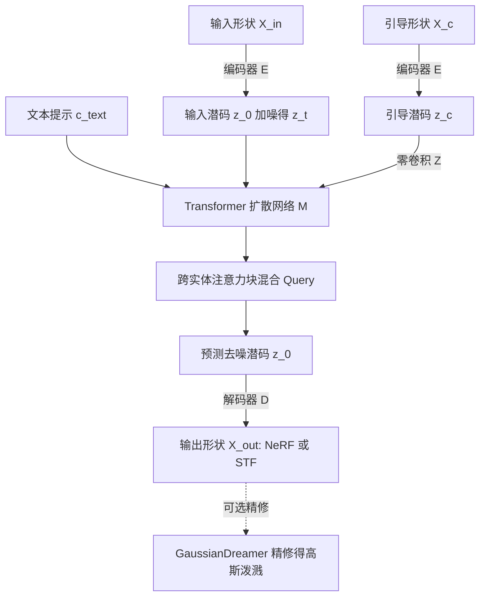

## 一句话总结

Spice·E 通过一种跨实体注意力（cross-entity attention）机制，为预训练的 Transformer 型 3D 扩散模型（Shap·E）注入结构性引导，使其在保留原有生成能力的同时，能在数秒内完成语义形状编辑、抽象到 3D、3D 风格化等多种 3D 到 3D 任务。

## 研究背景

文本引导的 3D 生成近年进展迅速，但依赖预训练 2D 扩散模型（如 Stable Diffusion）在多视角渲染上做优化的方法，为生成单个样本往往需要漫长的优化过程，难以实用。与此同时，在百万级 3D 数据集上直接训练的 3D 扩散模型（如 Shap·E）能在数秒内生成高质量、文本条件的 3D 资产，速度快出几个数量级。

然而这类直接生成的 3D 扩散模型本质上是无约束的，缺乏在生成过程中施加结构先验的能力，因而无法有效用于 3D 编辑场景。作者受 2D 领域 ControlNet 为扩散模型添加条件控制的启发，提出核心问题：如何在不访问（可能私有的）训练数据、也不依赖大规模算力集群的前提下，为预训练的 Transformer 型 3D 扩散模型提供任务特定的结构控制，同时保留其生成表达力。这要求在微调时最大化利用预训练权重，又能从辅助引导形状中学到任务特定的结构先验。

## 方法

整体框架：以 Shap·E 作为参考 3D 扩散模型。Shap·E 用编码器 $$E$$ 将 3D 形状 $$X$$ 映射为潜表示 $$z = E(X)$$（潜维度 $$d = 1024$$），该潜表示经解码器 $$D$$ 可线性投影为 NeRF 或带符号纹理场（STF）的权重。Spice·E 冻结编码器 $$E$$，在「输入形状与引导形状」配对数据上微调扩散模型，把每个自注意力块替换为跨实体注意力块，从而让模型在文本提示之外，还能以一个条件引导 3D 形状 $$X_c$$ 作为结构约束。

关键设计：

- 自注意力回顾：在每个自注意力层 $$l$$，中间特征 $$\phi_l(z_t)$$ 经线性层投影为 $$K = f_K(\phi_l(z_t))$$、$$Q = f_Q(\phi_l(z_t))$$、$$V = f_V(\phi_l(z_t))$$，注意力为
$$Attn(Q, K, V) = \mathrm{softmax}\left(\frac{Q \cdot K^{T}}{\sqrt{d}}\right) V$$

- 跨实体注意力（核心贡献）：输入是一对潜向量 $$(z, c)$$，其中 $$z$$ 是加噪潜码，$$c$$ 是编码结构信息的条件潜码。为保留原网络能力，先对 $$c$$ 施加零卷积算子 $$Z$$（权重与偏置初始化为零的 $$1 \times 1$$ 卷积，源自 ControlNet），保证训练开始时条件潜码不影响网络。机制只在 Query 上混合，因为目标是操纵 $$z$$ 所编码形状的结构而保留其外观：
$$Q_{\times} = f_Q(\phi(z)) + f_{Q_c}(Z(\phi_c(c)))$$
输出为 $$z_{out} = Attn(Q_{\times}, K, V)$$。其中 $$f_{Q_c}$$ 与 $$\phi_c(c)$$ 为随机初始化的可学习线性层与中间特征。直观上，微调开始时它等价于一个功能完整的自注意力块，随微调推进网络逐层学会利用引导形状的信息。这与只用条件 Query、无法保留自注意力成分的简单交叉注意力形成对比。为避免过拟合，$$\phi_c$$ 对各块取常量，而非像 $$\phi_l(z)$$ 那样逐层依赖。

- 训练目标：给定输入潜码 $$z_0 = E(X_{in})$$、时间步 $$t$$、文本提示 $$c_{text}$$ 与引导潜码 $$z_c$$，模型 $$M_{\theta}$$ 直接预测去噪潜码，沿用 Shap·E 的目标：
$$L = \mathbb{E}_{z_0, t, c_{text}, c_0} \lVert M_{\theta}(z_t, t, c_{text}, z_c) - z_0 \rVert_{2}^{2}$$
推理时系统只需引导形状 $$X_c$$ 编码得到的 $$z_c$$、随机噪声 $$z_T$$ 与文本提示，逐步去噪为 $$\hat{z}_0$$ 再解码为输出形状。

- 可选精修：可将 GaussianDreamer 中的 Shap·E 初始化替换为 Spice·E 输出，用分数蒸馏优化高斯，得到更精细的高斯泼溅，但生成时间从约 20 秒增至约 15 分钟。其余结果均不含精修。

## 实验结果

作者在三个文本条件 3D 到 3D 任务上验证：语义形状编辑（ShapeTalk 数据集）、文本条件抽象到 3D（ShapeNet 立方体基元代理）与 3D 风格化（Objaverse）。

语义形状编辑（LAB 越高编辑越语义准确）：

| 方法 | LAB↑ | GD↓ | l-GD↓ | CD↓ |
| --- | --- | --- | --- | --- |
| ChangeIt3D | 0.27 | 0.003 | 0.009 | 0.05 |
| Ours | 0.44 | 0.007 | 0.013 | 0.05 |

文本条件抽象到 3D：

| 方法 | CLIP-Sim↑ | CLIP-Dir↑ | GD↓ | 运行时间 |
| --- | --- | --- | --- | --- |
| SketchShape | 0.27 | 0.01 | — | 约 15 分钟 |
| Fantasia3D | 0.27 | 0.01 | 0.06 | 约 30 分钟 |
| Ours | 0.28 | 0.03 | 0.01 | 约 20 秒 |

3D 风格化：

| 方法 | CLIP-Sim↑ | CLIP-Dir↑ | GD↓ | 运行时间 |
| --- | --- | --- | --- | --- |
| Latent-Paint | 0.27 | 0.01 | — | 约 15 分钟 |
| Fantasia3D-Paint | 0.28 | 0.01 | — | 约 15 分钟 |
| Fantasia3D | 0.28 | 0.01 | 0.06 | 约 30 分钟 |
| Ours | 0.27 | 0.01 | 0.01 | 约 20 秒 |

消融方面，在抽象到 3D 任务上比较多种基线的 GD：Shap·EFT 为 0.06、SDEdit3D 为 0.05、CrossOnly 为 0.03、ControlNet3D 为 0.03，均显著差于本方法的 0.01。作者指出 ControlNet3D 需优化的额外参数远多于本方法（330M 对 50M），在较小数据集上更易过拟合、遗忘预训练知识。

## 亮点与局限

亮点：跨实体注意力仅通过混合 Query 特征就把结构先验注入预训练 3D 扩散模型，无需为特定任务定制网络结构或训练目标；相比基于优化蒸馏的方法快出几个数量级（约 20 秒对 15 至 30 分钟）；在语义编辑上 LAB 明显更高，在抽象到 3D 与风格化上以远低的 GD 忠实保留引导结构。该机制可迁移到其它 Transformer 型 3D 扩散骨干，随更强骨干出现可实现更强编辑。

局限：方法继承了所构建骨干 Shap·E 的缺陷，Shap·E 难以将多个属性绑定到物体、且对高度复杂形状常编码失败，导致训练与评测数据含噪；方法对「引导形状忠实度」与「文本一致性」之间的权衡缺乏显式控制，结果有时功能上不合理（如桌腿使桌子难以正常使用），有时又不足以保留引导结构。

## 延伸思考

Spice·E 展示了一条低成本路径：在不触碰专有数据与大算力集群的前提下，用极少额外参数把「可控性」补进已经很强的预训练生成模型，这与 ControlNet 在 2D 领域的思路一脉相承。其对 Query 与 Key/Value 分工的利用（结构由 Query 主导、外观由 Key/Value 保留）也为理解注意力在生成模型中的语义角色提供了 3D 侧的佐证。作者提出该跨实体混合机制未必局限于 3D 形状，凡是需要向生成框架注入引导信号的场景都可能受益，这暗示了一种通用的「引导即混合内部表示」的范式。此外，显式建模结构忠实度与文本一致性之间的可调权衡，以及随更强 3D 扩散骨干升级替换，是值得跟进的方向。
