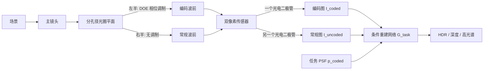

## 一句话总结

把相机光圈"一分为二"——一半用衍射光学元件（DOE）做任务专用编码，另一半保持常规成像，配合手机/单反上普遍存在的双像素（dual-pixel）传感器，在单次曝光、不增大体积的前提下同时拿到一张"编码图"和一张"常规图"，再用后者作为条件去重建 HDR、深度或高光谱，显著缓解计算成像长期存在的重建病态与画质损失问题。

## 研究背景

过去二十年，计算相机（computational cameras）通过"光学 + 算法协同设计"实现了单帧 HDR、大视场、扩展景深、超分辨、高光谱等常规相机做不到的能力。核心思路是用特制光学元件把肉眼/普通传感器捕捉不到的场景信息"编码"进图像里，再用算法解码出来。

但这套范式有两个绕不开的硬伤：

- **重建是病态逆问题。** 光学编码把场景信息打散、叠加，重建时要在传感器噪声和光子噪声中恢复信号，极易产生常规相机没有的伪影。
- **牺牲了常规画质。** 编码光学天然损失高频细节，重建结果画质往往不如普通传感器。加上高分辨率下 image-to-image 神经网络的算力与带宽开销巨大，这类相机至今只在显微成像等少数场景落地；手机厂商宁愿用多摄阵列这种"贵但可行"的方案，也不愿上计算光学。

作者的观察是：如果能在**同一条光路、同一次快门**里，既拿到编码图、又拿到一张几乎完美对齐的常规图，那么常规图就能当作重建的"条件/参考"，既补回高频细节、抑制伪影，又能直接用于取景等下游任务而无需昂贵重建。问题在于——如何在不增大相机体积的前提下把"两个光学系统合成一个"？

## 核心方法

作者的答案是**分孔径 + 分波前**：在光圈平面只对一半孔径施加 DOE 相位调制（编码），另一半不加调制（常规），再借助双像素传感器天然的"左右分光"能力把两路波前在传感器上分开。

### 双像素传感器：天然的分光器

双像素传感器的每个像素在不增大像素间距的情况下被拆成两个独立的光电二极管，分别记录来自光圈左右两个"半圆盘"的光。它本是为相位检测自动对焦（PDAF）设计的：对焦光在两个二极管间几乎零视差，离焦光则呈现深度相关的"离焦视差"。作者反其道而行——不是去利用自然离焦模糊，而是**主动**给一半孔径加上优化过的 DOE 相位，从而让一路二极管拿到任务编码信息、另一路拿到不受干扰的全清晰参考图，而且两路天生对齐、无需配准。

### 双调制成像模型

作者用波动光学推导两路 PSF。点光源经过球面相位、DOE 相位、透镜二次相位累积后传播到传感器，PSF 由角谱传递函数给出：

$$p = \left| \mathcal{F}^{-1}\left\{ \mathcal{F}\{ A(x,y)\exp(j\phi_l) \} \cdot H \right\} \right|^2$$

关键在于振幅函数 $A(x,y)$ 对左右两路取相反的半孔径掩膜（$x<0$ 与 $x>0$），从而得到两路独立 PSF。作者让 DOE 高度场 $h$ 在两半各自取形——本文固定右半不调制（$h_R=0$，产出常规图 $I_\text{uncoded}$），左半施加任务专用调制（产出编码图 $I_\text{coded}$）。整个前向模型对 $h$ 可微，因此 DOE 可通过反向传播优化。

### 条件重建框架

重建网络 $G_\text{task}$ 同时吃编码图、常规图和任务 PSF：

$$I_\text{recon} = G_\text{task}(I_\text{coded} \mid I_\text{uncoded},\, p_\text{coded})$$

统一采用"物理反卷积模块 + 编码器-解码器骨干"的结构：先用可微 Wiener 滤波（DWDN 风格）对编码图做基于特征的逆滤波，再让网络以常规图为条件融合出结果。重建被约束为既符合光学编码效应、又与常规图里的真实场景内容一致，从而压制伪影。

## 技术细节

作者用同一套原则实例化了三种任务相机，差别只在于目标 PSF 与损失函数：

- **HDR 成像。** 目标 PSF 设计成"条纹状"（十字/streak），把过曝高光沿条纹方向扩散、叠加到未过曝区域，相当于在多个位置生成不同曝光的副本。由于常规图已经提供了未过曝区的 LDR 内容，编码半只需专注恢复高光，重建退化为一个去卷积问题。损失为整体 L1 加高光掩膜区域的加权 L1。
- **高光谱成像。** 用光栅状相位刻意引入色散，让焦点位置随波长横向平移（约每 10 nm 移动 1 像素），把 31 通道光谱信息编码进 3 通道 RGB。以常规无色差图为参考，据平移量反解光谱。损失结合 RGB 空间的感知损失（LPIPS）与光谱空间的光谱角映射（SAM）。
- **单目深度。** 采用深度相关的"半环"PSF（半径随深度每 20 cm 增长 1 像素），把绝对深度编码进离焦线索，解决常规相机"焦前/焦后离焦模糊无法区分"的歧义。重建用 ResNet18 分别提取两路特征后共享解码器，损失为深度 L1 加梯度损失。

**真实原型与串扰标定。** 原型用 Canon EOS 5D Mark IV 双像素相机 + Canon EF 50mm f/1.8 STM 镜头，DOE 直径 8.64 mm，16 级光刻工艺制作，3D 打印支架把 DOE 贴在镜头盖玻璃旁（避免拆解商用复合镜头）。实际中双像素左右分光并不理想，离轴光会造成串扰（一路的光被另一路记录）。作者通过遮挡半孔径拍白墙，标定出固定的串扰比 $\alpha$，对中心 $3072\times3072$ 像素做一次性校正，即可反解出干净的编码图与常规图。针对制造误差与合成-真实域差异，重建网络采用两步微调：先用实测 PSF 在合成数据上微调，再用跨模态一致性损失（把重建高光重新代入前向模型，要求生成的编码图与实拍一致）精修。

## 实验结果

三个任务在合成与真实场景上均优于对应基线，且消融显示"去掉常规图、只用编码图"会明显掉点，验证了常规参考图的关键作用。

| 任务 | 指标 | 关键对比 | 结论 |
| --- | --- | --- | --- |
| HDR | RMSE / PSNR（整体与高光区） | vs DeepHDR、CEVR、Rank-1 Optics、Coded-Only | 本方法 PSNR 54.87 dB（高光区 37.68 dB），全面领先；Rank-1 有条纹残留，DeepHDR 只能"编造"高光 |
| 高光谱 | PSNR / SSIM / SAM | vs HRNet、QDO、Coded-Only | PSNR 32.96 dB、SAM 0.15，较 QDO 有 >6 dB PSNR 与 0.25 SAM 优势；HRNet 光谱端部误差大 |
| 单目深度 | MAE / RMSE / log10 / δ<1.25 | vs MiDaS、ZoeDepth、Deep DfD、Coded-Only | MAE 0.086 m、δ<1.25 达 0.993；既有绝对尺度又保细节，优于纯单目（尺度歧义）与纯离焦编码（细节差） |

真实实验中，实测 PSF 与设计 PSF 形状吻合（条纹/彩虹/半环），HDR 能恢复树枝等高光细节，高光谱重建曲线与微型光谱仪实测接近，深度重建与 RealSense L515 LiDAR 参考高度一致（户外强光下 LiDAR 失效，仅与 MiDaS 对比）。

## 贡献与局限

**贡献。**

- 提出单目单帧成像装置，在同一光路同时捕获编码图与常规对齐图，不增大物理体积、不增加重建算力（常规图直接可用）。
- 提出"分孔径可微光学设计"——把光圈分成两个调制区，并与双像素传感器协同设计以解耦两条光路。
- 提出以常规图为条件的重建框架，把 HDR、深度、高光谱统一为"物理反卷积 + 条件网络"。
- 在仿真与真实原型上验证三大应用，全面优于只用常规图的 RGB-to-X 方法与只用编码图的计算光学方法。

**局限。**

- 受限于学术级纳米加工，制造的相位板质量低于业界最先进工艺，且原型采用缩小孔径的"加装式"相位板，而非与镜头一体化协同设计。
- 除深度任务外，其他任务假设场景全清晰（all-in-focus）；若要处理离焦场景内容（如去模糊），需联合求解场景深度。
- 依赖双像素传感器的物理分光能力，串扰需一次性标定校正。

## 延伸思考

这篇工作的巧妙之处在于，它没有去发明新传感器，而是"劫持"了手机/单反里早已量产的双像素结构，把原本服务于自动对焦的左右分光能力，变成了"编码 + 常规"双通道的物理复用手段——这让计算光学第一次有机会以"零额外体积、零额外重建成本拿到常规图"的方式接近消费级落地。作者也指出，考虑到手机相机本身孔径就小，缩小孔径的原型限制未来可通过与手机光学一体化协同设计来消解。更有想象力的是文末提出的方向：主动照明的双孔径相机、用于认证通信的光学签名、乃至光学神经网络计算——分孔径分波前的"一机双用"原则，本质上提供了一个在单一光路里叠加两套光学功能的通用框架。
