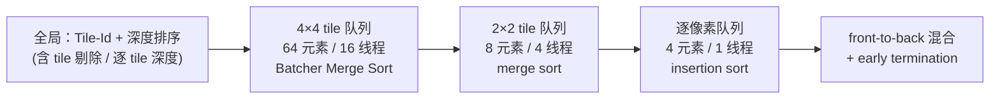

## 一句话总结

作者指出 3D Gaussian Splatting（3DGS）的"popping"（视角旋转时的突变闪烁）源自它对所有高斯用统一的视空间深度做全局排序这一近似；他们改用逐光线的"最大贡献点深度"来排序，并设计了一套分层（4×4 tile → 2×2 tile → 逐像素）的软件光栅化器，在保持与 3DGS 几乎相同渲染速度（平均仅慢 4%）的前提下消除了 popping，实现真正视角一致的实时渲染。

## 研究背景

3DGS 用一组带球谐颜色的各向异性 3D 高斯表示场景，凭借实时、高质量的新视角合成成为主流。但它的高效渲染建立在几个简化之上，其中最关键的一步是排序近似：

- 高斯被压扁成 2D splat（Zwicker 等人的 EWA 溅射），并沿光线用**均值处的单一视空间深度**代替完整的 1D 高斯积分。
- 更进一步，3DGS 用高斯均值 $\mu$ 在视方向 $v$ 上的投影 $t_i = \mu_i^\top v$ 作为深度，**与具体光线 $r$ 无关**，于是可以对整幅图做一次全局排序。

这个"投影到以相机为中心的球壳"的近似在相机平移时排序保持一致，但在**相机旋转**时，两个高斯的相对深度会突然翻转，导致同一几何在不同帧呈现出突变的颜色——这就是 popping。它在 VR 头显转头等场景中尤其刺眼、破坏沉浸感。更糟的是，3DGS 训练时会**利用**这种视角不一致去"作弊"地拟合视相关效果、降低损失。

理想解法是沿每条光线对所有高斯做正确的体积渲染，但实时不可行。退一步的做法是：为每条光线计算高斯贡献最大的位置（即深度），再做正确的逐像素混合。难点在于排序必须**逐光线**进行，而 3DGS 中单条光线常涉及上千个高斯——朴素的逐像素全排序会让渲染慢 100 倍。

## 核心方法

### 逐光线最优深度 $t_{opt}$

作者摒弃"逐高斯统一深度"，改为计算每条光线 $r(t) = o + t\,d$ 上高斯贡献最大的点。对 1D 高斯而言，混合位置的最佳离散近似就是其沿光线的最大值点，由 3D 高斯沿光线的导数求得：

$$t_{opt} = \frac{d^\top \Sigma^{-1} (\mu - o)}{d^\top \Sigma^{-1} d}$$

这个深度**依赖光线方向 $d$**，因此排序顺序在相机旋转下保持稳定，从根本上避免 popping。值得注意的是，$t_{opt}$ 在场景空间是一张随相机位置变化的**曲面**，无法用平面等简单图元传统光栅化，所以必须逐光线计算。对于表面重建里常见的极扁高斯，$\Sigma^{-1}$ 会很大导致数值不稳定，作者把 $S^{-1}$ 的元素上界限制到 $10^3$（等效于给极薄高斯加一点厚度），代价极小。

若直接对每条光线按 $t_{opt}$ 全排序，可以完美消除 popping，但慢 100 倍且无法提前终止（early ray termination 依赖排序结果），既不能实时也拖累训练。

### 从局部重排到分层排序

关键观察：$t_{opt}$ 在相邻光线间是平滑的，因此相邻光线的排序顺序也相近，可以共享排序努力。作者逐级推进：

1. **逐 tile 深度**：沿用 3DGS 的 tile/depth 组合排序键，但把全局深度换成用 tile 中心光线算的逐 tile $t_{opt}$。单独这样做会在 tile 边界产生明显接缝。
2. **局部重排（k-buffer 思想）**：遍历 tile 列表时不立即混合，而在寄存器里维护一个小的重排窗口，用插入排序把新高斯插入；窗口溢出时才混合深度最小的样本。窗口取 16~24 已能消除大部分可见 popping，但运行时增加 2~6 倍。
3. **分层排序光栅化器**（本文最终方案）：在 tile 与线程之间插入多级重排，一边下沉一边细化排序，并在每一级剔除不贡献的高斯以降低排序成本。

### 分层渲染管线

管线用**三级有序队列**，从 4×4 tile 到 2×2 tile 再到单像素：

- **Tile 剔除**：3DGS 用 $\epsilon_O = 1/255$ 的贡献阈值作精确剔除。作者对每个 tile 求 2D 高斯贡献最大的点 $\hat{x} = \arg\max_{x \in X} G_2(x)$（若均值不在 tile 内则落在离均值最近的两条 tile 边上），据此把高斯精确绑定到它真正贡献的 tile，平均每 tile 高斯数减少约 44%。
- **逐 tile 深度调整**：用剔除阶段已算出的最高权重点 $\hat{x}$ 构造光线来评估 $t_{opt}$，比"tile 中心光线"更准，进一步降低排序误差。
- **负载均衡**：覆盖 tile 数少于 32 的高斯由本线程处理；剩下覆盖大屏幕的巨型高斯用 warp 内投票与 shuffle 指令二次分配，近景/高分辨率下可把 Preprocess 与 Duplication 加速最多 10 倍。
- 三级队列大小取 (64/8/4)，只在队列里存高斯 id 和当前级深度，其余信息（$\mu$、$\Sigma^{-1}$ 等）按需从全局内存取回并经 shuffle 在线程间共享。整体有效排序窗口在 **25~72** 之间，几乎与全排序不可区分。

### 反向传播

与 3DGS 反向"从后往前"不同，作者的反向 pass 也走**front-to-back**，避免存储逐像素排序结果的巨大内存开销。利用减法/除法从最终累积色 $C(r)$ 和透射率 $T_{N_r}$ 反推每个高斯之后的贡献：

$$\sum_{j=i+1}^{N_r} c_j \alpha_j \prod_{k=1}^{j-1}(1-\alpha_k) = C(r) - C_i, \qquad \prod_{k=i}^{N_r}(1-\alpha_k) = \frac{T_{N_r}}{T_i}$$

由于先混合的高斯贡献更大、先计算能累积更少浮点误差，梯度甚至可能更准确。作者全程使用稳定排序（Batcher Merge Sort、基于线程 rank 的 merge sort、插入排序），保证前向/反向用完全一致的排序顺序，梯度才正确。

## 实验结果

在 Mip-NeRF 360、Deep Blending、Tanks & Temples 共 13 个真实场景上评测（RTX 4090，Full HD）。

- **图像质量**（PSNR/SSIM/LPIPS/FLIP）：与 3DGS 相当。在 Deep Blending 和 Mip-NeRF 360 户外上略胜 3DGS；在 Tanks & Temples 和室内略逊，作者归因于 3DGS 能靠 popping"作弊"拟合视相关效果。
- **视角一致性**（新提出的指标）：因为标准图像指标测不出 popping，作者用光流（RAFT）把帧 $F_i$ warp 到 $F_{i+t}$，再用 FLIP 度量 warp 帧与真实帧的差异（MSE 对 popping 不敏感，FLIP 更接近人眼翻页对比的感知）。取短程 $t=1$ 与长程 $t=7$。结果本文在几乎所有场景大幅领先，尤其 $\text{FLIP}_7$（如 T&T：本文 0.0113 vs 3DGS 0.0286）。
- **深度一致性**：以 COLMAP 稀疏点云为基准，本文重建点位误差 $E_{depth}$ 平均 0.388，优于 3DGS 的 0.552。
- **用户研究**：18 名参与者对比视频，明显偏好本文（均值分 0.42，Wilcoxon 检验 $p < .0001$）。
- **性能**：无 Opacity Decay 时总耗时 4.99 ms vs 3DGS 4.80 ms，平均仅慢 **4%**（1.04×）。消融显示负载均衡、tile 剔除、分层剔除各自都至关重要（去掉后 Duplicate 慢 5×、Render 显著变慢）。
- **减半高斯**：用 Opacity Decay（每 50 步把不透明度乘 0.9995 替代 3DGS 的 opacity reset）可让高斯数减半（约 1.54M）。此时本文仍保持视角一致，而 3DGS 的 popping 反而加剧——本文因此实现相对 3DGS **2× 内存节省、1.6× 渲染加速**，且质量几乎不可区分。

## 贡献与局限

**贡献**：

- 定位并解释了 3DGS popping 的根因：统一深度的全局排序在旋转下不一致；提出逐光线 $t_{opt}$ 作为视角无关的排序依据。
- 一套分层（tile→tile→pixel）的 compute-mode 软件光栅化器，配合 tile 剔除、逐 tile 深度、两阶段负载均衡，把逐像素排序的开销从 100× 压到平均 4%，并同样高效地支持反向传播。
- 提出基于光流 + FLIP 的自动 popping 检测指标，并用用户研究验证；系统的排序/剔除/深度近似策略分析。
- 代码开源，包含 CUDA 光栅化器与交互式 viewer。

**局限**：

- 重排不保证绝对正确的混合顺序，对极复杂的几何关系仍可能残留 popping 或闪烁。
- 方法仍**忽略高斯沿光线的重叠**，只是更好地近似而非真正的体积渲染；作者认为完整的高斯体积渲染有望既消除伪影又提升重建质量，是值得探索的方向。

## 延伸思考

这篇工作把 3DGS 的问题从"表示/优化"层面拉回到"渲染排序"这一被长期近似掉的环节，揭示了一个反直觉事实：3DGS 的部分"高质量"其实是靠 popping 作弊换来的。它提出的视角一致性度量（光流 warp + FLIP）为后续所有 3DGS 变体提供了标准图像指标之外的评测维度。其"逐光线最优深度 + 分层协同排序"的思路，也启发了后续一系列 order-independent / 混合透明度 / 排序无关的 Gaussian 渲染研究；而"忽略沿光线重叠"这一残留近似，则指向真正体积一致的高斯渲染这一更根本的开放问题。
