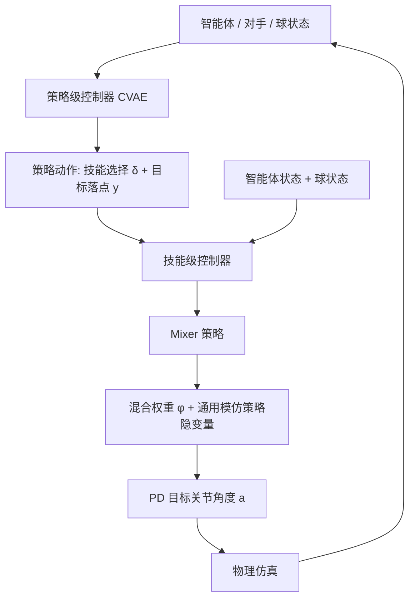

## 一句话总结

提出面向乒乓球的物理仿真角色动画方法，用分层的技能控制器解决多技能任务中的模式崩溃问题，并用策略控制器学习技能选择与落点决策，在智能体对战与 VR 人机对战中同时支持竞争与合作。

## 研究背景

将深度学习引入物理仿真角色动画后，角色已能完成后空翻、拳击、网球等敏捷自然的动作。当前主流做法是两阶段训练：先通过模仿参考动作学习可复用的技能嵌入，再在任务阶段调用这些技能完成下游任务。

但当不同技能之间差异细微时（例如正手拉球与正手推挡），任务训练阶段常出现模式崩溃：智能体虽然在模仿阶段学到了多样技能，任务阶段却只反复使用少数几种，既浪费了技能多样性，也限制了强化学习的探索，导致任务表现次优。

另一个较少被研究的问题是决策策略：多数已有工作要么不需要多样技能，要么依赖人工指定技能，智能体缺乏根据对手与球的运动动态地选择技能和落点的能力。本文针对这两点，同时提升物理仿真智能体的技能执行能力与策略决策能力。

## 方法

### 整体框架

方法采用分层结构，分为技能级控制器与策略级控制器两层。策略级控制器以智能体、对手、球的状态为输入，输出策略动作，包括要使用的技能与球的目标落点；技能级控制器则以智能体状态、球状态和策略动作为输入，输出技能动作，即 PD 控制器的目标关节角度。训练时先训练技能级控制器，再冻结其权重训练策略级控制器。

### 技能级控制器

技能级控制器分三个阶段训练。

第一阶段是模仿策略。将动捕数据按五种技能（正手拉球、推挡与扣杀、反手拉球与推挡）划分为子集，为每种技能训练一个模仿策略 $$\pi_i(a_i \mid s, z_i)$$，同时用全部数据训练一个通用模仿策略。这里借鉴混合专家思想，用多个专用策略而非单一通用策略来缓解模式崩溃。每个模仿策略基于对抗框架训练，判别器区分动捕真实转移与策略生成转移：

$$\min_{D_i} -\mathbb{E}_{d_{M_i}(s,s')} \log(D_i(s,s')) - \mathbb{E}_{d_{\pi_i}(s,s')} \log(1 - D_i(s,s')) + \lambda_{gp}\,\mathbb{E}_{d_{M_i}(s,s')}\lVert \nabla_\phi D_i(\phi)\rVert^2$$

同时训练 von Mises-Fisher 编码器 $$q_i$$ 使隐变量 $$z_i$$ 与转移对应，并加入多样性项鼓励不同隐变量表达不同动作。

第二阶段是球控制策略。为每种技能训练 $$\omega_i(z_i \mid s, b, y)$$，使智能体能把随机发来的球击打到目标落点。任务奖励由球拍奖励、球奖励和风格奖励加权组成：

$$r(t) = w_p r_p(t) + w_b r_b(t) + w_s r_s(t)$$

球拍奖励鼓励球拍靠近球，球奖励鼓励球的预测落点靠近目标落点，风格奖励沿用对抗判别器保持动作自然。

第三阶段是 Mixer 策略。单独使用某个球控制策略只能重复单一技能，直接切换控制器又会因前一技能终止状态与下一技能起始状态不匹配而失败。Mixer 策略 $$\omega_m(z_m \mid s, b, \delta, y)$$ 以关节为单位混合各技能动作，输出通用模仿策略的隐变量与一组混合权重 $$\varphi$$：

$$a = \varphi \odot \pi_u(\cdot \mid s, z_u) + (1 - \varphi) \odot \sum_{i=1}^{5} \delta_i\, \pi_i(\cdot \mid s, z_i)$$

其中 $$\delta$$ 是指示所选技能的 one-hot 向量。训练 Mixer 时只更新它，其余策略权重冻结。

### 策略级控制器

策略级控制器 $$f$$ 采用迭代式行为克隆。它以策略观测 $$o = (s, \tilde{s}, b)$$（智能体、对手、球状态）为输入，输出策略动作 $$c = (\delta, y)$$。为建模乒乓球比赛的随机性，采用条件变分自编码器（CVAE）结构，训练损失为重构误差加 KL 散度：

$$\sum_{k=1}^{K} \lVert c^{expert}_k - c'_k\rVert + \beta_{KL} D_{KL}(Q(u \mid \mu_k, \sigma_k^2) \Vert \mathcal{N}(0, I))$$

训练时通过反复与环境交互收集数据来更新策略：学习竞争策略时挑选带来胜利的数据，学习合作策略时挑选对手能成功接球的数据。推理阶段只用解码器，采样隐变量与观测拼接后生成策略动作。

专家演示来自两类交互环境：智能体对战环境中对手使用固定的启发式策略（随机策略或从约二十分钟转播视频提取的视频策略）；人机交互环境中用户通过 VR 头显与手柄操作被物理仿真的球拍，物理仿真运行在 Isaac Gym，VR 界面运行在 Unity。

## 实验结果

技能评估在向智能体随机发出一万个球的设定下比较运动质量。本文方法在判别器得分、技能准确率、多样性得分上均优于 ASE、CASE 与去掉 Mixer 的显式过渡变体 ET：

| 指标 | ASE | CASE | ET | 本文 |
| --- | --- | --- | --- | --- |
| 判别器得分 | 1.62 | 2.28 | 4.95 | 5.72 |
| 技能准确率 | 0.38 | 0.47 | 0.69 | 0.76 |
| 多样性得分 | 6.13 | 6.05 | 7.32 | 8.01 |

任务表现上（括号为更快球速测试集的微调结果），本文方法平均连续回球次数最多，落点误差第二好，ET 虽误差略小但难以持续应对快球：

| 指标 | ASE | CASE | ET | 本文 |
| --- | --- | --- | --- | --- |
| 平均回球次数 | 9.54 (5.94) | 8.79 (5.28) | 6.55 (3.66) | 10.93 (6.28) |
| 平均误差（米） | 0.28 (0.33) | 0.35 (0.39) | 0.25 (0.28) | 0.26 (0.31) |

智能体对战策略评估中，本文相比 RL 基线在竞争设定下胜率更高、合作设定下回合更长：

| 对手 | 竞争 RL | 竞争 本文 | 合作 RL | 合作 本文 |
| --- | --- | --- | --- | --- |
| 随机对手 | 0.641 | 0.687 | 14.9 | 16.4 |
| 视频对手 | 0.637 | 0.681 | 15.6 | 18.2 |

RL 会陷入局部最优并对特定对手过拟合，两者直接对战时本文方法胜率明显更高，且落点分布更接近真实球员。人机 VR 交互中，初始策略胜率 64%、平均回合 4.04；两轮竞争策略优化后胜率升至 78%、回合降到 3.75；合作策略下胜率降到 58%、用户可维持约 5.34 回合。

## 亮点与局限

亮点在于用混合专家式的多技能模仿加 Mixer 策略的关节级动作混合，有效缓解了细微技能间的模式崩溃并实现快速自然的技能过渡；策略层用迭代行为克隆加 CVAE 显式学习技能选择与落点决策，可灵活切换竞争与合作目标；系统统一支持智能体对战与 VR 人机双向物理交互，且信息交换量小、可实时运行。

局限方面，作者指出为每种技能单独建策略再由 Mixer 融合的做法难以扩展到包含数百种技能的数据集；同时方法是数据驱动的，最终动作质量高度依赖动捕数据质量。

## 延伸思考

分层的技能与策略解耦是这项工作的核心思路：底层保证动作多样自然，上层专注决策。这种结构可能迁移到其他需要快速切换多样技能的对抗性或竞技性动画任务（如击剑、羽毛球）。而其扩展性瓶颈也指向一个有价值的方向，即如何把显式技能标注的高质量控制与从无标注动作中学习的可扩展表示结合起来，在质量与规模之间取得平衡。此外，VR 人机交互环境本身也是研究人机博弈与协作行为的实验平台。
