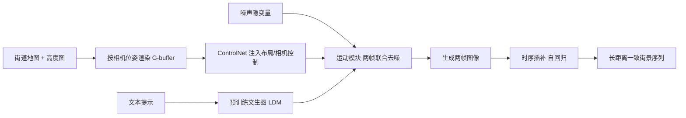

## 一句话总结

Streetscapes 以街道地图与高度图作为布局条件，配合可选文本提示，基于视频扩散模型和一种新的时序插补（temporal imputation）自回归机制，生成横跨多个街区、长距离且视角一致的高质量城市街景序列。

## 研究背景

生成图像、视频、三维模型的方法进展迅猛，但在大规模输出上仍受限：文本到视频只能产出有限帧数的短片，文本到三维主要生成单个物体，难以扩展到整座城市。作者聚焦城市街景，希望沿着合成城市街道的路径生成长距离、三维一致的视图，称为 Streetscapes。要在城市尺度上实现这一目标，面临三个核心问题：

- 用什么输入？在城市尺度上，纯文本控制粒度太粗。作者受布局条件生成模型启发，改用俯视场景布局（街道地图加对应高度图）来约束轨迹，并保留可选文本描述天气、时段等风格。
- 产出什么输出？希望结果像从三维模型渲染出来那样具备视角一致性，但把生成式三维方法扩展到整座城市非常困难。作者转而基于文本到视频模型输出长图像序列，通过把布局投影到屏幕空间的 G-buffer 来保证视角一致，并用自回归技术扩展到长序列。
- 用什么训练数据？训练需要大量真实街景序列及对应布局。作者的关键洞察是把 Google Street View 这类地图服务的地理数据用于生成任务，但这类航拍布局较粗糙、投影到地面视角时对齐并不精确，方法必须对噪声足够鲁棒。

与最接近的 InfiniCity（基于 GAN、需要对齐的 CAD 模型、难编辑）以及并发的街景生成工作（依赖三维包围盒、逐帧靠跨帧注意力保持一致）相比，本文只用街道与建筑布局及其高度信息，且用自回归方式突破现有文本到视频模型的帧数限制。

## 方法

### 整体框架

系统在视频扩散模型基础上加入两个关键要素：其一是对粗糙场景布局的条件化机制；其二是避免长序列生成时漂移（保持图像停留在自然图像流形上）的自回归方法。系统先训练一个联合去噪生成两帧的扩散模型，输入包含从给定布局为两个相机视角渲染出的条件信息；随后在推理阶段把这个预训练的两帧模型改造为自回归的时序插补模式，无需重新训练即可持续生成一致的长序列。

### 关键设计 1：布局条件的场景生成

方法建立在预训练的隐扩散模型（Latent Diffusion Model）之上。给定噪声特征图 $$z_T$$ 与文本提示，模型通过反向扩散迭代去噪得到 $$z_0$$，再由解码器 $$\mathcal{D}$$ 得到高质量图像 $$x_0 = \mathcal{D}(z_0)$$。作者不修改基础 U-Net 参数，从而天然继承文本控制能力（例如生成数据中稀缺的雪景）。

为实现两帧生成，作者借鉴 AnimateDiff，把运动模块（motion module）插入基础模型，使各扩散步 $$t$$ 上帧间可交换信息，噪声预测网络扩展为 $$\epsilon_\theta\!\left(z^{(i)}_t, z^{(i+1)}_t, t\right)$$，联合估计 $$\left(z^{(i)}_{t-1}, z^{(i+1)}_{t-1}\right)$$，作者称之为并行去噪（parallel denoising）。选择输出两帧是最小且最灵活的设计。

布局控制方面，把街道地图与高度图按两个目标相机位姿 $$C^{(i)}$$、$$C^{(i+1)}$$ 渲染为 G-buffer $$G^{(i)}$$、$$G^{(i+1)}$$（含语义标签的 RGB 图、屏幕空间视差图与高度图），再经 ControlNet 注入，从而把地图空间信息转换到屏幕空间，实现对相机位姿与场景布局的直接控制。注意系统并不直接输入相机位姿参数。

### 关键设计 2：自回归视频扩散与时序插补

并行去噪只能生成前两帧；仅靠 G-buffer 条件无法保证外观一致（它只控布局不控外观），简单地把成对生成的帧堆叠或把已生成帧作为 RGB 控制追加到 ControlNet 都会出现严重的质量漂移。作者提出时序插补方法。

在标准反向扩散步 $$x_{t-1} = \mathrm{DDIM}(x_t, \epsilon_\theta(x_t, t), t)$$ 基础上，对已生成的上一帧 $$x^{(i)}$$，每个反向扩散步不再复用上一步对 $$x^{(i)}_t$$ 的估计，而是直接从已知帧采样：

$$z^{(i)}_t \sim \mathcal{N}\!\left(z^{(i)}_t;\ \sqrt{\alpha_t}\,\mathcal{E}\!\left(x^{(i)}\right),\ (1-\alpha_t)\,\mathbf{I}\right)$$

即对已知帧对应的隐变量加噪。由于所有反向步都如此，最终去噪出的 $$z^{(i)}_0$$ 解码后仍是同一帧 $$x^{(i)}$$；这一操作只作用于两帧中的第一帧，第二帧 $$z^{(i+1)}_t$$ 仍来自上一步估计。这样保证下一对生成图像的第一帧与上一对的最后一帧相同，生成后丢弃第一帧、只把第二帧 $$x^{(i+1)}$$ 追加到序列。一个关键洞察是：插补让自回归过程在整个反向扩散中多次使用条件帧的加噪副本，使条件对轻微出域的帧更鲁棒，那些不自然细节会被噪声淹没。

为进一步提升 $$x^{(i)}$$ 与 $$x^{(i+1)}$$ 的一致性，作者又提出两项技术：

- Resample：受图像补全启发，把 $$z^{(i+1)}_{t-1}$$ 去噪后再加噪并重跑插补，经数轮来回后再进入下一步，使其与加噪条件更趋一致。
- WarpInit：利用 G-buffer $$G^{(i)}$$ 中的视差图，把已知 RGB 图像 $$x^{(i)}$$ 从位姿 $$C^{(i)}$$ 扭曲到下一视角 $$C^{(i+1)}$$，其加噪版本作为 $$z^{(i+1)}_T$$ 的良好初始化（即使扭曲图有空洞和伪影）。

据作者所知，这是首个把插补（尤其是时序插补）用于自回归视频生成的系统。

### 关键设计 3：街景数据

作者把 Google Street View 的地理数据作为契合生成任务的训练来源，采集了覆盖巴黎、伦敦、巴塞罗那、纽约四座城市、约 33 平方公里的 150 万张图像，并附带场景布局与相机位姿、时间戳等元数据。数据规模、覆盖与多模态带来价值，但航拍布局粗糙、投影到地面视角对齐不完美，因此系统需对这些噪声鲁棒。

## 实验结果

在长距离一致街景生成任务上，与 InfiniCity 用 FID、KID 对比（仅用伦敦地图公平比较），本文以自回归方式在各步区间的质量均显著更优。

| 指标 | InfiniCity | Streetscapes（全部步） | 1–16 步 | 16–32 步 | 32–64 步 |
| --- | --- | --- | --- | --- | --- |
| FID↓ | 108.47 | 17.79 | 16.12 | 21.70 | 29.93 |
| KID↓ | 0.084 | 0.023 | 0.017 | 0.022 | 0.025 |

在永续视图生成（perpetual view generation）任务上，从真实起始视图自回归生成，用 LPIPS 衡量近距一致性、FID/KID 衡量长距质量。Streetscapes 近距质量与一致性与最优的 Zero123-A 相当，同时在更长距离（32 步以上）显著保持质量，而其他方法明显退化。

| 方法 | LPIPS↓（1–16） | FID/KID（1–16） | FID/KID（16–32） | FID/KID（32–64） |
| --- | --- | --- | --- | --- |
| InfNat0-mono | 0.600 | 16.72 / 0.014 | 48.97 / 0.042 | 71.10 / 0.056 |
| InfNat0-proxy | 0.614 | 26.80 / 0.025 | 51.48 / 0.052 | 59.00 / 0.048 |
| DiffDreamer | 0.589 | 45.96 / 0.050 | 164.23 / 0.208 | 207.37 / 0.242 |
| Zero123-A | 0.497 | 7.09 / 0.005 | 34.64 / 0.035 | 64.77 / 0.062 |
| Streetscapes | 0.519 | 11.69 / 0.012 | 25.59 / 0.028 | 35.47 / 0.034 |

此外，系统还能生成每个场景约 1 平方公里、100 帧、带灵活相机运动的长距街景巡游，并支持文本控制（如「巴黎，日落前」「纽约的雨天」）与地理风格的混搭（如把巴黎街区布局生成为纽约风格，呈现纽约式路牌与巴黎式朱丽叶阳台等标志性细节）。

## 亮点与局限

亮点：

- 提出时序插补这一简单有效的自回归机制，直接复用预训练两帧模型、无需重训，把条件帧的多次加噪副本注入反向扩散，兼顾长距一致与抗漂移。
- 用街道地图加高度图的布局条件与 G-buffer 投影实现相机位姿与场景布局的精细控制，且保留基础模型的文本控制能力。
- 识别 Google Street View 地图语料作为独特训练数据源，将地理数据用于生成任务。
- Resample 与 WarpInit 两项技术进一步增强相邻帧一致性，突破了视频扩散模型的有限帧数限制。

局限：

- 偶尔出现瞬变物体的不自然运动（如车辆突然出现或消失），作者归因于街景数据采集频率有限及此类物体普遍存在。
- 结果存在一定近距不一致（如逐帧轻微色彩闪烁），源于扩散问题中质量与一致性之间固有的权衡。

## 延伸思考

- 时序插补把「已知帧的加噪副本」作为鲁棒条件，这一思路能否推广到更一般的可控长视频生成，减少对显式几何或跨帧注意力的依赖。
- 系统只用粗糙布局与高度图便获得可控相机轨迹与多视角一致，若引入更精细的语义或实例级几何，能否显式建模并控制瞬变物体（车辆、行人）。
- 依赖 Google Street View 的白天、正常天气数据，极端天气与时段主要靠基础模型的文本先验幻想生成，如何在数据稀缺条件下保证这些风格的物理合理性值得探索。
- 输出仍是长图像序列而非显式三维模型，后续三维重建为可选步骤；把一致性约束更紧密地与三维表征耦合，或能进一步提升几何一致与可编辑性。
