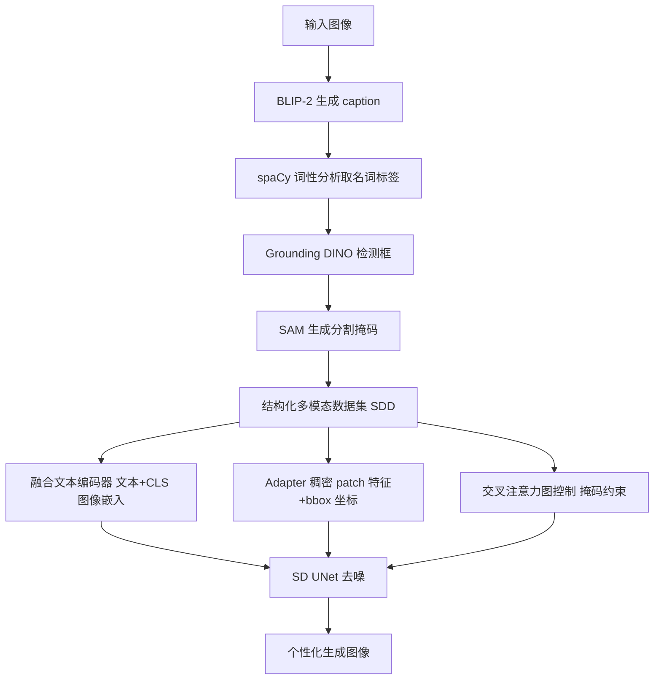

## 一句话总结

Subject-Diffusion 用自建的 7600 万图像大规模标注数据集训练一个统一框架，只需单张参考图、无需测试时微调，就能在开放域内完成单主体乃至双主体的个性化文生图。

## 研究背景

扩散模型让文生图在艺术性、真实感与语义对齐上都取得了显著进步，但仅靠文本描述难以充分表达用户意图，于是「文本描述 + 参考图」的定制化生成成为热门方向。现有个性化方法大体分两条路线：一是测试时微调（如 Textual Inversion、DreamBooth、Custom Diffusion），通常需要 3∼5 张参考图并为每个概念单独训练，效率低、难以落地；二是在大规模个性化数据上重新训练基础模型，避免了微调，但相较微调方法往往牺牲保真度与泛化能力，且很多只能处理人像、猫、狗等特定域，或只支持单概念。

作者指出，同时满足「单张参考图、多概念生成、免测试时微调、开放域零样本」这四点的工作极少。制约因素之一是数据：带对象级分割掩码与图像级细致语言描述的公开数据集（LVIS、ADE20K、COCO-stuff、Visual Genome、Open Images）规模普遍偏小（1 万至 100 万），或缺失文本描述。为此作者构建自动标注工具并造出大规模结构化数据集，再配合新的模型架构来兼顾保真度与可编辑性。

## 方法

整体框架：以 Stable Diffusion 为骨干，围绕三个设计要素展开。其一，设计特定的提示模板，用文本编码器把文本与对象级视觉特征融合，作为 SD 的条件；其二，在每个自注意力与交叉注意力块之间插入 adapter，编码分割对象的稠密 patch 特征及其边界框坐标以增强保真度；其三，基于分割掩码引入交叉注意力图控制策略，让模型聚焦于实体与其对应区域的局部优化，从而支持多主体生成。

关键设计：

- 数据集构建（SDD）：基于 LAION-5B，先用 BLIP-2 为每张图生成更精确的 caption，再用 spaCy 做词性分析、取名词作为实体标签；把标签喂给开集检测模型 Grounding DINO 得到检测框，检测框再作为提示送入 SAM 得到对象掩码；最后把图文对、检测框、分割掩码与标签组合成结构化数据。经过滤后得到 7600 万图像、2.22 亿实体、16.2 万常见类别，规模远超 Open Images 的 100 万标注图像。

- 融合文本编码器：构造提示模板「[text prompt], the [subject label 0] is [PH_0], the [subject label 1] is [PH_1], ...」。与固定文本编码器的做法不同，作者在文本编码器的第一层嵌入处，用图像主体的 CLIP「CLS」嵌入替换对应位置的实体 token 嵌入，然后重训整个文本编码器；实验表明「先融合、再整体重训」比后融合具有更强的自一致性。

- 稠密图像与对象位置控制：把分割后的主体图送入 CLIP 图像编码器得到 256 长度的 patch 特征 token，并与主体坐标的傅里叶变换位置信息融合，防止多主体混淆。在每个 Transformer 块的自注意力与交叉注意力之间插入可学习 adapter 层：
$$L_a := L_a + \beta \cdot \tanh(\gamma) \cdot S([L_a, h_e])$$
其中 $$h_e = MLP([v, Fourier(l)])$$，$$v$$ 为 256 个 patch 特征、$$l$$ 为主体坐标，$$\gamma$$ 初始化为 0。训练时只激活交叉注意力的 key、value 层与 adapter 层，冻结其余层。此外引入位置区域控制：生成二值掩码特征图并拼接到图像 latent，用以解耦前景与背景分布、防止训练坍塌。

- 交叉注意力图控制：基于 Prompt-to-Prompt 的结论，交叉注意力图能反映每个 token 对应对象的位置。交叉注意力计算为：
$$CA_l(z_t, y_k) = Softmax(Q_l(z_t) \cdot L_l(y_k)^T)$$
作者认为主体混淆源于无约束的注意力，于是在实体 token 处加入正则项，惩罚注意力图与实体分割掩码之间的 L1 偏差，选取 $$h_l = w_l = \lbrace 32, 16, 8 \rbrace$$ 的层：
$$L_{attn} = \frac{1}{N} \sum_{k=1}^{N} \sum_{l} \lvert CA_l(z_t, y_k) - M_k \rvert$$

- 训练目标：把检测掩码 $$l_m$$ 拼接到噪声 latent $$z_t$$ 后经卷积调整维度送入 UNet，条件由融合文本编码器输出，adapter 接收局部 patch 特征与 bbox 坐标，总目标为：
$$L = \mathbb{E}_{\mathcal{E}(x_0), y, \epsilon \sim \mathcal{N}(0,1), t} \left[ \lVert \epsilon - \epsilon_\theta(z_t, t, y, x_s, l, l_m) \rVert_2^2 \right] + \lambda_{attn} L_{attn}$$

## 实验结果

在 DreamBench 上以 DINO、CLIP-I（图像对齐）与 CLIP-T（文本对齐）评测。单主体设定下 Subject-Diffusion 的 DINO 得分显著领先（0.711 对 DreamBooth 的 0.668），CLIP-I 与 CLIP-T 与免微调方法持平或略高；在约 10 倍主体数量的 OpenImages 测试集上仍保持较高得分，显示泛化能力。双主体设定下在 DINO 与 CLIP-T 上均优于两种微调方法。

| 方法 | 类型 | 测试集 | DINO↑ | CLIP-I↑ | CLIP-T↑ |
| --- | --- | --- | --- | --- | --- |
| DreamBooth | FT | DB | 0.668 | 0.803 | 0.305 |
| Custom Diffusion | FT | DB | 0.643 | 0.790 | 0.305 |
| ELITE | ZS | DB | 0.621 | 0.771 | 0.293 |
| BLIP-Diffusion | ZS | DB | 0.594 | 0.779 | 0.300 |
| IP-Adapter | ZS | DB | 0.667 | 0.813 | 0.289 |
| Subject-Diffusion | ZS | DB | 0.711 | 0.787 | 0.293 |
| Subject-Diffusion | ZS | OIT | 0.668 | 0.782 | 0.303 |

双主体对比（均在 DreamBench 的 30 组两主体组合上）：

| 方法 | 类型 | DINO↑ | CLIP-I↑ | CLIP-T↑ |
| --- | --- | --- | --- | --- |
| DreamBooth | FT | 0.430 | 0.695 | 0.308 |
| Custom Diffusion | FT | 0.464 | 0.698 | 0.300 |
| Subject-Diffusion | ZS | 0.506 | 0.696 | 0.310 |

消融实验显示：移除 adapter 层导致几乎所有指标大幅下降（单主体 DINO 0.711→0.534），说明 256 个 patch 特征是高保真度的主要来源；缺少图像「CLS」特征也显著降低主体保真度；注意力图控制对双主体提升明显、对单主体略有提升；位置控制移除后全面退化；边界框坐标能显著改善双主体生成，但对单主体反而略降（信息过于冗余）。仅用 OpenImages（600 类）重训则整体下降，但仍优于或持平 ELITE 与 BLIP-Diffusion，佐证了大规模数据的重要性与模型结构的有效性。

## 亮点与局限

亮点：首次在单张参考图、免测试时微调、开放域零样本的前提下同时支持单主体与双主体个性化生成；自建 7600 万图像、2.22 亿实体的结构化数据集，用 BLIP-2 + spaCy + Grounding DINO + SAM 的自动标注流水线批量产出多模态标注；「文本图像先融合再整体重训文本编码器」提升自一致性，adapter 稠密特征提升保真度，注意力图控制缓解多主体混淆。

局限：边界框坐标对单主体生成会引入冗余信息、略微降低保真度；在部分指标（如 DreamBench 的 CLIP-I）上仍不及 IP-Adapter；论文主要验证到双主体，对更多主体的扩展与更复杂场景的组合能力尚未充分展示；方法依赖大规模数据与自动标注质量，标注误差可能传导到生成效果。

## 延伸思考

这篇工作把「数据规模 + 结构化多模态标注」作为开放域个性化生成的关键杠杆，用现成的检测、分割、caption 模型拼出自动标注流水线，本质上是用工程化的数据生产来替代逐概念的测试时微调。这提示了一个通用范式：当下游任务缺乏带精细标注的大规模数据时，可以用一组预训练基础模型组合出「标注器」，把弱标注数据升级为强监督信号。另一方面，融合文本与图像特征的时机（编码前 vs 编码后）、以注意力图掩码约束来解耦多主体，都是可迁移到其他条件生成任务的设计思路。后续若能在保真度与可编辑性之间做更自适应的权衡、并把多主体能力稳定扩展到更多实体，将进一步逼近真正即插即用的个性化生成工具。
