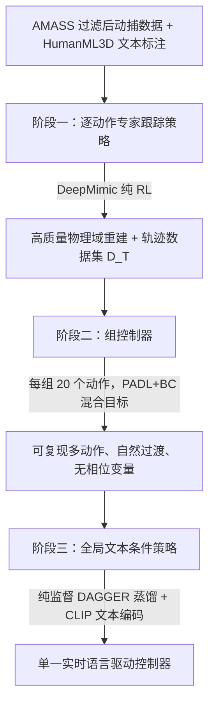

## 一句话总结

本文提出 SuperPADL，一个用于物理仿真角色的语言驱动控制框架：通过"渐进式监督蒸馏"，先用强化学习训练大量单技能专家，再逐级把它们蒸馏进更大更鲁棒的策略，最终得到一个可实时响应文本指令、覆盖 5000 多个动作技能并能自然过渡的统一控制器。

## 研究背景

物理仿真的角色动画能从第一性原理生成逼真且可交互的动作，近年强化学习（RL）极大扩展了仿真角色能复现的运动技能库。但要让这些系统真正好用，需要一个易上手又足够表达力的控制接口。传统的操纵杆指令、目标航点等抽象接口易用却限制了对角色行为的控制力；目标轨迹、关键帧虽表达力强，却需要专业知识或动捕设备，制作成本高。

自然语言是一个兼具易用性与表达力的接口。大语言模型已在众多生成任务中展现出强大的指令能力，运动合成领域也出现了不少 text2motion 工作，但绝大多数集中在运动学（kinematic）模型上。物理驱动的语言控制器在多样性、可扩展性和运动质量上都还远不及运动学同行：作者此前的 PADL 只能从约 9 分钟的动作数据里学习；另一类做法是把运动学 text2motion 模型与底层运动跟踪模型拼接，虽能借助运动学模型的可扩展性，却把仿真角色的能力严格限制在运动学模型给出的行为上，运动质量也明显偏低。

核心矛盾在于：RL 方法能训出高质量、可自然过渡的物理策略，却难以扩展到几百个动作以上；而运动学模型靠监督学习能轻松扩展到上千个动作。本文的目标就是搭一个可扩展框架，训练出单一、通用、端到端的语言驱动物理控制器，直接把语言指令映射为驱动仿真角色的电机动作。

## 方法

整体框架：SuperPADL 结合 RL 与监督学习，围绕"运动控制器的渐进式蒸馏"展开，分三个训练阶段。随着每个策略学习的动作数量增多，RL 的使用被逐步减少——专家纯 RL 训练，组控制器用 RL 与行为克隆混合，全局控制器则完全靠监督学习。关键思想是只在 RL 有效的小数据规模上使用 RL，再通过蒸馏把众多小网络的技能迁移进大网络。

关键设计：

- 阶段一 · 逐动作专家跟踪。动捕数据是运动学的，无法直接对物理策略施加监督损失。作者借鉴 MoCapAct，用 DeepMimic 为数据集中每个动作训练一个跟踪专家策略 $$\pi^{e}_{i}(a_t \mid o_t, \phi)$$，条件是角色当前状态 $$o_t$$ 与把策略同步到参考运动的相位变量 $$\phi \in [0,1]$$。训练监控笛卡尔位姿误差，低于 3cm 即提前停止；达到 3000 轮上限仍高于 5cm 则丢弃该动作（约 5% 被丢弃，多为攀爬不存在的楼梯、坐不存在的椅子等物理上不可能的动作）。借助 Isaac Gym 上 GPU 加速的 DeepMimic，多数策略一小时内完成。随后从每个专家记录含 10000 帧观测-动作对的轨迹，得到轨迹数据集 $$D_T=\{T_i\}$$，作为后续监督训练的"动作数据集"。

- 阶段二 · 用 PADL+BC 训练组控制器。把数据集随机划分成每组 20 个动作，为每组训练一个组控制器 $$\pi^{g}_{i}(a_t \mid o_t, I)$$，其中动作索引 $$I$$ 用可训练的嵌入表编码（此阶段不使用语言条件）。训练目标结合对抗式 RL 与行为克隆：
$$\mathcal{L}=\mathcal{L}_{\text{PADL}}+0.01\,\mathcal{L}_{\text{BC}}$$
PADL 引入一个运动条件判别器 $$\text{Disc}(I, s, s') \to [0,1]$$，用 PPO 优化策略、奖励鼓励策略"骗过"判别器：
$$r_t=-\log\!\left(1-\text{Disc}(I, s_{t-1}, s_t)\right)$$
行为克隆项则从专家轨迹里采样观测-动作对，让组控制器模仿专家动作：
$$\mathcal{L}_{\text{BC}}=\mathbb{E}_{I}\,\mathbb{E}_{(o,a)\sim T_I}\,\lVert \pi^{g}_{i}(o, I)-a\rVert_2^2$$
组控制器去掉了相位变量（推理时难以确定过渡瞬间的相位取值）。BC 信号大幅降低训练成本：先做 2000 轮仅用 BC 的预热，再用 PADL+BC 训练 10 亿样本（对比从零训 PADL 需 70 亿样本），单张 A40 约 12 小时完成，而纯 PADL 需近三天。

- 阶段三 · 蒸馏为全局文本条件策略。以组控制器为教师，训练全局语言条件策略 $$\pi^{G}(a_t \mid o_t, c)$$（$$c$$ 为文本描述），全程纯监督，从而可扩展到更大数据集。先用静态轨迹数据集 $$D_T$$ 做行为克隆预热，让全局策略的状态分布接近组控制器；随后用类 DAGGER 的在线模仿学习训练至收敛：每轮用当前全局控制器滚动轨迹，由对应组控制器对每个观测标注动作，让全局控制器去匹配。条件不再是索引而是自然语言描述，用 CLIP 文本编码器编码后送入策略网络。

- 数据与网络。训练数据是 AMASS 的过滤子集：滤掉短于 2 秒或长于 9 秒、以及物理上不可能（如爬楼梯、单杠摆荡）的片段，共 5866 个动作训练 DeepMimic 专家，通过跟踪阶段的 5587 个动作（约 8.5 小时）用于训练全局控制器。语言标注来自 HumanML3D，并用 ChatGPT 生成同义改写以增加多样性，共 48207 条描述。所有策略（专家、组、全局）均用简单 MLP，组与全局控制器额外引入历史窗口：回看 40 帧、每 8 帧取一帧共 5 帧观测。

## 实验结果

作者提出阈值化精确率与召回率（thresholded precision/recall）来评估无相位变量的组/全局控制器：召回率衡量参考运动被复现的比例，精确率衡量生成轨迹中有多少在模仿参考运动的片段；用曲线下面积（AUC）汇总。

全局控制器与两个在同一 5587 动作数据集上训练的基线对比（直接把 PADL、PADL+BC 用到全量数据）：

| 全局控制器方法 | Precision AUC | Recall AUC |
| --- | --- | --- |
| SuperPADL | 1.18 | 1.11 |
| PADL+BC | 1.12 | 0.73 |
| PADL | 0.99 | 0.70 |

结果显示：在上千动作规模上直接用对抗式 RL 是无效的，基线网络基本只能站立和踉跄，几乎不响应文本指令；SuperPADL 在精确率与召回率上都明显更优，且能在任意两个动作间过渡（成功率超过 90%），即便两动作来自不同分组。

组控制器层面，随机选 4 组各 20 个动作，对比 PADL+BC 与纯 PADL：

| 组控制器方法 | Precision AUC | Recall AUC | 训练时间 |
| --- | --- | --- | --- |
| PADL+BC | 1.21 ± 0.03 | 1.21 ± 0.02 | 12h |
| PADL | 1.02 ± 0.11 | 1.10 ± 0.05 | 67h |

PADL+BC 在生成更高质量运动的同时，训练时间显著更短（即使计入前置专家训练，总成本仍低于纯 PADL）。全局控制器可在单张消费级 GPU 上实时生成动作，而运动学扩散模型生成单条动画可能需要近一分钟。

## 亮点与局限

亮点：核心贡献是"渐进式监督蒸馏"这一可扩展训练范式——把难以扩展的对抗式 RL 只留在小数据规模（单技能专家、20 动作小组）使用，再靠纯监督蒸馏把众多小网络的技能聚合进一个大网络，从而把物理驱动的语言控制扩展到 5000 多个技能，远超以往几百个的上限。相比"运动学 text2motion + 跟踪"的拼接方案，它是端到端直接把语言映射为电机动作，不依赖运动学模型，保留了物理策略的高质量与自然过渡；PADL+BC 混合目标同时提升了运动质量并大幅降低训练成本；最终模型实时运行、可交互响应指令变化。

局限：对芭蕾、跳跃等高动态动作仍会吃力；蒸馏范式的固有问题是组控制器里任何复现不佳的技能或缺陷都会级联传入全局控制器；全局控制器在困难动作中途被要求过渡时仍可能失去平衡摔倒（如单腿平衡踢腿时切换），调整过渡时机可缓解；此外它只用了 AMASS 的一部分，未训练很长的动捕序列。

## 延伸思考

这项工作最值得借鉴的是它对"RL 与监督学习分工"的清醒判断：RL 擅长从零探索出高质量、可恢复、可过渡的物理行为，但样本效率与可扩展性差；监督学习一旦有了"动作标签"就能轻松吃下海量数据。SuperPADL 的做法本质上是把 RL 当作"数据/技能生成器"，用它在小规模上造出优质行为，再把这些行为固化成可监督模仿的目标——这与近来大模型里"用 RL 造数据、用监督做规模化"的思路不谋而合，对其他难以直接大规模 RL 的控制/决策问题都有参考价值。

另一方面，蒸馏级联误差是这类分阶段方法的结构性风险：底层专家或组控制器的瑕疵会被逐级放大且难以在后期纠正。未来若能引入在线的质量筛选、让全局控制器在蒸馏时对低质量教师降权，或在蒸馏后补一轮小规模 RL 微调来修复高动态动作与过渡失衡，可能是把这类框架推向更大数据规模与更高鲁棒性的关键。
