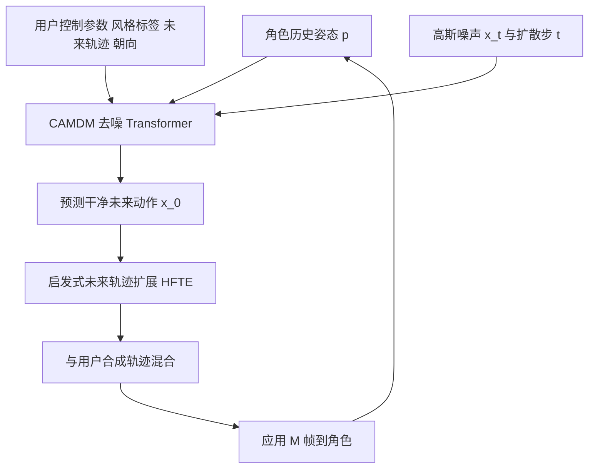

## 一句话总结

本文提出条件自回归运动扩散模型（CAMDM），把运动扩散概率模型驯服到实时角色控制场景，用单一统一模型对高层、粗粒度的用户控制信号做出实时响应，生成高质量、多样且支持多风格切换的角色动画。

## 研究背景

实时角色控制是计算机动画中的核心难题，需要在动态交互环境中生成既自然又契合用户高层指令的动作。过去以相位函数神经网络（PFNN）为代表的自回归方法用确定性网络预测下一帧姿态，但高层「潦草」的用户输入本身存在歧义，确定性模型在最小化均方误差时会退化到均值姿态，产生脚部滑动、动作幅度收缩等瑕疵，且动作缺乏多样性，导致角色动画重复而单调。

概率模型可以避免坍缩到均值姿态。基于变分自编码器或归一化流的方法能建模条件动作分布，但前者难以刻画复杂分布、轨迹跟踪误差大，后者实时性不足。近来运动扩散概率模型在大规模动捕数据上展现出强大的分布建模与高质量、多样采样能力，但它们依赖上千步去噪链、主要面向文本等离线条件，如何将其有效用于实时角色控制器仍是开放问题。作者据此提出把运动扩散模型改造为实时控制器，需同时满足可控性、多样性与计算效率三重需求。

## 方法

整体框架：给定大规模移动数据集，方法先训练一个基于 Transformer 的条件自回归运动扩散模型（CAMDM），输入角色过去 $$P$$ 帧动作与用户控制参数，学习捕捉未来 $$F$$ 帧动作的条件分布。运行时在每一帧收集角色历史姿态、用户控制输入与随机高斯噪声，从条件分布中采样出一段未来姿态并显示，从而以自回归方式驱动角色，在遵循用户指令的同时表现出连贯而多样的动作。

关键设计：

- 运动扩散与表示：采用直接预测干净样本的扩散范式，去噪网络学习 $$\hat x_0=G(x_t,t)$$。动作样本由 $$F$$ 帧姿态组成，每帧含根关节位移 $$O\in\mathbb{R}^{F\times 3}$$ 与关节旋转 $$R\in\mathbb{R}^{F\times JQ}$$；根位移转为局部位移，关节旋转用 6D 表示（$$Q=6$$）。条件化后模型为
$$\hat x_0=G(x_t,t;\,p,c_l,c_{rv},c_{ro})$$
其中 $$c_l$$ 为风格或步态标签，$$c_{rv}$$、$$c_{ro}$$ 为投影到地面的未来根位移与朝向。训练损失结合样本重建、3D 关节位置、脚部接触与速度四项
$$L=\lambda_{samp}L_{samp}+\lambda_{pos}L_{pos}+\lambda_{foot}L_{foot}+\lambda_{vel}L_{vel}$$

- 分离式条件标记（SCT）：以往把多种条件压成单一特征向量或单个 token，易因某些分量意外主导而导致控制不稳定（如风格标签失效、轨迹跟不上）。本文为每个条件学习独立 token，拼在含噪动作序列前作为去噪 Transformer 输入，借注意力机制强化每个条件的作用，实现稳定控制。

- 过去动作上的无分类器引导（CFG-PM）：动捕数据缺乏跨风格过渡动作。作者发现关键在于控制过去动作在自回归生成中的影响，于是对「过去动作」条件施加无分类器引导，训练时以 0.15 概率将过去动作 token 置空。当用户切换风格时以引导尺度 $$\gamma$$ 采样
$$G(x_t,t;p,c_l,c_{rv},c_{ro})=G(x_t,t;p=\varnothing,c_l,c_{rv},c_{ro})+\gamma\left(G(x_t,t;p,c_l,c_{rv},c_{ro})-G(x_t,t;p=\varnothing,c_l,c_{rv},c_{ro})\right)$$
与常规放大条件不同，这里取 $$\gamma<1$$ 以削弱过去动作影响，从而在不同风格间平滑过渡；风格不变时不启用 CFG-PM。

- 启发式未来轨迹扩展（HFTE）：为提升风格内多样性，采用「懒触发」策略——训练模型预测较长未来动作，运行时在用户控制不变时尽可能多地应用生成帧（每次应用 $$M$$ 帧）。这会耗尽模型预测的未来轨迹，使其与用户合成轨迹长度不匹配，导致混合时抖动。方法通过回收模型预测轨迹末端的最后 $$K$$ 个点，前后翻转复用直至长度对齐，平滑地扩展轨迹。

- 实时生成：仅用 8 步扩散（训练与运行时一致）即可获得令人信服的效果，远少于常见的上千步，从而满足实时响应。

## 实验结果

在 100STYLE 数据集（超 400 万帧、100 种风格）上评测。单风格控制下，CAMDM 在运动质量与条件对齐上全面超越基线（含运动匹配 MM-DP、局部运动相位 LMP、MANN-DP 与生成式方法 MoGlow）。

| 方法 | FID↓ | 脚滑↓ | 加速度↓ | 轨迹误差↓ | 朝向误差↓ | 风格准确率↑ |
| --- | --- | --- | --- | --- | --- | --- |
| MM-DP | 3.455 | 1.063 | 1.602 | 53.160 | 19.321 | 23.6% |
| LMP | 1.255 | 0.872 | 1.098 | 71.691 | 2.671 | 51.5% |
| MANN-DP | 1.629 | 0.764 | 1.097 | 59.005 | 3.634 | 36.5% |
| MoGlow | 3.053 | 1.317 | 1.009 | 51.356 | N/A | 5.2% |
| Ours | 0.913 | 0.685 | 1.077 | 22.818 | 3.997 | 89.5% |

多风格切换实验中，本文方法以更少过渡帧（过渡时长 48.47 帧）与最高成功率（94.2%）可靠切换到目标风格，即使数据集中不存在相应过渡动作也能完成，如「LeftHop」与「RightHop」这类镜像风格间的切换，得益于对过去动作施加的 CFG。消融实验显示：去掉 SCT、去掉 HFTE 或改用 MLP 编码条件都会明显劣化 FID 与轨迹对齐，验证各设计的必要性。系统部署基于 AI4Animation，模型权重仅约 20MB，在 RTX 3060 上以 60 帧每秒以上实时运行。

## 亮点与局限

亮点：首个支持实时、多风格统一角色控制的运动扩散模型；分离式条件标记让每个控制信号稳定生效；对过去动作而非风格标签施加无分类器引导，巧妙解决了数据中缺失过渡动作导致的风格切换难题；启发式未来轨迹扩展兼顾了「懒触发」带来的多样性与轨迹平滑；仅 8 步去噪配合紧凑模型实现高帧率实时推理。

局限：方法主要在移动类（locomotion）技能上验证，对更复杂、非周期的交互动作覆盖有限；控制信号仍为风格标签与地面轨迹等相对粗粒度的形式，缺少对精细身体部位的直接约束；跨风格过渡质量依赖 CFG 尺度等超参的经验设置；8 步去噪虽高效，但通用扩散加速技术在该自回归设定下表现退化，说明加速与质量的权衡尚未完全打通。

## 延伸思考

这项工作最具启发的一点是把扩散模型「离线、高步数、单次生成」的惯常用法，改造成「实时、极少步数、逐帧自回归」的交互式控制器，说明扩散范式并非天然与实时应用相斥，关键在于针对性的工程与算法驯服。尤其是把无分类器引导从「放大条件」反向用作「削弱历史依赖」，为在缺失过渡数据的情况下实现平滑状态切换提供了通用思路，可迁移到其他需要在模式间跳转的时序生成任务。未来若能把控制信号从粗粒度轨迹扩展到更丰富的语义、物理或交互约束，并与物理仿真结合，或将推动交互式数字角色向更自然、更可控的方向演进。
