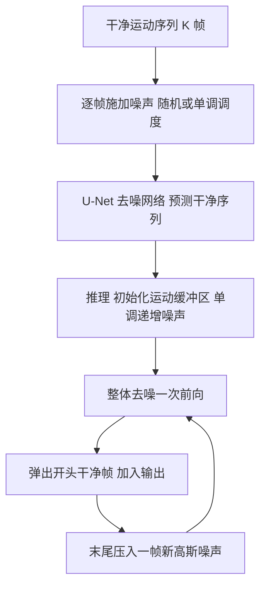

## 一句话总结

TEDi 把扩散过程的「去噪时间轴」与运动序列的「时间轴」纠缠在一起，让模型每一步只推进运动时间轴、在一个渐进加噪的运动缓冲区里持续吐出干净帧，从而以自回归方式合成任意长度、不塌缩的角色动作序列。

## 研究背景

长时程运动序列生成是角色动画中长期存在的难题，需要产出真实、非重复且不退化（例如动作冻结）的序列。去噪扩散概率模型（DDPM）在图像合成上取得了极高质量，近来也被引入运动领域，但典型做法是把整段运动当作一张「运动图像」，从随机高斯噪声一次性并行去噪出固定长度的序列。

固定长度输出在长时程场景下有两大局限。其一，没有令人满意的方式把短序列拼成长序列，简单地首尾相接并混合会产生缝合处的接缝伪影。其二，典型扩散过程交互可控性差，往往需要数百次去噪迭代才能产出一小段干净运动。作者由扩散过程「沿去噪时间轴以小步增量从纯噪声逐步合成样本」这一渐进特性获得启发，提出把这种渐进机制迁移到运动的时间轴上，实现随时可取的连续干净帧流。

## 方法

整体框架：训练阶段对干净运动序列施加逐帧不同的噪声水平，让网络学会在各帧噪声不一的情况下直接预测整段干净运动；推理阶段维护一个「运动缓冲区」，其中帧的噪声沿时间轴单调递增（首帧噪声最低、尾帧最高），每次前向即整体去噪一遍，弹出开头那一帧已完全干净的帧作为输出，再向缓冲区末尾压入一帧新采样的纯噪声，如此递归即可无限延展。

关键设计：

- 运动表示：一段运动由 $$K$$ 个姿态构成，包含根关节在 xz 平面上的位移 $$O_{xz}$$、根关节高度 $$O_y$$、以及用 6D 旋转特征表示的关节旋转 $$R$$；为缓解脚部滑步，还加入脚部接触标签 $$L$$。全部特征沿通道维拼接为 $$M\equiv[O_{xz},O_y,R,L]$$。

- 时间纠缠扩散：核心是把去噪时间轴与运动时间轴合二为一，即令扩散总步数 $$T=K$$，使噪声水平成为帧序号的函数。训练用两种加噪调度混合：随机调度让每帧噪声水平独立均匀采样 $$t_i\sim U(0,T)$$，把整段序列视作批量大小为 $$K$$ 的姿态批，学习单帧后验；单调调度则令 $$t_i=i$$，为推理时的跨帧平滑过渡提供额外监督。实践中以概率 $$p=\tfrac{2}{3}$$ 用随机调度、其余用单调调度。加噪后的帧满足
$$\tilde f_i\sim\mathcal{N}\left(\sqrt{\bar\alpha(t_i)}\,f_i,\,(1-\bar\alpha(t_i))I\right),\quad \bar\alpha(t_i)=\prod_{j=1}^{t_i}(1-\beta_{t_j})$$
网络直接预测干净信号而非噪声。

- 损失函数：因为直接预测干净运动，得以施加对加噪分布本来无法定义的正则项。基础扩散损失为
$$L(\theta)=E_{m_0,w,t}\lVert m_0-\mu_\theta(m_t,t)\rVert_2^2$$
再加上基于前向运动学 $$\mathrm{FK}$$ 的位置损失，用以按关节在运动链中的层级恰当加权旋转误差
$$L_{pos}=\frac{1}{KJ}\sum_{t=1}^{K}\left\lVert \mathrm{FK}_S(\hat R_t,\hat O_t)-\mathrm{FK}_S(R_t,O_t)\right\rVert_2^2$$
以及在有真实接触标签时惩罚高足部速度的接触损失 $$L_{contact}$$。总损失为
$$L=\lambda_{diff}L_{diff}+\lambda_{pos}L_{pos}+\lambda_{contact}L_{contact}$$
去噪网络借鉴 2D 图像扩散常用的 U-Net，但改用沿时间轴滑动的 1D 卷积、1D 注意力与跳连以捕捉长程帧间相关性。

- 打字机式推理：缓冲区 $$I=[\tilde f_1,\dots,\tilde f_K]$$ 每步整体去噪后，把 $$M_\theta(I)_1$$ 作为干净帧弹出加入输出 $$F_{out}$$，其余帧前移，末尾补入 $$\tilde f_K=X\sim\mathcal{N}(0,I)$$。这样每次前向只需一次即可输出一帧干净帧，而每帧新噪声会在缓冲区中停留 $$T$$ 次迭代、走完完整扩散链，兼顾了自回归的快速性与逐帧的完整去噪。

- 引导生成与轨迹控制：无需额外训练。把未来要执行的「运动引导」加噪后覆写进缓冲区对应位置（在缓冲区起点前保留五帧不覆写以平滑过渡），即可让当前生成帧「预备并规划」即将到来的动作；类似地把根轨迹信息递归覆写进缓冲区即可实现轨迹控制。

## 实验结果

训练数据取自 CMU 运动数据集，从 120fps 下采样到 30fps，采样 500 帧、步长 100 帧的窗口，在 NVIDIA A40 上约三天完成 50 万次迭代。定量上以「局部窗口内姿态平均方差」衡量运动是否塌缩（方差过低即冻结）。与 ACRNN、MDM 对比：ACRNN 在大而多样的数据集上初始化后很快塌缩，MDM 用外绘（out-painting）拼接会在边界产生明显缝合伪影，而 TEDi 能产出对塌缩鲁棒的无限长序列。

在 55 名受访者的感知研究中，将本方法与 MDM、ACRNN、Motion VAE 的随机采样结果以 3×3 网格呈现，让用户分别挑选最具多样性与最高质量的一组：

| 方法 | 多样性得票 | 质量得票 |
| --- | --- | --- |
| Ours | 34 | 33 |
| MDM | 12 | 17 |
| ACRNN | 8 | 5 |
| Motion VAE | 1 | N/A |

结论是本方法在质量上与 MDM 相当或更优，在多样性上显著领先。消融实验（去掉随机加噪、改用逐帧一致的固定噪声水平）表明，缺少时间上变化的噪声会同时削弱长程生成的多样性与稳定性。

## 亮点与局限

亮点：提出「时间纠缠」这一简洁而新颖的机制，用一个固定的运动缓冲区在不递增扩散时间的情况下持续沿去噪轴产出干净帧，天然地把扩散与自回归结合，从设计上支持任意长度且避免了拼接伪影；引导生成与轨迹控制均以缓冲区修补（inpainting）方式在推理期零训练实现，因缓冲区携带未来轨迹的模糊信息，模型能提前为将来的动作做规划与平滑过渡。

局限：从纯噪声算出一帧干净帧仍需走完整条去噪链，带来延迟；作者提出未来可借鉴 DDIM 的跳步思路进一步降低延迟。此外当前框架未涉及高层语义条件，长时程的文本条件生成与高低层控制的耦合仍是待探索方向。

## 延伸思考

这项工作最具启发的是把「扩散去噪的时间维」重新解读为「数据序列的时间维」，从而用同一套去噪网络实现流式自回归生成。这种视角意味着扩散不必局限于「一次性去噪一整张固定尺寸样本」，而可以化作一台沿某种有序维度持续推进的生成机。作者也指出该思想可推广到音频、视频等序列数据，甚至可为图像定义逐块顺序。对于任何存在自然顺序、又希望兼顾生成质量与无限延展的任务，这种把缓冲区当作「渐进噪声梯度场」的设计都值得借鉴，也为长时程可控生成提供了一个干净的接口。
