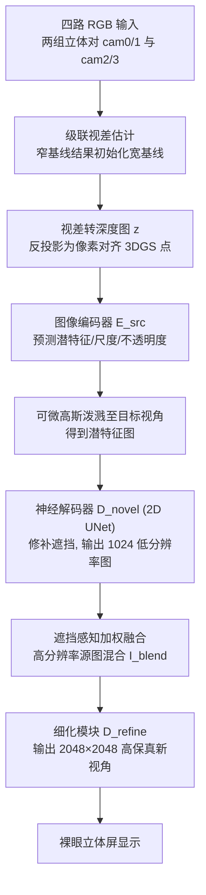

## 一句话总结

Tele-Aloha 是一套低成本、高真实感的双向远程临场系统：仅用四台稀疏 RGB 相机、一块消费级 GPU 和一台裸眼立体屏，配合级联视差估计 + 潜特征高斯泼溅 + 遮挡感知加权融合的实时新视角合成算法，实现 2K 分辨率、30fps、端到端延迟低于 150ms 的上半身临场通信。

## 研究背景

沉浸式远程临场（telepresence）追求的是"共同在场感"（co-presence）——身处千里之外的人却仿佛共享同一空间。人际交流中最关键的视觉线索集中在上半身：面部表情、眼神、手势与手臂动作。因此聚焦上半身的临场系统是一个合理的研究切口。

以 Starline、VirtualCube 为代表的商用系统已展示出很强的沉浸体验，但它们依赖复杂硬件与定制化物理布置（隔间或房间），且大量使用深度传感器，带来沉重的计算与传输负担，往往需要多块高端显卡，难以走向普通消费者。

作者主张彻底抛弃深度传感器，理由有三：其一，深度传感器对光照与场景反射敏感；其二，在低反射率区域和复杂材质场景下，深度观测存在缺失与噪声；其三，高质量深度传感器相比 RGB 相机仍然昂贵。于是本文提出用仅四台标定过的 4K RGB 相机作为全部输入传感器，整套硬件约 1.5 万美元，从而具备成为消费级量产产品的潜力。核心挑战在于：上半身场景的"放大"效应会放大伪影与抖动；稀疏相机布置带来的宽基线让传统立体匹配难以奏效；而 3DGS 等高质量表示又通常需要逐场景优化数分钟，无法即时泛化到未见过的用户。

## 方法

### 整体框架

系统由多视图视频采集、压缩传输、流解码、新视角合成与显示五部分构成。四台硬件同步的 RGB 相机布置在显示器左、右、上方：上方两台构成窄基线立体对，另一对为宽基线。经眼动追踪确定用户双眼位置后，为左右眼各合成一路新视角，送入裸眼立体屏，无需佩戴任何头显即可获得三维观感。整套流水线在单块 RTX 4090 上以 30FPS 运行，端到端延迟低于 150ms。

新视角合成算法是系统核心，分三步：级联视差估计得到稳健几何，潜特征高斯泼溅在降分辨率下得到完整渲染，遮挡感知融合再借助高分辨率输入细化到 2K。

### 关键设计

级联视差估计。稀疏输入下获取稳定几何是稳健渲染的关键。系统内两组水平相机对基线长短不同：上方 $(cam0, cam1)$ 基线小、立体匹配更稳健，下方 $(cam2, cam3)$ 基线大、视场更宽。作者用 RAFT-Stereo 先对窄基线对做零初始化估计：

$$\langle \hat{\mathbf{d}}_{cam0}, \hat{\mathbf{d}}_{cam1} \rangle = F_d(\mathbf{I}_{cam0}, \mathbf{I}_{cam1}, 0, 0)$$

再把 $cam0$ 的视差转深度、抬升为三维点云，光栅化到 $cam2$、$cam3$ 视角提取 Z-buffer 并转回视差，作为宽基线对的初始化：

$$\langle \hat{\mathbf{d}}_{cam2}, \hat{\mathbf{d}}_{cam3} \rangle = F_d(\mathbf{I}_{cam2}, \mathbf{I}_{cam3}, \mathbf{d}^{init}_{cam2}, \mathbf{d}^{init}_{cam3})$$

如此宽基线的大视差也能被稳健估计。实验显示，有初始化时仅 3 次迭代即可达到无初始化 16 次迭代的精度。

潜特征高斯泼溅。将三张深度图 $\hat{z}_{\{cam0,cam2,cam3\}}$ 反投影为像素对齐的 3D 高斯点。每个点具备位置 $\mathbf{x}_i$、潜外观特征 $\mathbf{f}_i$、尺度 $\mathbf{s}_i$、不透明度 $\alpha_i$ 四个属性，旋转固定为单位阵。与原始 3DGS 直接学习 RGB 或球谐不同，这里学习的是高维潜特征，把原图局部内容压缩进潜码，使每个点能表征一个局部区域，从而对遮挡、深度误差和相机色噪更鲁棒。编码器以图像与深度拼接为输入，共享骨干后由三个头分别输出外观特征图、尺度图与不透明度图：

$$\langle \mathbf{M}_f, \mathbf{M}_s, \mathbf{M}_\alpha \rangle = E_{src}(\mathbf{I} \oplus \mathbf{z})$$

高斯点可微地泼溅到左右目标视角得到潜特征图 $F_{novel}$，再由 2D UNet 解码器 $D_{novel}$ 在降分辨率（$1024 \times 1024$）下修补自遮挡造成的稀疏与空洞，同时输出用于后续上采样的细化特征图：

$$\langle F^{ref}_{novel}, \mathbf{I}^{lr}_{novel} \rangle = D_{novel}(F_{novel})$$

遮挡感知渲染细化。为补足分辨率，把所有预测深度图 warp 到新视角得到较稠密的融合深度 $\mathbf{z}_{fused}$，再将每个像素反投影回各输入视角采样颜色。混合权重综合考虑有效掩码、SDF 遮挡检查、射线与表面法向夹角，以及到相机距离：

$$w_i = \mathbf{M}_i(\mathbf{x}_i.uv) \cdot Occ(\mathbf{x}_i) \cdot \cos\langle \mathbf{r}(u,v), \mathbf{n}_i \rangle \cdot \frac{1}{\lVert \mathbf{x}^{cam}_i \rVert^2}$$

其中遮挡检查 $Occ$ 在 $\lvert \mathbf{x}_i.z - z_i \rvert < \delta$ 时取 1，避免在被遮挡区域采样。加权求和得到高频纹理丰富但可能不完整的混合图 $\mathbf{I}_{blend}$：

$$\mathbf{I}_{blend}(u,v) = \frac{1}{\sum_{i=0}^{\upsilon_{num}} w_i} \sum_{i=0}^{\upsilon_{num}} w_i \cdot \mathbf{c}_i$$

最后细化模块把"完整但低分辨率"的解码特征与"高频但不完整"的混合图融合，输出高保真新视角：

$$\mathbf{I}^{hr}_{novel} = D_{refine}(F^{refine}_{novel} \oplus E_{hr}(\mathbf{I}_{blend}))$$

两者互补，兼得完整性与高频细节。

## 实验结果

训练数据为 THuman-Sit 与 THuman2.0；THuman-Sit 按 4000 训练、700 测试划分，源图渲染方式与硬件布置对齐，新视角在其间随机采样。合成数据集上与其他高效新视角合成方法的定量对比如下：

| 方法 | PSNR ↑ | SSIM ↑ | LPIPS ↓ |
|------|--------|--------|---------|
| FloRen | 19.049 | 0.844 | 0.251 |
| ENeRF | 24.203 | 0.891 | 0.160 |
| GPS-Gaussian | 25.204 | 0.909 | 0.112 |
| 本文（无细化） | 25.642 | 0.916 | 0.171 |
| 本文（有细化） | 26.543 | 0.928 | 0.095 |

级联视差消融显示，宽基线在有初始化时 EPE 从 2.741 降到 2.192，1 像素内正确率从 0.5350 提升到 0.7169。系统效率方面：视差估计 4.7ms、编码器 6.1ms、解码器与细化器合计 9.3ms、输入视图融合 1.4ms、3DGS 光栅化 1ms、其他 1ms，视角合成总计约 23.5ms；两终端同一局域网下端到端延迟约 149ms。

## 亮点与局限

亮点：

- 用最简的四台 RGB 相机（无任何深度传感器）+ 单块消费级 GPU + 裸眼立体屏，把沉浸式临场系统的硬件成本压到约 1.5 万美元，具备量产潜力。
- 级联视差估计巧妙用窄基线结果初始化宽基线，攻克了稀疏宽基线立体匹配的难题，仅 3 次迭代即达高精度。
- 泼溅潜特征而非 RGB/球谐，配合神经解码器，显著缓解上半身严重自遮挡带来的空洞与不完整。
- "低分辨率完整修补 + 高分辨率加权融合"的双路细化，在实时约束下兼得完整性与高频纹理，实现 2K、30fps、<150ms。

局限：

- 对镜面/非朗伯物体（如眼镜）易失败，强各向异性会导致视差估计不稳定。
- 依赖前景分割，背景抠除不准会引入伪影。
- 系统聚焦上半身，且用户左右可移动范围约 0.8m、前后约 0.3m，受显示硬件与相机采集体积限制。

## 延伸思考

本文最值得借鉴的是一种"用工程系统化设计弥补硬件极简化"的思路：既然深度传感器昂贵且脆弱，就用一对窄基线相机提供稳健几何、再级联到宽基线，把"高质量传感"问题转化为"多视图约束 + 级联估计"问题。泼溅潜特征而非颜色的做法也颇具启发——它把可微渲染从"直出像素"解耦为"渲染中间表征 + 神经解码"，让稀疏、含噪的几何依然能产出完整图像，这一模式可推广到其他前馈式 3DGS 场景。

进一步看，系统当前受限于上半身与非朗伯物体，未来若能引入视角相关的外观建模（恢复球谐或引入反射先验）以处理眼镜、金属等材质，并把相机标定、时间同步与渲染联合优化，有望向全身、更自由的采集布置扩展。裸眼立体屏 + 低延迟眼动追踪的组合也提示：临场系统的"最后一公里"体验，显示端与算法端需要协同设计，而非彼此独立。
