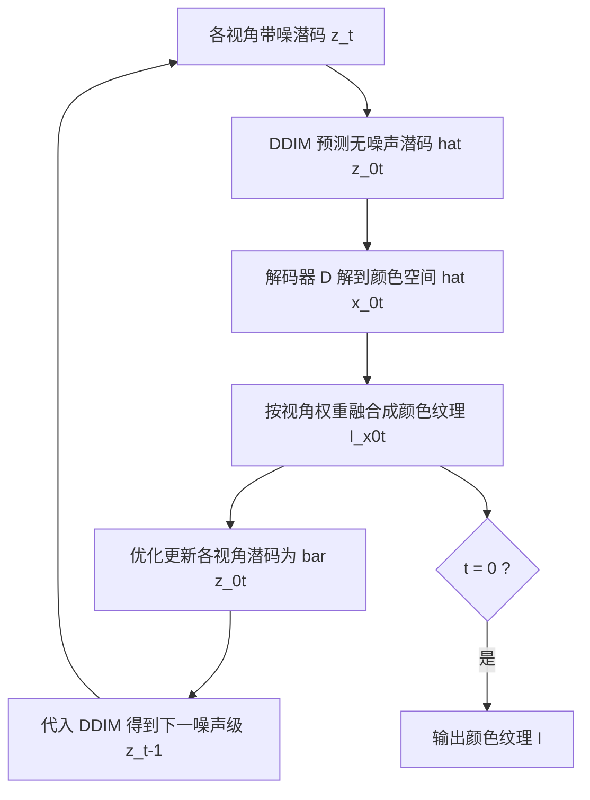

## 一句话总结

TexPainter 借助预训练二维扩散模型为任意三维网格生成纹理，核心是在 DDIM 预测的无噪声潜变量上做颜色空间融合，再通过优化反传更新各视角潜码，从而在不假设视角间顺序依赖的前提下实现多视角一致的高质量纹理。

## 研究背景

预训练扩散模型（如 LDM）让在屏幕空间自动生成图像成为可能，但把它用于三维网格纹理生成时，核心难题是多视角一致性：同一张纹理在不同相机视角下渲染出的外观必须在语义和视觉上保持一致。

已有方法存在两类问题。一类方法（如 TEXTure、Text2Tex）对每个视角顺序执行去噪并逐步覆盖上一视角生成的纹理，容易产生接缝、噪声和无意义的碎片。另一类方法（TexFusion）把去噪过程与多视角融合紧耦合，在潜空间里对带噪图像做融合。但不同视角的潜码是在各自独立的扩散过程中被加噪的，直接在潜空间操作会损害图像质量甚至削弱一致性。此外，这些方法还引入了不必要的视角间假设，例如假定多视角渲染图之间存在顺序依赖，而这与"不同相机视角只通过一张公共纹理间接关联"的直觉相悖。

作者观察到两点：其一，虽然中间时刻的潜码 $z^i_t$ 在不同视角上噪声成分差异巨大，但 DDIM 预测的 $\hat{z}^i_{0,t}$ 是对 0 时刻无噪声状态的估计；其二，LDM 的自编码器是高度非线性映射，颜色空间的一致并不意味着潜空间的一致。这两点是 TexPainter 方法设计的出发点。

## 方法

### 整体框架

给定网格 $M=\langle V,F\rangle$、UV 映射以及文本提示嵌入 $h$，目标是推断出在任意视角下都保持一致的纹理图像 $I$。方法基于深度条件的预训练 LDM，是一个改造过的多视角 DDIM 流程：对所有采样视角并行去噪，在每一步用 DDIM 预测的无噪声潜码解码到颜色空间做融合，再用优化把融合结果反传回各视角潜码。

### 关键设计

颜色空间融合：先由 DDIM 得到各视角预测的无噪声潜码 $\hat{z}^i_{0,t}$，解码为颜色图像 $\hat{x}^i_{0,t}=D(\hat{z}^i_{0,t})$，再按视角权重加权平均到一张颜色纹理。权重偏向那些与面片接近正交、覆盖像素更多的视角：

$$w_i = \max\left(0, \left\langle \frac{c^i - T(u)}{\lVert c^i - T(u)\rVert}, n(u)\right\rangle\right)$$

$$I_{x,0,t}(u) = \sum_{i \in C(T(u))} w_i\,\hat{x}^i_{0,t}(T(u)) \Big/ \sum_{i=1}^{\lvert C\rvert} w_i$$

优化反传更新潜码：拿到融合纹理 $I_{x,0,t}$ 后，通过优化把各视角潜码调整为 $\bar{z}^i_{0,t}$，使其解码结果与用融合纹理渲染出的对应视角图像匹配：

$$\arg\min_{\{\bar{z}^i_{0,t}\}} \sum_{i=1}^{\lvert C\rvert} L_{\text{diff}}(\bar{z}^i_{0,t}, c^i), \quad L_{\text{diff}}(z,c) \triangleq \lVert D(z) - R(M, I_{x,0,t}, c)\rVert_1$$

由于渲染项可在优化前预计算，该优化只涉及解码器 $D$ 的导数，无需可微渲染器，计算相对高效。更新后的潜码再代入 DDIM 得到下一噪声级：

$$z^i_{t-1} \sim \mathcal{N}\left(\sqrt{\alpha_{t-1}}\,\bar{z}^i_{0,t} + \sqrt{1 - \alpha_{t-1} - \sigma_t^2}\,\epsilon_\theta(z^i_t, t, h),\ \sigma_t I\right)$$

由于所有视角在 $\arg\min$ 中被平等对待，方法彻底去掉了对视角顺序依赖的假设。

两项扩展：一是联合优化，把 $I_{x,0,t}$ 和 $\{\bar{z}^i_{0,t}\}$ 一起优化，在相机覆盖不足的区域获得更好质量，但需要可微渲染器，推理时间从约 25 分钟增至 66 分钟，建议用快速版预览、联合优化版离线出终稿。二是把该框架推广为在多个扩散过程之间施加约束的通用机制，例如给不同相机集合分配不同文本提示，实现局部区域分别控制的三维版混合扩散。

## 实验结果

在 64 个高质量网格、182 组网格与文本提示上评测，以 SD2-depth 在各视角深度图与提示下生成的图像为参考集，用 FID 衡量质量。

| 方法 | FID（越低越好） | 时间（分钟） |
| --- | --- | --- |
| TEXTure | 88.16 | 5.5 |
| Meshy | 70.49 | N/A |
| Fantasia3D | 57.25 | 24.1 |
| TexFusion | 41.55 | 4.2 |
| Ours | 38.21 | 27.3 |
| Ours（直接编码 DE） | 43.40 | 4.8 |

TexPainter 取得最低 FID，质量优于对比方法；用 VAE 直接编码替代优化的变体大幅提速（4.8 分钟），但质量略有下降。消融实验表明：直接在潜空间融合会得到模糊且不一致的纹理；换用 DDPM 并在带噪潜码上做颜色融合会产生无意义纹理，说明依赖 DDIM 预测的无噪声潜码是必要条件。

## 亮点与局限

亮点：抓住"DDIM 预测的无噪声潜码"这一关键点，把多视角融合放到颜色空间进行，再用轻量优化（只需解码器导数、无需可微渲染器）反传更新潜码，思路简洁且效果一致提升；彻底去除视角间顺序依赖假设；框架可推广到多提示局部控制等更一般的多扩散过程约束。

局限：使用固定相机视角集合，难以像部分工作那样动态选视角（因为每步去噪都需所有视角同时在场融合）；质量受限于预训练 LDM，锐利特征生成不佳，缺乏三维方向约束时可能给人物模型生成多张脸；加权平均和优化不充分会导致模糊区域与平滑边缘；因每步都要重复优化，计算成本高于此前工作。

## 延伸思考

方法把"在颜色空间融合、在潜空间用优化对齐"确立为一种绕开自编码器非线性的通用范式，值得思考它在视频、四维序列或其他需要跨样本一致性的生成任务中的适用性。作者提出的"多扩散过程约束"视角尤其有想象空间：一致性约束只是其中一例，理论上可以纳入光照、材质分解或语义分区等更多约束。而无损编码器或纹理超分等改进若能替代每步优化，将直接缓解当前最主要的推理成本瓶颈。
