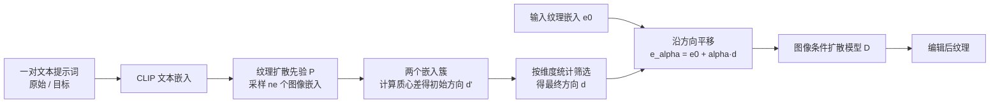

## 一句话总结

TexSliders 提出一种无需训练或微调扩散模型的纹理编辑方法，通过在 CLIP 图像嵌入空间中由一对文本提示词构造出保持纹理身份的编辑方向，实现类似滑块的连续可控编辑。

## 研究背景

扩散模型在自然图像编辑上表现出色，但把它直接用于纹理编辑却存在困难。主流图像编辑方法依赖操纵注意力图（attention maps）来保持结构与身份，其前提是图像包含清晰的物体结构、每个文本 token 能对应到某个空间区域。纹理却缺乏这种可分离的物体结构，注意力图无法捕捉纹理的结构信息，因此这类方法在纹理域上退化明显。

纹理是 3D 内容创作管线的核心组成部分，编辑纹理时人们希望像使用程序化材质的参数滑块一样进行直观、连续、解耦的控制，但程序化表示难以创作，参数与直观概念往往不对应。作者据此设定了四个目标：编辑方向易于定义、编辑要保持纹理身份、不需要真值标注数据、不修改原始扩散模型权重。

作者还观察到一个关键现象：在以图像嵌入为条件训练的扩散模型中，身份保持比以文本嵌入为条件的模型容易得多。原因在于用文本描述一张纹理会丢失大量信息，而图像嵌入能把结果约束到更具体的外观。因此方法选择在 CLIP 图像嵌入空间中操作。

## 方法

整体框架：给定一对描述编辑起点与终点的文本提示词（例如从 “metal” 到 “rusty metal”），方法先用一个针对纹理域训练的扩散先验模型 $$P$$ 把文本嵌入转换为 CLIP 图像嵌入，再在图像嵌入空间中计算一个编辑方向 $$d$$，最后把沿该方向平移后的嵌入作为条件送入图像条件扩散模型 $$D$$ 生成编辑后的纹理。

关键设计一：多嵌入求方向。为得到稳健的编辑方向，对原始与目标提示词各采样 $$n_e$$ 个图像嵌入（实验取 $$n_e = 150$$），分别记为 $$o^{(i)}$$ 与 $$t^{(k)}$$，然后取两簇质心之差作为初始方向 $$d' \in \mathbb{R}^{768}$$，其每个分量为：

$$d'_j = \frac{1}{n_e}\left(\sum_k t^{(k)}_j - \sum_i o^{(i)}_j\right).$$

对多个嵌入求平均可以在很大程度上把待编辑属性与身份解耦，但仍不足够。

关键设计二：维度剪枝以保持身份。作者发现许多维度并不贡献目标属性，反而携带导致身份漂移的噪声。于是按维度的簇内变异（标准差）与簇间变异（质心距离）做比较，只保留簇间变异大于簇内变异的维度，其余置零，得到最终方向 $$d$$：

$$d_j = \begin{cases} d'_j, & \text{若 } \lvert \tilde{d}'_j \rvert > \tau \cdot std_k(\tilde{t}^{(k)}_j) \text{ 且 } \lvert \tilde{d}'_j \rvert > \tau \cdot std_i(\tilde{o}^{(i)}_j) \\ 0, & \text{否则} \end{cases}$$

其中阈值 $$\tau$$ 通常取 $$0.8$$，且比较在归一化向量上进行。

关键设计三：滑块式连续编辑。给定待编辑纹理的图像嵌入 $$e_0$$，最终嵌入为：

$$e_\alpha = e_0 + \alpha \cdot d,$$

其中 $$\alpha$$ 调节编辑强度，可取正负值，甚至可外推（$$\alpha > 1$$ 或 $$\alpha < 0$$）。用户仅凭两个文本提示词即可在约两分钟内（单张 A10G GPU、未优化实现）创建一个新滑块。多个编辑方向还能组合叠加。

方法所用扩散模型在 7700 万张无人物无文字图像上训练，纹理先验在其中约 1000 万张被归类为纹理的子集上单独训练，并保证生成可平铺（tileable）的纹理。

## 实验结果

作者构建了一个测试集：七类材质（bricks、fabric、leather、metal、paper、stones、wood）与九种主要编辑属性组合，筛选语义有效的配对，共 80 张图像（66 张生成、14 张真实照片），每张配有原始与目标提示词。评测采用两个 CLIP 空间指标：CLIP-Direction 衡量编辑方向的贴合度，CLIP-Im2Im 衡量身份保持度，二者均越高越好。全测试集平均结果如下：

| 方法 | CLIP-Direction ↑ | CLIP-Im2Im ↑ |
| --- | --- | --- |
| P2P | 0.0880 | 0.9033 |
| Pix2pix-zero | 0.0811 | 0.8667 |
| SDEdit 0.5 | 0.0706 | 0.8753 |
| SDEdit 0.75 | 0.0690 | 0.8707 |
| Ours | 0.1063 | 0.9303 |

本方法在两个指标上都显著优于对比方法：既更贴合目标编辑方向，又更好地保持纹理身份。SDEdit 存在明显权衡（低噪声保身份但几乎不编辑，高噪声完成编辑但身份漂移）；P2P 与 Pix2pix-zero 因依赖不适合纹理的注意力图而出现身份丢失或走出纹理域的伪影。消融实验表明：单个嵌入（$$n_e = 1$$）无法保持身份；使用全部 768 维（方向 $$d'$$）虽有改善但身份仍不稳；只有经过维度筛选的完整方法才能在保持结构的同时完成编辑。方法还能用于真实照片（先用 CLIP 嵌入重建再编辑）、跨材质迁移编辑方向、组合多个方向，以及用成对图像替代文本来定义编辑方向。

## 亮点与局限

亮点：思路简洁且零样本，不需真值数据、不训练也不微调扩散模型；把编辑转化为 CLIP 图像嵌入空间中的一个方向，天然支持连续滑块、正负外推与多方向组合；提出基于簇内/簇间统计的维度剪枝，有效改善身份保持；能处理纹理特有的尺度变化（如 “small stones” 到 “big stones”），这是依赖空间结构的对比方法做不到的。

局限：继承了 CLIP 与扩散模型的偏置，对某些概念不够敏感（例如 CLIP 对 “vertical” 的表示优于 “horizontal”，导致竖条纹难以转横）；部分情况下身份不能完美保持，可能是编辑方向中残留噪声或冗余维度所致；外推过远会导致嵌入超出采样分布而失真；纹理“身份”本身缺乏形式化定义；工作聚焦彩色纹理，扩展到材质贴图受限于材质扩散模型的数据规模。

## 延伸思考

维度剪枝的核心洞见是把“属性”与“身份”对应到统计上可分的维度子集，这种基于簇间/簇内变异的选择策略并不限于纹理，或许可推广到其它需要解耦编辑的嵌入空间任务。方法揭示的“图像条件比文本条件更利于身份保持”这一点，对更广泛的可控生成与编辑设计有借鉴意义：当任务需要精细保真时，应尽量在信息更完整的表示空间中定义操作。后续若能结合扩散模型反演提升重建精度、探索更优的维度选择准则，或把编辑方向扩展到完整材质贴图并集成到面向艺术家的交互界面，将更贴近实际创作流程。
