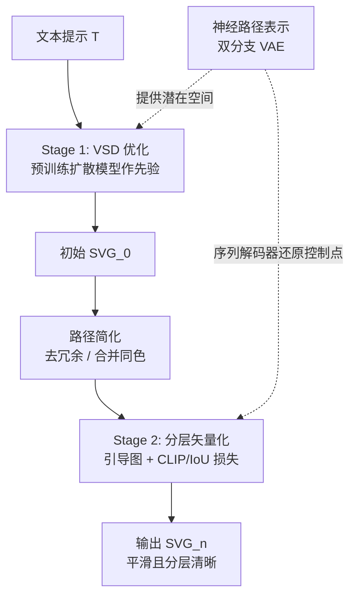

## 一句话总结

通过学习一个"神经路径表示"（双分支 VAE），并配合两阶段文本驱动优化（VSD 初生成 + 分层矢量化精修），从文本提示生成具有平滑路径与清晰分层结构的高质量矢量图（SVG）。

## 研究背景

矢量图（SVG）凭借可缩放、分层可编辑等特性在数字艺术与设计中广泛使用，但手工创作需要专业经验且耗时。文本到矢量（T2V）生成希望降低门槛，现有做法主要有两类，各有短板：

- 先用文本到图像（T2I）模型生成栅格图，再做图像矢量化。但 T2I 结果通常带有写实纹理与复杂色彩，转成矢量后路径数量爆炸、缺乏分层组织，偏离矢量图应有的简洁与平整色块。
- 直接在预训练视觉—语言模型（CLIP 或扩散模型）指导下优化路径的控制点。由于控制点自由度高且缺乏几何约束，容易产生自相交、锯齿状的杂乱路径。

此外，以往学习 SVG 潜在表示的工作（RNN、Transformer）多在整张 SVG 层面建模，受限于路径组合的巨大多样性，往往只能生成字体、草图、简单图标等特定类别。作者的核心观察是：复杂矢量图往往由简单路径组合而成，因此应在"单条路径"这一局部粒度上学习紧凑而富表达力的几何表示。

## 方法

整体框架分为两大部分：先离线学习神经路径表示，再在该潜在空间上做文本驱动的两阶段路径优化。一张 SVG 被表示为 $$SVG=\{\theta_1,\theta_2,\dots,\theta_m\}$$，其中每条路径 $$\theta_i=(z_i,C_i,Tr_i)$$ 分别对应形状潜码、颜色与仿射变换。

关键设计：

- 双分支 VAE 学习神经路径表示。一条路径是首尾相连的三次贝塞尔曲线序列。序列编码器（Transformer + 注意力，含位置编码）捕捉控制点间的几何关系；图像编码器（卷积网络）从可微光栅化得到的路径图像中学习渲染视觉特征。两路特征拼接后经线性投影融合为共享潜码 $$z\in\mathbb{R}^{d_F}$$（$$d_F=24$$）。两个解码分支分别重建控制点序列与路径图像。
- 训练损失结合几何与视觉两种模态。用从贝塞尔曲线上采样的辅助点计算 Chamfer 距离 $$\mathcal{L}_{cfr}$$ 以避免序列 MSE 过拟合，图像损失 $$\mathcal{L}_{img}=\lvert I-\hat I\rvert_1+\mathcal{L}_{percep}(I,\hat I)$$，再加 KL 正则 $$\mathcal{L}_{kl}$$，总损失为 $$\mathcal{L}=\lambda_{cfr}\mathcal{L}_{cfr}+\lambda_{img}\mathcal{L}_{img}+\lambda_{kl}\mathcal{L}_{kl}$$。在黑白图标数据集上训练，得到平滑、可插值的路径潜在空间。
- 第一阶段：变分分数蒸馏（VSD）优化。以预训练文本到图像扩散模型为先验，直接在潜码空间优化路径组合（而非显式控制点），保证每条路径的规整性。相比 SDS 会出现过饱和、过平滑、缺乏多样性，VSD 把参数建模为分布，用 LoRA 建模渲染图像分布，其梯度为 $$\nabla_\theta\mathcal{L}_{VSD}\triangleq\mathbb{E}_{t,\epsilon}\left[w(t)\left(\epsilon_\phi(x_t;T,t)-\epsilon_{LoRA}(x_t;T,t)\right)\frac{\partial x}{\partial\theta}\right]$$，产出初始 $$SVG_0$$。
- 第二阶段：分层矢量化精修。先做路径简化（去掉低不透明度/极小面积路径、合并重叠同色路径）；再对简化后的 SVG 加噪去噪得到更干净的引导图 $$I_g$$；随后按面积从大到小递进式加入路径，逐层优化，损失为 $$L_{lyr}=L_{CLIP}+\lambda_{IoU}L_{IoU}$$，从粗到细得到清晰、层次分明的最终结果。

## 实验结果

在 160 条文本提示、每条生成 5 张共 800 张 SVG 上，从矢量级（平滑度 Smooth、简洁度 Simp、分层语义 Layer）、图像级（FID）、文本级（CLIP）综合评估。主实验对比如下：

| 方法 | Smooth ↑ | Simp ↓ | Layer ↑ | FID ↓ | CLIP ↑ |
| --- | --- | --- | --- | --- | --- |
| T2I + Potrace | 0.7846 | 430 | 0.0226 | 104.92 | 0.2732 |
| T2I + LIVE | 0.5797 | 40 | 0.0119 | 97.82 | 0.2519 |
| T2I + LoRA + Potrace | 0.7882 | 160 | 0.0395 | 45.16 | 0.2729 |
| CLIPDraw | 0.4711 | 128 | 0.0317 | 123.55 | 0.2832 |
| Diffsketcher | 0.4829 | 128 | 0.0105 | 92.36 | 0.2607 |
| VectorFusion（from scratch） | 0.6322 | 128 | 0.0139 | 65.71 | 0.2675 |
| VectorFusion（from LIVE） | 0.5025 | 128 | 0.0258 | 76.45 | 0.2880 |
| 本文方法 | 0.8012 | 40 | 0.0591 | 52.30 | 0.3015 |

本文方法在平滑度、分层语义、文本对齐（CLIP）上最优，且仅用 40 条路径即达到更好的语义对齐；FID 上仅次于专门在类似矢量风格数据上微调的 LoRA + Potrace 基线。用户研究（32 名参与者）中，本文方法在整体 SVG 质量上获 81.1% 偏好、文本对齐上获 69.2% 偏好，均居首。消融实验表明：去掉神经路径表示会导致路径自相交、平滑度大幅下降（0.5271）；仅用序列模态会削弱重建视觉保真；去掉 VSD 阶段会让路径数激增到 380；去掉分层矢量化则路径杂乱堆叠、层次混乱。

## 亮点与局限

亮点：

- 将表示粒度从"整张 SVG"下沉到"单条路径"，用双分支 VAE 同时吸收几何（序列）与视觉（图像）信息，突破了以往只能生成特定类别的限制，可生成多样复杂的矢量图。
- 在潜在空间而非控制点上优化，天然带有几何约束，从根源上缓解自相交与锯齿问题。
- 两阶段设计（VSD 生成 + 分层矢量化精修）兼顾语义对齐与清晰的分层可编辑结构，并支持可调细节层级、多风格、SVG 定制、图像转 SVG、SVG 动画等应用。

局限：

- 依赖预训练文本到图像扩散模型作为先验，其风格与能力边界会传导到生成结果。
- 路径 VAE 在黑白图标数据上训练，控制点序列被填充/截断到固定长度（$$k=50$$），对超长或极复杂路径有约束；支持线稿等开放路径还需在相应数据上微调。
- 分两阶段并结合 VSD 优化，整体优化流程相对复杂。

## 延伸思考

- "局部路径潜表示 + 全局组合优化"的思路值得推广：把可微渲染的表达力与学习先验的几何规整性解耦，可能同样适用于三维草图、CAD 曲线、字体等结构化矢量内容。
- VSD 相比 SDS 在多样性与细节上的收益，提示分数蒸馏类方法在矢量优化中同样受"点估计 vs 分布估计"影响，后续可探索更高效的分布建模替代 LoRA。
- 分层矢量化通过面积排序递进加入路径来诱导层次结构，是一种轻量却有效的先验；能否让分层本身可学习、与语义对齐，是提升可编辑性的方向。
