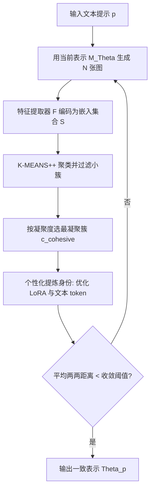

## 一句话总结

给定一段仅有文字的角色描述，本方法通过「生成图库 → 语义聚类挑最凝聚簇 → 个性化提炼身份」的迭代过程，全自动地从文本到图像扩散模型中蒸馏出一个一致的角色表示，使同一角色能在全新语境中被反复、连贯地生成。

## 研究背景

文本到图像生成模型极大释放了视觉创作潜力，但用户在生成「一致角色」时普遍受挫，而角色一致性正是故事绘本、游戏开发、资产设计、品牌与广告等大量真实场景的关键。现有方法通常要么依赖目标角色的多张已有图像（如个性化与故事生成方法），要么依赖繁琐的人工流程（如借用名人名字、手工筛选图像变体、精心堆砌超长提示词），既不通用也难以自动化。

作者提出一个新任务设定：仅以一段自然语言描述为输入，自动蒸馏出满足该描述的某个一致角色表示，且不要求输入任何目标角色的图像。其核心论点是，在许多应用里目标是生成「某个」一致角色，而非精确复刻某个特定外观，因此可以创造出并不对应任何已有形象的全新一致角色。方法的基本假设是：对同一提示词生成足够多的图像，其中必然会出现共享特征的图像分组，从这些分组的「共同点」中即可提炼出一致身份。

## 方法

整体框架：给定文本到图像模型 $$M_{\Theta}$$（参数 $$\Theta = (\theta, \tau)$$，其中 $$\theta$$ 为 LoRA 权重、$$\tau$$ 为自定义文本嵌入）与描述角色的提示词 $$p$$，目标是求得表示 $$\Theta(p)$$，使 $$M_{\Theta(p)}$$ 能在新语境中一致地生成该角色。做法是用模型自己生成的图像作为训练数据，迭代地个性化定制模型，把输出不断「漏斗式」收敛到一个一致身份。

关键设计：

- 身份聚类：每轮用当前表示生成 $$N$$ 张不同随机种子的图像，用预训练特征提取器（DINOv2）嵌入得到集合 $$S = \bigcup_{N} F(M_{\Theta}(p))$$，再用 K-MEANS++ 按余弦相似度聚类。先剔除规模低于阈值 $$d_{\text{min-c}}$$ 的小簇（避免在小数据集上过拟合），再从剩余簇中选「最凝聚」的一簇。簇 $$c$$ 的凝聚度定义为成员到质心 $$c_{\text{cen}}$$ 的平均距离：
$$\text{cohesion}(c) = \frac{1}{\lvert c \rvert} \sum_{e \in c} \lVert e - c_{\text{cen}} \rVert_{2}$$

- 身份提炼：最凝聚簇仍可能身份不完全一致，故在其图像上训练以提炼更一致的身份。基座为 Stable Diffusion XL（含 CLIP 与 OpenCLIP 两个文本编码器），先做文本反演为两个编码器各加一个新 token $$\tau$$；由于纯 token 空间表达力不足，再用 LoRA 对自注意力与交叉注意力层更新权重 $$\theta$$。训练用标准去噪损失：
$$L_{\text{rec}} = \mathbb{E}_{x \sim c_{\text{cohesive}},\, z \sim E(x),\, \epsilon \sim \mathcal{N}(0,1),\, t} \left[ \lVert \epsilon - \epsilon_{\Theta(p)}(z_t, t) \rVert_{2}^{2} \right]$$
其中 $$E(x)$$ 为 SDXL 的 VAE 编码器，$$z_t$$ 为噪声到时刻 $$t$$ 的潜码，优化对象为 $$\Theta = (\theta, \tau)$$。

- 迭代收敛：每轮提炼出的表示 $$\Theta$$ 用于生成下一轮的 $$N$$ 张图，从而逐步收敛到一致身份。采用早停准则：当新生成图像的所有嵌入两两欧氏距离的平均值小于阈值 $$d_{\text{conv}}$$ 时停止。方法是非确定性的，同一提示词多次运行会得到不同的一致角色，符合任务的「一对多」本质。

## 实验结果

作者用 ChatGPT 生成不同类型（动物、生物、物体等）与风格（贴纸、动画、写实等）的角色提示词，与多种个性化基线对比，采用两个标准指标：提示相似度（生成图像与文本的 CLIP 相似度）与身份一致性（同一角色在不同语境下生成图像的 CLIP 图像嵌入两两相似度）。核心发现是两者之间存在内在权衡，本方法取得了更好的平衡（原文以散点图与用户研究呈现，未给出统一数值表）。各方法在该权衡上的定性表现如下：

| 方法 | 提示相似度 | 身份一致性 | 备注 |
| --- | --- | --- | --- |
| TI | 高 | 低 | 能跟随提示但角色不一致 |
| BLIP-diffusion | 高 | 低 | 能跟随提示但角色不一致 |
| IP-Adapter | 中 | 中 | 一致性弱于本方法 |
| LoRA DB | 低 | 高 | 一致但常不跟随提示、姿态固定 |
| ELITE | 低 | 高 | 提示跟随差、角色易畸变 |
| 本方法 | 平衡 | 平衡 | 兼顾提示跟随与一致性，姿态视角多样 |

用户研究（Amazon Mechanical Turk，1—5 李克特量表评分提示相似度与身份一致性）同样表明本方法在两个维度间取得更好平衡，且与基线的差距更明显。消融研究显示四个组件均关键：去掉聚类会因训练集过于多样而损害身份提炼；去掉 LoRA（仅保留文本 token）会因参数不足而欠拟合；每轮重新初始化表示或只迭代一次，都无法收敛到单一身份。

## 亮点与局限

亮点：首个「仅凭文本、无需任何角色图像」的全自动一致角色生成方案，且领域无关（人、动物、物体皆可）；将「聚类挑凝聚簇 + 个性化提炼」组织成迭代漏斗，把模型自身输出逐步收敛为一致身份；能在保持提示跟随的同时生成不同姿态与视角的角色；可自然衔接下游应用，如故事绘本插图、结合 Blended Latent Diffusion 的局部图像编辑、结合 ControlNet 的姿态控制，并支持用户手动挑选聚类以干预结果。

局限：作者列出五点。其一，身份有时无法完全收敛一致（如机器人颜色、手臂形状仍有差异），常因提示过于宽泛致聚类找不到足够凝聚的集合；其二，配角或关联元素（如角色的宠物猫）不一致，且框架不支持同时发现多个概念；其三，会绑定提示词之外的「伪属性」（如给姜黄猫贴纸凭空添加绿叶），源于扩散模型的随机性恰好让含该属性的图像构成最凝聚簇；其四，计算开销大，收敛一次约需 20 分钟；其五，倾向生成较简单、单一居中的场景，或因身份提炼阶段的「平均化」效应所致。

## 延伸思考

本工作把「一致性」从「复刻已有外观」重新定义为「蒸馏某个满足描述的新身份」，这一视角切换本身就颇具启发：它把问题从检索/复制转成了生成式的自洽收敛，且天然是一对多的。方法的核心机制其实是一种「用模型自身输出的密度非均匀性来自举一致性」的策略——聚类挑最凝聚簇，等价于沿生成流形上密度更高的模式收敛，这种自训练漏斗思路也可能迁移到其它需要从噪声输出中提炼稳定概念的场景。其暴露的伪属性与配角不一致问题，本质指向「哪些语义该被绑定进身份、哪些应保持自由」这一控制难题，显式建模身份忠实度与提示可编辑性之间的可调权衡，以及降低约 20 分钟的迭代成本，都是值得跟进的方向。
