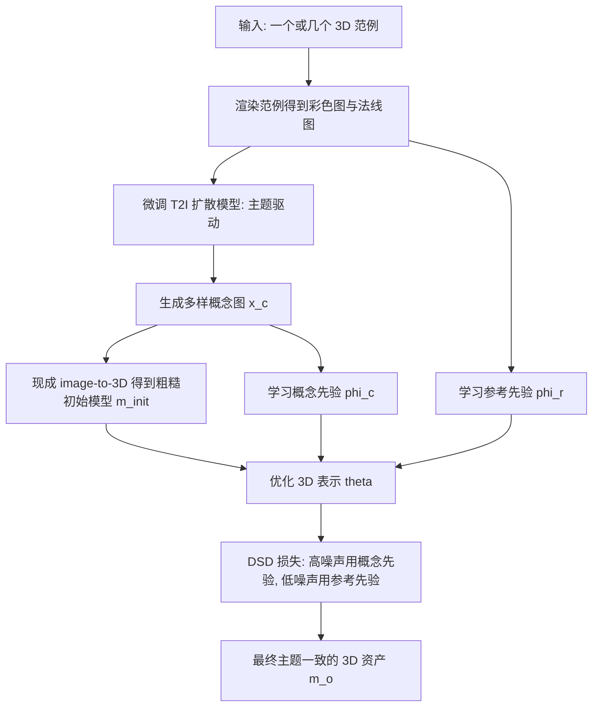

## 一句话总结

ThemeStation 给定一个或几个 3D 范例，通过「先画概念图，再做参考引导的 3D 建模」两阶段流程，配合一种双分数蒸馏（dual score distillation, DSD）损失，生成一批既与范例主题一致（unity）又彼此各异（diversity）的高质量 3D 资产。

## 研究背景

在虚拟现实、游戏等应用里，人们常需要制作大量主题一致但各不相同的 3D 模型，例如一整座古镇的建筑群或一个生态系统里的怪物。熟练美术师做出一两个协调的模型不难，但要造出成规模的 3D 画廊则费时费力。

扩散模型显著降低了 3D 内容创作门槛，让人能从文本（text-to-3D）或图像（image-to-3D）出发生成 3D 资产。但这些方法受输入模态携带的 3D 信息有限，普遍存在 3D 歧义与多视图不一致问题。作者提出改用 3D 范例作为输入来引导生成：相比文本和图像，3D 范例在几何与外观上都提供更丰富的信息，能减少建模歧义。

难点在于，若只用少量 3D 范例直接训练一个生成模型，得到的变化非常有限，基本停留在缩放、随机重复或重排输入，无法在外观上引入有意义的修改，也不理解范例的语义。ThemeStation 的核心思路是把预训练 2D 扩散模型中的先验「扩展」到 3D-to-3D 生成任务上，从而在保持主题的同时产生真正新颖的内容变化。

## 方法

整体框架模仿真实 3D 建模流程：先做概念美术设计，再从基础体逐步精修为成品。第一阶段微调一个预训练文本到图像（T2I）扩散模型，生成一批与范例主题一致的概念图；第二阶段对每张概念图，用现成 image-to-3D 方法得到粗糙初始模型，再通过 DSD 损失优化为最终模型。

关键设计：

- 主题驱动的概念图生成：与主体驱动（subject-driven）的个性化方法不同，作者的目标不是复刻同一个主体，而是生成主题一致却主体各异的新内容。做法是用较少迭代微调 T2I 模型，使其在学到范例主题（语义与风格）的同时保留想象力，并用一句跨所有范例共享的文本提示（如「a 3D model of an owl, in the style of [V]」）来显式解耦主题与内容。

- 参考引导的 3D 建模：从概念图 $$x_c$$ 出发用现成 image-to-3D 得到初始模型 $$m_{init}$$ 作为起点。由于概念图与初始模型可能存在结构不一致与瑕疵，最终模型并不严格对齐概念图，而是把它们当作中间产物，逐步精修。

- 双分数蒸馏（DSD）：这是核心组件。回顾 SDS 与 VSD——VSD 的梯度为
$$\nabla_\theta \mathcal{L}_{VSD} = \mathbb{E}_{t,\epsilon}\left[\omega(t)\left(\epsilon_\phi(x_t; y, t) - \epsilon_{lora}(x_t; y, t, c)\right)\frac{\partial x}{\partial \theta}\right]$$
单一先验的 SDS/VSD 在混合冲突先验时会崩溃。DSD 同时使用两个扩散先验：概念先验 $$\phi_c$$（保证概念图内容保真度）和参考先验 $$\phi_r$$（从范例恢复多视图一致的细节纹理与几何）。参考先验同时在彩色图和法线图上学习，法线图用带「normal map」标识的独立提示以解耦外观与几何。

- 按噪声级分配先验：作者观察到逆扩散存在由粗到细的时间步动态——高噪声级（早期时间步 $$t_h$$）控制全局布局与粗色分布，低噪声级（后期时间步 $$t_l$$）生成高频细节。据此把概念先验施加在高噪声级、参考先验施加在低噪声级，避免二者直接相加导致的损失冲突。概念先验与参考先验的梯度分别为
$$\nabla_\theta \mathcal{L}_{concept}(\phi_c, t_h) = \mathbb{E}_{t_h,\epsilon}\left[\omega\left(\epsilon_{\phi_c}(x_{t_h}; y, t_h) - \epsilon_{lora}\right)\frac{\partial x}{\partial \theta}\right]$$
$$\nabla_\theta \mathcal{L}_{ref}(\phi_r, t_l) = \mathbb{E}_{t_l,\epsilon}\left[\omega\left(\epsilon_{\phi_r}(x_{t_l}; y_x, t_l) - \epsilon_{lora}\right)\frac{\partial x}{\partial \theta}\right] + \mathbb{E}_{t_l,\epsilon}\left[\omega\left(\epsilon_{\phi_r}(n_{t_l}; y_n, t_l) - \epsilon_{lora}\right)\frac{\partial x}{\partial \theta}\right]$$
最终 DSD 梯度为二者加权组合：
$$\nabla_\theta \mathcal{L}_{DSD} = \alpha \nabla_\theta \mathcal{L}_{concept}(\phi_c, t_h) + \beta \nabla_\theta \mathcal{L}_{ref}(\phi_r, t_l)$$
其中 $$\alpha$$、$$\beta$$ 平衡两路引导强度。

## 实验结果

作者收集了含 66 个参考模型的基准（15 个立体场景、25 个独立物体、26 个角色）。与五个 image-to-3D 方法比较（评估第二阶段），用 CLIP 分数衡量全局语义相似度、Contextual 距离衡量像素级语义距离；与两个 3D 变化方法比较（评估整体 3D-to-3D），用视觉/几何多样性与视觉/几何质量衡量。

| 对比方向 | 方法 | CLIP↑ | Contextual↓ |
| --- | --- | --- | --- |
| Image-to-3D | Magic123 | 0.868 | 3.345 |
| Image-to-3D | OpenLRM | 0.840 | 4.137 |
| Image-to-3D | Ours | 0.890 | 3.168 |

| 对比方向 | 方法 | 视觉多样性↑ | 几何多样性↑ | 视觉质量↑ | 几何质量↑ |
| --- | --- | --- | --- | --- | --- |
| 3D-to-3D | Sin3DM | 0.180 | 0.344 | 5.221 | 5.638 |
| 3D-to-3D | Sin3DGen | 0.201 | 0.634 | 5.127 | 5.607 |
| 3D-to-3D | Ours | 0.315 | 0.465 | 5.848 | 5.616 |

两个 3D 变化基线倾向于过拟合输入、产出无意义的重复或重排内容，视觉多样性与质量都较低；ThemeStation 则生成主题一致、几何与纹理都有合理变化的新颖资产。30 人用户研究的成对比较（2AFC）显示，在 image-to-3D 与 3D-to-3D 两个任务上本方法都显著更受偏好。

消融实验对比五种设置：仅用概念先验的基线、朴素叠加两先验、完整 DSD、反转噪声级分配、参考先验扩展到全噪声级。完整 DSD 在四项指标上全面最优；朴素叠加会因损失冲突产生凹凸表面与模糊纹理；反转噪声级分配导致明显性能下降，印证了「高噪声用概念先验、低噪声用参考先验」这一设计与扩散时间步动态的契合。

| 设置 | CLIP↑ | Contextual↓ | 视觉质量↑ | 几何质量↑ |
| --- | --- | --- | --- | --- |
| 基线（仅概念先验） | 0.877 | 3.182 | 5.639 | 4.789 |
| 朴素叠加参考先验 | 0.876 | 3.177 | 5.726 | 5.336 |
| 完整 DSD | 0.890 | 3.168 | 5.848 | 5.616 |
| 反转 DSD | 0.863 | 3.186 | 5.578 | 4.926 |
| 参考先验主导 | 0.874 | 3.179 | 5.701 | 5.296 |

## 亮点与局限

亮点：首次将扩散先验扩展到 3D-to-3D 主题感知生成任务；两阶段设计忠实模仿真实建模流程，把概念图作为可选的粗引导而不强约束；DSD 巧妙利用扩散逆过程的由粗到细动态，在不同噪声级分派两个冲突先验，优雅化解了损失冲突；仅凭单个范例也能生成兼具主题一致性与多样性的高质量资产，并支持通过文本提示操控的可控 3D-to-3D 生成。

局限：与其他基于优化的 3D 生成方法一样，将初始模型精修为成品仍需数小时；作为两阶段流程，虽可方便接入更好的 image-to-3D 方法改善初始化，但也会受劣质初始化（如 3D 瑕疵、漂浮物）拖累；当概念图本身含重大错误（如尾巴长在身体前方）时难以修复；对需要规则几何的目标（如带立方体规整化的「Minecraft」建筑）因缺乏显式几何约束而可能失败。

## 延伸思考

作者指出训练一个前馈式主题感知 3D-to-3D 生成模型是化解速度瓶颈与初始化依赖的潜在方向，这与整个 3D 生成领域从「逐物体优化」走向「前馈预测」的趋势一致。DSD 中「按噪声级分派不同先验」的思想具有普遍性，值得迁移到其他需要融合多个冲突引导信号的生成任务。此外，方法的上限很大程度取决于第一阶段概念图与初始模型的质量，随着更强的多视图扩散与神经渲染技术出现，整条流水线有望在质量与效率上持续受益。
