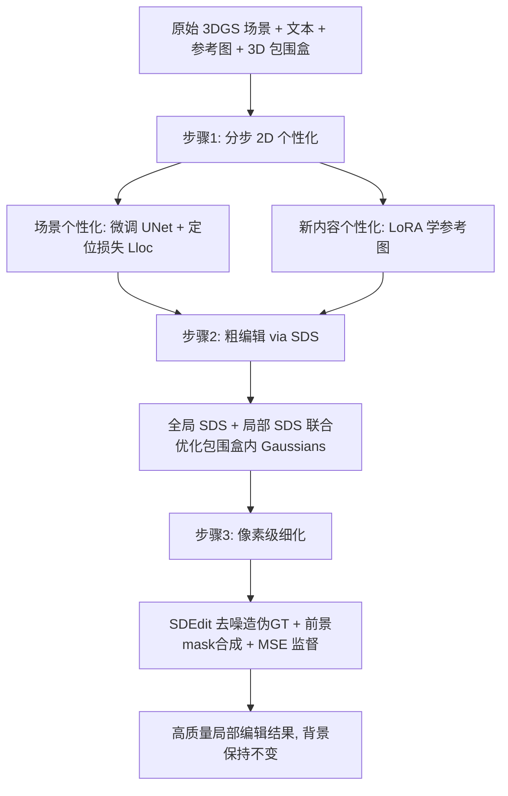

## 一句话总结

TIP-Editor 让 3D 场景编辑同时接受「文本提示 + 图像提示 + 3D 包围盒」三种约束：文本说清语义、参考图锁定外观细节、包围盒圈定编辑区域；核心用一套分步（stepwise）2D 个性化策略把「已有场景」和「新内容」分别学进扩散模型，再以 3D Gaussian Splatting 作表示做局部编辑，从而实现比纯文本方法精确得多的外观与位置控制。

## 研究背景

基于辐射场（NeRF、3D Gaussian Splatting）的表示因其逼真的渲染质量，被广泛用于三维重建及各类下游编辑任务（纹理编辑、形状变形、场景分解、风格化等）。其中，只需高层指令（如文本）的「生成式编辑」相比传统需要大量交互的雕刻式、绘画式编辑更加便捷，借助大规模文生图（T2I）模型的成功而快速发展。

但纯文本驱动的方法存在天然瓶颈：文本描述无法精确指定「特定外观」和「特定位置」。论文举了两个典型例子——想给玩具戴上电影《黑暗骑士》里小丑同款妆容、或戴一副特殊的心形墨镜，纯文本方法往往生成的是该类别里最常见、不受控的版本；同时也很难只靠文本把物体放到罕见位置（例如把墨镜架在额头上）。这些困难根源在于生成物体的外观多样、场景的空间布局多样。

针对这两点，作者提出 TIP-Editor，用文本 + 一张参考图 + 一个 3D 包围盒共同引导，对基于 GS 的辐射场做直观、便捷、精准的编辑。

## 核心方法

给定目标场景的多视角带位姿图像（COLMAP 估计），先训练出原始场景的 3D Gaussian Splatting 表示。之所以选 GS，是因为它是显式、灵活的点式表示，天然便于局部编辑——用包围盒即可轻松分离前景与背景。整个编辑流程分三步：

### 步骤 1：分步 2D 个性化（Stepwise 2D Personalization）

这是全文最关键的设计。它基于 DreamBooth，但做了两处重要改动，把「已有场景」和「参考图新内容」分开学习，避免多概念互相干扰（concept forgetting）。

- 场景个性化：先用 BLIP-2 给场景生成初始文本（如 "a toy"），在名词前加一个特殊 token $$V_1$$ 得到场景专属提示（"a $$V_1$$ toy"），再用重建损失和先验保持损失微调 T2I 模型（Stable Diffusion）的 UNet。特别地，条件里额外加入相机位姿 $$p$$，以便后续 SDS 优化时更好地控制视角。损失为：

$$\mathcal{L}_{scene}=\mathbb{E}_{z,y,\epsilon,t}\lVert\epsilon_{\phi_1}(z_t,t,p,y)-\epsilon\rVert_2^2+\mathbb{E}_{z^*,y^*,\epsilon,t^*}\lVert\epsilon_{\phi_1}(z^*_t,t^*,p^*,y^*)-\epsilon\rVert_2^2$$

- 定位损失（Localization Loss）：为了把新物体准确放到指定位置（尤其是罕见位置，如额头上的墨镜），作者从物体关键词的交叉注意力图 $$A_t$$ 中读取「实际生成位置」，把 3D 包围盒投影到图像平面得到「目标区域 $$S$$」，二者之间构造损失：

$$\mathcal{L}_{loc}=\left(1-\max_{s\in S}(A_t^s)\right)+\lambda\sum_{s\in\bar{S}}\lVert A_t^s\rVert_2^2$$

含义是：鼓励编辑区域内注意力概率高，同时惩罚区域外出现目标物体。值得注意的是这里只对区域内取 max 逼近 1，而非像以往工作那样强制区域内所有像素注意力都为 1——消融实验表明后者会让物体铺满整个包围盒造成 overfill 伪影。

- 新内容个性化：固定上一步的 UNet，插入 LoRA 层专门学习参考图的独特特征。同样用 BLIP-2 得到参考物初始文本并插入特殊 token $$V_2$$（如 "$$V_2$$ sunglasses"），训练损失：

$$\mathcal{L}_{ref}=\mathbb{E}_{z_r,y_r,\epsilon,t}\lVert\epsilon_{\phi_2}(z^r_t,t,p^*,y_r)-\epsilon\rVert_2^2$$

训练后，场景内容存在 UNet 里、参考图内容存在 LoRA 层里，二者相互干扰大幅降低，也天然支持连续（sequential）多次编辑。

### 步骤 2：基于 SDS 的粗编辑

用个性化后的扩散模型 $$\epsilon_{\phi_2}$$，通过 Score Distillation Sampling 优化包围盒内的 Gaussians $$G_B$$。不同编辑类型对 Gaussians 的处理不同：物体插入时复制盒内 Gaussians 并只优化新的；物体替换/重纹理时更新盒内全部（重纹理只改球谐颜色系数）；风格化时优化全场景。作者同时用全局与局部两种 SDS：

$$\mathcal{L}_{SDS}=\gamma\mathcal{L}^G_{SDS}+(1-\gamma)\mathcal{L}^L_{SDS}$$

全局 SDS 输入完整渲染图和包含 $$V_1,V_2$$ 的完整提示 $$y_G$$，保证新内容与场景协调；局部 SDS 只渲染前景物体、用只描述新物体的提示 $$y_L$$，减少伪影。消融显示 $$\gamma=0.5$$ 时前景质量与融合自然度最佳。

### 步骤 3：像素级细化

直接用 SDS 优化的结果常带伪影（如镜框上的绿色噪点、头发上的针状噪声）。作者借鉴 SDEdit，对粗渲染图 $$I_c$$ 加少量噪声（噪声水平很小，$$t_0=0.05$$）再用个性化模型去噪得 $$I_c^d$$，同时渲染只含可编辑 Gaussians 的实例 mask $$M_{inst}$$ 和只含固定 Gaussians 的背景图 $$I_{bg}$$，合成伪 GT：

$$I_{gt}=M_{inst}\odot I_c^d+(1-M_{inst})\odot I_{bg}$$

这样背景严格保持原样、前景被 T2I 模型增强，再用 MSE 监督渲染图，有效去噪并增强纹理。小噪声水平保证了细节增强而不改变形状与视角一致性。

## 技术细节

- 3D 表示为 3DGS，每个高斯含位置 $$\mu$$、不透明度 $$\alpha$$、协方差 $$\Sigma$$、颜色 $$c$$，可微溅射渲染。
- 场景个性化 1k 迭代、新内容个性化 500 迭代，$$\lambda=0.1$$。
- 粗编辑视角采样沿用 DreamEditor，渲染分辨率 512×512，依任务复杂度 1K~5K 迭代，约 5~25 分钟。
- 细化阶段 3K 迭代，不到 3 分钟；渲染相机位姿以 30° 间隔覆盖各仰角与方位角。
- 参考图既可来自互联网，也可先用 T2I 模型生成多个候选再由用户挑选，让结果更可预测。

## 实验结果

在六个不同复杂度的真实场景（简单背景物体、人脸、复杂户外场景）上评测。由于缺少专门的图像驱动编辑基线，作者与两个最先进文本驱动辐射场编辑方法比较：Instruct-NeRF2NeRF（I-N2N）和 DreamEditor（为公平将其自动定位改为手动选择）。评价指标为 CLIP 文-图方向相似度、参考图与编辑结果间的 DINO 相似度，以及 50 人用户研究（质量 Quality 与对齐 Alignment 两方面）。

| 方法 | CLIP$$_{dir}$$↑ | DINO$$_{sim}$$↑ | Vote$$_{quality}$$ | Vote$$_{alignment}$$ |
| --- | --- | --- | --- | --- |
| Instruct-N2N | 8.3 | 36.4 | 21.6% | 8.8% |
| DreamEditor | 11.4 | 36.8 | 7.6% | 10.0% |
| Ours | 15.5 | 39.5 | 70.8% | 81.2% |

TIP-Editor 在所有指标上大幅领先。定性上，两个基线不支持图像提示，只能生成该类别里最常见、不受控的物体；I-N2N 有时误解或忽略关键词，DreamEditor 因用网格（NeuMesh）表示难以做大幅形状变化。TIP-Editor 则能稳定保留参考图独特特征（心形墨镜、白色长颈鹿、小丑妆容），支持物体插入、替换、重纹理、风格化，并能无质量退化地连续编辑。

关键消融：

- 去掉 $$\mathcal{L}_{loc}$$：CLIP$$_{dir}$$ 从 25.4 掉到 4.4，墨镜无法放到指定的额头位置。
- 去掉 LoRA：外观相似度下降（心形变普通圆形），CLIP$$_{dir}$$ 24.0、DINO 28.0。
- 3D 表示对比：GS（CLIP 18.7 / DINO 33.5）优于 Instant-NGP（背景被误改）和 NeuMesh（无法大幅形变），说明显式灵活的 GS 最适合局部编辑同时保持背景不变。
- 与 Custom Diffusion 的 2D 个性化对比：后者用同一 UNet 学所有概念、缺定位机制，个性化质量与放置精度都更差。

## 贡献与局限

贡献：
- 提出 TIP-Editor，一个同时接受文本与参考图提示的通用 3D 场景编辑框架，支持物体插入、替换、重纹理、风格化等多种操作。
- 提出分步 2D 个性化策略：场景个性化中的定位损失实现精确位置控制，独立的 LoRA 新内容个性化实现精确外观控制，并支持连续编辑。
- 采用 3D Gaussian Splatting 作表示，利用其显式点数据结构实现高效、精准的局部编辑并保持背景不变。

局限：
- 包围盒输入虽方便但较粗糙，在复杂场景中可能框进不想要的元素；若能自动获得 3D 实例分割会更好。
- 从 GS 表示的场景中难以提取平滑、准确的网格（几何抽取困难）。

## 延伸思考

TIP-Editor 的核心价值在于点明「文本作为编辑条件的信息带宽不足」这一痛点，并给出务实的多模态补充方案：用参考图补全外观、用 3D 包围盒补全位置。它没有发明新的生成范式，而是把 DreamBooth/LoRA 个性化、SDS 优化、SDEdit 细化、以及 3DGS 的显式可分离性巧妙组合起来。其中「分步个性化把场景与新内容分离存储」的思路尤其值得借鉴——它用架构隔离（UNet vs. LoRA）解决了多概念个性化的相互干扰，这也是其支持连续编辑的关键。而选择 GS 而非 NeRF/网格，本质是看中了显式表示「用包围盒即可分离前景/背景」这一局部编辑友好特性。未来若能把粗糙包围盒升级为自动 3D 实例分割、并解决 GS 的网格抽取问题，这类「文+图+框」的混合提示编辑范式有望成为交互式 3D 内容创作的实用底座。
