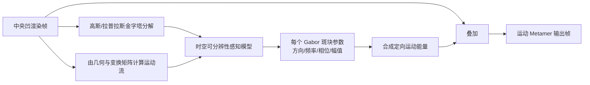

## 一句话总结

指出「中央凹渲染（foveated rendering）会削弱外周视觉的运动感知、使物体看起来比实际更慢」这一被忽视的问题，并受「双漂移错觉」启发，提出用受控相位调制的程序化 Gabor 噪声实时合成时空运动能量、叠加在中央凹渲染画面上，从而在不引入可察觉画质退化的前提下补回丢失的运动线索——迈向「运动 metamer（运动同感异形体）」的第一步。

## 研究背景

中央凹渲染利用人眼在外周视觉中空间分辨率急剧下降的特性，在远离注视点的区域降低着色率/空间分辨率，从而大幅削减渲染成本，已成为 VR/AR 头显（如 PSVR2、Varjo）实现高质量实时渲染的关键技术。它本质上是「视觉 metamerism」的一个特例：让物理上不同的图像在感知上无法区分。

然而，以往的中央凹渲染工作只追求一个目标——生成在**空间上**与全分辨率参考无法区分（或不产生可察觉画质损失）的图像，却忽略了人类视觉系统的其他加工过程。本文聚焦于**运动感知**这一被忽视但对 VR 至关重要的维度。大量视觉科学研究表明，外周视觉的一个核心功能恰恰是**探测和感知运动**。中央凹渲染在削减外周画质的同时，可能损害我们探测与量化运动的能力。这在「运动信息驱动决策」的沉浸式仿真中尤为致命：如果 VR 中的运动被系统性低估，用户的判断与行动都会出错，真实世界与仿真环境之间的感官等价性也就无从谈起。

作者由此提出核心问题：既然空间 metamer 通过保留图像的空间统计量来实现「大脑编码上的等价」，我们能否通过一个类比的「metameric 过程」——合成结构上不同、却诱发相同运动感知的内容——来补偿外周运动线索的损失？

## 核心方法

### 动机验证与灵感来源

作者先做了一个小型受控心理物理实验来确立问题：让被试注视屏幕中央，两侧并排播放两段线性相机运动的视频，右侧为固定速度（24 m/s）的全分辨率参考，左侧为中央凹（外周模糊）版本或同样的全分辨率版本；为聚焦外周视觉，中央 $15^{\circ}$ 半径的内容被挖空。用调整法让被试把左侧速度调到「看起来和右侧一样快」。结果显示：为了达到与全分辨率参考的感知等速，被试对**中央凹版本持续且显著地把速度调高**（即在相同物理速度下，中央凹画面被感知得更慢，p = 0.012）。这直接证实了外周分辨率损失会抑制速度感知。

补偿的灵感来自**双漂移错觉（Double-Drift Illusion）**：一个 Gabor 斑块物理上朝一个方向运动，同时其内部条纹沿另一方向持续相位漂移；直视时观察者看到真实运动方向，但当它处于外周时，相位漂移会强烈改变感知到的运动路径（看起来在斜向移动）。这说明**内部相位变化**能强力调制外周的运动感知——于是「先合成空间能量、再用局部相位变化调制它」就能成为可控的定向运动能量来源。

### 合成方案

作者以 Tariq 等人 2022 年的实时 Gabor 噪声合成框架为基础（它能合成/控制空间频率、又基于叠加 Gabor 斑块便于控制相位、且足够高效）。管线接收一帧中央凹渲染作为输入，**不依赖全分辨率参考**（因而适配真实渲染管线），流程为：

Gabor 斑块定义为正弦函数与高斯包络的乘积：

$$g_i(x,y) = K_i e^{-\pi a_i^2 (x^2+y^2)} \cos\big(2\pi f_i^s (x\cos\theta_i + y\sin\theta_i) + \phi_i\big)$$

噪声为各斑块的可加贡献，其中 $w_i \in \{-1, 1\}$ 为随机二值权重，用以保证合成噪声均值为零、不改变平均亮度：

$$N(x,y) = \sum_{i \in I} w_i \cdot g_i(x-x_i, y-y_i)$$

## 技术细节

方法的关键在于逐斑块估计四个参数（方向、时空频率、相位变化率、幅值），使合成的运动能量既有效又不可被察觉。

**方向**：把 Gabor 斑块的方向对齐到局部运动方向，使相位变化始终与局部运动一致；方向一致的局部相位调制会整合成全局运动感知。

**时空频率**：合成的能量必须落在外周不可分辨的时空频段内。借助对比敏感度函数（CSF），定义可分辨性边界 $S(i) = S_{csf}(f_s(i), f_t(i), e(\mathbf{x}_i))$，其中 $S(i) < 1$ 表示不可分辨。作者采用 stelaCSF 的等敏感度曲面（$S_{csf}=1$）作为控制边界，并利用等偏心度切片近似线性的观察，把边界建模为线性函数（最坏情况下只会更保守、不会把合成推入可见区）。时间频率与空间频率通过速度耦合，并引入缩放因子 $\alpha$：

$$f_t(i) = \alpha f_s(i) \cdot v(\mathbf{x}_i)$$

代入线性边界即可解出应合成的空间频率（$T_s, T_t$ 为偏心度相关的截距）：

$$f_s(i) = \frac{T_s(e(\mathbf{x}_i))}{1 + \frac{T_s(e(\mathbf{x}_i))}{T_t(e(\mathbf{x}_i))} \cdot \alpha v(\mathbf{x}_i)}$$

**相位变化率**：为补偿丢失的运动能量，施加与局部速度成正比的相位变化。给定时间频率 $f_t(i)$，相位变化率与每帧（第 $k$ 帧、刷新率 $R$）增量为：

$$\phi_v(i) = 2\pi f_t(i), \qquad \phi_i^{k+1} = \phi_i^{k} + \frac{\phi_v(i)}{R}$$

为避免**运动混叠**（相位变化过快时斑块看似反向运动，如快转风扇/直升机桨叶的错觉），须满足奈奎斯特约束 $|\phi_v(i)| < \pi R$，这为空间频率引入了下界修正 $\hat{f}_s(i)$。

**幅值**：叠加能量时须考虑背景对比度的**掩蔽效应**——运动会随速度降低对合成能量的掩蔽、从而提高其可见性，因此幅值要随速度自适应调整。作者用最接近 $f_s(i)$ 的拉普拉斯/高斯金字塔层估计 Michelson 对比度、经 CSF 归一化，再建模为背景导致的对比度阈值抬升 $a_c(\mathbf{x}_i)$，最终幅值模型（含自然图像统计项、缩放因子 $\gamma$）为：

$$K(i) = \gamma \cdot |l(\mathbf{x}_i, L_a(\mathbf{x}_i))| \cdot a_c(\mathbf{x}_i)$$

**Gabor 斑块尺寸**：为避免「孔径问题」（高斯窗过小会导致运动方向被误判），利用外周感受野随偏心度线性增大的特性，让高斯孔径半径随偏心度线性增大，保证斑块至少覆盖两个正弦周期。

**实时实现**：基于 Unity URP，围绕四个着色器（运动流、参数估计、相位更新、噪声合成）实现。仅在 YUV 的 Y 通道处理、末尾加回颜色；运动流由全分辨率几何与相机 MVP 矩阵计算；Gabor 支撑域截断到 $3\sigma$，只累加影响该点的斑块。整条管线（含底层场景渲染）在 NVIDIA GTX 4090 上对 4K 场景达到约 75–90 fps。验证时取 $\alpha=1, \beta=1, \gamma=3$。

## 实验结果

作者用 Vegetation（线性相机路径）与 City（绕轴圆周路径）两个 4K 场景、各三档速度（低/中/高，高速档屏幕运动流约 30–35 deg/s，处于平滑追随极限内）进行验证。中央凹用随偏心度线性增长的高斯模糊模拟，中央 $15^{\circ}$ 挖空；三档模糊率 Low（接近可见阈值）、Mid、High（分别高出恰可察觉率 25% 与 50%）。主实验为 14 名被试的速度匹配任务，参考为全分辨率，两个测试版本为「标准中央凹」与「中央凹 + 本方法」。

- **速度感知（图 8）**：在 Mid 与 High 两档模糊下，本方法相较标准中央凹显著改善了速度低估（p = 0.0051、p = 0.0053），Low 档差异不显著（p = 0.092）。标准中央凹确实存在一致的速度低估，且低估幅度随测试速度升高而减小（作者推测因参考视频在高速下也因运动模糊丢失高频、时空失配减小）。本方法在高速下甚至可能让被试觉得比参考更快，说明其感知强度很足（可通过减小 $\alpha$ 缓解过冲）。
- **一个引人深思的观察**：即使在处于可察觉阈值的 Low 模糊下，仍能观测到运动线索损失——这暗示「空间上无可见差异」并不必然意味着「运动感知等价」，可能对应人类视觉系统中空间与运动加工通道的分离。
- **画质（图 9）**：7 名被试的双选（2AFC）实验中，在 Mid/High 模糊、三档速度下，大多数判断认为**本方法比标准中央凹更接近参考的画质**，说明合成的运动能量没有引入可察觉的画质退化；被试也未报告「不自然」现象（仅偶有因中央凹产生的「模糊」感）。

## 贡献与局限

**贡献**：首次指出并实验证实中央凹渲染会抑制外周运动感知、导致速度低估这一被主流忽视的问题；提出「运动 metamer」概念，把 metamerism 从纯空间维度拓展到运动维度；设计出不依赖全分辨率参考、基于时空可分辨性模型与相位调制 Gabor 噪声的**实时**运动能量合成技术，并通过用户实验证明其在补回运动线索的同时不引入可察觉画质损失。

**局限与未来工作**：参数 $\alpha, \beta, \gamma$ 的标定还较粗糙，尚未达到「与全分辨率参考感知完全等速」的理想运动 metamer，且存在高速过冲；分析仅限外周（挖空中央凹），未研究中央凹与外周如何协同形成一致的运动表征；只在两类全局相机运动（线性、旋转）上验证，未覆盖复杂/局部运动与不同加速度；空间与时间统计在 metamerism 中的相互作用仍缺乏形式化理论；外周偶有极细微、感知不可见的条带不连续未做额外混合处理。作者呼吁对空间 metamerism 与运动/深度等感知线索的等价关系开展专门研究。

## 延伸思考

这篇工作最有价值的启示，是把中央凹渲染从「只求空间不可区分」的单一目标，拓展到「保全整个感知谱系（空间、时间、深度、运动等）」的更完整视角。它揭示了一个反直觉却重要的事实：**空间保真并不自动蕴含其他感知维度（如运动）的保真**——这对所有感知驱动的图形优化都是警醒。方法层面「用一个错觉现象反推出可控合成算子」的思路也很漂亮：双漂移错觉本是视觉系统的「bug」，却被转化为补偿外周运动线索的「feature」。对于 VR/AR、云渲染、注视点串流等对成本敏感又要求沉浸真实的场景，这类「感知等价而非像素等价」的合成范式提供了在带宽/算力与主观真实感之间更聪明的折中方向；而作者提出的「运动 metamer」也为后续建立运动、深度、动态范围等多线索联合的形式化 metamerism 理论埋下了引子。
