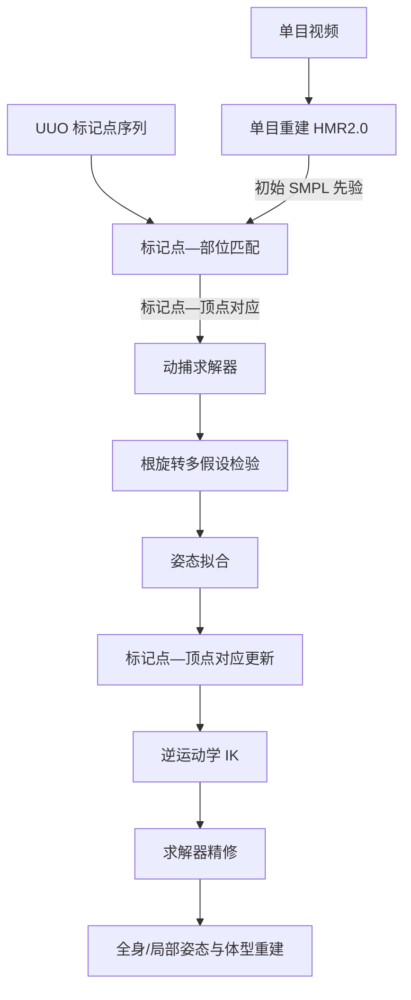

## 一句话总结

本文提出并求解「无结构无标注光学动捕」（UUO mocap）新问题——标记点可任意贴在全身或某一肢体且无需人工打标签，方法借助一段同步拍摄的单目视频提取人体先验，再通过多阶段优化联合完成标记点识别、身体部位匹配与姿态形状重建。

## 研究背景

光学动捕以多视角红外相机捕捉贴在人体上的反光标记点，再拟合 SMPL 等统计人体模型来恢复姿态与体型，是获取高精度三维人体运动的「金标准」。但传统流程存在一个核心矛盾：准确的重建依赖准确的标记点标注（labeling），而准确的标注又反过来依赖已知的姿态与体型，二者互为前提。

为缓解标注负担，已有方法要么要求标记点按预定义的结构化模板摆放，要么训练神经网络在已知布局上自动打标签（如 SOMA）。这些做法都强依赖预设布局，难以泛化到未见过的摆放，尤其无法处理「只在左腿或右肩贴点」这类局部布局——而局部动捕恰恰对生物力学研究和动物动捕十分关键。

作者由此提出无结构无标注光学动捕：标记点可任意放置、无需人工标注，同时求解全身或局部的姿态与体型。其关键洞察是引入一段用普通相机（如手机）拍摄、仅需与标记点时间同步的单目视频——无需相机标定、无需从视频中识别标记点——用它提供强有力的人体姿态与体型视觉先验。

## 方法

整体框架：输入为一段单目视频与一组 UUO 标记点序列，输出为 SMPL 参数（姿态、体型、全局平移与朝向）。流程分三个模块串联——单目重建从视频提取初始人体先验；标记点—部位匹配为标记点找到对应骨骼/顶点，提供良好初始化；动捕求解器通过多阶段优化得到最终结果。

关键设计：

- 单目视频先验：用现成方法 HMR2.0 从视频回归 SMPL 的姿态 $$\Theta$$ 与体型 $$\beta$$。单目重建虽在全局平移、朝向和绝对尺寸上有歧义，但姿态相对准确、体型比例合理，因此作为后续拟合的先验。记 $$T$$ 帧、$$\lvert M\rvert$$ 个标记点为点集 $$m\in\mathbb{R}^{T\times\lvert M\rvert\times 3}$$。

- 标记点分割：SMPL 每个顶点带有线性混合蒙皮（LBS）权重，最大权重指示其所属骨骼，同骨骼顶点近似刚性关联。作者计算所有帧上每对标记点欧氏距离的标准差构建亲和矩阵，再用平均连接的层次聚类（阈值 5mm）把标记点聚成 $$K$$ 组，每组假定对应一根骨骼。

- 部位定位的多假设检验：把 $$K$$ 组标记点视为含 $$K$$ 根骨骼的运动链，从 SMPL 骨骼层级中枚举所有长度为 $$K$$ 的候选链，逐一拟合并选取拟合误差最小者。误差含单向 Chamfer 距离项与体型正则项：
$$E_{3D}=\frac{1}{\lvert T\rvert\cdot\lvert M\rvert}\sum_{t=1}^{T}\sum_{m(t)\in M(t)}\min_{v(t)\in V(t)}\lVert v(t)-m(t)\rVert^{2}$$

- 分阶段动捕求解：直接联合优化易陷入劣质局部极小，尤其是旋转 $$\Phi$$ 难优化。作者假设初始网格与标记点仅相差一个偏航旋转，用四个均匀初值 $$y\in\lbrace 0^{\circ},90^{\circ},180^{\circ},270^{\circ}\rbrace$$ 做多假设检验，各自优化后取拟合最优者：
$$\beta,\Theta,\Gamma,\Phi=\arg\min_{y\in B}E_{3D}(\beta_y,\Theta_y,\Gamma_y,\Phi_y)$$

- 逆运动学精修：先建立每个标记点到最近顶点的对应，再优化逆运动学目标，其中标记点—顶点距离项引入 9.5mm 的皮肤—标记点偏移量 $$\delta$$：
$$E_{M}=\frac{1}{\lvert T\rvert\cdot\lvert M\rvert}\sum_{t=1}^{T}\sum_{m(t)\in M}(\lVert v^{(t)}_{m}-m(t)\rVert^{2}-\delta)^{2}$$
最后重复「对应—IK」一次做精修，用上一阶段输出替代初始姿态作正则目标，以减小标记点与顶点间的距离不一致。

## 实验结果

在 UMPM、MOYO、CMU Kitchen 三个含硬件同步视频与标记点的数据集上评测，指标为 MPJPE（关节位置误差）、MPJVE（关节速度误差）、V2V（顶点误差）与 m2s（标记点到体表距离），均越小越好。注意所有数据集都不用于训练，以模拟无结构设定。下表为全身重建的关节位置误差 MPJPE（单位 mm）主结果节选：

| 方法 | 模态 | UMPM | MOYO | CMU Kitchen |
| --- | --- | --- | --- | --- |
| SOMA | markers | 101.1 | 268.5 | 88.0 |
| HMR2.0+RR | markers+video | 334.1 | 430.5 | 396.3 |
| VPoser+V | markers+video | 524.4 | 132.2 | 321.2 |
| HuMoR+V | markers+video | 558.1 | 205.9 | 308.7 |
| 本方法 | markers+video | 60.8 | 65.2 | 44.2 |
| Reference（有标注） | labeled markers | 0.0 | 0.0 | 0.0 |

结论有三：其一，本方法在全身与局部重建、所有数据集上都大幅领先，逼近使用有标注标记点的参考上界。其二，SOMA 因训练布局与 CMU Kitchen 相近而在全身重建上具竞争力，但在局部重建（如仅左腿、右臂、左肩）上表现很差，凸显无结构标记点的挑战。其三，VPoser 与 HuMoR 在无标签标记点下表现糟糕，加入视频先验后全身重建显著改善，但局部重建仍远逊于本方法。可视化还显示对比方法常无法找到正确的根部对齐、动作更抖动。

## 亮点与局限

亮点：首次提出并系统求解无结构无标注光学动捕问题，放松了标记点必须结构化摆放与人工标注两大约束，实用价值突出；巧妙地用一段仅需时间同步、无需标定的单目视频提供人体先验，让方法可跨不同光学动捕系统泛化；提出的标记点聚类分割、部位匹配多假设检验、根旋转多假设检验与分阶段优化，有效避开了直接联合优化的劣质局部极小；尤其支持局部身体重建，对生物力学与动物动捕意义重大。

局限：方法依赖现成单目重建（HMR2.0）的质量，视频先验不准会传导到后续优化；求解采用多阶段优化并一次性处理整段序列（最多上万次迭代），计算开销与全身候选链搜索成本较高；假设初始网格与标记点仅差一个偏航旋转，对更复杂的朝向差异未必稳健；评测聚焦单人场景。

## 延伸思考

这项工作最具启发的一点，是把「跨模态互补」用得恰到好处：视频擅长给出相对姿态与体型比例却拙于全局定位与尺度，光学标记点恰好精确刻画三维位置却缺少语义标签，两者结合就同时化解了各自的短板。它揭示出一种务实的思路——与其训练一个依赖特定布局、难以泛化的标注网络，不如引入一个廉价而互补的信号源，用优化把弱先验逐级细化为强结果。顺此方向，若把单目先验换成更强的时序人体重建、或把刚性骨骼假设放宽到软组织与关节体，或许能把无结构动捕推广到多人、动物乃至更自由的采集环境，让高精度动捕真正摆脱繁琐的布点与标注负担。
