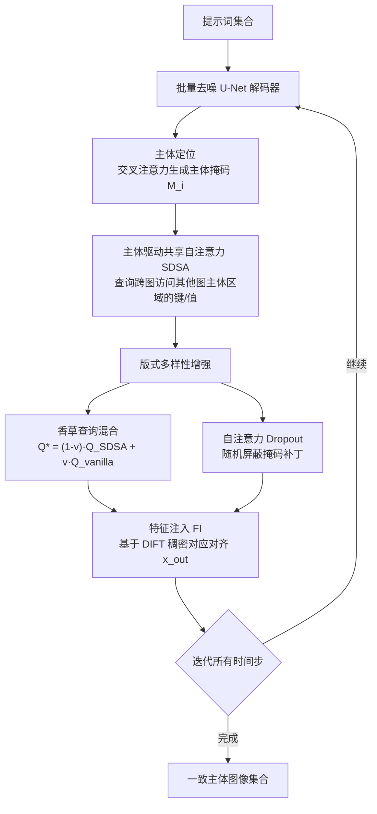

## 一句话总结

本文提出 ConsiStory，一种无需训练、无需逐主体优化的文生图方法：通过在生成过程中共享预训练扩散模型的内部激活（主体驱动的共享自注意力与基于对应关系的特征注入），让同一主体在不同提示词下保持一致的身份，同时兼顾版式多样性与文本对齐。

## 研究背景

大规模文生图（T2I）扩散模型能从文字创造丰富场景，但其随机性使得「同一主体跨多条提示词保持视觉一致」十分困难，而这种一致性对绘本插画、虚拟资产设计、漫画创作、合成数据等应用至关重要。

已有方法主要分两类，且都存在明显代价：

- 基于个性化（personalization）：让模型学习一个新词来表示特定主体，需要逐主体训练，难以在一张图中同时保持多个主体一致，且常在「主体一致性」与「文本对齐」之间做权衡。
- 基于图像条件的编码器：训练图像条件扩散模型（如 IP-Adapter、ELITE），需要大规模预训练算力，且向多主体场景的扩展并不清晰。

作者指出，这两类方法有一个共同点：都是「事后（a posteriori）」地强制一致性，即让生成图去对齐某个给定目标图像。这会把模型的创造力约束在目标图上，并把模型推离其训练分布。本文的核心思想是「先验（a priori）」地在生成过程中促进跨帧一致：直接利用扩散模型的内部特征表示让多张生成图彼此对齐，而不依赖外部图像，从而实现零样本、即时的一致生成，速度约为当时最优方法的 $20$ 倍。

## 方法

整体框架：给定一组共享主体的提示词，ConsiStory 在批量生成的每个去噪步骤中，先用交叉注意力图定位每张图中的主体并生成主体掩码；随后把 U-Net 解码器中的标准自注意力替换为主体驱动的共享自注意力（SDSA），让不同图之间共享主体信息；再叠加特征注入进一步细化身份。全过程只在推理阶段介入，不做任何训练或反向传播。

关键设计：

- 主体驱动的共享自注意力（SDSA）。朴素做法是扩展自注意力，让一张图的查询也能访问批内其他图的键、值，但这会导致背景趋同、版式坍缩、文本对齐大幅下降（类似单条提示的视频生成）。ConsiStory 用主体掩码限制共享范围：查询只能匹配「自身图」或「其他图中主体区域」的键值。设 $N$ 张图，拼接键 $K^{+}$、值 $V^{+}$ 与掩码 $M_i^{+}$，注意力为

$$A_i^{+}=\mathrm{softmax}\!\left(Q_i K^{+\top}/\sqrt{d_k}+\log M_i^{+}\right),\quad h_i=A_i^{+}\cdot V^{+}.$$

其中 $M_i^{+}$ 对属于第 $i$ 张图自身的补丁全部置 $1$，对其他图仅保留主体补丁；掩码通过对主体词的交叉注意力图跨步骤、跨层平均并阈值化得到。这样只共享主体外观，背景保持独立。

- 版式多样性增强。SDSA 恢复了文本对齐、避免背景坍缩，但仍会让主体位置、姿态过于相似。作者用两招缓解：其一，香草查询混合——先做一次不带 SDSA 的普通去噪并缓存查询 $Q_t^{vanilla}$，再对同一潜码做带 SDSA 的去噪，把查询向香草查询线性插值 $Q_t^{*}=(1-\nu_t)Q_t^{SDSA}+\nu_t Q_t^{vanilla}$，主要作用于控制版式的早期时间步；其二，自注意力 Dropout——每步随机把 $M_i$ 中的一部分补丁置 $0$，削弱跨图共享，调节 dropout 概率即可在一致性与多样性之间取平衡。

- 特征注入（FI）。共享注意力改善了整体一致性，但精细纹理易失真。作者发现自注意力输出特征 $x^{out}$ 蕴含大量纹理信息，于是用 DIFT 特征在每对图之间建立补丁稠密对应 $C_{t\to s}$，对目标图每个补丁 $p$ 在其余图中选 DIFT 空间余弦相似度最高的源补丁：

$$\mathrm{src}(p)=\arg\max_{s\neq t}\ \mathrm{similarity}\!\left(D_t[p],\,D_s[C_{t\to s}[p]]\right),$$

再按 $\hat{x}_t^{out}=(1-\alpha)\,x_t^{out}+\alpha\cdot\mathrm{src}(x_t^{out})$ 混合特征。注入同样受主体掩码限制、并对低相似度补丁做阈值门控，从而在不影响背景的前提下让主体外观由所有源图共同贡献。

- 锚点图与可复用主体。可指定少量「锚点图」（通常 $2$ 张），其余图只从锚点获取键值与注入源，降低扩展注意力规模、减少显存与伪影；固定锚点提示与随机种子即可在新场景中复用同一主体，实现无限量一致生成。

- 多主体一致生成。只需对多个主体掩码取并集即可。由于注意力 softmax 的指数形式与对应图阈值化天然起到门控作用，语义不同的主体之间不易发生信息泄漏。

## 实验结果

基于 SDXL，在 $100$ 组、每组 $5$ 张共享主体的图上评测。自动指标用 CLIP 分数衡量文本对齐、用 DreamSim（去背景）衡量主体一致性；ConsiStory 位于两者的帕累托前沿，且标准设置在文本对齐上与原生 SDXL 相当，说明「先验地促进一致」能更好保留模型原有知识。由于自动一致性指标存在偏差，作者又做了大规模双选强制用户研究（每个基线每类问题 $500$ 份回答，共 $3000$ 份），本文方法胜率如下（越高越受偏好）：

| 对比基线 | 视觉一致性胜率 | 文本对齐胜率 |
| --- | --- | --- |
| LoRA-DreamBooth | 61% | 60% |
| Textual Inversion | 88% | 56% |
| IP-Adapter | 91% | 58% |

运行时间方面，ConsiStory 在 H100 上生成两个锚点加一张新提示图仅需 $32$ 秒，约为当时最优方法（估计 $13$ 分钟）的 $1/25$，比 LoRA-DB（$4.5$ 分钟）与 TI（$7.5$ 分钟）快约 $8$ 至 $14$ 倍；IP-Adapter 推理仅 $8$ 秒，但需数周预训练。消融显示：去掉 SDSA 会严重损害形状与纹理一致性，去掉特征注入会让主体形状相近但身份不准，去掉香草查询混合与注意力 dropout 则版式多样性显著下降。

## 亮点与局限

亮点：

- 完全无训练、无逐主体优化，仅在推理时共享内部激活即可实现一致生成，速度远超个性化与迭代式方法。
- 用主体掩码把共享限制在主体区域，配合香草查询混合与注意力 dropout，系统性地解决了扩展注意力带来的「版式坍缩」问题。
- 天然支持多主体一致生成，并可与 ControlNet 等工具组合，还首次实现无需编码器、无需调参的常见类别训练无关个性化。

局限：

- 特征注入依赖 DIFT 对应，当主体在不同图中语义差异过大（如人形机器人与工厂机械臂）时对应会变噪，一致性可能下降（阈值门控可部分缓解）。
- 训练无关个性化在复杂物体上表现不佳，且与改变风格的提示不兼容。
- 一致性依赖预训练模型的内部表征与掩码定位质量，对随机种子等因素仍较敏感。

## 延伸思考

ConsiStory 最具启发的一点，是把一致性从「事后对齐给定目标」转变为「生成过程中先验对齐彼此」。它不引入外部图像、不做反向传播，仅通过在自注意力层跨图共享主体的键值、并用扩散特征建立稠密对应来注入纹理，就免费获得了跨提示的主体一致性。这再次印证了扩散模型的自注意力查询、键、值不仅服务于单图生成，更是可复用的语义匹配接口。其代价是整套机制建立在主体掩码定位与 DIFT 对应的可靠性之上，当语义漂移较大时会退化，这也解释了后续大量工作（如面向多提示叙事、风格解耦、区域协调的改进）持续围绕「如何更稳健地共享与对齐主体特征」展开——共享注意力作为一致生成的范式仍有很大打磨空间。
