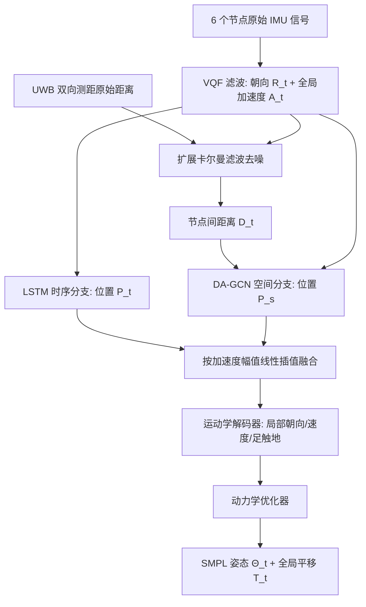

## 一句话总结

本文提出 Ultra Inertial Poser，用仅 6 个可穿戴节点（廉价现成 IMU＋UWB 无线电）测得的原始惯性信号与传感器间距离，通过图神经网络融合估计全身 SMPL 姿态与全局平移，用「测距约束」显著抑制惯性追踪固有的漂移与抖动。

## 研究背景

相机动捕是记录人体运动的金标准，但需要布线、固定场地与穿戴标记服，难以移动。为摆脱这些限制，基于稀疏可穿戴传感器的追踪方案逐渐流行，其中最常见的是惯性测量单元（IMU）。然而 IMU 无法直接观测位置，其估计天然存在漂移；商用系统往往要靠 17～19 个 IMU 加运动学模型来补偿。

近年方法尝试用学习模型从稀疏 IMU（如 6 个）估计全身姿态，但它们高度依赖高端专有传感器（如 Xsens）提供的、经过良好标定的绝对三维状态。即便如此，由于缺乏直接的位置观测，姿态估计仍受整体漂移和关节抖动困扰，且在慢速动作下精度进一步恶化。

作者的关键洞察是：为稀疏 IMU 引入一种廉价、低功耗、易扩展的补充信号——基于超宽带（UWB）测距得到的传感器间距离。UWB 带宽极大、波形极短，可精确解析信号收发时刻，从而在不需要固定锚点、不依赖专有硬件的前提下动态测出节点间距离，为惯性追踪提供缺失的空间约束。

## 方法

整体框架：人体佩戴 6 个传感节点（头、腰/骨盆、双腕、双膝），每个节点含一个 6 自由度 IMU 与一个 UWB 无线电。系统先从原始信号估计每个节点的全局朝向、全局加速度以及所有节点两两之间的距离，再送入基于学习的姿态估计模块，输出叶节点关节角、根朝向与全局平移的 SMPL 参数。

关键设计：

- 可穿戴感知硬件：自研 6 个无线原型，每个集成 6 自由度 IMU（LSM6DS）与 UWB 无线电（DWM1000），封装于 $$35\times 35$$ mm，板载微控制器（NRF52840）采样并通过蓝牙串流。IMU 采样 100 Hz，用 VQF 滤波估计世界坐标系下的重力补偿加速度 $$\hat{a}_i$$ 与绝对朝向四元数 $$\hat{q}_i$$；佩戴者以 T-pose 完成简单标定。

- UWB 测距：6 台设备用广播式双向测距协议求两两飞行时间 $$\tau_{ij}=\tfrac{1}{2}\big(t^{Received}_i-t^{Sent}_i+t^{Received}_j-t^{Sent}_j\big)$$，在 25 Hz 下测得全部 15 对距离。无需固定锚点，仅需单天线。由于人体遮挡会带来非视距（NLOS）噪声，作者用扩展卡尔曼滤波将 UWB 距离与各传感器的加速度、朝向融合，跟踪相对位置、相对速度与相对朝向；相对位置的模长 $$\hat{d}_{ij}=\lVert x_{ij}\rVert_2$$ 作为对 NLOS 更鲁棒的距离估计。

- 距离注意力图卷积网络（DA-GCN）：把系统建模为图 $$G=\lbrace V,E\rbrace$$，节点携带朝向、边携带距离。相较以往用二值邻接矩阵的 GCN，本文将距离编码进边特征，计算可学习的相关矩阵 $$C_l=A_l\odot D\oplus B_l$$，并以权重调制聚合节点特征 $$H_{l+1}=(M_l\odot(W_l H_l))C_t$$，从而输出符合距离测量的空间位置估计 $$P_s$$。

- 双分支融合：LSTM 时序分支给出 $$P_t$$，DA-GCN 空间分支给出 $$P_s$$，二者按加速度幅值做线性插值融合——运动少时 IMU 信噪比低，更倚重距离分支；运动大时更倚重惯性分支。该融合天然兼容惯性 100 Hz 与距离 25 Hz 的不同更新率。

- 距离感知损失与数据合成：位置估计器的损失结合方向余弦相似度与距离 L1 重建项 $$L_d=\dfrac{\hat{P}\cdot\tilde{P}}{\lVert\hat{P}\rVert\lVert\tilde{P}\rVert}+\lambda\lVert d(\hat{P})-D\rVert_1$$（$$\lambda=0.01$$）。训练数据由 AMASS 合成：在 SMPL 网格顶点上放虚拟传感器合成加速度与朝向，并用碰撞感知的时变高斯噪声模型合成 UWB 距离——遮挡比小于 0.2 时标准差 $$\sigma_0=0.051$$ m，大于等于 0.2 时 $$\sigma_1=0.083$$ m，遮挡比由隐式人体模型 COAP 查询得到。

- 数据集 UIP-DB：10 名参与者（身高 155～187 cm）完成 25 类动作，含日常动作与对惯性追踪具挑战性的慢速过渡、坐姿与物体交互，共 200 分钟同步数据。参与者穿 57 反光标记服并佩戴 6 个自研节点，由 20 相机 Optitrack 系统提供参考，用 SOMA 标注点云、MoSh++ 提取 SMPL 参考。

## 实验结果

评测三项指标：SIP 误差（上臂与大腿全局朝向误差，度）、关节位置误差（cm）、抖动 Jitter（全身关节 jerk，$$km/s^3$$），均越小越好。在自采真实数据集 UIP-DB 上，与仅用惯性的 SOTA 方法 PIP、TIP 及其加距离变体对比（真实 UWB 距离），主结果如下：

| 方法 | SIP 误差 | 位置误差 | 抖动 |
| --- | --- | --- | --- |
| TIP | 33.01 | 14.82 | 1.86 |
| PIP | 30.47 | 13.62 | 1.57 |
| TIP-D | 30.34 | 13.96 | 1.84 |
| PIP-D | 30.33 | 13.27 | 1.39 |
| UIP（本方法） | 24.12 | 10.65 | 0.05 |
| UIP finetuned | 23.85 | 10.55 | 0.08 |

相比 PIP，本方法把位置误差从 13.62 降到 10.65 cm（约 22%），抖动从 1.56 降到 0.055 $$km/s^3$$（约 97%）。在慢速动作（平均加速度小于 1 $$m/s^2$$）子集上优势尤为明显：TIP、PIP 因缺乏位置观测而显著变差，本方法凭距离约束仍稳健。消融显示：去掉传感器间距离后位置误差回升到 13.749、抖动飙至 1.556；去掉 DA-GCN 或碰撞感知噪声模型、去掉距离感知损失也都带来明显退化，说明各组件均有贡献。

## 亮点与局限

亮点：首次把 UWB 测距得到的传感器间距离作为约束，融入稀疏惯性姿态估计框架，用图神经网络优雅地把「节点朝向＋两两距离」结合成空间位置；整条流程直接处理 IMU 原始信号（加速度、角速度）与 UWB 原始距离，不依赖 Xsens 等专有硬件提供的三维状态，因而廉价、可扩展、可在室外野外使用；碰撞感知的合成噪声模型让模型能在 AMASS 上训练并迁移到真实廉价传感器；并贡献了含同步 IMU＋UWB＋SMPL 参考的 200 分钟数据集 UIP-DB。

局限：额外引入了 UWB 感知需求，且 UWB 标定对温度敏感（约 2.15 mm/°C），需跨工作温度标定；与其它学习方法一样对分布外姿态泛化受限，评测假设平坦地面、物体交互较简单；对全局平移的改善有限（2 m/5 m 真值移动下误差 0.318/0.422 m，仅略优于 PIP 的 0.333/0.440 m）；真实数据的状态与距离估计仍误差较大，在合成的无漂移朝向、完美距离下方法潜力更高。

## 延伸思考

这项工作最有价值的启示，是用一种廉价、正交的信号去补齐单一模态的结构性缺陷：IMU 擅长捕捉朝向与加速度却无法观测绝对位置，UWB 测距恰好提供了节点间的空间约束，两者结合就同时压住了漂移与抖动。相比重建定制电磁传感或引入相机，UWB 的低功耗、抗干扰、易扩展特性，让它更贴近可真正落地的可穿戴设备形态——尤其在 Airtag、SmartTag 等 UWB 定位器日益普及的当下。顺此方向，若把距离约束进一步用于全局平移估计、扩展到更丰富的地形与多人场景，或把图结构与更强的时序模型结合，稀疏惯性动捕有望在保持低成本的同时，逼近相机系统的精度与稳定性，真正实现「随身、无线、随处可用」的全身追踪。
