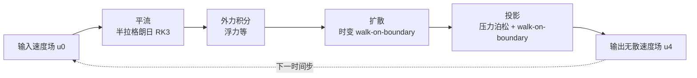

## 一句话总结

提出一种基于速度（velocity-based）的蒙特卡洛流体求解器，通过算子分裂将 Navier-Stokes 方程拆成逐点估计的子步，并用 walk-on-boundary 方法处理投影与扩散，克服了此前基于涡量（vorticity-based）蒙特卡洛方法的局限，可直接吸收传统速度型求解器的各种成熟技术。

## 研究背景

蒙特卡洛 PDE 求解器近年在图形学中被重新重视，因为它对几何边界表示灵活、对输入噪声鲁棒、支持解的逐点估计、且天然易于并行。此前 Rioux-Lavoie 与 Sugimoto 等人首次将蒙特卡洛方法用于基于 Navier-Stokes 的烟雾仿真，但其采用的是基于涡量的表述。

涡量表述带来两个问题。其一，图形学中主流的流体技术（如烟雾浮力、散度控制、PIC/FLIP、advection-reflection 等）都是围绕速度表述发展的，无法直接迁移到涡量型蒙特卡洛框架。其二，涡量方法在处理非单连通（不连通或带孔洞）的流体域时会因谐波速度场处理不当而产生错误结果，例如两个障碍物之间的烟雾流动会被错误地绕开。速度表述天然能正确捕捉这类物理，因此作者提出一个基于速度的蒙特卡洛流体求解器。

## 方法

整体框架：对 Navier-Stokes 方程按标准算子分裂，在每个时间步内拆成四个子步，并为每个子步设计一个逐点（pointwise）的蒙特卡洛估计器，使得求解器可以在任意空间点估计速度，而不依赖底层离散化结构。

$$\frac{\partial \mathbf{u}}{\partial t} = -(\mathbf{u}\cdot\nabla)\mathbf{u} - \frac{1}{\rho}\nabla p + \nu\nabla^2\mathbf{u} + \mathbf{f}, \quad \nabla\cdot\mathbf{u}=0$$

四个子步的划分为：

$$\text{advection:}\ \frac{\partial \mathbf{u}}{\partial t}=-(\mathbf{u}\cdot\nabla)\mathbf{u}, \quad \text{force:}\ \frac{\partial \mathbf{u}}{\partial t}=\mathbf{f}$$

$$\text{diffusion:}\ \frac{\partial \mathbf{u}}{\partial t}=\nu\nabla^2\mathbf{u}, \quad \text{projection:}\ \frac{\partial \mathbf{u}}{\partial t}=-\frac{1}{\rho}\nabla p\ \ \text{s.t.}\ \nabla\cdot\mathbf{u}=0$$

关键设计一：平流与外力的逐点更新。平流采用半拉格朗日方式沿速度场反向追踪轨迹，实践中用三阶 Runge-Kutta 提升轨迹精度；外力（如浮力）用前向欧拉逐点累加。二者的评估点不必与网格对齐，因此摆脱了传统网格插值的束缚。

$$\mathbf{u}_1(\mathbf{x}) \leftarrow \mathbf{u}_0(\mathbf{x}-\Delta t\,\mathbf{u}_0(\mathbf{x})), \qquad \mathbf{u}_2(\mathbf{x}) \leftarrow \mathbf{u}_1(\mathbf{x}) + \Delta t\,\mathbf{f}(\mathbf{x})$$

关键设计二：投影步的积分化重构。投影只需要压力梯度 $\nabla p$，其中 $p$ 满足泊松方程 $\nabla^2 p = \nabla\cdot\mathbf{u}_3$。无边界时，作者用基本解 $G$ 把解写成卷积，再对其求梯度。直接形式仍需显式评估速度散度，不符合"只输入逐点速度场"的目标。作者利用恒等式 $\nabla_{\mathbf{x}}G=-\nabla_{\mathbf{y}}G$ 做分部积分，把对散度的依赖转成对速度本身的积分：

$$\nabla_{\mathbf{x}} p(\mathbf{x}) = -\int_{\Omega_s} \mathbf{S}(\mathbf{x},\mathbf{y})\,\lbrace\mathbf{u}_3(\mathbf{y})-\mathbf{u}_3(\mathbf{x})\rbrace\,dV(\mathbf{y}) - \int_{\partial\Omega_s}\lbrace\nabla_{\mathbf{x}}G\rbrace\,\mathbf{n}(\mathbf{y})\cdot\lbrace\mathbf{u}_3(\mathbf{y})-\mathbf{u}_3(\mathbf{x})\rbrace\,dA(\mathbf{y})$$

这里用 $\mathbf{u}_3(\mathbf{x})$ 做全局平移抵消了泰勒展开的零阶项，把奇异性从 $O(\lvert r\rvert^{-d})$ 降到 $O(\lvert r\rvert^{-(d-1)})$，从而可用重要性采样处理。随后用蒙特卡洛在域内采 $N_V$ 点、边界采 $N_A$ 点得到无偏（无边界情形）估计器，域内按正比于 $1/\lvert r\rvert^{d-1}$ 采样并配合对偶采样降方差。

关键设计三：带固体边界的处理。此时投影是泊松方程的内/外 Neumann 问题，边界条件为自由滑移 $\partial p/\partial \mathbf{n} = \mathbf{n}\cdot(\mathbf{u}_3-\mathbf{u}_s)$。作者采用 walk-on-boundary 方法，它基于类似渲染方程的边界积分方程、用光线追踪求解，可在有界与无界域下统一处理 Neumann 问题。为提高效率还引入边界值缓存（类比渲染中的虚拟点光 VPL），在多个评估点之间共享子路径。

关键设计四：扩散步。粘性流体需在投影前加扩散步，求解常系数扩散方程。无边界或时间步很小时，与高斯核卷积即为精确解；存在边界或大时间步时，作者首次将时变 walk-on-boundary 方法引入图形学，在时空域中从评估点沿负时间方向采样路径，当采样时间为负时自然终止递归，无需预设递归深度。

## 实验结果

作者用 CUDA 与 NVIDIA OptiX 光线追踪实现 GPU 版本，在 Intel Xeon Silver 4316 CPU 与 NVIDIA RTX A5000 GPU 上测试。主要定量结果如下。

| 配置 | 每时间步耗时 |
| --- | --- |
| 传统网格法（cut-cell，单线程 CPU） | 0.064 s |
| 本方法，每子步后均缓存（含 VPL） | 7.8 s |
| 同上但关闭 VPL | 109 s |
| 本方法，投影后不缓存 | 32.1 s |
| 本方法，平流后不缓存 | 10.1 s |

在带障碍物的涡对场景中，本方法约 101.0 s／时间步，涡量型方法约 87.6 s／时间步，差距约 15%。加入扩散步会使耗时相对基线增加 48%（高雷诺数）至 84%（低雷诺数）。收敛测试表明投影步误差随样本数以 $O(N^{-1/2})$ 的逆平方根速率下降；样本数过低会导致仿真发散，且边界附近速度估计的噪声更大。定性上，浮力、散度控制（速度汇/源）、不同雷诺数、advection-reflection、PIC/FLIP 等扩展都得到与传统网格法一致的合理结果。

## 亮点与局限

亮点：将主流的速度表述引入蒙特卡洛流体，使浮力、散度控制、PIC/FLIP、advection-reflection 等成熟技术得以直接迁移；逐点估计与网格无关，可减少子步之间的插值缓存误差；用统一的 walk-on-boundary 框架处理有界与无界域的 Neumann 问题；是目前唯一能在不连通障碍等场景下给出正确物理的蒙特卡洛流体方法；求解只依赖光线相交查询，易于 GPU 加速。

局限：计算速度仍显著慢于传统方法（约慢两个数量级），需要较多样本才能压低误差；含边界场景需要方差更大的 Neumann 边界求解器，成本更高；非凸域内部 Neumann 问题的 walk-on-boundary 方差尤其大。当前实现依赖速度场缓存，完全无离散化的递归方案虽有理论价值，但估计成本随时间指数增长而不实用。

## 延伸思考

该工作把光传输与几何处理里成熟的蒙特卡洛 PDE 思路完整迁移到速度型流体，核心价值在于"逐点、无需全局耦合线性求解"这一范式转变，让流体求解器的离散化选择变得高度灵活。顺着作者给出的方向，若能为 walk-on-boundary 支持空间变化的扩散方程，就能表达变密度流体；结合可微渲染技术则可用于反问题求解。更值得期待的是，逐点无散速度场的思路为带自由表面的液体全蒙特卡洛仿真铺平了道路，这可能是把该范式从烟雾推广到更广泛物理仿真的关键一步。此外，引入速度梯度信息（如仿射粒子网格类方法）或特征映射、能量守恒积分器等，也有望进一步降低平流与分裂误差。
