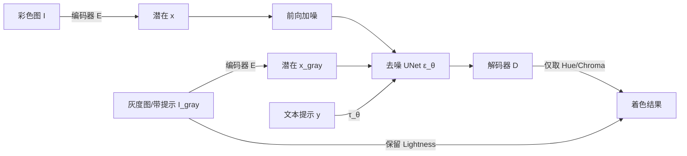

## 一句话总结

对文生图潜在扩散模型（Stable Diffusion）做最小改动并微调，得到一个统一的着色模型，能够以直接着色、颜色提示、参考图、文本提示等多种方式给灰度图着色，并可无需额外训练地扩展到时序稳定的视频着色。

## 研究背景

图像与视频着色是图像修复中最常见也最经典的问题之一。它本质上是病态问题：同一张灰度图存在多种合理的着色结果。已有方法覆盖面很广，从传统计算机视觉策略到基于 Transformer 或生成式神经网络的最新方法，但普遍受困于以下一个或多个问题：

- 只能输出单一着色结果或多样性有限；
- 整体视觉效果欠佳；
- 高度专门化于某个子任务，缺乏泛化能力；
- 围绕潜在扩散模型的架构设计过于复杂。

近期一些工作已经尝试用扩散模型做着色，但方案往往较复杂，需要额外训练一个引导去噪过程的旁路模型（类似 ControlNet 的做法）。这不仅增加参数量与计算时间，作者还指出这种方式会导致次优的着色效果。作者认为，在超大规模数据上训练的文生图扩散模型内含高层视觉理解能力，恰好适合处理着色这类问题，因此主张直接复用这一视觉基础模型，用一组通用、与架构无关的机制来统一处理着色的各个方面。

## 方法

### 整体框架

目标是学习给定灰度图 $I_{gray}$ 下彩色图的条件分布 $p(I \lvert I_{gray})$。方法基于潜在扩散模型：用变分自编码器（VAE）的编码器 $E$ 将彩色图 $I$ 与灰度图 $I_{gray}$ 分别编码为潜在表示 $x$ 与 $x_{gray}$，模型学习潜在空间中的条件分布 $p(x \lvert x_{gray})$。

前向加噪过程为：

$$x_t = \sqrt{\gamma}\, x_0 + \sqrt{1-\gamma}\,\epsilon$$

其中 $\epsilon \sim \mathcal{N}(0, I)$，$\gamma$ 控制方差调度。逆向过程训练去噪 UNet $\epsilon_\theta$，最小化：

$$\mathcal{L} = \mathbb{E}_{x,y,t,\epsilon}\lVert \epsilon - \epsilon_\theta(x_t, \tau_\theta(y), t, x_{gray}) \rVert_2^2$$

其中 $y$ 为对应文本提示，$\tau_\theta$ 为文本编码部分，$t$ 在扩散步中均匀采样。起点模型选用 Stable Diffusion 2.1。

### 关键设计

改造基础模型需要解决两个问题：

- 让模型接受灰度图条件。作者将灰度图潜在表示 $x_{gray}$ 作为去噪 UNet 的额外输入。关键在于第一层卷积核的初始化：原模型使用 $k \times k \times c^{org}_{in} \times c_{out}$ 的卷积核，改造后为 $k \times k \times c_{in} \times c_{out}$。若用常规初始化策略模型无法收敛，作者的做法是把原预训练卷积核的权重复制到新卷积核对应位置，其余新增权重初始化为 $0$。
- 克服 VAE 解码器细节重建能力不足。由于灰度图的亮度通道已包含全部纹理细节，作者切换到 CIELab 颜色空间：保留原灰度图的亮度（Lightness），只从模型预测中提取色度/色相（Chroma/Hue）。这样即使解码结果存在瑕疵，也不影响着色质量。

多种引导方式在同一框架下统一实现：

- 多样化着色：通过采样不同的初始潜在 $x_T$，配合无分类器引导（classifier-free guidance）与 DDIM 采样，得到多个合理的着色变体。
- 颜色提示：由于复用了预训练编码器，只需把用户指定的颜色块直接画在灰度条件图上（记为 $I^*_{gray}$）即可。训练时随机采样若干带色块的图像，并将文本置空以避免干扰；推理时同样用无分类器引导融合提示。
- 参考图着色：借助语义匹配与语义分割，在匹配的语义区域内计算关键点对应，把参考图颜色复制到灰度图对应位置，再作为颜色提示条件输入，从而自动完成语义相近物体间的颜色迁移。
- 文本引导的物体级着色：训练时仍提供文本提示，因此可用文本引导。为实现实例级细粒度控制、避免颜色泄漏，作者建立"颜色词"列表，为待着色的每个物体创建并行去噪路径（主路径 $y$ 去掉具体颜色词，另有 $y_1$、$y_2$ 等分支）。每一步去噪后，用各物体 token 的交叉注意力图转成潜在掩码，将并行路径的潜在合并回主路径，重复 $m$ 次（约总步数的 $50\%$–$80\%$）后颜色信息完成整合。该做法无需昂贵的 DDIM 反演或 Null-Text 优化。
- 视频跨帧颜色传播：把自注意力改造为跨帧注意力，对关键帧 $k$ 与后续帧 $i$：

$$\text{CF-Attn}(Q_i, K_k, V_k) = \text{Softmax}\!\left(\frac{Q_i (K_k)^T}{\sqrt{c}}\right) V_k$$

由于预测量是色度/色相，能缓解潜在扩散模型的时序不稳定问题。为生成较长的稳定视频，关键帧会在预定周期后更新。该策略无需额外训练，且相比独立采样同样数量的图像不引入额外计算。

## 实验结果

数据集用 COCO 验证集与 NTIRE 视频着色挑战验证集；图像指标包含 PSNR、SSIM、LPIPS，以及更能反映着色质量的 FID、CF（色彩丰富度）、$\Delta$CF、CIEDE2000。对可生成多结果的方法，额外给出"5 次采样取最优"的评测行。

COCO 图像着色（作者认为 FID 与 $\Delta$CF 最具代表性）：

| 方法 | FID↓ | SSIM↑ | LPIPS↓ | PSNR↑ | $\Delta$CF↓ | CIE2K↓ |
| --- | --- | --- | --- | --- | --- | --- |
| DDColor Large（单样本） | 7.35 | 0.935 | 0.184 | 22.36 | 11.22 | 9.88 |
| VVFM 本文（单样本） | 7.92 | 0.930 | 0.201 | 20.90 | 13.01 | 10.25 |
| VVFM 本文（5 选优） | 7.29 | 0.942 | 0.162 | 23.11 | 9.44 | 8.53 |
| PBDiffusion（5 选优） | 8.02 | 0.929 | 0.191 | 21.99 | 11.73 | 9.70 |

单随机样本下本文与最强方法 DDColor Large 相当（后者单样本 FID 最优），而在多样本设定下本文大幅领先所有已有方法。用户研究中，本文与 DDColor、UniColor、PBDiffusion、DeOldify、ControlNet 的成对比较均获多数偏好（对 DDColor 为 $56.27\%$ 对 $43.73\%$，对 ControlNet 达 $68.36\%$ 对 $31.64\%$）。

NTIRE 视频着色（FID 与时序一致性指标 CDC）：

| 方法 | FID↓ | CDC↓ |
| --- | --- | --- |
| DDColor | 34.88 | 0.06600 |
| VVFM（无跨帧注意力） | 26.8 | 0.01246 |
| VVFM | 33.0 | 0.00343 |
| VVFM（无跨帧注意力）+ BiSTNet | 32.0 | 0.00351 |
| VVFM + BiSTNet | 37.7 | 0.00301 |

不加跨帧注意力时色彩鲜艳但时序不一致；加入跨帧注意力后可保持时序稳定。作者还验证了该架构改造可迁移到 SD1.4、SDXL、Pixart-$\alpha$ 等不同预训练扩散模型上。

## 亮点与局限

亮点：

- 用一个统一模型覆盖直接着色、颜色提示、参考图、文本提示与视频着色多个子任务，且在各子任务上匹配或超越专门方法。
- 相比 ControlNet 类旁路方案，改动极简（仅改第一层卷积并做权重复制初始化 + CIELab 颜色空间技巧），却带来更好效果与更少参数/计算。
- 视频着色通过复用注意力实现，无需额外训练，也不增加相对于独立采图的计算量；提出的机制与架构无关，可套用到任意预训练扩散模型。

局限：

- 受潜在扩散模型自编码器容量限制，小物体的着色可能不完美。
- 更精细的文本引导控制、以及大幅运动场景的处理仍需进一步研究。

## 延伸思考

这项工作的核心思路是"最小侵入式复用基础模型"：与其为特定条件训练庞大的旁路网络，不如利用预训练权重的复制式初始化让模型平滑接受新条件，并借颜色空间分解规避解码器的细节缺陷。这种"把难题拆解到已有能力边界内"的做法值得借鉴——尤其是仅取色度、保留原亮度这一点，本质上是把生成模型的不确定性限制在最容易出错也最无关紧要的通道上。此外，把训练时保留的文本条件与自注意力机制在推理阶段"再利用"为物体级与跨帧控制，提示了扩散模型内部注意力图作为免训练控制接口的潜力，可能推广到其他需要空间或时序一致性的编辑任务。
