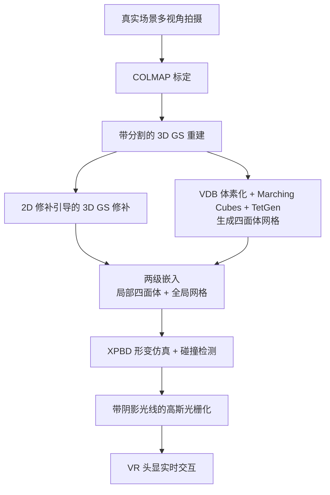

## 一句话总结

VR-GS 把 3D Gaussian Splatting 与基于位置的动力学（XPBD）统一进一条实时管线，通过一套新颖的"两级嵌入"策略让高斯核跟随四面体网格做物理形变，配合分割、修补与阴影贴图，在 VR 头显中实现了对真实重建场景中可形变物体的直观、物理真实的交互操控。

## 研究背景

3D 内容日益普及，但传统的建模、编辑与交互流程工程量大、门槛高，非专业用户难以参与高质量内容创作。作者希望在现代辐射场技术上找到更易用的替代路径：

- NeRF 虽通用，但体渲染效率不足以支撑 VR 所需的高帧率，且其处理形变依赖对查询光线做逆形变映射，速度慢。
- 3D Gaussian Splatting（GS）以一组显式各向异性高斯核表示场景，渲染高效、几何显式，可直接被形变或编辑，天然适合后处理式操控，且免去了高保真网格、UV 与纹理。
- 已有工作把物理仿真引入静态 GS（如 PhysGaussian）以生成新颖动态，但其逐高斯的物质点法（MPM）离散代价高，难以满足实时交互的时间预算。

VR-GS 的目标是构建首个交互式、物理感知的 GS 编辑器：既保持 GS 的实时渲染与照片级质量，又通过网格嵌入的实时仿真让用户在 VR 中"所见即所仿真"。

## 方法

### 整体框架

系统分为离线的资产准备与在线的 VR 仿真渲染两部分。离线阶段从真实多视角拍摄出发，完成带分割的 GS 重建、遮挡区域修补与仿真用四面体网格生成；在线阶段用 XPBD 驱动网格形变，经两级嵌入带动高斯核运动，并做碰撞处理与阴影投射。

### 关键设计

资产准备。分割在 GS 训练中完成：先用 2D 分割模型在多视角图上生成跨视角一致的彩色掩码，再给每个高斯核额外挂上三个可学习 RGB 属性，用分割损失让核自动学到所属物体：

$$L_{\text{seg}} = L_1(M_{2d}, I)$$

总损失为 $L_{\text{total}} = (1-\lambda)L_1 + \lambda L_{\text{SSIM}} + \lambda_{\text{seg}} L_{\text{seg}}$（取 $\lambda=0.2$、$\lambda_{\text{seg}}=0.1$）。物体分离后被遮挡区域会出现空洞，用 2D 修补工具 LaMa 引导 3D 高斯修补：冻结空洞外的核，用修补损失 $L_{\text{inpaint}} = L_1(I_{\text{inpainted}}, I)$ 优化空洞处的核。仿真网格则先做内部填充，再把高斯中心当点云转成 VDB，经 Marching Cubes 抽水密表面并用 TetGen 四面体化，网格不参与渲染、仅作动力学媒介，故可用中等分辨率。

高斯运动学。沿用 PhysGaussian 的高斯随形变场演化的思路，但把仿真器换成 XPBD 以实现实时。网格形变是分片线性的，每个四面体内形变梯度分片常量：

$$F = \left[\mathbf{x}_1 - \mathbf{x}_0,\ \mathbf{x}_2 - \mathbf{x}_0,\ \mathbf{x}_3 - \mathbf{x}_0\right]\left[\mathbf{x}_1^0 - \mathbf{x}_0^0,\ \mathbf{x}_2^0 - \mathbf{x}_0^0,\ \mathbf{x}_3^0 - \mathbf{x}_0^0\right]^{-1}$$

四面体内高斯核的均值与协方差随之更新：

$$\boldsymbol{\mu} = \sum_i w_i \mathbf{x}_i, \qquad \Sigma = F\,\Sigma_0\,F^{\top}$$

其中 $w_i$ 是初始中心的重心坐标，$\Sigma_0$ 为初始协方差。

两级嵌入（核心贡献）。直接把高斯中心嵌入最近四面体，无法保证每个椭球都被完全包裹，大形变下会产生尖刺伪影。作者提出两级方案：先用一个尽可能贴合的独立局部四面体把每个高斯核单独包裹（局部四面体之间无连接）；再把这些局部四面体的顶点嵌入全局仿真网格。全局网格被 XPBD 驱动形变时，局部四面体顶点被保持在边界内，从而带动高斯核演化。由于一个局部四面体可能跨多个全局四面体，其形变相当于周围全局四面体形变的平均，得到更平滑的形变梯度场，消除尖刺伪影。

物理参数与阴影。密度、杨氏模量 $E$、泊松比 $\nu$ 为可调超参，从 $E=1000\,\text{Pa}$、$\nu=0.3$、$\rho=1000$ 起手，通常在 10 轮人工调节内得到视觉合理的动态。原始全局光照被烘焙进球谐，但物体移动/形变后阴影不再对齐，故引入阴影贴图：从光源方向估计深度图并对每个高斯做可见性测试，生成随物体运动的动态阴影，帮助用户在操控时判断物体间距离。

## 实验结果

原型在 Unity + CUDA 插件上实现，用 Quest Pro 头显、RTX 4090 测试。与两种物理操控方法在标准化帧时间下比较单帧仿真耗时（秒，越低越快）：

| 场景 | PAC-NeRF | PhysGaussian | VR-GS（本文） |
|------|----------|--------------|---------------|
| Stool | 0.750 | 0.112 | 0.017 |
| Chair | 0.813 | 0.219 | 0.022 |
| Materials | 0.625 | 0.390 | 0.021 |

VR-GS 在视觉质量上与 PhysGaussian 相当、明显优于 PAC-NeRF，同时凭 XPBD 大幅加速仿真。多个 VR 演示的实时帧率覆盖较广：如 Fox（约 30 万高斯）达 161.2 FPS，Horse 达 115.4 FPS，含碰撞检测的 Toy Collection（约 167 万高斯）为 24.3 FPS，Animal Crossing 为 34.7 FPS。实践中把网格顶点数约束在 10K~30K 之间以平衡帧率与物理精度。从零搭建一个可交互 VR 场景（Toy Collection）的耗时案例显示，拍摄约 20 分钟、COLMAP 标定约 60 分钟（其中 COLMAP 约 40 分钟）、分割约 2 分钟。消融验证了两级嵌入能有效消除极端拉伸/扭转下的尖刺伪影、修补能填补移动物体后的"黑洞"、阴影贴图能提供动态阴影。

## 亮点与局限

亮点：

- 首个交互式、物理感知的 GS 编辑器，把渲染与仿真统一进"所见即所仿真"的实时管线，并落地到 VR 头显。
- 两级嵌入以简洁的"局部四面体 + 全局网格"两层插值，把大形变尖刺伪影转化为平滑形变场，是提升形变真实感的关键设计。
- 用 XPBD 替代逐高斯 MPM，配合中等分辨率网格与并行友好算法，在保持照片级渲染的同时把仿真代价压到实时预算内。
- 系统性整合分割、修补与动态阴影，兼顾物体级操控、场景完整性与空间感知。

局限：

- 物理参数（杨氏模量、密度等）仍需人工试调，缺乏自动标定。
- 依赖离线的重建、标定与网格生成流程，端到端准备成本不低（如 COLMAP 数十分钟）。
- 网格分辨率在细节与帧率之间存在权衡，过粗丢细节、过细则 XPBD 需更多迭代否则物体偏软。
- GS 仅能重建训练视角可见表面，遮挡区域依赖修补补全。

## 延伸思考

VR-GS 展示了显式 GS 表示与网格化物理仿真结合的可行范式：把"事后正则/逐点仿真"替换为"网格驱动 + 嵌入"，用两级嵌入换来实时性与视觉稳健的折中。其思路为后续工作（如直接用现成网格资产驱动的 mesh-based GS、LLM 驱动的 VR 交互）提供了基础。未来可探索物理参数的自动辨识、端到端资产准备的加速，以及自适应网格分辨率以在细节与性能间取得更好平衡。
