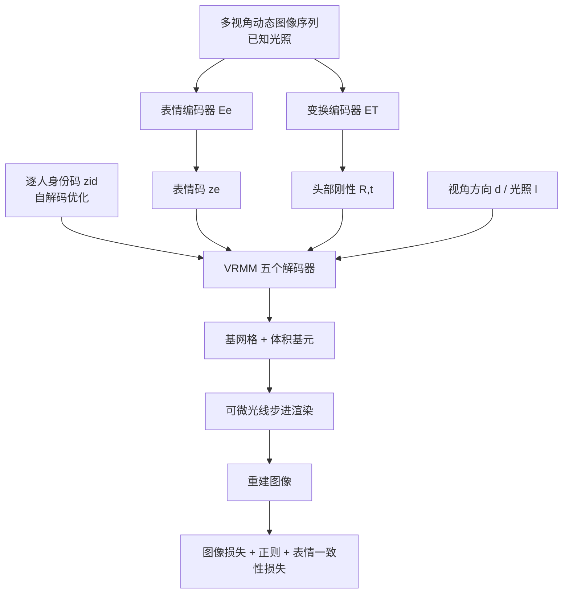

## 一句话总结

VRMM 提出首个既能连续重光照、又覆盖完整表情范围的体积化可变形头部先验模型，通过自监督训练把身份、表情、光照解耦到低维参数空间，并配合保先验的个性化微调，实现从少量甚至单张图像重建可动画、可重光照的高保真三维头像。

## 研究背景

三维人脸建模长期依赖 3D 可变形模型（3DMM）。这类方法以参数化形式编码人脸，便于操控身份与表情，但受限于线性、基于网格的表示，难以刻画头发、口腔内部、眼睛等复杂结构的真实感。近年基于体积表示（如 NeRF、体积基元）的方法带来了更完整的头部表达，但仍存在两方面不足：

- 现有数据驱动的体积先验模型难以同时建模动态表情与可变光照。它们要么采用监督学习、依赖离散身份与表情的解耦输入数据，要么需要昂贵且脆弱的预处理（如逐帧网格跟踪），难以规模化。
- 把生成式体积模型用于下游重建时普遍存在过拟合。由于训练数据有限，将输入人脸反演到体积建模空间常常效果不佳，还会破坏先验中习得的可重光照、可动画属性。

VRMM 针对这两点提出新的训练框架与个性化框架，力图弥合这一差距。

## 方法

整体框架分为两阶段：先在影棚数据上训练体积可重光照可变形先验，再设计保先验的拟合流程把模型拟合到影棚或真实场景采集，用于消费级头像重建。

整体框架。VRMM 建立在体积基元混合（MVP）表示之上，把体积基元附着到基网格的 UV 空间；并借鉴物理启发的外观解码器以支持重光照，光照条件 $$l$$ 表示为球面上 $$N_l$$ 个密集采样方向的入射光场。模型把身份码 $$z_{id}$$、表情码 $$z_e$$、视角方向 $$\mathbf{d}$$、光照 $$l$$ 映射到基网格顶点与体积基元：

$$\{\mathbf{v}, R_p, t_p, s_p, V_\alpha, V_{rgb}\} = \mathrm{VRMM}(z_{id}, z_e, \mathbf{d}, l).$$

渲染通过沿光线积分体素辐亮度得到像素颜色：

$$I_{rgb}(p) = \int_{t_{min}}^{t_{max}} V_{rgb}(\mathbf{o}_p + t\mathbf{d}_p)\,\frac{dT(p,t)}{dt}\,dt.$$

关键设计。

- 五解码器结构。VRMM 由网格解码器 $$D_{mesh}$$、身份解码器 $$D_{id}$$、变换解码器 $$D_T$$、不透明度解码器 $$D_\alpha$$、可重光照外观解码器 $$D_{rgb}$$ 组成。身份解码器把低维身份码映射为分层特征图，分别注入不透明度与外观分支；外观解码器用线性分支处理光照相关解码、非线性分支注入身份特征。
- 断梯度拼接（detach-concatenate）。由于基元的变换与外观高度相关，作者在变换、不透明度、外观非线性分支的中间层之间互相拼接特征图。直接拼接会因不同分支梯度尺度差异导致训练不稳定，因此在拼接特征上停止梯度回传，显著缓解身份数与训练帧数增大时体积基元的抖动。
- 解耦的自监督训练。表情编码器 $$E_e$$ 预测表情码的高斯分布均值与方差并采样，变换编码器 $$E_T$$ 预测头部刚性变换；身份码用仅解码器（auto-decoder）方式以高斯噪声初始化并与网络联合优化。训练无需对不同身份的表情做对齐或注册，采用免跟踪的端到端流程。
- 训练目标由三部分组成：$$L_{total} = L_{img} + L_{reg} + L_{exp}$$。其中 $$L_{img}$$ 含 $$L1$$ 与感知损失；正则项包含表情码的 KL 散度、体积最小化、尺度正则与身份码 $$L2$$。作者发现对表情码施加远大于身份码的 KL 权重，可限制 $$z_e$$ 的信息量，使表情编码器只提取表情相关信息，而光照与身份从其他分支注入，从而实现解耦。
- 表情一致性损失 $$L_{exp}$$。用某身份的表情码搭配另一身份码与不同光照渲染图像，再经编码器提回表情码，约束跨身份表情语义对齐，兼顾图像空间与参数空间差异。
- 保先验的模型拟合。拟合分为反演与微调两步。反演阶段先用 2D 关键点初始化刚性与相机参数，再通过逆渲染联合优化；身份码不直接求解，而是求一组权重 $$\mathbf{w}$$ 线性混合训练集已有身份码以约束域。微调阶段借鉴 Pivotal Tuning 与 DreamBooth，引入局部正则损失 $$L_{LR}$$，把参数修改限制在反演身份码附近的局部区域，从而在提高重建保真度的同时保留可动画、可重光照的先验能力。微调约 500 次迭代（约五分钟）即可收敛。

## 实验结果

训练数据来自自建装置采集的 254 名被试动态表情，29 台相机、分辨率 2448×2048、每人 1800 帧、共超过 1300 万张图像，采用组光照模式并每四拍插入一张全亮帧，在八张 NVIDIA V100 上训练约两周。在 Multiface 数据集上做新视角合成、在 FFHQ 的 100 张真实图像上做单视角重建，与 MoFaNeRF、HeadNeRF 对比：

| 方法 | 新视角 MAE ↓ | 新视角 SSIM ↑ | 新视角 LPIPS ↓ | 单视角 MAE ↓ | 单视角 SSIM ↑ | 单视角 LPIPS ↓ |
| --- | --- | --- | --- | --- | --- | --- |
| MoFaNeRF | 28.3 | 0.829 | 0.247 | 35.00 | 0.878 | 0.199 |
| HeadNeRF | 17.19 | 0.892 | 0.211 | 14.07 | 0.905 | 0.163 |
| Ours | 5.29 | 0.950 | 0.120 | 4.45 | 0.933 | 0.106 |

消融实验表明：表情一致性损失让不同身份学到更统一的表情空间；局部正则损失在微调时保留先验知识，使个性化后的表情迁移更准确。个性化评估显示，随参考帧数增加，动画的表情幅度更准确、身份特有的皱纹更明显；重光照仅需正、左、右三视角输入即可较准确，增加视角可小幅提升。

## 亮点与局限

亮点：

- 首个同时支持连续重光照与完整表情范围的体积可变形头部先验，并具备实时渲染能力。
- 自监督训练框架无需跨身份对齐表情，也无需脆弱的逐帧网格跟踪，显著降低训练数据约束，可扩展到大量身份。
- 保先验的个性化框架用局部正则缓解了「保真度—可编辑性」权衡，使单张或少量图像即可重建可动画、可重光照头像。

局限：

- 训练依赖 LightStage 级别的可控光照多视角采集与超大规模数据（超 1300 万张图像、八卡两周训练），采集与训练成本高。
- 先验仅由数百名身份训练，参数空间受限，复杂个体细节仍需微调补足，而微调会一定程度削弱可操控性。
- 论文主要针对头部区域，对更广泛的头发、配饰等极端外观的泛化仍有挑战。

## 延伸思考

VRMM 的核心思路是用「强正则限制某一分支信息量 + 断梯度稳定多分支耦合」实现属性解耦，这种对信息瓶颈的显式控制对其他多属性生成模型（如全身、手部先验）也具借鉴意义。其保先验个性化范式与扩散模型中的 DreamBooth、GAN 反演中的 Pivotal Tuning 一脉相承，说明「先验保持」正成为跨表示重建的通用工具。后续若能减少对 LightStage 采集的依赖、引入被动采集或合成光照数据，或将可重光照体积先验与更高效的高斯表示结合，有望进一步降低门槛并提升渲染效率。
