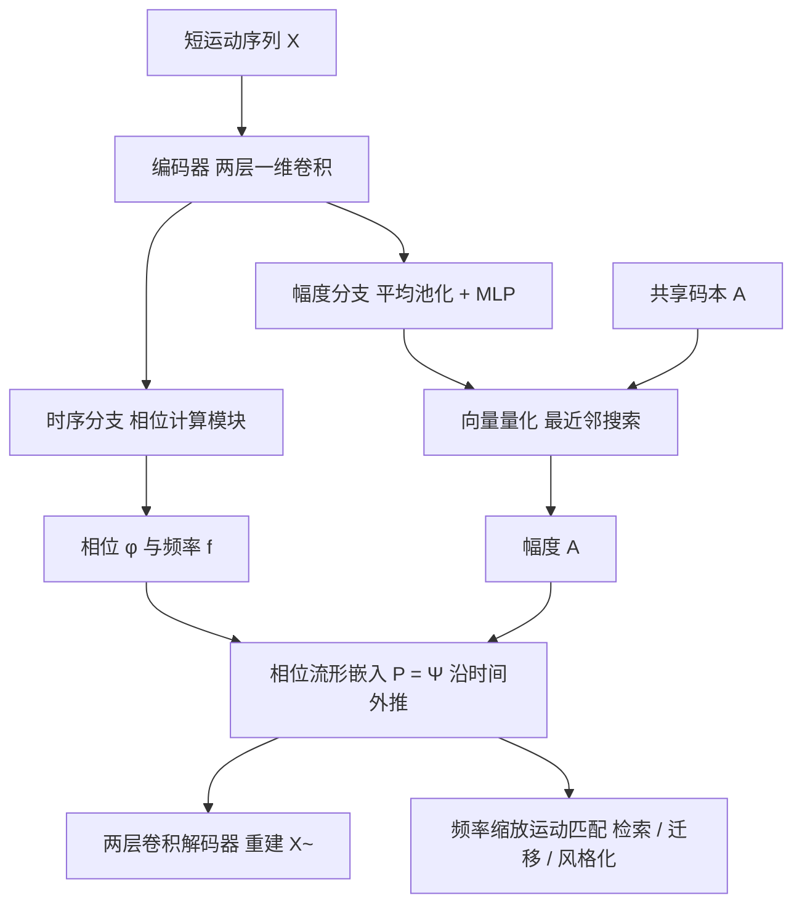

## 一句话总结

WalkTheDog 提出一种由多条闭合曲线组成的「断连一维相位流形」，用向量量化周期自编码器（VQ-PAE）在无任何监督、无骨骼对应关系的情况下，为形态迥异的角色（如人与狗）学习一个共享的相位流形，使语义相近的运动落入同一条曲线、同一相位对齐时序，从而支持跨形态的运动检索、迁移与风格化。

## 研究背景

理解运动的内在结构与语义，且不依赖角色的形态与骨骼结构，是角色动画研究的核心问题。传统的运动重定向与风格迁移常依赖成对数据的精确对齐，严重限制了适用范围；而运动图（motion graph）、运动场（motion field）等组织大规模数据集的方法，其相似性度量建立在外在的姿态特征上，这些特征同时编码了骨骼结构与运动语义，因此难以在统一空间里处理不同的角色设计与多样的内容。

作者主张学习一种与角色形态无关的内在运动表示，把运动的结构与语义解耦，且不需要任何标签或监督信号。他们抓住的关键内在属性是运动的周期性：常见的行走、跑步等移动可以用一个线性相位变量来参数化。已有的相位方法（如 DeepPhase 的周期自编码器 PAE）虽然能学出连续多维相位流形，但相位与幅度往往纠缠在一起，难以分离时序与高层语义；且运动数据的稀疏性使流形中大片区域无效，为多角色共享流形带来更大困难。

## 方法

整体框架：核心是一个断连一维相位流形，配合向量量化周期自编码器（VQ-PAE）来学习运动到流形的映射。对每个数据集训练一个独立的 VQ-PAE 以适应各自的形态与骨骼特征，但多个 VQ-PAE 共享同一个幅度码本，从而在无监督下把语义相近的运动自然聚到同一条曲线上。训练后丢弃解码器，仅保留相位嵌入，再与改进的运动匹配算法结合，用于检索、迁移与风格化。

关键设计：

- 断连一维相位流形：给定输入运动序列 $$\mathbf{X}\in\mathbb{R}^{J\times T}$$，把每一帧映射到流形上的一点 $$p=\Psi(\mathbf{A},\phi)$$，其映射定义为
$$\Psi(\mathbf{A},\phi)=\mathbf{A}_0\sin(2\pi\phi)+\mathbf{A}_1\cos(2\pi\phi)$$
这是嵌入在 $$\mathbb{R}^d$$ 中的一个椭圆，$$\mathbf{A}_0,\mathbf{A}_1$$ 分别是幅度向量 $$\mathbf{A}$$ 的前后两半。相位 $$\phi\in(-\tfrac12,\tfrac12]$$ 连续可变，而幅度只能从大小为 $$K$$ 的有限码本 $$\mathcal{A}$$ 中选取。因此整个流形是一族椭圆的集合，语义相近的一类运动被嵌入同一个椭圆，椭圆与幅度一一对应。码本大小即瓶颈宽度，是学出「既有表达力又语义对齐」流形的关键。

- 向量量化周期自编码器（VQ-PAE）：编码器由两层一维卷积得到中间表示，再分为时序分支与幅度分支。时序分支用核大小为 1 的卷积把中间表示压成单通道时序信号，交给相位计算模块预测枢轴帧的相位 $$\phi$$ 与频率 $$f$$；相较 PAE 用 FFT 各频段功率加权求平均频率（对相位平移不稳定），作者改用一个小型 MLP 作用于功率谱，得到更鲁棒的频率预测。幅度分支先在时间轴做平均池化，经 MLP 得到原始幅度 $$\tilde{\mathbf{A}}$$，再用向量量化取最近邻 $$\mathbf{A}=\arg\min_{\mathbf{A}_i\in\mathcal{A}}\lVert\tilde{\mathbf{A}}-\mathbf{A}_i\rVert^2$$。基于相位线性与幅度恒定假设，用 $$\Phi=\phi+f\cdot\mathbf{T}$$ 外推整段相位并由 $$\mathbf{P}=\Psi(\mathbf{A},\Phi)$$ 得到嵌入，最后由两层卷积解码器重建运动。浅层解码器与小码本共同构成瓶颈，逼迫语义结构进入潜空间：例如空闲与跑步会在码本中相距很远，而慢跑与跑步在相位对齐后足够相似，可能共用同一码字。

- 损失函数：重建损失加向量量化损失，
$$\mathcal{L}=\mathcal{L}_{rec}+\lambda_{vq}\mathcal{L}_{vq},\quad \mathcal{L}_{rec}=\lVert\mathbf{X}-\tilde{\mathbf{X}}\rVert^2,\quad \mathcal{L}_{vq}=\lVert\mathrm{sg}(\tilde{\mathbf{A}})-\mathbf{A}\rVert^2+\lVert\tilde{\mathbf{A}}-\mathrm{sg}(\mathbf{A})\rVert^2$$

- 共享流形与码本重初始化：训练两个数据集时目标为 $$\mathcal{L}=\mathcal{L}_{rec1}+\mathcal{L}_{rec2}+\lambda_{vq}\mathcal{L}_{vq}$$，只靠共享码本 $$\mathcal{A}$$ 即可对齐，无需任何骨骼拓扑对应。由于常规向量量化易出现码字仅被单个 VQ-PAE 使用、导致两数据集嵌入分布不一致，作者借鉴并改造了一种重初始化技术：按衰减的运行平均使用率把低频使用的码字向编码器产出的原始幅度插值，且共享码字取所有 VQ-PAE 更新的平均，只有被所有 VQ-PAE 频繁使用的码字才会收敛稳定，从而保证跨数据集的流形重叠。

- 频率缩放运动匹配：训练完成后为数据集每一帧获得流形嵌入。作者把经典运动匹配从「固定帧数」改为「固定周期数」：以 VQ-PAE 预测的频率定义每帧对应的一个运动周期长度 $$t(i)$$，逐周期查询数据库。代价函数为
$$c(i,k)=d(\mathbf{P}_{i:i+t(i)},\mathbf{Q}_{k:k+t(k)})+\lambda_1\lVert\mathbf{J}_{start}-\mathbf{J}_k\rVert_2^2+\lambda_2\lVert t(i)-t(k)\rVert^2$$
其中相位距离通过把两段相位线性插值到同一长度再算平方距离得到，第三项鼓励匹配到频率相近的片段。这样更敏捷的运动匹配更频繁、响应更快，又能把输出插值到与输入相同的频率，实现更准确的时序与语义对齐，兼顾响应性与平滑性。

## 实验结果

在 Dog、Human-Locomotion 以及高度风格化的 MOCHA 数据集上，作者以「人-狗」与「风格化」两种组合训练 VQ-PAE，验证时序与语义对齐效果，并展示检索、迁移与风格化应用。通过训练一个从流形嵌入到姿态空间的小 MLP，用逐帧关节位置误差衡量流形的表达力：误差在码本较大时趋于平台，Dog 与 Human-Loco 在尺寸 64 后基本饱和，尺寸 512 峰值最好，但 MOCHA 因大量幅度间过渡使逐帧 MLP 误差偏大（可由序列级运动匹配忠实重建）。

| 码本 $$\lvert\mathcal{A}\rvert$$ | Dog（cm） | Human-Loco（cm） | MOCHA-Clown（cm） | MOCHA-Ogre（cm） |
| --- | --- | --- | --- | --- |
| 8 | 1.86 | 1.29 | 11.6 | 12.2 |
| 32 | 1.41 | 1.19 | 9.97 | 10.9 |
| 64 | 1.24 | 1.13 | 9.86 | 9.85 |
| 128 | 1.19 | 1.08 | 9.29 | 9.42 |
| 512 | 0.87 | 1.01 | 6.50 | 7.70 |

不过码本越大，落在跨数据集共享连通分量上的嵌入比例越低（流形重叠度下降）：人-狗设置下尺寸 64 重叠度已降到 67.8%、128 仅 5.42%、512 为 0%；风格化设置整体更易重叠。因此需在表达力与重叠度之间折中，最终人-狗设置选 $$\lvert\mathcal{A}\rvert=32$$、风格化设置选 64。消融还表明：去掉码本重初始化后重叠度明显下降（如人-狗无重初始化时尺寸 16 从 100% 降到 73.6%），说明重初始化对构建共享流形至关重要。此外，与最新骨骼感知网络 SAN 相比，SAN 在人狗骨骼差异大时难以迁移，而本方法无需骨骼对应即可完成语义与时序对齐的迁移。

## 亮点与局限

亮点：把运动的内在周期性作为对齐基石，用「离散幅度选椭圆、连续相位定时序」的紧凑几何结构，将运动的语义与时序显式解耦；仅凭共享码本这一极简耦合，就能在无监督、无自监督损失、无骨骼对应的条件下把人、狗乃至风格化角色对齐到同一相位流形；改进的频率缩放运动匹配又把 1D 相位的表达力落地到检索、迁移、风格化等实用任务。相较 DeepPhase 的多维纠缠相位，本方法的流形更紧凑、可解耦。

局限：语义对齐并不总是完美，需要精心挑选码本大小以平衡表达力与重叠度，且隐含要求各数据集包含语义相近的运动分布（如狗数据缺少后退动作，人的后退会被对齐到狗的前进）；由于不提供关节对应，左右身体部位无法区分，可能出现左右脚接触错配；当前框架非生成式，丢弃解码器后不能直接生成新运动。

## 延伸思考

这项工作最具启发性的地方，是用「刻意的瓶颈」换取「涌现的结构」：浅层网络加小码本限制了模型容量，反而逼迫它把运动的语义（幅度/椭圆）与时序（相位）自发地组织成对齐良好的几何流形，而非依赖标签或成对监督。这提示我们，跨形态对齐问题也许并不需要显式的骨骼映射，只要找到一个足够内在、足够低维的共享结构（这里是周期性），异构角色就能在同一空间里自然对话。沿这一思路，未来若能自动学习码本大小、把量化残差用于表达同一语义下的「风格」，或把周期自编码器推广到音乐等其他一维周期信号（做紧对齐的音乐到舞蹈生成），并补上生成能力，这套相位流形有望从「对齐与检索」扩展为更通用的跨模态、跨形态运动表示基础。
