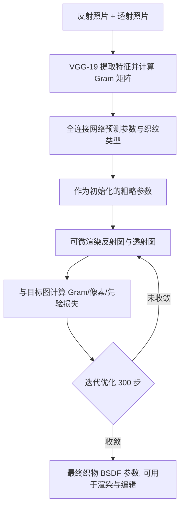

## 一句话总结

只用手机拍摄一对正面打光（反射）与背面打光（透射）照片，通过一个可微的双向散射分布函数（BSDF）模型加上轻量网络与可微优化，首次让恢复出的织物参数在反射与透射两方面同时与真实照片吻合。

## 研究背景

数字化机织织物在数字人、室内设计、虚拟现实等场景价值很高，但人工制作高质量织物资产成本高昂，因此从真实样本轻量化采集成为热点。此前 Jin 等人（2022）提出只拍一张反射照片、用可微几何与着色模型反演织物参数的方法，在高光形状与结构上都能很好匹配照片。

但作者指出：仅靠反射图不足以刻画织物的全部反射与透射行为。最典型的是厚度——它对反射几乎不敏感，却强烈影响透射。厚度不同的织物可能有几乎相同的反射图，却有截然不同的背光透射表现。而透射对于把织物用作窗帘、灯罩乃至衣物都至关重要。因此单张图无法估计的信息，需要反射与透射两张图共同约束才能恢复完整参数。

此外，直接把已有基于 SpongeCake 的模型开启透射并不能奏效：它用单次散射的 SGGX microflake lobe 去近似多次散射，在入射与出射方向近乎相反时（恰好是背光透射图的中心区域）误差最大，无法解释真实织物透射中的多次散射。

## 方法

整体框架：搭建一个「一台手机相机 + 前后两个点光源」的采集装置，把平铺织物样本夹在两光源之间，分别拍出反射图与透射图并裁剪下采样到 512×512。随后用一个轻量网络从这对图预测织物参数与织纹类型作为初始化，再用可微渲染优化进一步精修，使渲染结果同时匹配反射与透射输入。核心支撑是作者提出的新织物 BSDF 模型。

关键设计：

- 方位不变的多次散射相位函数（ASGGX）：作者观察到多次散射经过 microflake 之间多次弹射后，出射分布沿方位角趋于均匀，这是标准 SGGX 无论如何调参都表达不出的。于是把入射方向 $$\omega_i$$ 与出射方向 $$\omega_o$$ 旋转到同一纵向平面，使二者方位角一致，再用修正后的半向量 $$\omega_h'$$ 查询 microflake 密度，定义方位不变相位函数：
$$f_p(\omega_i \to \omega_o) = \frac{D(\omega_h')}{2\sigma(\omega_i)}$$
分母中的 2 来自变换关系 $$d\omega_o' = 2 \lvert \omega_o' \cdot \omega_h' \rvert d\omega_h'$$，区别于标准半向量反射雅可比中的 4。该相位函数复用 SGGX 的 $$D$$ 与 $$\sigma$$，同时满足能量守恒与互易性，可插入 SpongeCake 框架导出对应 BSDF。

- 两层 microflake 模型：透射图中同一像素同时受经纱与纬纱影响，单层模型无法表达。作者在织物每个点上用两层 SpongeCake 分别表示靠近相机的顶层纱线与远离相机的底层纱线，每层各有独立的漫反射反照率、粗糙度等参数集。

- 张力感知的厚度调制：纱线在两纱交叠处因张力增大而变薄，厚度决定透光比例，对透射影响显著。作者按纱线上位置调制厚度：
$$T = T \times \left( S_{min} + \mu \times (1 - S_{min}) \right)$$
其中 $$S_{min}$$ 为最小厚度尺度（缎纹与斜纹取 0.5，平纹取 1.0），$$\mu$$ 为张力等级（长段中心为 0.0、压缩段中心为 1.0，之间线性插值）。该项作为每种织纹的固定属性，不参与优化。

- 完整 BSDF：由三项组成——两层 SGGX 的单次散射项 $$f_s$$、两层 ASGGX 的低阶多次散射项 $$f_m$$、以及处理高阶散射的漫反射项，且每项都区分反射与透射。透射漫反射同时考虑两层纱线法线的余弦乘积，反射漫反射只考虑第一层法线：
$$f(\omega_i, \omega_o) = f_s(\omega_i, \omega_o) + f_m(\omega_i, \omega_o) + f_d^{r,t}(\omega_i, \omega_o)$$

- 网络与优化：两张图分别送入预训练 VGG-19、算 Gram 矩阵后拼接，经三层全连接（每层 256 节点、LeakyReLU）输出 34 通道参数，训练只更新全连接权重。优化阶段用 Adam、学习率 0.01、迭代 300 步（在 NVIDIA 4060 上约四分钟），损失由 Gram 矩阵损失、先验损失与低分辨率像素损失加权组成。为匹配透射图中光源的离焦效果，作者把点光源投影到图上并生成高斯斑，让纱线间隙查询该高斯，从而在针孔相机模型下也能模拟离焦。

## 实验结果

由于真实数据没有参数真值，论文主要用输入图与渲染图的视觉匹配、以及网络初始化的 MSE 来验证。下表为初始化消融中随机初始化与网络初始化在反射、透射上的误差对比，网络初始化误差明显更低。

| 初始化方式 | 反射 MSE↓ | 透射 MSE↓ |
| --- | --- | --- |
| 随机初始化 | 0.0041 | 0.0119 |
| 网络初始化（本文） | 0.0030 | 0.0037 |

其他关键结论：在合成数据上，网络预测的粗参数渲染大致匹配输入但有色偏与高光偏差，经可微优化后与输入及披挂布料网格渲染都更贴合。在真实数据上，与 Jin 等人（2022）相比，对方虽能复现反射，但因缺失厚度等关键参数、且对多次散射处理欠佳，其透射预测与实拍差距很大，而本文能同时匹配反射与透射。消融进一步表明：ASGGX 对匹配透射高光不可或缺（仅漫反射或 SGGX 都失配）；两层模型才能重现缎纹的竖向连续纱线；张力感知厚度才能还原整体斜向结构。

## 亮点与局限

亮点：以反射—透射照片对作为约束，首次让恢复参数在反射与透射两侧同时吻合真实织物；提出的 ASGGX 方位不变相位函数针对性地解决了背光中心处多次散射的建模难题，且满足能量守恒与互易性；采集装置极为轻量（一部手机加两个点光源），流程含网络初始化加可微优化，单次优化约四分钟。

局限：着色模型未考虑纱线直径变化、纱线滑移，以及褶皱、飞散纤维等全局特征，会带来部分失配；虽可通过更复杂的过程化空间变化扩展，但只用两张图去估计更多参数会让优化更难。网络在若干典型织纹上训练，遇到未见织纹需要重新训练。

## 延伸思考

方法把「更贴近物理的相位函数设计」与「轻量可微反演」结合，说明在采集端增加一个互补观测（透射）能显著提升逆问题的可辨识性，这一思路可迁移到其他半透光材质（如纸张、树叶、皮肤）的轻量采集。作者也指出可进一步建模纱线级细节与瑕疵，并向针织物等其他织物类型扩展；若能把张力感知厚度从固定属性升级为可学习、可优化的场，或结合更强的先验网络，有望在更少约束下恢复更丰富的空间变化外观。
