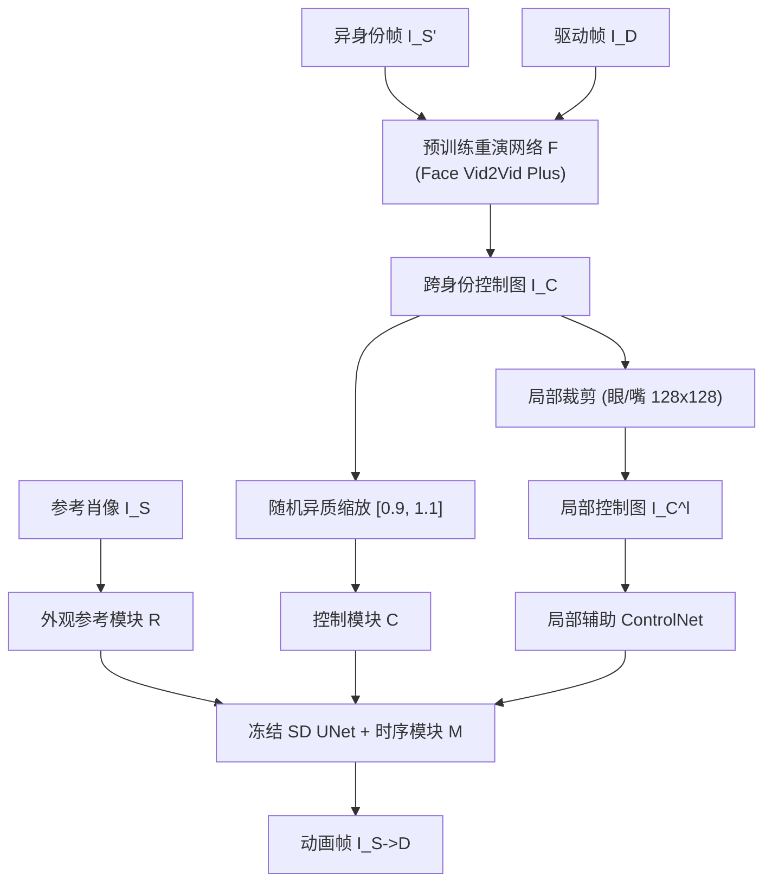

## 一句话总结

X-Portrait 用一张静态肖像作为外观参考，直接以驱动视频的原始 RGB 帧作为运动条件，配合分层的运动注意力（全局＋局部）和跨身份的缩放增强训练，在冻结的 Stable Diffusion 上实现表情细腻、身份稳定且能泛化到风格化肖像的零样本肖像动画。

## 研究背景

肖像动画的目标是用驱动视频中的头部姿态与表情去驱动一张静态肖像图，应用于视频会议、视觉特效和数字人。早期主流方法（如 FOMM、Face Vid2Vid）采用"扭曲＋渲染"两阶段流程：先根据源图与驱动帧之间的表情/姿态差异估计运动流，把源身份特征做扭曲，再送入生成解码器补全细节。这类方法在扭曲和渲染两端都存在局限：由关键点或隐编码生成的扭曲场难以刻画细微或超出分布的极端表情，解码器容量受限导致分辨率与感知质量不足，遇到风格化肖像或大幅头部运动时会出现模糊、僵硬和面部畸变。

近期一批工作把该任务当作可控的图像到视频（I2V）扩散来做：借助 ControlNet 用显式的语义运动信号（面部关键点、骨架、稠密姿态）来控制运动。但这类显式且粗糙的姿态信号无法完整表达原始表情，且强依赖第三方检测器的鲁棒性与精度，损害了动画的表现力与稳定性；同时从驱动帧提取的姿态图并未与驱动身份语义（脸型、比例等）完全解耦，跨身份驱动时会污染源身份，作者称之为"外观泄漏"（appearance leakage）。

## 方法

### 整体框架

X-Portrait 以冻结的预训练潜在扩散模型（SD 1.5）为渲染骨干，插入三个可训练的辅助模块实现外观、运动、时序的解耦控制：

- 外观参考模块 $$R$$：从参考图 $$I_S$$ 提取身份属性与背景上下文，通过骨干 UNet 的自注意力被交叉查询。
- 控制模块 $$C$$（ControlNet 形式）：从驱动信号推断头部姿态与表情，以加性注意力注入 UNet。
- 时序模块 $$M$$（基于 AnimateDiff）：在 UNet 块中插入时序 Transformer，保证跨帧一致性。

核心创新在于运动控制信号：不再使用中间显式表示，而是让网络直接从驱动 RGB 图像中隐式解读运动。

### 关键设计

隐式跨身份运动控制：显式关键点方案有三个问题——依赖第三方检测器易抖动/失效、粗糙表示无法刻画牙齿眼球眉毛等细节、自驱动训练下网络会走捷径复制与身份纠缠的驱动结构导致跨身份时身份漂移。为此，作者用预训练重演网络 $$F$$（Face Vid2Vid）合成跨身份图像对：取同一主体的两帧作为参考 $$I_S$$ 与重建目标 $$I_D$$，但控制输入改为 $$I_C = F(I_{S'} \to I_D)$$，其中 $$I_{S'}$$ 来自另一身份的视频帧。这样 $$C$$ 被训练去隐式提取与身份解耦的运动，既缓解外观泄漏，又能在推理时直接用驱动视频而无需任何预处理。RGB 控制图比关键点携带更丰富的运动信息，足以让 $$C$$ 泛化到未见的表情与头部运动。

增强局部面部运动注意力：全局加性条件注意力对每个像素等权处理，容易漏掉鼻翼皱纹、眼球转动等细微动作。作者引入一个辅助 ControlNet，条件是仅保留眼睛和嘴巴周围区块的掩码图 $$I_C^l$$（以关键点中心裁剪 $$128 \times 128$$ patch），把去噪引导聚焦到关键局部结构。训练前还用额外的 L1 与 VGG 感知重建损失在局部 patch 上微调控制图生成器 $$F$$，得到 Face Vid2Vid Plus，使其更好地捕捉细微运动。

身份保持：即便有跨身份训练，$$F$$ 仍未完全摆脱外观纠缠，$$I_C$$ 的脸型与眼/嘴尺寸会被目标驱动图影响。作者在训练时对 $$I_C$$ 和 $$I_C^l$$ 施加随机异质缩放（经验上缩放因子取 $$[0.9, 1.1]$$），故意制造与目标 $$I_D$$ 的轻微错位，迫使网络依赖 $$I_S$$ 提取身份特征；缩放只影响头形，不改变表情和姿态。推理时再对整段驱动序列施加仿射变换（平移＋缩放），对齐源与选定驱动帧的头部框。当可用多张参考图（如视频）时，只需把多组外观特征拼接进 UNet 即可融合出身份更佳的动画。

训练与推理：SD 1.5 权重全程冻结；$$R$$、$$C$$ 用 SD 1.5 初始化，$$M$$ 用 AnimateDiff 初始化；分阶段依次插入并训练，AdamW 学习率 $$10^{-5}$$，每模块 30K 步、每步 16 帧。推理采用 prompt traveling 增强时序平滑，并兼容潜在一致性模型，在 A10 GPU 上 10 步即可 30 秒生成 24 帧；从 $$I_S$$ 前向加噪得到初始噪声而非纯随机噪声，可减少跳变伪影；推理不依赖 $$F$$。

## 实验结果

训练数据为 550 名受试者的自采单目视频（42 种表情＋约 20 分钟对话，室内外场景，裁剪至 $$512 \times 512$$）。评测收集 100 张野外肖像（含 2D/3D 卡通、动漫、赛博朋克、油画、雕塑等风格）与 200 段授权测试视频。所有指标在 $$256 \times 256$$ 分辨率下计算，所有基线在同一数据上微调。

自重演与跨重演的定量对比（越低越好者标 ↓，越高越好者标 ↑）：

| 方法 | L1 ↓ | SSIM ↑ | LPIPS ↓ | FID ↓ | ID 相似度 ↑ | 图像质量 ↑ | 表情/姿态 ↓ |
| --- | --- | --- | --- | --- | --- | --- | --- |
| Face Vid2Vid | 0.042 | 0.770 | 0.203 | 52.071 | 0.615 | 36.222 | 0.100/4.72 |
| DaGAN | 0.054 | 0.732 | 0.234 | 64.297 | 0.280 | 35.537 | 0.111/5.10 |
| TPS | 0.038 | 0.801 | 0.179 | 50.636 | 0.508 | 34.904 | 0.079/3.94 |
| MCNet | 0.035 | 0.811 | 0.176 | 51.091 | 0.343 | 34.624 | 0.094/3.82 |
| FADM | 0.049 | 0.727 | 0.231 | 51.091 | 0.635 | 34.640 | 0.103/4.62 |
| MagicDance | 0.045 | 0.766 | 0.172 | 30.383 | 0.643 | 67.241 | 0.099/7.04 |
| Face Vid2Vid Plus | 0.034 | 0.825 | 0.144 | 26.386 | 0.625 | 42.478 | 0.071/3.44 |
| X-Portrait | 0.033 | 0.829 | 0.133 | 14.553 | 0.689 | 67.569 | 0.070/3.37 |

其中自重演对应 L1/SSIM/LPIPS/FID 列，跨重演对应 ID 相似度（ArcFace 余弦相似度）、图像质量（HyperIQA）、表情/姿态精度（与驱动帧用 ARKit blendshape 和头姿的 L1 差异）。X-Portrait 在几乎所有指标上领先：借助 SD 先验，它与 MagicDance 在图像质量上大幅超越其余方法，而相比 MagicDance 又在身份保持和运动精度上更优。

消融（跨重演）：

| 方法 | ID 相似度 ↑ | 表情/姿态 ↓ |
| --- | --- | --- |
| （a）无跨身份训练 | 0.015 | 0.037/1.58 |
| （b）无局部控制 | 0.731 | 0.077/3.69 |
| （c）无缩放 | 0.658 | 0.070/3.26 |
| 完整模型 | 0.689 | 0.070/3.37 |

去掉跨身份训练后，网络退化为复制驱动帧，表情精度虽高但身份相似度崩塌；去掉局部控制会丢失细微表情（如非对称皱眉），表情精度下降；去掉缩放增强会出现明显的身份向驱动漂移。

## 亮点与局限

亮点：用原始 RGB 驱动图取代显式关键点，最大限度保留运动信息并摆脱第三方检测器依赖；跨身份＋缩放增强训练巧妙地把外观泄漏问题转化为解耦监督；分层的全局＋局部注意力显著提升眼球、嘴部等细节表现力；骨干 SD 全程冻结带来强域泛化（可零样本迁移到动漫、油画、雕塑等风格）和高图像质量，并兼容一致性模型加速。

局限：整体表现力受限于基础重演网络 $$F$$——当 $$F$$ 对极端表情（如抿唇内卷、鼓腮）完全无法产生相关运动线索时，这类样本在训练中被过滤，X-Portrait 也难以学到对应分布；牙齿区域质量、以及可察觉的抖动伪影仍有改进空间。

## 延伸思考

这项工作的核心思路是"用一个能力有限但可用的旧模型去自举一个更强的生成模型"：Face Vid2Vid 本身表现力不足，却被用作跨身份运动信号的生成器，扩散骨干再在其基础上放大表现力。这种"以弱教强"的自举范式对数据稀缺的可控生成任务颇有启发。另一方面，缩放增强本质是通过刻意引入结构错位来强制模块解耦，与常见的对抗性/信息瓶颈式解耦相比更简单直接，值得在其他条件生成任务中借鉴。局限也提示了一个根本瓶颈：条件信号生成器决定了可表达运动的上界，若要突破极端表情，可能需要更强的运动表示或直接从 RGB 端到端学习，而非依赖中间重演网络。
