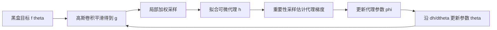

## 一句话总结

ZeroGrads 在优化过程中在线、自监督地拟合一个局部神经代理来近似不可微图形管线的损失景观，用代理的解析梯度替代无法获取的真实梯度，从而让梯度下降可以作用于任意黑盒渲染、建模与动画问题。

## 研究背景

基于梯度的优化已经渗透到渲染、材质建模、角色与流体动画等图形任务中，但它要求整条管线可微，能把目标函数的梯度反传到待优化参数上。现实中很多图形管线是黑盒（如 Blender、RenderMan、Unity 等完整软件），无法访问内部实现，也就无法求导；即便能访问内部，其中的函数也可能本身不可微（如阶跃函数），或产生对收敛无用的梯度。本文的设定是：只拥有一个前向模型（例如建模或渲染流程）和一个参考目标，可以计算损失，但损失的梯度不可用。

一种经典思路是用一个"代理"损失替换不可微损失：代理与真实损失有相近的极小值，但本身可微。问题在于，如何针对任意图形管线高效地找到这样的代理损失——采样一次代价高昂（需要跑完整渲染或仿真），而问题维度又可能相差好几个数量级。传统无导数优化（模拟退火、遗传算法、SPSA、CMA-ES、有限差分等）在图形日常使用中大多已失宠：它们在光滑问题上也常需大量函数评估才能收敛，随维度升高收敛困难，且每次迭代成本高（有限差分需 $2n$ 次评估）或内存随维度平方增长（CMA-ES 的协方差矩阵）。

## 方法

### 整体框架

给定一个标量目标函数 $f(\theta) : \Theta \rightarrow \mathbb{R}^+_0$，希望找到最小化它的参数 $\theta^*$。由于 $\partial f / \partial \theta$ 不可访问、无定义（在不连续处）、为零（在平台区）或计算代价过高，方法转而在当前参数附近局部拟合一个可调、可微的代理函数 $h(\theta, \phi)$，用其导数 $\partial h / \partial \theta$ 作为替代梯度驱动优化。整套流程包含四个关键步骤，并与参数优化同步在线进行。

### 关键设计

一、平滑目标。真正的麻烦不在孤立的不可微点（连 ReLU 都有），而在梯度为零的平台区。方法用高斯核 $\kappa$ 对目标做卷积得到光滑目标：

$$g(\theta) = \kappa * f(\theta) = \int_{\Theta} \kappa(\tau) f(\theta - \tau)\, d\tau$$

高斯卷积保持凸性，使光滑目标的 Lipschitz 界更强（$L_g \le L_f$），并保证梯度连续，即便原目标梯度不连续。

二、代理函数。代理 $h(\theta, \phi)$ 可以是多项式、径向基函数或神经网络（完整方法用神经网络），其解析形式便于通过自动微分同时得到 $\partial h / \partial \phi$ 与 $\partial h / \partial \theta$。相比线性方法，连续代理允许在不重跑前向模型的情况下，在新位置多走几步梯度下降并评估估计损失面。

三、局部化。在整个域上匹配 $h$ 与 $g$ 既奢侈又无必要，因为一阶优化器只在当前参数附近取值。方法用另一个以 $\theta$ 为均值的高斯权重 $\lambda$（不同于平滑核 $\kappa$）把拟合聚焦在当前解的局部邻域：

$$l(\theta, \phi) = \int_{\Theta} \lambda(\rho, \theta)\, (g(\rho) - h(\rho, \phi))^2\, d\rho$$

代理从不访问真实目标的梯度（它们甚至可能不存在），仅通过采样平滑损失 $g$ 来自监督学习。

四、高效估计器。把平滑损失与局部损失合并后，对代理参数 $\phi$ 求梯度会得到一个嵌套积分。由于作用在内层积分上的函数是线性（二次误差），根据积分号下求导的莱布尼茨法则，可将其重排为在乘积空间 $\Theta \times \Theta$ 上的双重积分，从而得到线性复杂度 $O(N)$ 的无偏估计：

$$\frac{\partial}{\partial \phi} l \approx \frac{1}{N} \sum_{i}^{N} \frac{2 \lambda(\rho_i, \theta)}{p(\rho_i, \tau_i)} \frac{\partial h(\rho, \phi)}{\partial \phi} (h(\rho_i, \phi) - \kappa(\tau_i) f(\rho_i - \tau_i))$$

这一重排只在特殊情形（二阶多项式作用于内层积分）成立，换成 KL 散度、Hinge 或指数损失会因导数非线性引入偏差。

五、重要性采样。对两个局部性项 $\lambda$ 与 $\kappa$ 做重要性采样以降低 MC 估计器的方差，把采样预算集中到当前迭代真正重要的区域，这在高维尤为关键。$\lambda$ 的 $\sigma_o$ 控制采样半径，$\sigma_i$ 控制平滑量，一般设为 $\sigma_o$ 的 15%。

一个核心洞见：SPSA、FR22 等方法直接估计参数梯度 $\partial \theta$（带方差），而 ZeroGrads 估计代理梯度 $\partial \phi$、再解析地算出 $\partial \theta$，从而把高方差估计转移到神经网络的参数更新中，被网络状态的"迟滞"和频谱偏置自然平滑，使方法可扩展到极高维度。

## 实验结果

评测分两组：低维任务（渲染、建模、动画）用于消融验证设计选择，高维真实任务用于对比传统无导数优化器。所有方法只在图像空间操作，不访问任何真值监督或参数，报告 10 次独立运行的中位数。下表为在完整方法达到 95% 误差下降的迭代处，各消融/对比方法相对误差比（数值越大表示落后越多）：

| 方法 | 平滑 | 代理 | 采样 | 渲染 | 建模 | 动画 |
| --- | --- | --- | --- | --- | --- | --- |
| NoSmooth | 无 | 神经网络 | 高斯 | 1.2× | 3.9× | 1.5× |
| NoNN | 高斯 | 二次型 | 高斯 | 8.9× | 792.4× | 16.3× |
| NoLocal | 高斯 | 神经网络 | 均匀 | 12.3× | 613.4× | 22.4× |
| FD | 无 | 线性 | Box | 24.5× | 654.3× | 10.2× |
| FR22 | 高斯 | 线性 | 重要性 | 11.0× | 323.6× | 3.3× |
| Ours | 高斯 | 神经网络 | 高斯 | 1.0× | 1.0× | 1.0× |

消融显示：去掉局部性（NoLocal）在高维（如 320 个立方体的 Mosaic）方差过大而难以收敛；用二次型替换神经网络（NoNN）表达力不足；有限差分（FD）能稳步逼近但不随维度扩展；去掉内层平滑（NoSmooth）仅轻微降低性能（约 2 倍），部分因代理拟合带来隐式平滑。

高维任务（等采样预算对比）覆盖：256×256×3 纹理、拟合 MNIST 的 35152 权重 MLP、2562 顶点网格、1024 维焦散高度场，以及训练一个输出样条控制点的 VAE 生成模型。传统无导数优化器（GA、SA、SPSA、CMA-ES）多数失败或收敛慢；在网格任务上 FR22 与本方法取得最低最终误差（分别为 0.0018 与 0.0013）。梯度方差分析显示，本方法梯度幅值的方差比 SPSA、FR22 低若干数量级，归功于神经代理的状态与光滑性。

## 亮点与局限

亮点：把"为黑盒管线找代理损失"这一过程系统化、自动化，只需前向模型与参考即可在线、自监督地优化，无需预训练模型或预计算真值梯度；通过把方差从参数域转移到代理参数域，方法可扩展到多达约 35k 个相互关联的变量；据作者所述，这是首个在不可微任务上训练的生成模型。作者明确表示不宣称在方差或收敛上优于 Mitsuba、Redner、PhiFlow 等专用方法，而是拓宽逆向图形求解器的适用面。

局限：继承梯度下降的固有问题，可能陷入局部极小、在缓坡区移动缓慢，并引入额外超参数；存在初始"热身"阶段浪费样本；其梯度方差虽低于同类估计法，但高于解析梯度，故在有专用方法的问题上通常不及后者；在极复杂损失景观（平台区与离散空间混合，如同时优化家具类型与位置的场景复现任务）中，代理难以准确编码，优化会退化到把物体推出画面的局部极小。

## 延伸思考

该工作的价值在于用"可学习的局部代理"把不可微问题的求导难题，转化为一个可以借助渲染领域成熟的蒙特卡洛方差缩减技术求解的估计问题——这种把光传输采样思想迁移到梯度估计的类比很有启发性。它为那些无法或不值得改写为可微形式的商业管线提供了实用的优化通道。值得进一步思考的方向包括：内层代理损失与外层优化器之间的相互作用如何自适应调节，如何设计自适应的代理结构或混合方法来处理离散与连续混合、且充满平台区的复杂景观，以及如何在保持通用性的同时缩小与专用可微渲染器之间的方差与收敛差距。
