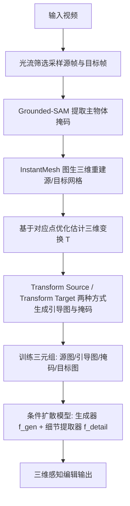

## 一句话总结

3D-Fixup 提出一个前馈式的 3D 感知图像编辑框架，让用户对单张照片中的物体做出平面外旋转、三维平移等真实的三维变换，同时保持物体身份一致；其核心是利用视频数据结合图生三维模型自动构造带三维引导的训练数据对，再用扩散模型学习从三维引导图到最终编辑结果的映射。

## 研究背景

生成式图像编辑希望让用户直观地操纵图像中的物体，即便图像本身对物体或场景的信息并不完整。现实中我们所编辑的物体其实是三维物体的投影，因此像平面外旋转、三维平移这类自然操作，需要模型对光照、阴影、被遮挡部分等图像中不可见的信息进行合理"幻想"。这类三维编辑在电商（多角度展示商品）、数字媒体制作（无需重建整个场景即可重新配置或重打光）等场景中价值很高。

现有方法主要有两类局限。一类是基于优化的方法，如 Image Sculpting 先构造粗糙三维形状再编辑与精修，质量高但推理时优化过程计算量大、速度慢；Diffusion Handles、GeoDiffuser 等同样依赖推理时优化，鲁棒性与速度受限。另一类是前馈方法，如 Object3DIT、Magic Fixup，速度较快，但受限于合成训练集或纯二维数据，缺乏深度与空间理解，且往往依赖文本提示，难以精确控制。

作者的观察是：视频天然编码了真实世界的物理动态、光照与背景变化，是构造三维感知训练数据的富矿。由此提出一个前馈方法，用富含三维先验的真实视频数据来实现真实照片的三维感知编辑。其贡献有三点：设计从真实视频生成三维感知训练数据的新颖数据管线；设计利用三维引导、在自然图像上做精确三维编辑的高效前馈模型；通过大量实验证明方法能生成真实的三维编辑并超越现有方法。

## 方法

### 整体框架

推理阶段的工作流是：给定源图像与指示待编辑物体的掩码，先用图生三维方法（InstantMesh）重建物体网格；用户对该粗糙网格施加期望的三维变换（旋转、平移），渲染得到三维引导图 $$I_{guide}$$；扩散模型再依据引导图与掩码生成符合编辑意图、且保持身份的最终图像。

训练所需的监督由一个从视频自动构造的数据集提供，每条数据包含源图像 $$I_{src}$$、引导图 $$I_{guide}$$ 与作为真值的目标图像 $$I_{tgt}$$。整体流程可分为"数据构造管线"与"扩散编辑模型"两大部分。

### 关键设计

从视频构造数据。给定一段视频，先计算全片光流，累计光流过小则丢弃，足够大则采样两帧作为 $$I_{src}$$ 与 $$I_{tgt}$$。用 Grounded-SAM 得到物体掩码，并过滤隐私、美学、三维变换不显著等情况。为自动挑选主物体，定义"实例分数"，倾向于居中且占画面比例大的物体：边界分数 $$S_b = 1 - p^{inst}_{border} / p_{border}$$ 衡量实例触边程度，面积分数 $$S_a = p_{inst} / p_{image}$$ 衡量占比，综合分数为 $$S_{inst} = 0.6 \cdot S_b + 0.4 \cdot S_a$$，取分数最高者。

三维变换估计。对源帧与目标帧用 InstantMesh（内部借助 Zero123++ 生成多视图）分别重建网格 $$S_{src}$$ 与 $$S_{tgt}$$，并渲染深度图。用 SpaTracker 得到跨帧对应点，将二维对应点结合深度反投影到三维：$$P = D(p) \cdot K^{-1} [p_x, p_y, 1]^T$$。平移分量由两组点云的质心偏移初始化 $$t = c_{tgt} - c_{src}$$，旋转分量通过在 $$X, Y, Z$$ 三轴以 10 度步长做粗网格搜索初始化，随后最小化重投影损失 $$L_{reproj} = \sum_i \| p_{tgt,i} - \Pi(T P_{src,i}, K) \|_2^2$$ 迭代优化 $$T$$。值得注意的是，$$T$$ 被建模为刚性变换，对非刚性运动只给出近似；训练时真值来自非刚性变换而引导用刚性近似，这种差异反而鼓励模型学会非刚性适配，让编辑后的物体自然融入新语境（如旋转狗、马时脚部位置的微调）。

两种数据生成方式。有了优化后的 $$T$$，作者设计两种设置生成引导图与编辑掩码。Transform Source（TS）：把变换后的源网格渲染并按目标掩码贴到目标图上；Transform Target（TT）：把目标网格渲染贴到源帧上，背景则依据源帧到目标帧的光流做形变。两种掩码都取三值：1.0 表示保持不变的背景，0.5 表示渲染区域，0.0 表示需要修补的空洞，从而引导模型分别执行"保留内容""增强三维变换区域""修补缺失区域"。训练时在 TT 与 TS 间随机采样。数据来自 800 万条授权视频，经长度、隐私、运动等多级过滤最终保留约 5 万条视频片段。

扩散编辑模型。架构基于 Magic Fixup，包含生成器 $$f_{gen}$$ 与细节提取器 $$f_{detail}$$ 两个网络。前向过程逐步加噪 $$x_t \sim \mathcal{N}(\sqrt{\alpha_t} x_{t-1}, (1-\alpha_t) I)$$；反向去噪过程 $$x_{t-1} = f_{gen}(x_t, I_{guide}, M_{guide}, F_t, t; \theta)$$ 以引导图、掩码与细节特征为条件。为对齐引导并弥合训练与推理的域差，去噪从引导图的加噪版本初始化 $$x_T = \sqrt{\bar{\alpha}_T} I_{guide} + \sqrt{1 - \bar{\alpha}_T} \epsilon$$。细节提取器在源图（及其加噪版本、掩码）上提取多层特征 $$F_t$$，通过交叉注意力注入生成器：$$A^i_t = \mathrm{softmax}(Q^i_t K^{i\top}_t / \sqrt{d})$$，$$G^i_t = A^i_t V^i_t$$，其中提取器特征作键值、生成器特征作查询，从而把源图的精细细节与身份忠实传递到输出。

实现细节。从 Stable Diffusion 1.4 预训练权重出发，训练样本按 TT、TS、MF（Magic Fixup 数据）以 0.35、0.35、0.3 的概率采样；以 0.2 概率丢弃对 $$I_{src}$$ 的条件以增强身份保持。在 8 张 A100 上以批大小 8、学习率 1e-5 训练约两天；推理用 DDIM 采样 100 步，图像裁剪为 512×512。

## 实验结果

作者在包含大幅三维变换的自建测试集上，用 LPIPS 与 FID 评估，对比 7 个基线。定量结果如下表，3D-Fixup 在所有指标上均最优，说明其编辑更接近真值分布与真实分布。

| 方法 | LPIPS ↓ | FID (5k) ↓ | FID (30k) ↓ |
| --- | --- | --- | --- |
| Magic Fixup | 0.5776 | 174.6926 | 27.1542 |
| 3DIT | 0.4493 | 145.3389 | 23.8392 |
| Zero123 | 0.6803 | 202.2304 | 44.8570 |
| Instruct-pix2pix | 0.7532 | 231.7562 | 73.3829 |
| InstantDrag | 0.4810 | 163.6477 | 34.6370 |
| Blended LDM | 0.5012 | 185.0291 | 41.3255 |
| MOFA-Video | 0.3283 | 149.1247 | 20.9583 |
| 本文 Ours | 0.2397 | 132.1145 | 13.0228 |

定性对比显示，直接以三维变换为条件的 3DIT 因合成数据与真实图像的域差而失败，Zero123 难以保持身份；基于拖拽的 InstantDrag、MOFA-Video 因拖拽对三维变换定义过于模糊而难以处理大幅旋转；Blended LDM 不保身份；Instruct-pix2pix 受文本歧义困扰。本文方法在大幅三维变换下仍能高质量编辑并保持身份。作者还展示了沿 y 轴从 0 到 180 度的连续旋转编辑，验证了模型对平面外旋转的三维感知能力。

消融实验方面：数据设置上，TS 单独 LPIPS/FID 为 0.3874/151.6589，加入 MF 后为 0.3321/145.3312，TS+TT+MF 全量数据最优为 0.2397/132.1145。条件机制上，三值掩码 (0.0, 0.5, 1.0) 优于两值 (0.0, 1.0)（FID 13.0228 对 17.5615），且图像特征 dropout 有效（去掉后 FID 升至 21.2870）。运行时间上，相比优化式方法 Image Sculpting 约 877 秒每样本，本文在 50 步 DDIM 下约 2 秒。

## 亮点与局限

亮点在于：用视频加图生三维模型自动构造三维感知训练数据，绕开了大规模真实三维编辑数据难以采集的瓶颈；三维引导图作为二维与三维之间的显式桥梁，让前馈模型既能做精确三维控制又保持真实感；刚性引导与非刚性真值之间的有意差异，反而促成了物体在新语境中的自然适配；前馈设计相比优化式方法带来数百倍的推理加速。

局限在于：精细细节（如甜甜圈上的糖粒、衣物纹理）有时保持不佳，可能受图像编码器能力限制；当图生三维步骤因遮挡、不完整或掩码检测不佳导致 $$I_{guide}$$ 质量偏低时，输出会次优，可通过对掩码/物体做外扩修补缓解。作者指出未来可扩展到多物体的复杂场景，并改进底层三维先验以增强跨数据集的泛化。

## 延伸思考

这项工作体现了"用数据管线换标注"的思路：真实三维编辑数据难获取，就借助视频中天然存在的运动与图生三维先验自动合成监督信号，把无法直接标注的任务转化为可学习的前馈映射。三维引导图作为中间表示很关键，它把用户意图从模糊的文本/拖拽变成了明确的几何条件，这也解释了为何本文在大幅变换下明显优于依赖文本或拖拽的基线。

一个值得关注的取舍是刚性近似与非刚性真值的错配被当作"特性"而非"缺陷"来利用，这在依赖精确对齐的任务中往往被视为噪声，而在生成式编辑里却能带来更自然的结果。此外，方法的上限受图生三维与掩码检测质量制约，说明前置模块的鲁棒性会直接传导到最终编辑质量，如何端到端地缓解这种误差累积，是这类"多模块桥接"框架共同面对的问题。
