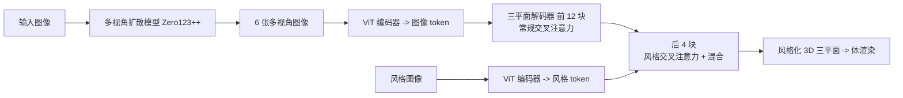

## 一句话总结

本文发现大型重建模型（LRM）中后段的交叉注意力块隐式编码了物体的外观特征，只需把参考风格图像的注意力特征注入这些块，就能在无需任何训练或测试时优化的前提下，把风格图的视觉风格迁移到单图重建出的 3D 物体上，并保持多视角一致性。

## 研究背景

随着文本或图像驱动的 3D 生成方法快速成熟，用户希望对生成过程有更多控制，其中一项典型需求就是"外观风格化"：给定一张参考风格图（例如莫奈的画作），把它的视觉风格施加到生成的 3D 物体上，同时从任意视角看都要保持连贯与美观。与 2D 不同，3D 风格化必须考虑外观和纹理细节如何随底层曲面结构变化，才能既保留参考图的视觉神韵，又生成多视角一致的结果。

在 3D 风格化领域，传统做法多以辐射场（NeRF）为底层表示：给定多视角图像和一张风格图，通过复杂的逐物体优化来渲染并施加风格。这类方法效果不错，但属于逐物体优化，计算昂贵且耗时，难以与追求交互式生成与风格化的 3D 生成器配合使用。

作者从 2D 风格化的发展中获得启发。以 Stable Diffusion、DALL·E 为代表的大型图像生成模型不仅能高质量生成图像，还具备复杂的风格迁移能力，其核心是注意力机制，能聚焦于最相关的内容与风格特征。既然 2D 图像生成器天然擅长风格迁移，作者提出疑问：在同样采用注意力机制的 3D 重建模型中，是否也涌现出类似能力？

## 方法

### 整体框架

方法建立在 InstantMesh 之上——一个从单张图像重建 3D 物体的框架，由多视角生成器和大型重建模型两部分组成。给定一张输入图像，先用多视角扩散模型 Zero123++ 在预定义视点合成 6 张新视角图像；再把这些视角送入基于 LRM 框架的重建器，生成以三平面（triplane）表示的 3D 物体。重建器是一个 16 层的大型 Transformer，每层包含交叉注意力、自注意力和 MLP 块：三平面特征在自注意力中相互关注，而在交叉注意力中，键和值来自多视角图像的 ViT 嵌入（图像 token），查询来自三平面特征。

作者的核心假设是：较早的 Transformer 块主要决定几何（形状与结构），较后的块则聚焦重建物体的外观。因此，只需在后段交叉注意力块中引入第二组来自参考风格图的键值特征，即可实现风格化。

### 关键设计

**注意力注入与混合。** 给定参考风格图，先用与多视角图像相同的 ViT 编码器对其编码。在后段交叉注意力模块中，分别计算相对于原始多视角图像和风格图像的注意力输出，再按混合权重 $$\alpha$$ 融合：

$$\text{Attention}(Q,K,V)=\text{softmax}\left(\frac{Q_{in}K_{style}^{T}}{\sqrt{d_k}}\right)V_{style}\cdot\alpha+\text{softmax}\left(\frac{Q_{in}K_{content}^{T}}{\sqrt{d_k}}\right)V_{content}\cdot(1-\alpha)$$

其中 $$\alpha$$ 控制风格化程度，$$K_{content},V_{content}$$ 来自原始多视角图像，$$K_{style},V_{style}$$ 来自风格图像。这样三平面解码器就能把 3D 特征与参考图的视觉风格元素关联起来。

**只在后段注入。** 仅在后段块启用基于风格的交叉注意力，可确保模型先建立稳固的几何基础，再逐步融入风格细节。消融显示，若把风格特征注入越多的块，其内容会开始干扰底层 3D 几何、导致结果变差；这与 2D 扩散风格迁移方法"只在后段块注入风格"的观察一致。基于 Chamfer 距离的层数消融，作者最终选择只在最后 4 个 Transformer 块启用风格交叉注意力。

**混合权重取舍。** 对某些物体，精细细节更多体现在外观而非几何（如猫头鹰的眼睛），此时不宜用风格注意力完全覆盖，而应与原图注意力按 $$\alpha$$ 混合以保留细节。实验中经验性地取 $$\alpha=0.8$$ 以取得较好平衡。作者还对比了两种替代设计：把原图与风格图 token 拼接后一起做交叉注意力（风格无法一致地迁移到整个物体），以及先把两者的 ViT 嵌入平均混合再做交叉注意力（导致 3D 结构退化、重建变模糊）；分别计算再混合注意力输出的方案效果最佳。

## 实验结果

作者在 Google Scanned Objects（GSO）、OmniObject3D 以及文本生成的物体上评估，风格参考图来自 Wikiart 和文本生成。定量评估用 15 个 3D 物体，各施加 2 张随机风格图。风格保真度用 VGG19 特征的 Gram 矩阵 L2 距离衡量（越低越好），内容保真度用归一化到单位立方体后、表面均匀采样 16K 点计算的 Chamfer 距离（CD）与 F-Score（阈值 0.2）衡量。运行时在单张 NVIDIA A100 GPU 上测量。

| 方法 | 风格保真度 ↓ | CD ↓ | F-Score ↑ | 运行时 |
| --- | --- | --- | --- | --- |
| Single - InstantStyle | 41.915 | 0.01380 | 0.9634 | 5.9 min |
| Single - IPAdapter | 38.550 | 0.01567 | 0.9476 | 3.2 min |
| Single - StyleAlign | 45.346 | 0.02402 | 0.91915 | 2.8 min |
| Single - Cross-Image Attn | 39.721 | 0.03042 | 0.90508 | 4.3 min |
| Single - AdaIN | 37.980 | 0.04331 | 0.83786 | 2.8 min |
| Single - Attention Interpolation | 40.304 | 0.07630 | 0.73042 | 6 min |
| Multi - InstantStyle | 40.393 | 0.01366 | 0.9669 | 4.7 min |
| Multi - IPAdapter | 37.627 | 0.01366 | 0.9580 | 3.2 min |
| Multi - StyleAlign | 44.456 | 0.00744 | 0.95635 | 2.8 min |
| Multi - Cross-Image Attn | 44.834 | 0.02006 | 0.9333 | 4.3 min |
| Multi - AdaIN | 37.172 | 0.00692 | 0.96030 | 2.8 min |
| Multi - Attention Interpolation | 45.353 | 0.01688 | 0.94476 | 6 min |
| ARF | 37.901 | 0.00060 | 0.99999 | 1.5 h |
| StyleRF | 42.960 | 0.00072 | 0.99974 | 2 h |
| EASI-TEX | 44.630 | 0.00032 | 0.99999 | 37 min |
| Surface-aware Mesh | 43.393 | 0.00032 | 1.0 | 23 min |
| Ours | 34.584 | 0.00594 | 0.9755 | 35.5 sec |

本文方法取得最佳风格保真度（34.584），显著优于其他方案；内容保真度上与其他 3D 方法基本持平，能保持物体的 3D 形态（NeRF 类方法 CD 略优，但需要多视角图像集，且 EASI-Tex 与 Surface-aware Mesh 因被直接提供真值几何、只负责生成纹理，故几何"完美"）。运行时方面，本文方法仅需 35.5 秒，远快于图像风格化基线（分钟级）与 NeRF 优化方法（1.5～2 小时）。此外，27 人参与的用户研究中，本文方法在整体质量（62.99%）、风格保真度（67.81%）、内容保真度（59.27%）三项上均以显著优势被优先选择。

## 亮点与局限

亮点：首次揭示并利用大型重建模型中注意力机制对几何与外观的隐式解耦，提出一个无需训练、无需逐物体优化的 3D 风格化方法，35.5 秒即可完成、适合交互式与实时应用；通过混合权重 $$\alpha$$ 可控制风格化强度，兼顾风格迁移与内容细节保留；在风格保真度和用户偏好上全面领先，同时保持了 3D 几何一致性。

局限：风格化过程可能抽象或简化内容纹理中较精细的细节；方法当前性能受底层 InstantMesh 重建质量制约，但会随大型重建模型的进步而受益；主要保持几何不变，如何为特定风格改变高频几何细节以提升合理性仍待探索；目前只在有预训练模型的 InstantMesh 上应用，扩展到重建 3D 高斯泼溅的更新方法是有前景的方向。

## 延伸思考

这项工作最有启发性的一点，是把"注意力块的功能分工"当作可直接利用的先验：无需重新训练，仅凭"前段管几何、后段管外观"的经验性划分，就能在推理时通过特征注入实现可控编辑。这与 2D 扩散模型中"只在后段注入风格"的发现相互印证，暗示大型视觉模型内部普遍存在内容与风格的层级化解耦，这类"探针 + 注入"范式或许能推广到更多可控生成任务（如材质替换、局部编辑）。另一方面，方法把风格化建立在单图重建管线之上，其上限与鲁棒性都被底层重建器锁定；一旦几何与外观的解耦不再干净（例如更强的高斯泼溅重建器），后段注入是否仍然奏效值得验证。若能进一步把风格同时作用于高频几何而非仅外观，才可能实现真正"形随风格而变"的 3D 风格化。
