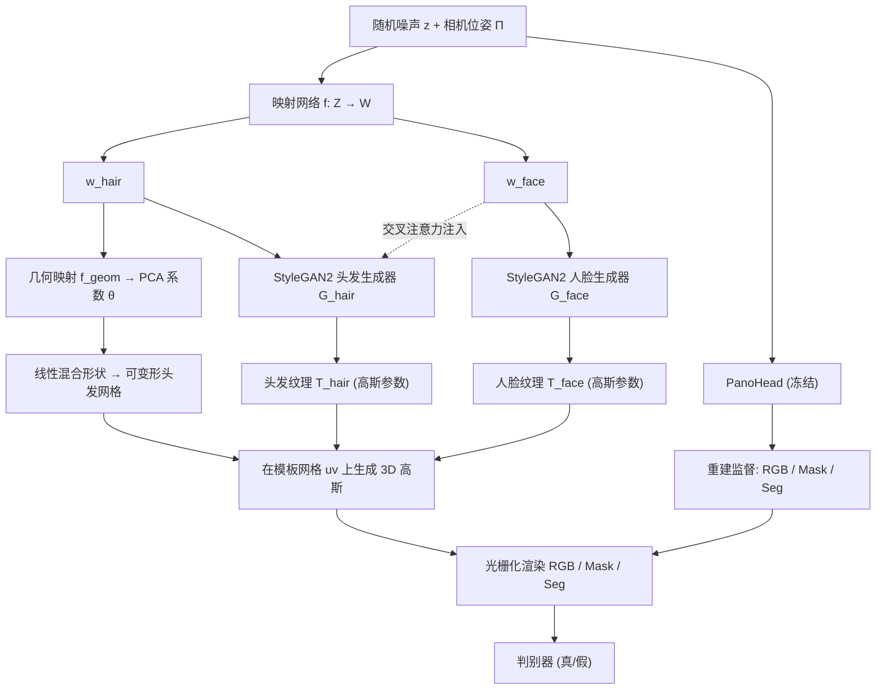

## 一句话总结

3DGH 提出一个把头发与人脸解耦的无条件 3D 头部生成模型，用"模板网格 + 3D 高斯泼溅 + 可变形头发几何"的数据表示，配合双分支 StyleGAN2 生成器与交叉注意力，既能保证头发/人脸的清晰分离，又能建模两者的真实相关性，从而支持保持多视角一致性的 3D 发型编辑。

## 研究背景

高质量 3D 人头生成在数字化身、远程呈现、沉浸式游戏等场景有广泛需求。近年主流做法是把几何感知表示（如 tri-plane、NeRF）与成熟的 2D 图像生成模型结合来做 3D 头部生成，如 EG3D、PanoHead、SphereHead、GGHead 等。

但这些方法普遍忽视了一个关键差异：人脸即便身份不同，眼睛、嘴巴等面部特征仍存在共性；而头发的多样性远大于人脸，短发到长发、蓬松到贴服差异巨大。绝大多数已有 3D 头部生成模型把头发和人脸的建模纠缠在一起，因此难以支持发型迁移这类更细粒度的编辑任务。一些 2D 或 tri-plane 编辑方法要么在 3D 应用中出现视角不一致，要么在建模 3D 头发（尤其是后脑区域）时力不从心。

要训练一个支持"可组合"的生成模型，作者指出需要同时解决两个问题：其一是保证头发与人脸的清晰分离以实现解耦；其二是尊重两者的内在相关性，因为现实中男性面孔多与短发相关，女性面孔多与中长发相关。3DGH 正是围绕这两点展开设计。

## 方法

整体框架把 3D 高斯泼溅与 3D GAN 结合，包含三大组件：融入可变形头发几何的数据表示、同时建模分离与相关的双分支网络、以及为稳定训练与促进头发-人脸分离而设计的训练目标。

关键设计如下。

**基于模板的 3D 高斯泼溅。** 每个高斯基元由 14 维参数描述 $$g_i = \{p_i, q_i, s_i, c_i, o_i\} \in \mathbb{R}^{14}$$ 分别是中心位置 $$p_i \in \mathbb{R}^3$$、四元数旋转 $$q_i \in \mathbb{R}^4$$、各轴缩放 $$s_i \in \mathbb{R}^3$$、颜色 $$c_i \in \mathbb{R}^3$$ 与不透明度 $$o_i \in \mathbb{R}$$。为克服原始 3DGS 的无结构性，作者把每个高斯与带 uv 布局的模板网格绑定，将高斯组织成 2D 纹理图 $$T \in \mathbb{R}^{256 \times 256 \times 14}$$，每个纹素存一个高斯的参数。头发与人脸各用一套网格和纹理，最终渲染约 13.1 万个高斯。

**可变形头发几何。** 为覆盖发型的巨大几何差异，作者从多视角面部采集数据拟合头发几何，通过可微渲染分割图并对标定分割计算 $$L_1$$ 损失来求解形变。为抑制翻折、折叠等瑕疵，借鉴 Neural Jacobian Fields，优化雅可比 $$J \in \mathbb{R}^{F \times 3 \times 3}$$ 与质心平移 $$t$$ 而非直接优化顶点偏移：

$$J^*, t^* = \arg\min_{J,t} \| R(\text{PoissonSolve}(J) + t; \Pi) - I_{seg} \|_1$$

优化通常 500 步内收敛，共收集 283 个头发网格，再用数字人常用的 PCA 求出线性混合形状，任意变形头发网格由下式生成：

$$M(\vec{\theta}; X) = \bar{M} + \sigma \sum_{n=1}^{\vert \vec{\theta}\vert } \theta_n X_n$$

其中 $$X$$ 为形状位移的正交主成分，$$\bar{M}$$ 与 $$\sigma$$ 为均值形状和标准差。混合形状系数数量设为 $$\vert \vec{\theta}\vert  = 32$$，兼顾平滑与变化覆盖。

**双分支 3D GAN。** 采用 PanoHead 作为训练数据生成器，按 StyleGAN2 范式训练。映射网络把 $$z, \Pi$$ 映射到 $$w_{hair}, w_{face}$$；头发分支额外经几何映射网络 $$f_{geom}$$ 得到混合形状系数。两个 StyleGAN 生成器输出头发/人脸纹理，生成高斯后与模板网格绑定并联合渲染出 RGB 与 mask，采用类似 EG3D 的双判别方法。

**头发-人脸相关性。** 用交叉注意力层把 $$w_{face}$$ 注入 $$G_{hair}$$ 的每个合成块，在不同尺度影响头发生成：

$$x_l = \text{Conv}(x_l), \quad x_{l+1} = x_l + \text{CrossAttention}(Q = x_l, K = V = w_{face}), \quad y_{l+1} = \text{Upsample}(y_l) + \text{ToRGB}(x_{l+1})$$

借鉴无分类器引导（CFG），训练时以 10% 概率丢弃条件 $$w_{face}$$（置零），推理时按因子 $$\omega$$ 混合条件与无条件特征：

$$\tilde{x}_l = \omega x_l + (1 - \omega) x_l^{\emptyset}$$

从而额外提供一个控制头发-人脸相关强度的旋钮。

**训练目标。** 最终损失是对抗损失、重建损失与多项正则的加权和：

$$L = L_{adv} + \lambda_{rgb} L_{rgb} + \lambda_{mask} L_{mask} + \lambda_{seg} L_{seg} + \lambda_{seg}^{mesh} L_{seg}^{mesh} + \lambda_{reg}^{pos} L_{reg}^{pos} + \lambda_{reg}^{scale} L_{reg}^{scale} + \lambda_{reg}^{uv} L_{reg}^{uv}$$

其中分割损失对高斯渲染的分割图用交叉熵（因为 $$\alpha$$ 混合会改变边界值，标量标签易误标），对网格分割图用 $$L_1$$。位置正则把高斯约束在网格表面薄层内（人脸阈值 $$\gamma = 40$$mm，头发因网格本身可变形而降为 $$20$$mm），缩放正则把尺度限制在 $$[s_{min}, s_{max}] = [0.2, 5]$$，另用 GGHead 的 uv 全变差损失防止背部高斯穿透到正面。权重设为 $$\lambda_{rgb} = 10, \lambda_{mask} = 10, \lambda_{seg} = 1, \lambda_{seg}^{mesh} = 100, \lambda_{reg}^{pos} = 0.1, \lambda_{reg}^{scale} = 1, \lambda_{reg}^{uv} = 1$$。模型在 2500 万张图像上训练完成。

## 实验结果

**生成质量（FID）。** 由于 PanoHead 是训练数据生成器，其渲染被视为真实样本，在 5 万真/假样本上计算 FID。结果为：back 9.86、front 5.47、all 6.55，三项均小于 10，说明生成质量与 PanoHead 相当。

**多视角一致性（ID，越高越好）。** 用 AdaFace 计算不同相机位姿下配对图像的平均余弦相似度：EG3D 0.678、GGHead 0.683、SphereHead 0.581、本文 0.690。3DGH 取得最佳一致性，因为 EG3D 与 GGHead 在大位姿下表现挣扎，SphereHead 的 2D 超分网络会引入瑕疵。

**消融实验（FID / FID-swap，均越低越好，FID-swap 通过随机互换 5 万个 $$w_{hair}, w_{face}$$ 评估组合真实性）。**

| 分割监督 | 头发几何 | 头发-人脸相关 | FID | FID-swap |
|---|---|---|---|---|
| Seg. in D | ✗ | cross attn. | 296.97 | 296.89 |
| w/o Seg. loss | ✗ | cross attn. | 10.56 | 31.97 |
| w/ Seg. loss | ✗ | cross attn. | 12.15 | 34.18 |
| w/ Seg. loss | ✓ | – | 12.11 | 29.99 |
| w/ Seg. loss | ✓ | concat. | 10.30 | 14.95 |
| w/ Seg. loss | ✓ | cross attn. | 7.67 | 20.56 |

要点：把分割图直接喂给判别器会因连续浮点值与离散标签的量化差异导致早期模式崩溃（FID 高达约 297）；去掉分割损失仍能得到合理结果，加入后能促进更清晰的头发-人脸分离；可变形头发几何能提升整体质量（固定几何会导致高斯为表达发型而大幅偏移，产生漂浮高斯）；相关性模块上，交叉注意力取得最低 FID（7.67），虽然拼接方式 FID-swap 更低，但会对 $$w_{face}$$ 产生过强依赖、降低固定人脸时的多样性。最后一行为最终设计，在质量与多样性间达到最佳平衡。

**定性能力。** 支持 360° 逼真渲染；能产出细粒度的头发-人脸分割图和平滑变形的头发几何；通过简单交换 $$w_{hair}$$ 即可迁移头发几何与外观，且天然保持多视角一致（相比 HairFastGAN 等 2D 方法需多步骤多模块）；CFG 因子 $$\omega$$ 增大时，迁移到男性面孔上的发型会逐渐变短以符合真实分布；隐空间线性插值可对头发与人脸独立进行，展现解耦控制与平滑语义过渡。

## 亮点与局限

亮点：

- 首次在 Gaussian-based 3D GAN 中实现头发与人脸的可组合生成，用两套独立模板网格分别建模，解耦彻底。
- 提出可变形头发几何（PCA 线性混合形状），显式吸收发型的几何多样性，避免用大幅偏移的高斯硬凑，从根本上改善质量。
- 用交叉注意力 + CFG 建模头发-人脸相关性，既尊重现实分布（性别/发型关联），又给编辑提供可调旋钮。

局限：

- 表达力受训练数据（PanoHead 合成图）限制，与真实野外图像存在域差，发髻、辫子等发型难以生成。
- 对占据大量正面视野的长发，后视角偶有渲染瑕疵，源于生成器同时以隐码和相机位姿为条件，位姿差异大时质量下降（PanoHead、SphereHead 同样存在）。
- 头发区域会因高斯基元被拉伸缩放以表达细发丝而产生空洞瑕疵；增加高斯数可缓解但会推高计算成本。
- 交叉注意力的相关性分析主要覆盖性别这一主导因素，对族裔等其他相关性覆盖不足（受数据集分布所限）。

## 延伸思考

3DGH 的核心洞见是"头发与人脸具有本质不同的多样性尺度"，因此不该用同一套纠缠表示去建模。这个观点其实可推广到更广的可组合生成：任何由"共性主体 + 高变异附属物"构成的对象（如身体与服饰、家具与软装），都可能受益于"分离表示 + 相关性建模"的双轨设计。

值得注意的是，模型完全依赖 PanoHead 的合成渲染做监督，本质上是在"蒸馏 + 解耦"一个已有 3D GAN 的知识，这既带来了标定精确、正背视角齐全的便利，也继承了源模型的域差与偏置。后续若能引入 RenderMe-360 等真实多视角数据混合训练，或用更强的相机位姿条件架构，有望突破当前发型覆盖与后视瑕疵的天花板。此外，CFG 式的相关性控制把"可编辑性"与"真实性"这对常被对立看待的目标统一在一个连续旋钮上，是本文在编辑方法论上一个有启发的贡献。最后，作者提到将框架扩展到可动画化身，这是把静态生成模型推向表情/动作驱动的自然方向，可变形头发几何在动态发丝运动下的表现将是关键考验。
