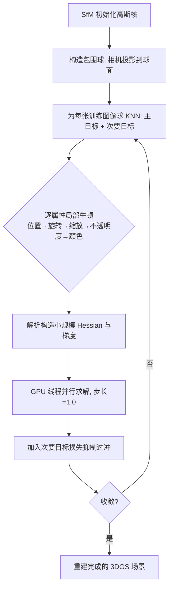

## 一句话总结

本文把 3D Gaussian Splatting 的训练从一阶随机梯度下降换成近二阶收敛的"局部牛顿法"：利用高斯核各属性之间弱耦合的特性，为每个属性分组解析地构造并求解小规模牛顿系统，并借助输入图像间的空间关系抑制过冲，最终在保持甚至超越质量的前提下把训练迭代数减少一个数量级、整体训练提速 5 到 10 倍。

## 研究背景

- 领域现状：3DGS 用一组显式的高斯核表达三维场景，靠光栅化 + tile-splatting 生成新视角，兼顾高质量与实时渲染，已成为新视角合成与三维重建的主流方案。作为学习式方法，它的训练沿用了通用深度学习那套随机梯度下降（SGD）流程。
- 核心痛点：SGD 至多只有线性收敛，3DGS 往往需要上万次迭代、即便有 GPU 加速也要数十分钟才能训练好一个场景。已有加速工作大多聚焦于压缩高斯数量、优化光栅化管线，训练提速只是"副产品"；直接照搬深度学习训练范式对 3DGS 而言既不高效也不贴合其数值特性。
- 本文 idea：3DGS 训练与一般神经网络训练存在本质差异——神经网络参数在计算图上强双向耦合，而高斯核的各属性之间只是弱耦合（如先定好 $$x$$ 方向缩放再调 $$y$$、$$z$$ 方向即可，颜色也只影响局部少量像素）。既然耦合弱，就可以把高维非线性问题拆成一系列小规模的局部二阶优化，从而引入牛顿法的近二阶收敛而不必求解全局 Hessian。

## 方法

### 整体框架

方法保留 3DGS 的场景表达（每个核含位置 $$\boldsymbol{p}_k$$、不透明度 $$\sigma_k$$、旋转四元数 $$\boldsymbol{q}_k$$、缩放 $$\boldsymbol{s}_k$$、球谐颜色 $$\boldsymbol{c}_k$$），但把"用全局梯度一起更新所有参数"换成"逐属性、逐核的局部牛顿求解"。训练时对当前输入图像，按位置 → 旋转 → 缩放 → 不透明度 → 颜色的顺序，为每一组属性解析构造局部 Hessian 与梯度、以默认步长 1.0 求解一个小系统，所有核以 Jacobi 方式在 GPU 线程上并行更新。同时用当前图像在球面上的最近邻图像（次要目标）近似全局损失，抑制随机训练的过冲。

### 关键设计

Hessian 的弱耦合观察与局部牛顿：可视化整张图像的训练 Hessian 会发现数值只在稀疏、局部的位置出现"尖峰"，说明核参数之间的影响并非全局；求解庞大的全局牛顿系统带来的收敛收益与其算力代价不成正比。于是本文不解全局系统，而是对每组属性 $$\boldsymbol{y}_k$$ 做局部求解 $$\Delta \boldsymbol{y}_k = -\left(\frac{\partial^2 L_t}{\partial \boldsymbol{y}_k^2}\right)^{-1}\left(\frac{\partial L_t}{\partial \boldsymbol{y}_k}\right)^{\top}$$ 。因为每个局部系统自由度很少，可以为每个 GPU 线程低成本地解析装配 Hessian 与梯度；牛顿法自带步长为 1、无需线搜索。

按属性拆分求解并各自降秩：损失同时含 L2 项与 SSIM 项，作者给出了两者对光栅化颜色的一二阶导数解析式，并针对每种属性做了专门处理以避免秩亏或冗余：位置只允许在垂直于视线方向的平面内调整，用一个基矩阵 $$\boldsymbol{U}_k$$ 把三维位置降到二维 $$\Delta \boldsymbol{p}_k = \boldsymbol{U}_k \Delta \boldsymbol{v}_k$$ ；缩放只关心它如何改变投影二维协方差的两个特征值，从而消除缩放与旋转组合的零空间；旋转把轴约束到视线方向 $$\boldsymbol{r}_k$$ 上、只优化一个角度并用乘法更新 $$\boldsymbol{q} \leftarrow \Delta\boldsymbol{q}\cdot\boldsymbol{q}$$ ；不透明度用内点法加对数障碍项把 $$\sigma_k$$ 约束在 $$[0,1)$$ 内；颜色因位置已先定、球谐基视为常量，$$\tilde{\boldsymbol{c}}_k = \boldsymbol{B}_k \boldsymbol{c}_k$$ 退化为线性、二阶导为零。

优化顺序有讲究：位置必须最先优化——核没摆对位置，相关像素是空的，谈不上调颜色；形状（旋转、缩放）优先于颜色。实验证实，一旦位置定好，旋转与缩放的先后、以及不透明度与颜色的先后都几乎不影响结果（它们已解耦）；但若先优化颜色，训练同样会二阶收敛，却收敛到更差的局部极小。

用次要目标抑制过冲：随机训练只看当前图像 $$I_t$$，二阶大步长更容易过冲——降低 $$L_t$$ 的同时可能抬高其他图像的损失，使全局损失反而变差。作者观察到与 $$I_t$$ 相关的"互补损失"主要集中在视角相近的邻居图像上，于是把包围球上球面距离最近的 $$K$$ 个图像作为次要目标 $$\mathcal{N}_t$$，把训练改写为 $$\min_{\boldsymbol{y}_k}\left(L_t + \tilde{L}_t\right),\ \tilde{L}_t = \sum_{j\in\mathcal{N}_t} L_j$$ 。次要目标的 Hessian/梯度更像一个自适应预条件子，可降采样计算，代价很小却能让全局损失平稳收敛、几乎无振荡，也就无需再靠学习率来削步长。实现中取 $$K=3$$ 以平衡收敛与效率。

## 实验结果

实验在 Intel i7-12700 + Nvidia RTX 3090 上用 C++/CUDA 实现，数据集覆盖 Mip-NeRF360 全部场景、Tanks & Temples 两个场景与 Deep Blending 两个场景，均采用标准 3DGS 的指标与光栅化管线（未叠加快速光栅化技巧，以免混淆）。收敛曲线显示，本文一次逐属性牛顿迭代降低损失的效果常胜过 100 次梯度下降迭代，而单次迭代耗时只比一次梯度下降慢约 20% 到 25%。

下表为主实验中 Mip-NeRF360 数据集上的对比（训练时间括号内为相对原版 3DGS 的加速比，数值忠于原文）：

| 训练算法 | SSIM↑ | PSNR↑ | LPIPS↓ | 训练时间/秒↓ |
| --- | --- | --- | --- | --- |
| Vanilla 3DGS | 0.871 | 29.18 | 0.183 | 1307 |
| AdR-Gaussian | 0.850 | 28.50 | 0.220 | 783 |
| EAGLES | 0.810 | 28.64 | 0.192 | 2163 |
| Taming 3DGS | 0.878 | 29.48 | 0.171 | 781 |
| 3DGS-LM | 0.813 | 27.39 | 0.221 | 972 |
| 本文 | 0.876 | 29.42 | 0.168 | 256（5.1×） |

在 Tanks & Temples 上本文为 0.871 / 24.43 / 0.154、训练 131 秒（5.3×）；在 Deep Blending 上为 0.927 / 30.43 / 0.228、训练 189 秒（6.4×）——两者的质量指标均领先各基线。整体来看，本文在大幅缩短训练时间的同时保持了同档甚至更优的重建质量。AdR-Gaussian、EAGLES 主要加速光栅化，与本文正交、可叠加；3DGS-LM 用全局 Levenberg-Marquardt（伪二阶）替换 SGD，但无法利用局部非线性，被本文明显拉开；Taming 3DGS 仍是一阶方法、靠减少核数在受限硬件上见长，速度仍慢于本文。

消融方面：优化顺序实验验证位置须先于颜色，否则收敛到更差极小；次要目标规模实验（$$\lvert\mathcal{N}_t\rvert = 0, 3, 8$$）显示 $$\lvert\mathcal{N}_t\rvert=0$$ 时二阶方法过冲甚至比原版更严重，取小的 $$K$$ 即可显著抑制过冲，$$K=8$$ 时几乎无振荡但计算更贵，故实现折中取 $$K=3$$。

## 亮点与局限

亮点：

- 抓住 3DGS 与通用深度学习的本质差异——核属性弱耦合，把高维全局牛顿问题拆成一批小规模局部牛顿求解，首次让近二阶收敛在 3DGS 训练中真正可行且高效。
- 为位置、旋转、缩放、不透明度、颜色各自设计了降秩/约束方案（平面位移、特征值空间、轴对齐旋转、对数障碍、线性颜色），解析装配 Hessian、无需线搜索、默认步长 1.0，天然适合 GPU 并行。
- 用"球面最近邻图像作为次要目标"这一低成本手段近似全局损失，稳住二阶训练的过冲，摆脱了对学习率调参的依赖。
- 迭代数减少约一个数量级、整体训练提速 5 到 10 倍，把复杂场景重建从"分钟级"压到"秒级"，且质量不降。

局限：

- 与原版 3DGS 一样只在静态场景上验证；动态场景中核的运动会产生随时间变化的耦合，可能损害训练效果。
- 位置 Hessian 的计算是当前主要瓶颈；作者认为可考虑对不同属性改用高斯牛顿或拟牛顿以进一步提速。
- 核的排序仍有优化空间，可引入 AABB、空间哈希等辅助结构加速。

## 延伸思考

这项工作的价值不只在于"更快训练 3DGS"，更在于它示范了一种方法论：当问题的参数耦合结构是稀疏、局部的时，与其套用通用的一阶随机优化，不如顺着问题本身的数值结构把它拆成可并行的局部二阶子问题。这一思路对其他显式、可解释的场景表达（如点云、体素、面元）同样具有借鉴意义。次要目标近似全局损失的做法，本质上是用"空间上邻近的少量样本"去廉价估计全局曲率信息以稳住大步长更新，这与更广义的方差缩减/预条件思想相通，值得在其他随机二阶优化场景中复用。顺着作者指出的方向，把局部牛顿替换为局部高斯牛顿或拟牛顿、并引入空间加速结构，或把方法推广到动态四维场景，都是自然且有潜力的后续课题。
