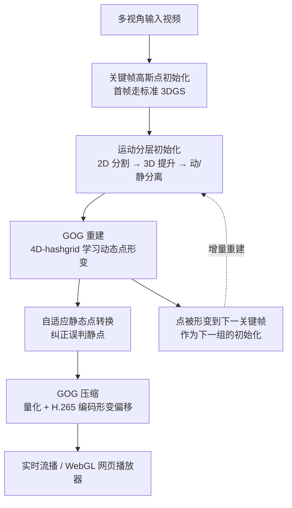

## 一句话总结

本文提出 4D 高斯视频（4DGV）：借鉴视频编码里的 GOP（图像组）思想，把体积视频切成一组组 "高斯组"（Group of Gaussians, GOG），再通过运动分层把每组高斯点分成"静态点"（跨组共享、只存一次）和"动态点"（用随时间变化的形变偏移建模运动），配合渐进式采帧、自适应静/动转换与针对形变偏移的 H.265 压缩，在质量领先的同时把每秒模型体积压到 1~4MB，实现可在浏览器实时流播的体积视频。

## 研究背景

- 领域现状：体积视频要在自由视角下提供沉浸式体验，既要高质量实时渲染，又要模型足够小以便网络传输。现有方案多基于动态 NeRF 或 3D 高斯泼溅（3DGS），后者通过让高斯点属性随时间演化（隐式形变场或切片 4D 高斯核）来处理动态场景。
- 核心痛点：一是可扩展性受限——隐式神经形变场的表达能力被固定模型尺寸束缚，难以覆盖长视频和复杂运动；二是存储暴涨——3DGS 每点带大量显式属性，扩展到时间维度需要更多点，重建几秒场景就要数 GB，无法满足在线流播的存储与带宽约束。此外，把 3DGS 直接扩展成流式表示时，数据组织与视频压缩的组结构不兼容，且常伴随组切换时的闪烁伪影。
- 本文 idea：把 MPEG 标准里的 GOP 结构作为压缩与传输的基本单元引入体积视频。分组一方面把内存与计算复杂度控制在可管理范围内，提供长视频的可扩展方案；另一方面把复杂时序运动拆成分段函数，降低运动建模难度，并可在每组关键帧重新调整高斯点分布以抑制运动跟踪的误差累积。同时观察到场景中大部分区域是静态的，于是用运动分层把动/静点分离，避免为静态点学习形变，省下大量计算与存储。

## 方法

### 整体框架

系统输入多视角、变长的视频流，每 30 帧设一个关键帧划分帧组。每个帧组重建为一个高斯组 $$\text{GOG}_k=\{P^s_k, P^d_k, D_k\}$$，其中 $$P^s_k$$、$$P^d_k$$ 分别是静态点集与动态点集，$$D_k$$ 是动态点的形变偏移集合。多阶段流水线依次为：

关键帧上做高斯点初始化与运动分层，得到带动/静分离的初始点云；随后动态点 $$P^d_k$$ 被形变以建模组内运动。重建时冻结静态点属性并跨组共享，动态点则照常优化、裁剪、克隆。上一组的点被形变到下一关键帧作为下一组动态点的初始化，实现整段视频的增量重建，显著降低每组初始化时间，利于长视频重建。

### 关键设计一：自适应运动分层

- **2D 运动分割**：多视角相机静止，因此光流小或为 0 即判为静态。先用 RAFT 光流估计相邻关键帧间的流场，流长超过阈值 $$\lambda_{raft}$$ 判为动态，得到 RAFT 标签。但 RAFT 标签会漏掉缓慢移动的部件，导致同一物体一部分静一部分动、产生撕裂伪影。于是选一个视角采样点去查询 SAM2 得到物体级标签做补全，并借助 SAM2 的记忆注意力机制把该标签传播到所有视角，得到多视一致的标签。最终标签由 RAFT 标签与 SAM 标签相加得到。
- **3D 提升**：给第 $$i$$ 个高斯点赋一个单通道运动标签 $$m_i$$，通过与颜色相同的 alpha 混合渲染成 2D 图 $$\tilde M=\sum_{i=0}^{n}T_i\alpha_i m_i$$，用可微光栅化优化，损失为：

$$L_m=\sum_{v\in V}\vert \tilde M_v-M_v\vert +\lambda^{nn}_{seg}\sum_{i\in P}\vert m_i-m_{nn}\vert +\lambda^{dyn}_{seg}\sum_{i\in P}\vert m_i-1\vert $$

三项分别是标签监督、邻域相似性（抗噪）、鼓励动态标签（多视标签不一致时有效）。

- **自适应静态点转换**：由于静态点属性在 GOG 重建中被冻结，静态物体上的外观变化（如移动的阴影、视角相关的反射）无法被捕捉。因此在优化中每 100 次迭代做一次转换：若某静态点的屏幕空间位置梯度超过 $$\lambda^{grad}_{adp}$$，或其最近邻中动态点比例超过 $$\lambda^{nn}_{adp}$$，就把它转成动态点。这一策略还改善了新出现物体和先前被遮挡区域的重建。

### 关键设计二：GOG 重建

只对动态点的规范空间坐标 $$P^d$$ 与形变偏移 $$D$$ 联合优化。形变只含位置偏移 $$\Delta x$$ 和旋转偏移 $$\Delta q$$（实验发现让尺度、不透明度随时间变化无增益）：

$$x_{i,t}=x_i+\Delta x_{i,t},\qquad q_{i,t}=q_i\cdot\Delta q_{i,t}$$

形变场用 **4D-hashgrid** 参数化（1 个空间 $$xyz$$ + 3 个时空 $$xyt,xzt,yzt$$ 网格），比 MLP 收敛快、比 K-Planes 表达力强；$$t$$ 轴用较低分辨率（形变时序平滑）。四个网格特征拼接后经多头 tiny MLP 解码成偏移。损失包含光度损失 $$L_{rgb}$$、类刚性 ARAP 损失 $$L_{arap}$$（鼓励邻近点共享旋转/平移偏移并保持局部长度）和时间平滑损失 $$L_{temp}$$（鼓励位置与旋转的匀速运动）：

$$L=L_{rgb}+\lambda_{arap}L_{arap}+\lambda_{temp}L_{temp}$$

- **渐进式采帧**：在优化前 $$N$$ 次迭代中，从靠近关键帧的帧逐渐扩展到较远的帧采样。第 $$n$$ 次迭代采到时刻 $$t$$ 的概率为：

$$p(n,t)=\frac{p'(n,t)}{\sum_{\tau=0}^{T}p'(n,\tau)},\qquad p'(n,t)=\begin{cases}1 & t\le\lfloor T\cdot n/N\rfloor\\0 & \text{else}\end{cases}$$

先热身形变场学习、再学远处帧，避免早期对初始化点预测长程运动的困难，大幅改善大运动物体的渲染质量。$$N$$ 设为总迭代数的一半。

### 关键设计三：GOG 压缩

- **高斯点量化**：对 $$\{q,o,s,c_{base}\}$$ 做位量化（$$q,o,s$$ 用 8 bit，尺度 $$s$$ 用 12 bit 在 $$[2^{-n\_bit},1]$$ 范围离散化）。3 阶 SH 有 48 个系数，其中高阶系数 $$c_{rest}\in\mathbb{R}^{45}$$ 占颜色存储的 94% 却只贡献约 15% 的出射辐射能量，故对其做向量量化，聚成大小 $$N_{vq}=1024$$ 的小码本，每点存一个整数索引。
- **形变编码**：把随时间变化的偏移用 Morton 排序映射到 2D 偏移图，再用 H.265 编码。$$\Delta x$$ 用 16 bit 量化后拆成高/低两张 8-bit RGB 图，$$\Delta q$$ 各通道用 8-bit 灰度图拼接。最终压成三条 8-bit MP4 轨道：高位 $$\Delta x$$（无损）、低位 $$\Delta x$$、拼接的 $$\Delta q$$（后两者用 CRF=20）。
- **实时渲染**：把动态点形变到对应时刻后与静态点拼接渲染。为消除组切换的突变，组间设重叠窗口，动态点不透明度线性淡出/淡入。还实现了基于 WebGL 的在线网页播放器，可在 PC、平板、手机上实时流播。

## 实验结果

- **主对比（MeetRoom / Technicolor / DeskGames）**：在 MeetRoom 上本文 PSNR 32.31、SSIM 0.957、LPIPS 0.173，模型仅 19.2 MB，全面领先（对比 4DGS 31.94/2196MB、Ex4DGS 31.03/75MB、3DGStream 30.88/2287MB）。DeskGames 上 PSNR 30.89、SSIM 0.920、体积 34.5 MB，同样最优。Technicolor 上 PSNR 31.77、体积 40.2 MB，位列第二（STG 为 32.35 但体积 436 MB）。
- **Neu3DV（对比 14 个基线）**：本文 PSNR 32.55，模型仅 21 MB，重建 73 分钟，渲染 185 FPS。相比之下 STG 32.05/200MB、Ex4DGS 32.11/115MB、4DGS 32.01、3DGStream 31.67/2430MB、MSTH 32.37/135MB，本文在质量领先的同时体积小一个数量级。
- **长视频（Neu3DV 1200 帧 / MobileStage 1600 帧 / ENeRF-Outdoor 1200 帧）**：本文分别为 29.26/58MB、28.21/193MB、25.81/255MB。相比最新长视频方法 TGH（29.44/90MB、27.29/420MB、24.74/310MB），本文平均体积小 36%，且在后两个数据集质量更高（Flame Salmon 场景略逊于 TGH）。
- **压缩对比 V3**：Neu3DV 上 V3 压缩前 31.27/4683MB、压缩后骤降到 25.45/113MB；本文压缩前 32.56/255MB、压缩后 32.55/21MB —— 压缩带来的 PSNR 损失小于 0.01 dB。说明对"形变偏移"编码比对"整场景点属性"编码的压缩损失小得多。
- **消融（Neu3DV，Table 6/8）**：去掉渐进采帧（w/o Prg.）PSNR 降到 32.448、去掉自适应转换（w/o Adp.）降到 32.412、去掉关键帧重初始化精修（w/o Rfn.）明显降到 31.205（会累积误差）。模型体积消融显示：运动分层把点体积降 5×，点量化再降 7×，形变 H.265 编码再压 28×，整体压缩率达约 1.9%（1142MB → 21.2MB），PSNR 几乎不变。
- **组长度（Table 7）**：组越长质量越低、体积越小；组长为 30 时在质量（32.554）、体积（21.21MB）、训练时间（72.5min）间取得平衡。在线解码形变偏移平均每帧仅 3.9 ms。
- **满长 DeskGames（6000 帧）**：$$Cube+$$ 30.61/299MB、$$Dominos+$$ 31.70/410MB、$$UNO+$$ 30.55/675MB，验证了长视频可扩展性。

## 亮点与局限

亮点：
- 把视频编码的 GOP 结构成功迁移到体积视频，用"组"同时解决可扩展性（分段建模长视频/复杂运动）与压缩友好性两大难题。
- 运动分层让静态点跨组只存一次、不学形变，动/静分离既省存储又省算力（Neu3DV 上仅 25.4% 点为动态，形变成本降 4×），还因减少动态点降低了 4D-hashgrid 的冲突、反而提升质量。
- 关键洞见"对形变偏移而非点属性做 H.265 编码"，把压缩损失压到几乎无损（<0.01 dB），是超越 V3 的核心原因。
- 自适应静态点转换巧妙解决了静态物体上移动阴影/反射等外观变化，同时缓解 2D 掩码不准和新出现/遮挡区域的重建问题。
- 每秒 1~4MB 的极小体积配合 WebGL 播放器，真正做到用 GitHub 当 HTTP 服务器就能网页实时流播。

局限：
- 自适应运动分层对小而快速运动的物体仍可能标注失败（如 DeskGames-Dominos 中快速倒下的小骨牌，运动标签和形变渲染都会出错）。
- 因逐组独立建模场景运动，缺乏动态点的长程对应关系，可能在物体重新出现时丢失跟踪。

## 延伸思考

- "对增量/偏移量而非绝对量做视频编码"是个可复用的思路：形变偏移在组内范围小、对量化鲁棒，天然适配成熟视频编解码器。这提示后续 4D 表示在设计之初就应考虑与主流编码管线的对齐，而非事后强行压缩。
- 静/动分层本质是"变化的才需要花预算"的思想，与稀疏更新、残差编码一脉相承；能否把分层做得更细（多级动态强度、按频率分层）或用可学习方式端到端决定分层，可能进一步压缩体积。
- 缺乏长程对应是当前逐组建模的代价。若能在保持组结构压缩优势的同时，引入跨组的点轨迹/身份对齐（类似点跟踪或规范空间共享），有望解决重现物体丢失跟踪的问题，也利于编辑与语义级操作。
