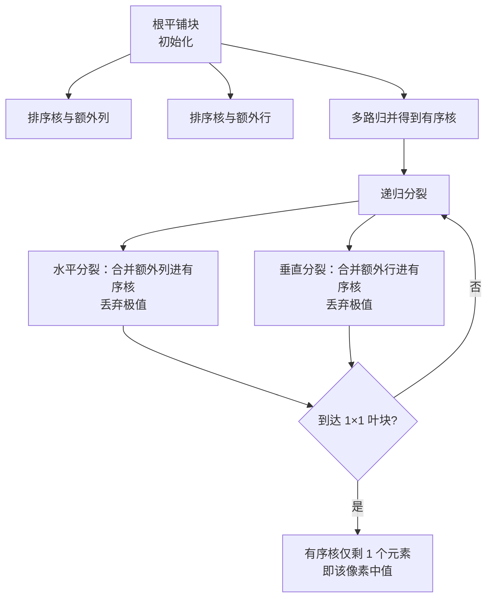

## 一句话总结

本文提出一种基于"分层平铺"（hierarchical tiling）的并行中值滤波算法，通过在多个层级上分解重叠的排序/选择问题来消除冗余计算，并给出数据无关与数据感知两个 GPU 实现变体，把 $$k\times k$$ 核的单像素复杂度分别降到 $$O(k\log(k))$$ 与 $$O(k)$$，在现代 GPU 上比现有最快方法快达 5 倍。

## 研究背景

- 领域现状：中值滤波是图像处理的基础工具，用邻域（核）内的中值替换每个像素，能在去除脉冲噪声（椒盐噪声）和颗粒噪声（散斑噪声）的同时保留锐利边缘，广泛用于光流估计、图像分割预处理、医学影像、立体匹配与边缘检测的后处理，以及摄影/视频编辑。
- 核心痛点：中值滤波不可分离（无法写成两个一维滤波的乘积），朴素逐像素处理复杂度至少为 $$O(k^2)$$，计算代价高。现有高效方法分两大阵营，各有短板：一是基于排序的方法，小核（$$3\times 3$$ 到 $$11\times 11$$）极快，但随核直径增大性能急剧下降；二是常数时间方法（基于直方图或 2D 小波矩阵），常数因子很大——直方图方法的桶数为 $$\Theta(2^b)$$（$$b$$ 为位深），对 8 位数据每像素要几百个周期，位深更大时几乎不可用。
- 本文 idea：既要更好地扩展到大核，又要充分利用大规模并行 GPU 的吞吐。为此引入分层平铺，把重叠选择问题在多个层级上逐步分解，配合"可分离性"与"遗忘性"两个原则，最大限度地在相邻像素间共享排序工作。

## 方法

整体框架：算法把图像划分为若干根平铺块（root tile），每块用一个二叉树式的递归结构处理。从一个 $$t_w^{(0)}\times t_h^{(0)}$$（边长为 2 的幂）的根平铺块出发，每次把方块沿水平方向、把非方块沿较长边一分为二，递归到 $$1\times 1$$ 的叶平铺块（即单个像素）为止。整个过程借助两个原则：可分离性（分解重叠排序问题以复用部分有序结果）与遗忘性（逐步纳入新值、同时丢弃已确定不会成为中值的极值，候选集不断收缩，直到看完所有输入即得中值）。

关键设计：

1. **足迹的结构化划分**：借用 Adams 的术语，对一个 $$t_w\times t_h$$ 平铺块与 $$k_w\times k_h$$ 核，定义足迹（所有像素核的并集）、核（所有核的交集）、额外列/额外行（核左右/上下的补充部分）与角块（其余元素）。子块的核是父块核的超集。每个额外列、额外行在递归全程都保持有序，从而在子块之间复用排序工作。任一层级上，某平铺块所有像素的中值必然落在有序核、额外列、额外行或角块之中；到叶块时额外行列与角块清空，大小为 1 的有序核就是中值。

2. **初始化与递归两阶段**：初始化对根平铺块做三件事——排序核与额外列、排序核与额外行、再用有序列或有序行的多路归并得到有序核。作者发现用多路归并排序核比 Adams 的对角排序网络更高效，在数据无关变体中归并网络在剪枝掉丢弃极值后不需要的部分后，操作数通常只有对角排序网络的一半。递归阶段则不断把父块的数据结构分裂更新为两个子块：水平分裂时把额外列归并进有序核（并丢弃极值），垂直分裂时把额外行归并进有序核。

3. **数据无关变体（选择网络，$$O(k\log(k))$$）**：控制流与访存不依赖数据，可把中间数据几乎全放进寄存器（GPU 上最快的存储）。作者为每类网络挑选操作数最少的实现——尺寸不超过 64 用进化方法搜到的最优排序网络、更大用 Parberry 的成对排序网络，归并用 Batcher 奇偶归并网络的推广，多路归并用 Lee-Batcher 网络。选取根平铺块的启发式为 $$t(k)=2^{\lfloor\log_2(k)\rfloor-1}$$，保证根块尺寸随核线性增长（$$k/4 < t(k) < k/2$$）。CUDA 实现把每个根平铺块映射到一个线程，靠模板元编程与循环展开把网络编译成 min-max 指令序列。但寄存器数量有限（每线程上限 255），核尺寸增大后会因占用率下降与寄存器溢出，在 $$15\times 15$$ 之后性能回落。

4. **数据感知变体（多趟，$$O(k)$$）**：面向大核。放弃数据无关约束后可用更高效的排序/归并算法（如线性复杂度的基数排序、merge path 并行归并）。由于大核下所有中间数据放不进寄存器甚至共享内存，作者采用多趟（multi-pass）方案，把递归拆成多个阶段，每阶段处理所有平铺块并把中间状态写回全局内存；每趟合并一次水平分裂和一次垂直分裂以节省 DRAM 带宽。实现拆成行排序、列排序、核排序、行扩展、列扩展、核扩展、最终化等 CUDA kernel，用三条 CUDA 流并借助事件管理依赖来重叠行/列/核上的操作。还额外做一步图像转置，同时保留行主序与列主序两份拷贝以提升访存合并与缓存命中。

## 实验结果

作者在一块 NVIDIA L40S GPU（142 个 Ada SM）上，用多张 30 兆像素图像、覆盖 $$3\times 3$$ 到 $$75\times 75$$ 的核尺寸做基准测试，不计主机与 GPU 间的数据传输。对比对象为各类别中的最佳实现：OpenCV 的直方图方法、Moroto 与 Umetani 的 2D 小波矩阵、Adams 的可分离排序网络，以及本文两个变体。主要结论（数字忠于原文）：

| 场景 / 指标 | 结果 |
|------|------|
| 封面示例：$$17\times 17$$ 核滤波 30 兆像素照片 | L40S 上仅需 2.2 ms，比当前最优快约 3 倍 |
| 小核 | 排序类方法最快；最小核下瓶颈是 DRAM 读写 |
| 中等核 | 数据无关变体超过 Adams 的编译（静态）实现 |
| 数据感知变体转折点 | 约 $$23\times 23$$（8 位）到 $$29\times 29$$（32 位）起成为最快 |
| 大核（$$75\times 75$$）对比 Adams | 快达 50 倍 |
| 整体最快达 5 倍 | 8/16/32 位数据、$$3\times 3$$ 到 $$75\times 75$$ 多数情形下最快 |
| 2D 小波矩阵反超点 | 8 位约 $$61\times 61$$、16 位约 $$75\times 75$$ 后因常数复杂度反超 |

两个变体互补：数据无关变体覆盖小到中核，数据感知变体接管大核，二者合力在很宽的核尺寸范围内取得最高吞吐，直到常数时间的 2D 小波矩阵在极大核处最终反超。

## 亮点与局限

- 亮点：
  - 分层平铺是核心创新——把"在多少像素间共享工作"从单一平铺尺寸的取舍，扩展成 $$n\to n/2\to n/4$$ 的多层级递归共享，既避免小块共享不足、又避免大块最终非共享步骤主导成本。
  - 首次让排序类方法达到 $$O(k\log(k))$$ 与 $$O(k)$$ 的单像素复杂度，对排序类方法而言前所未有。
  - 数据无关 + 数据感知双变体设计贴合 GPU 硬件现实：小核吃寄存器吞吐，大核用多趟共享内存/全局内存，覆盖面广。
  - 实用性强，支持 8/16/32 位多种数据类型，让长期被认为"太贵"的大核中值滤波在实时系统中变得可行。

- 局限：
  - 支持全部核尺寸与数据类型时编译时间长（约 15 分钟）、二进制体积大（约 40 MB）。
  - 数据感知变体内存需求很重，可超过输入图像尺寸达两个数量级，需靠对图像矩形切片迭代处理来满足内存预算。
  - 缺乏高效的并行多路归并算法，数据感知变体目前用连续两路归并替代，成为性能痛点之一。

## 延伸思考

- 分层平铺的"多层级共享重叠计算"思想不限于中值，或可推广到其他基于滑动窗口、且相邻窗口高度重叠的可分离/不可分离邻域算子（如各类秩滤波、形态学操作）。
- 作者指出把分层平铺扩展到 3D 很有价值——3D 中值滤波常用于医学影像，现有排序类方法仅适用于小核，分层平铺有望支持更大核。
- 数据无关与数据感知的转折点随位深右移，说明寄存器容量是硬约束；随着 GPU 寄存器文件与共享内存演进，两变体的分界与整体最优区间也会随之移动，值得在新架构上重新标定。
- "补充多路归并的高效并行算法"是明确的后续方向，若能突破，数据感知变体在大核下的常数因子还能进一步压低。
