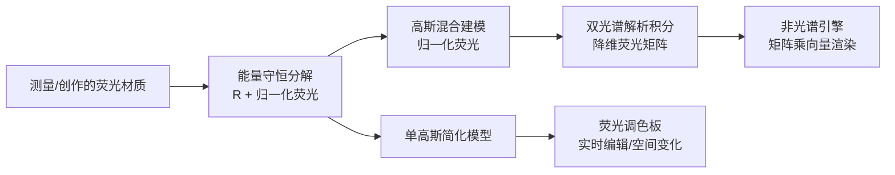

## 一句话总结

本文提出一个基于高斯函数的解析荧光材质模型，把降维后的重辐射矩阵拆成反射与荧光两部分，使荧光在非光谱（RGB/XYZU）引擎中可以被实时编辑和渲染，并支持艺术家从零创作荧光材质。

## 研究背景

- 领域现状：荧光材质会把入射光"搬运"到更长的波长再发出，表现为随光照变化的颜色偏移和额外亮度（例如在紫外光下依然可见）。物理上用双光谱重辐射矩阵 $$P(\lambda_i, \lambda_o)$$ 描述这一过程，其对角线就是常规的光谱反照率 $$\rho(\lambda) = P(\lambda, \lambda)$$ 。此前多数方法都要求光谱渲染引擎，且每种材质存一整张测量矩阵。
- 核心痛点：最近的工作（Fichet 等 2024）证明可以把光谱重辐射矩阵按感光函数降维成一张小的"降维重辐射矩阵" $$\bar{P} = S^\top P \tilde{S}$$ ，从而在非光谱引擎里用矩阵乘向量 $$c_o \approx \bar{P}\, c_i$$ 完成渲染。但它有两个硬伤：一是每种荧光材质都要单独计算并存储一张降维矩阵；二是只能吃测量数据，无法让艺术家创作或独立编辑荧光，空间变化也只能在测量材质之间插值。
- 本文 idea：把降维重辐射矩阵解析地拆成"反射 + 归一化荧光"两个可独立控制的分量，用少量高斯函数建模荧光分量，并给出这些高斯在任意高斯型感光函数上的解析积分。这样荧光参数就能实时改动，既能编辑现有材质，也能凭几个反照率颜色从零捏出可信的荧光材质。

## 方法

整体框架：先做一次"能量守恒的分解"，把重辐射矩阵写成反射矩阵 $$R$$ 与归一化荧光矩阵 $$\bar{F}$$ 的组合；再用高斯混合建模归一化荧光，并推导它在高斯感光基上的闭式积分，得到可直接用于非光谱渲染的降维荧光矩阵；最后把模型简化到单个高斯，配上"荧光调色板"交互，支持从零创作。

关键设计：

1. 能量守恒的重辐射分解（是什么/为什么/怎么做）。测量数据天然守恒，但一旦让艺术家改动荧光就可能破坏物理合理性。作者把光谱重辐射写成 $$P = R + F$$ ，再引入归一化荧光项 $$\bar{F}$$ ，令 $$F(\lambda_i,\lambda_o) = \bar{F}(\lambda_i,\lambda_o)\,(1 - R(\lambda_i,\lambda_o))$$ 。这样能量守恒约束就化简为只对 $$\bar{F}$$ 的独立约束 $$\int_0^\infty \bar{F}(\lambda_i,\lambda_o)\, d\lambda_o \le 1$$ ，与反照率解耦。关键是这一分解在降维矩阵上同样成立：$$\bar{P} = \bar{R} + \bar{\bar{F}}\,[I - \bar{R}]$$ ，因此编辑时不必对所有分量重算降维。输出颜色随之拆为反射项与荧光项，其中 $$[I - \bar{R}]\,c_i$$ 可解释为"留给荧光重辐射的入射颜色"。

2. 高斯建模归一化荧光。作者沿用 Iser 等的思路，用 $$Q$$ 个轴对齐的二维高斯（乘一个 Heaviside 项强制只向低能量/长波长辐射）来近似归一化荧光 $$\bar{F}$$ 。实验发现即便只用 $$Q=1$$ 个高斯，重辐射形状与各种光源下的反射颜色都能被准确复现。

3. 双光谱解析积分（核心贡献）。难点在于对偶感光函数一般不是高斯形。作者利用 $$\tilde{S} = S(S^\top S)^{-1}$$ 把对偶基表示成高斯的加权和，并把每个感光函数写成若干一维高斯之和 $$S \approx G\, T_G$$ ，于是降维荧光矩阵变成 $$\bar{\bar{F}} = T_G^\top \bar{F}^\circ T_G\, C$$ ，只剩下两个一维高斯与二维荧光高斯在三角形域上的积分。作者用两次错切变换（先沿 $$\lambda_i$$ 把对角边界变竖直、再沿 $$\lambda_o$$ 把斜高斯转成轴对齐），把三角域积分化成可分离的一维积分，最终得到只含误差函数 $$\mathrm{erf}$$ 的闭式解。这一步让荧光参数可以实时改动而无需重新数值积分。

4. 高斯感光基与艺术家友好简化。作者用高斯拟合 CIE XYZ 2006 2° 感光函数（$$\bar{x}$$ 用两个高斯、$$\bar{y}$$ 与 $$\bar{z}$$ 各一个），并额外提供一个 UV 高斯基以捕捉"紫外到可见"的重辐射。创作模型进一步只保留单个荧光高斯，参数缩到五个：强度 $$\alpha$$ 、吸收/发射的均值与方差。反射部分仅用一个反照率颜色 $$\rho$$ 指定，UV 通道由 $$\rho_{XYZU} = T_U\, \rho_{XYZ}$$ 自动推出。能量守恒通过把强度写成 $$\alpha = \bar{\alpha}\,\alpha_{max}$$ 、并给出保守的解析上界来保证。艺术家通过"荧光调色板"（展示某光源下可达颜色的色板）点选发射参数 $$(\mu_e, \sigma_e)$$ ，其中色相随 $$\mu_e$$ 变、饱和度随 $$\sigma_e$$ 变。

## 实验结果

主实验是在 Gonzalez 与 Fairchild 的 143 个测量荧光材质上，评估不同降维/建模方案相对全光谱参考的颜色误差 $$\Delta E^*_{2000}$$ （越低越好），跨多种标准光源统计。结果以箱线图给出，下表忠实转述各方案与论文报告的关键结论（分布数值读自箱线图，非逐点精确值）。

| 方案 | 荧光建模方式 | 相对全光谱的 $$\Delta E^*_{2000}$$ | 是否支持实时编辑 |
|------|--------------|--------------------------------|------------------|
| Fichet 等的降维（其 UV 基） | 测量矩阵暴力降维 | 基准水平 | 否 |
| 本文 UV 基的降维 | 测量矩阵暴力降维 | 与上者相当 | 否 |
| 本文解析模型 | 单个二维高斯荧光 + 对角六个一维高斯 | 与暴力降维非常接近 | 是 |

其余关键结论用文字补充：在"高斯个数"消融中，仅用 $$Q=1$$ 个高斯，多数材质、多种光源下反射颜色与真值的差异已 $$< 2$$（$$\Delta E^*_{2000}$$），几乎不可察觉；性能上，采用实时 OpenGL 原型，在配备 Intel Arc 140V 集成显卡的笔记本上渲染一帧 1920 × 1080 图像仅需约 8.3 毫秒。定性结果展示了测量材质的参数插值（两种荧光颜色插值出第三种颜色）、荧光强度/吸收/颜色随纹理的空间变化，以及与 Mojzik 等光谱参考路径追踪的对比。

## 亮点与局限

- 亮点：
  - 把"能量守恒分解"同时做在光谱矩阵和降维矩阵上，编辑荧光时无需对所有分量重算降维，兼顾物理合理与效率。
  - 用错切变换把三角域上的高斯积分化为闭式解，实现荧光参数的实时、解析编辑，这是相较此前"每材质一张测量矩阵"方法的关键突破。
  - 单高斯简化模型 + 荧光调色板，让艺术家仅凭反照率颜色就能从零创作可信荧光材质，并支持纹理驱动的空间变化。
  - 模型对非光谱引擎友好，也可反哺光谱渲染中重辐射矩阵的编辑。

- 局限：
  - 假设反射与荧光仅通过能量守恒耦合；物理上两者可能耦合更紧，但光学领域尚缺相关模型可借鉴。
  - 采用无限支撑的高斯基，若要在可见范围边界裁剪高斯会使解析积分推导复杂化（作者认为当前拟合高斯在可见范围外能量极小，无此必要）。
  - 只针对漫反射荧光，未覆盖角度相关（如某些蝴蝶翅膀）的荧光行为。

## 延伸思考

- 该模型延续了作者团队在虹彩（iridescence）上"解析预积分保证光谱一致性"的思路，把同一套"高斯建模 + 闭式积分"迁移到荧光，提示这类可编辑外观模型有统一的方法论。
- 作者提出的未来方向颇具想象力：借助测量双光谱 BSDF 数据库扩展到角度相关荧光；对简化模型做逆向设计，让艺术家给定不同光源下的重辐射颜色反解参数，从而探索荧光材质间的同色异谱配置；以及把方法从荧光表面推广到荧光体积（如北极熊白毛的荧光）。
- 值得追问的是，单高斯在极端光源或强荧光下的误差上界表现，以及自动推定 UV 通道的策略在更广材质库上的鲁棒性，这些在正文中主要以少量样本和箱线图呈现，规模化验证可进一步补强。
