## 一句话总结

把对话式 AI、性格与情绪建模、语音合成、面部与身体动画、真实世界感知等一整套技术，统一到一个模块化平台里，让用户能与一个"活着"的数字角色进行有故事线、可对话的沉浸式交流，并以数字爱因斯坦作为概念验证落地到真实物理场景。

## 研究背景

把电影角色、历史人物变成能对话、有故事线的交互式数字角色，是跨越几代人的想象。但实现它远不止语言建模一件事，而是牵涉一大堆彼此耦合的 AI 难题：对话智能、角色一致性、性格与情绪管理、知识与记忆、语音合成、动画生成、真实世界交互，以及与物理环境的集成。

基础模型、提示工程与下游微调的进展，让研究者能各自攻克这些单点问题，但把它们组合成一个连贯的交互式角色系统仍是开放难题。以往工作大多只解决其中一环（比如只做动画合成或只做语言建模），缺乏跨组件的整体一致性；角色一致性、可定制性、各模块实时同步这些要求也常常无法兼顾。早期甚至要靠演员实时"提线木偶"式操控角色（如迪士尼的 Turtle Talk with Crush）。

本文提出一个模块化系统，用 LLM 结合多模态感知、表现力合成与自适应性格建模，一次性覆盖这些挑战，并用数字爱因斯坦证明：用户可以就其科研、生平轶事和历史背景与之自由交谈。系统架构高度模块化，任一组件都能按角色和应用替换，因此并不局限于爱因斯坦。

## 方法

### 整体框架

系统以 Unity 为核心，把一个数字角色放进有主题的场景里。角色在四种状态间切换：idle（无交互）、listening（等待输入）、thinking（处理输入）、speaking（输出回应）。摄像头每 500ms 查询一次感知用户接近；用户落座后由 idle 转入对话，随机播放欢迎语后等待输入。整条流水线把传感输入（转写语音、视频用户特征与行为分析）送入 LLM 对话核心，由记忆和可调性格支撑，再从回应中抽取情绪，分别驱动语音合成、面部动画、身体动画选择与配图生成。

```mermaid
flowchart TD
    A[音频输入] -->|语音识别| T[转写文本]
    V[视频输入] --> U[用户特征与行为分析]
    T --> LLM[LLM 对话核心]
    U --> LLM
    MEM[记忆/知识库] --> LLM
    PER[性格滑块] --> LLM
    LLM --> R[角色回应文本]
    R --> EMO[情绪与强度预测]
    EMO --> SP[语音合成]
    EMO --> FA[面部动画合成]
    R --> IMG[Midjourney 配图]
    ST[Avatar 状态] --> BA[身体动画选择]
    SP --> REN[Unity 渲染引擎]
    FA --> REN
    BA --> REN
    IMG --> REN
```

### 关键设计

对话智能与主题一致性。采用双模型：GPT-4o 负责实时主题一致性与高质量交互，微调后的 Llama 3 8B 支持本地部署（隐私、成本、云服务中断时的离线兜底），二者共同满足实时性与鲁棒性要求。为每个角色整理 $$M$$ 个主题（爱因斯坦为 $$M=62$$，涵盖生平、科学理论、音乐兴趣），用 GPT-4o 为每个主题生成 $$N$$ 段合成对话。每轮对话用 Azure 的 text-embedding-3-large 嵌入成 3072 维向量 $$e_t$$，对话级向量为逐轮平均 $$e_{conv}=\frac{1}{T}\sum_{t=1}^{T}e_t$$，主题级向量再对该主题下所有对话求平均 $$e^{(j)}_{topic}=\frac{1}{N}\sum_{i=1}^{N}e^{(i,j)}_{conv}$$。UMAP 投影显示同主题聚成簇、相关主题彼此靠近。

嵌入空间导航。运行时把当前轮与同会话历史轮做指数加权聚合，半衰期三轮 $$h=3$$，越近权重越高：$$e_{agg}=\sum_{k=0}^{\infty}\alpha_k e_{t-k}$$，其中 $$\alpha_k=\frac{1}{Z}\cdot 2^{-k/h}$$，$$Z=\frac{1}{1-2^{-1/h}}$$。计算 $$e_{agg}$$ 与所有主题向量的余弦相似度，超过阈值即锁定当前主题；为平滑过渡，在三近邻里随机取一个作为下一主题，并据此改写提示词引导 GPT-4o。

微调细节。Llama 3 8B 在合成对话原文上用 Axolotl 微调三个 epoch，Adam 优化器，学习率 $$2e{-5}$$，梯度累积 8，余弦调度 100 步 warmup，batch size 为 1，跑在云端 NVIDIA RTX 6000 上，本地用 DeepSpeed 高效运行。

知识与记忆。基于向量的知识库存储对话历史，每次新输入嵌入后做相似检索，取最相关的五段对话片段并入提示的记忆上下文。

性格与情绪。回应生成后用 GPT-4o-mini 判定七种情绪之一（amazement、anger、disgust、fear、joy、sadness、neutral，与 Audio2Face 支持的情绪一致），并回归出 0.01 到 2.0 的强度，映射到 Azure 语音合成的说话风格。性格用独立的动态性格注入方法，用 GPT-4o 把回应改写到预定义性格画像上，画像由五个维度（vibrancy、conscientiousness、decency、artificiality、neuroticism）在五级强度上构成，并做成基于电位器、Arduino 与 3D 打印外壳的物理滑块，实时改写提示。

语音与动画。语音识别与合成走 Azure Speech Services，识别集成进 Unity 以降延迟并保持动画同步，含 1 秒缓冲应对自然停顿；合成用 Azure Custom Neural Voice。面部动画由合成音频经 NVIDIA Audio2Face（A2F）动态生成，作者写了 Python 包装器做 0.5 秒窗口的增量处理并直接流式输出；A2F 不可用时退回 SALSA LipSync（唇偏移误差略高但更鲁棒）。身体动画不用自动手势生成（重定向到风格化角色会不自然），而是用按状态分类的动捕片段库随机采样，眼睛用注视目标加扫视程序化生成。

真实世界交互。摄像头作为角色的"眼睛"：每帧与空扶手椅参考图算 SSIM，超阈值 $$\delta$$ 判定有人落座并触发对话；在摄像头流上跑多个 OpenVINO 模型——人脸检测、年龄性别识别、头姿估计（15 秒窗口 yaw 超 20 度判定不专注）、人脸重识别（余弦距离低于 0.3 判定为老用户，启用个性化记忆）。为兼顾隐私，把人脸模糊后的图像送 GPT-4 Vision，返回服饰配饰描述供对话使用。

视觉叙事。用最近五轮对话经 GPT-4o 组出 Midjourney 提示，通过 GoAPI 生成四张变体，用 CLIP 分数选最合适的一张，再由 GPT-4 Vision 描述回填给对话。至多每两分钟生成一次、显示两轮或到话题切换；因生成最长 32 秒，预生成每主题五张并缓存复用。

物理搭建。以 65 寸屏嵌入定制木框、隐藏摄像头、五路 Visaton 空间音响加低频震动模块、藏在书里的麦克风、物理性格滑块，配 Intel i9 加 RTX 3090 主机，辅以早 20 世纪风格的家具与装饰营造沉浸感。

## 实验结果

数字爱因斯坦用 1618 段演员录音（平均 4.02 秒）微调 Azure Custom Neural Voice，动捕包含 7 段 idle、12 段 listening、1 段 thinking、39 段 speaking；围绕 62 个核心主题每主题生成 71 段合成对话，共 4402 段用于导向 GPT-4o。

性能上各组件均达实时：性格改写 1.03 秒、GPT-4o 推理 1.16 秒、Llama 3 为 1.6 秒、情绪预测 0.61 秒、语音合成 0.4 秒；配图异步生成约 32 秒；累计端到端 GPT-4o 为 4.7 秒、Llama 3 为 5.14 秒，thinking 状态动画可有效掩盖这段延迟。

真实部署在两个国际活动上收集数据：GITEX GLOBAL 2024（技术类，374 次会话）与 SIGGRAPH Asia Emerging Technologies 2024（科研类，261 次会话），另收集 50 段 Llama 3 会话与 4402 段合成对话对比。采用 Toubia 等提出的三项指标：speed（话题切换速度）、volume（语义覆盖范围）、circuitousness（主题推进的迂回程度），越高越有利于动态丰富的交互。

| 指标 | GPT-4o（技术） | GPT-4o（科研） | Llama 3 | 合成 |
| --- | --- | --- | --- | --- |
| 会话数 | 374 | 261 | 50 | 4402 |
| 平均轮数 | 4.84 (2.94) | 5.67 (3.34) | 4.68 (2.14) | 30.00 (1.98) |
| 平均词数 | 29.35 (11.41) | 32.78 (14.71) | 33.10 (10.80) | 25.23 (10.36) |
| 覆盖主题数 | 49 | 42 | 22 | 62 |
| Speed | 0.77 (0.05) | 0.80 (0.05) | 1.04 (0.05) | 0.72 (0.05) |
| Volume | 0.53 (0.03) | 0.55 (0.04) | 0.70 (0.03) | 0.51 (0.04) |
| Circuitousness | 0.02 (0.02) | 0.02 (0.02) | 0.24 (0.02) | 0.02 (0.02) |

GPT-4o 在科研活动上参与度更高（平均 5.67 轮、回应 32.78 词），在 speed 与 volume 上均超过合成对话，说明它能实时给出简洁而有吸引力的回应；Llama 3 的 speed、volume、circuitousness 更高，轨迹更发散，而 GPT-4o 凭主题一致性机制保持更强连贯。62 个主题中 GPT-4o 在技术与科研活动分别覆盖 49、42 个，Llama 3 仅 22 个；活动现场话题自然扩展到 62 个爱因斯坦主题之外（如 GITEX、Dubai、SIGGRAPH Asia、Tokyo），展现了对新话题的适应性。

## 亮点与局限

亮点：这是一篇少见的"系统集成"论文，把十余个彼此独立、各自成熟的 AI 组件真正拼成一个连贯、可实时运行、能在真实展会上服务上百次会话的沉浸式角色平台，模块化设计让每个组件都可按角色替换。嵌入空间的主题导航（聚合嵌入加余弦相似度加三近邻随机跳转）用轻量方式解决了长对话的主题漂移；双模型（云端 GPT-4o 加本地微调 Llama 3）在质量、隐私、成本与容灾间取得平衡；物理性格滑块与摄像头感知把交互延伸进真实空间；隐私上把关键处理放本地、Azure 服务托管在欧洲区以满足 GDPR。

局限：分布式计算在快节奏对话中偶有延迟；尚未实现"打断对话者"的能力；动画合成的多样性和生动性仍有提升空间；认知建模离真正类人的理解推理还有距离。作者也坦言尚未做结构化用户研究来量化各组件对参与度和沉浸感的贡献，现有评估更多是部署统计而非受控实验。

## 延伸思考

这套平台的价值不在单点算法，而在工程编排：如何让语音、动画、生成、感知在秒级预算内协同，并用 thinking 状态的动画去"藏"住不可避免的延迟，是很实用的交互设计经验。嵌入空间导航这一招也可迁移到任意长程对话智能体的主题控制上，比堆更大的上下文窗口更省。真正待补的是可信的用户研究——目前指标（speed、volume、circuitousness）衡量的是对话的形状而非用户的主观体验，组件级消融加沉浸感/可信度问卷会让"believable"这一核心主张更有说服力。此外把历史人物数字化复活也带来同意、真实性与"数字招魂"的伦理张力，值得在可定制平台推广前正视。
