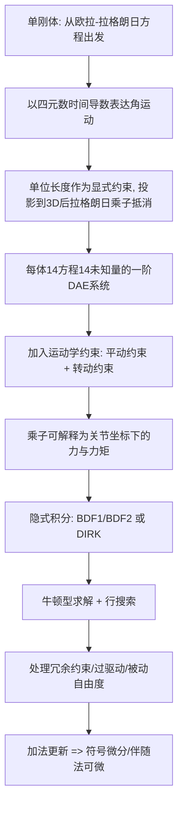

## 一句话总结

用四元数"加法更新"配合隐式积分，构建一套能严格满足运动学约束的刚体动力学求解器，天然支持含运动学闭环、冗余约束、过驱动与被动自由度的复杂机械系统，并且整套仿真可微分。

## 研究背景

刚体动力学在虚拟环境和真实机械系统里无处不在。当我们想仿真具有任意运动学结构（含闭环、被动自由度）的系统时，必须采用基于约束的表述方式。而对这类系统而言，让约束始终得到满足至关重要——尤其在奇异构型附近，哪怕极小的约束违背都可能导致完全错误的仿真结果。

常见的显式与半隐式时间步进方案对任意系统和任意步长都无法保证约束满足。半隐式方法（PhysX、ODE、MuJoCo 等主流软件采用）在速度层面隐式求解、位置层面随后显式积分，依赖被稳定化处理过的速度约束（Baumgarte 稳定化），既要调参又无法保证位置约束的满足。相比之下，隐式积分能把运动学约束纳入下一时刻求解，从而把约束满足到指定容差之内。

但隐式方案面对旋转运动有个难点。四元数是紧致且无奇异的旋转表示，可它必须保持单位长度才代表合法旋转。已有做法各有代价：

- 重归一化（renormalization）：临时投影操作会引入不精确性；
- 非单位长度四元数：仅在单体上展示过，未扩展到含约束情形；
- 变分积分子 / 隐式李群积分子：通过指数映射天然维持单位长度，但其**乘法式**更新采用专门的乘法代数，会给下游应用（尤其是可微分）带来麻烦。

本文的核心取舍是：把动力学方程写成关于四元数时间导数的形式，采用**加法更新**而非乘法更新，并把单位长度当作一个显式约束来处理。这样既能对接面向微分-代数方程（DAE）的隐式积分子，又让仿真天然可微分。

## 方法

### 整体流程

### 单刚体的四元数动力学

作者直接从欧拉-拉格朗日方程出发

$$\frac{d}{dt}\left(\frac{\partial T}{\partial \dot{s}}\right)^{T} - \left(\frac{\partial T}{\partial s}\right)^{T} = C_{s}^{T}\boldsymbol{\lambda} + f_{\text{gen}}$$

将保守力与非保守力都并入广义力项 $f_{\text{gen}}$，因此拉格朗日量取动能。状态用质心位置 $c$ 和单位四元数 $q$ 表示，速度用 $v$ 和 $w = \dot{q}$ 表示。与常见的 13 维状态 $(c, q, v, \boldsymbol{\omega})$ 不同，这里用 14 维状态 $(c, q, v, w)$，并把单位长度约束 $C = q^{T}q - 1$ 显式纳入。

关键在于借助矩阵 $G(q)$、$H(q)$（其元素线性依赖四元数分量）的一系列性质来推导角运动方程。旋转矩阵满足 $R(q) = G(q)H(q)^{T}$，角速度与四元数导数的关系为

$$\boldsymbol{\omega} = 2G(q)\dot{q} \iff \dot{q} = \tfrac{1}{2}G(q)^{T}\boldsymbol{\omega}$$

角运动的 4D 欧拉-拉格朗日方程推出后，作者用 $\tfrac{1}{2}G(q)$ 左乘两侧把方程投影到 3D 空间：

$$2G(q)H(q)^{T}J_{\text{rb}}H(q)\ddot{q} + 4G(q)H(\dot{q})^{T}J_{\text{rb}}H(q)\dot{q} = \boldsymbol{\tau}$$

**巧妙之处**：单位长度约束带来的广义力在投影后恰好抵消，于是那个拉格朗日乘子可以直接忽略。相比同类工作，这带来两点收益：不引入没有物理意义的 4D 增广惯性矩阵；无需为单位长度约束额外设一个乘子——角运动只需 3 个方程而非 4 个，方程数与未知数刚好相等。

最终单体系统是含 14 个方程、14 个未知状态变量的一阶系统。由于单位长度约束方程不依赖任何状态变量的时间导数，整个系统是一组微分-代数方程（DAE）而非纯常微分方程。

### 统一的约束表述

约束用来限制从动体 $F$ 相对基体 $B$ 的运动。每限制一个平动或转动方向，就加一个约束方程和一个拉格朗日乘子 $\lambda$，保证方程数与未知数始终相等。同时从各体方程中减去对应的约束力和约束力矩，以保证力/力矩在两体间正确传递。

平动约束基于两关节位置的差向量 $d$，沿通用轴 $a$ 限制运动：

$$C = a \cdot (R(q_{B})^{T}d)$$

转动约束要求从动体上的轴 $a$ 与基体上的轴 $b$ 保持正交（点积约束）：

$$C = (R(q_{F})a) \cdot (R(q_{B})b)$$

**设计亮点**在于：约束力和力矩都有解析且可解释的表达，对应的拉格朗日乘子可以直接被解读为关节坐标下的力或力矩。这避免了因使用四元数虚部而产生的不直观缩放，也让作者能定义与已有位置驱动器一致的、更通用的力驱动器。

由此，任何被动关节都能被转化为位置驱动或力驱动关节。位置驱动只需从被动约束里减去位置变量 $p$；力驱动则把乘子替换为参数 $p$，直接施加约束力和力矩。作者给出了固定、平动（prismatic）、转动（revolute）、圆柱、销槽、万向、笛卡尔、平面、球、槽、自由等常见关节的组合方式。

对于含多个正交约束的关节，大步长下可能收敛到"轴翻转"（joint flips）的伪解。作者引入**一致性约束**：正确解取值为 1，伪解取值为 0 或 $-1$；求解时若行搜索中任何一致性约束低于正阈值则回退。

### 隐式积分与求解

多体系统的连续运动方程构成一个指数 3、Hessenberg 形式的 DAE 系统，用完全隐式方案向前积分以保证约束满足到数值容差。作者选用无条件稳定的方案，这在把仿真器放进优化循环时尤为重要。

支持两族隐式方法：

- **BDF（向后差分公式）**：定步长。求解成本基本与阶数无关。实验主用 BDF1 与 BDF2，后者在计算成本、精度和稳定性之间取得良好平衡（3 阶及以上并非无条件稳定）。
- **隐式龙格-库塔（DIRK）**：需要高阶或自适应步长时使用；主要用于验证，以及用一个刚性精确两级 SDIRK 步来启动 BDF2 的首步。

求解离散方程主要遵循牛顿方案，迭代求解 $F_{y_{n}}\Delta y_{n} = -F$，并用满足 Armijo 条件的行搜索提升鲁棒性、防止一致性约束被违背。

针对不同系统类别，作者做了几项关键适配：

- **小步长下的条件数处理**：雅可比条件数随步长以 $O(1/\Delta t^{4})$ 增长。通过对变量和方程分别乘以对角缩放矩阵（位置/朝向用 1、速度用 $\Delta t$、乘子用 $\Delta t^{2}$），可让缩放后雅可比的主导项与步长无关。
- **过约束系统**：含运动学闭环的系统常出现冗余约束（如平面四连杆多出 3 个约束），使雅可比秩亏。作者沿用已有技术挑选可消去的约束子集，得到满秩的约简系统，用稀疏 LU 分解高效求解；只在冗余分析预计算时才需一次奇异值分解。运行时检查被消去约束是否仍满足，不满足才重做分析（实际很少发生）。
- **加权最小范数乘子**：冗余会让乘子解落在一个子空间里。作者让用户为每个力/力矩分量指定权重 $w_{i} > 0$，通过最小化加权范数 $\tfrac{1}{2}\sum_{i} w_{i}\lambda_{i}^{2}$ 选出更有意义、时间上更连贯的解，闭式解为

$$\boldsymbol{\lambda}_{n} = -W^{-1}E_{\lambda_{n}}^{T}\left(E_{\lambda_{n}}W^{-1}E_{\lambda_{n}}^{T}\right)^{+}E$$

  因为乘子有直观的物理解释，用户能凭直觉设权重（如想最小化驱动器力矩，就给位置控制驱动器力矩对应的乘子设很大的权重）。
- **全约束系统**：许多真实机构的位姿完全由运动学约束确定，此时可用更高效的两步求解：先用高斯-牛顿解正向运动学，再直接求速度，最后一次求解得到乘子，可用稀疏 Cholesky 分解，且无需缩放和冗余分析。

### 可微分性

隐式积分子简化了对任意参数的导数计算，因为不需要稳定化或自适应步长这类会给微分添麻烦的机制。由于采用**加法更新**而非乘法更新，符号微分可直接作用于所有构件。作者用隐函数定理计算导数，并用伴随法加速；还扩展了标准伴随法来处理加权最小范数乘子的情形。即便约束力/力矩存在子空间，仿真器仍保持完全可微分。

## 实验结果

作者按是否含冗余约束、是否过驱动、是否含被动自由度对例子分类，方法对所有类别都"开箱即用"。虽然方法既不守恒能量也不守恒动量，但实验表明能量与动量损失都相当小，且随步长减小而下降。

各例子的关键规模（部分数据）：

| 系统 | 组件数 | 约束数 | 约束方程数 | 状态变量数 |
| --- | --- | --- | --- | --- |
| T-Handle | 1 | - | - | 14 |
| 陀螺 Spinning Top | 1 | 1 | 3 | 17 |
| 摆 Pendulum | 1 | 1 | 5 | 19 |
| Hoberman 球 | 240 | 420 | 1980 | 5340 |
| 卫星 Satellite | 26 | 37 | 192 | 556 |
| 钢铁侠 Iron Man | 151 | 198 | 982 | 3096 |
| 瞪羚 Gazelle | 38 | 45 | 236 | 768 |

单步平均计算时间（AMD Ryzen Threadripper Pro 3955WX，16 核 3.9 GHz，64 GB 内存）：

| 系统 | 步长 $\Delta t$ | 序列长度 | 单步耗时（general 求解器） |
| --- | --- | --- | --- |
| T-Handle | 1 ms | 10 s | 0.037 ms |
| 陀螺 | 0.1 ms | 10 s | 0.045 ms |
| Hoberman 球 | 10 ms | 4 s | 1138.03 ms |
| 卫星 | 33 ms | 10 s | 7.75 ms |
| 钢铁侠 | 33 ms | 138.5 s | 26.89 ms（全约束求解器 4.19 ms） |
| 瞪羚 | 10 ms | 9.82 s | 3.55 ms（全约束 0.84 ms；力控 6.11 ms） |

几个代表性发现：

- **T-Handle（自由旋转）**：用来对比不同积分方案的能量与速度保持。经过启动阶段后 Pareschi-Russo SDIRK 的能量保持最好；BDF2 明显优于刚性精确两级 SDIRK，后者又优于 BDF1。
- **陀螺**：能复现进动与章动特征模式。BDF2 能量损失合理且严格满足约束（约束范数 $< 10^{-10}$）；Pareschi-Russo SDIRK 虽能量保持更好，但约束满足很差；半隐式方案也不能精确满足约束。这说明能量保持与约束满足之间存在取舍，本方法优先保证后者。
- **摆（大角速度）**：本文隐式方案对任意初速都保证约束满足；半隐式方案首步误差近乎为零但约束满足很差且误差随时间增长。在无约束的自由刚体上，半隐式方案近乎完美，而本方法表现一如既往。
- **Hoberman 球**：完全被动且高度过约束，抛出旋转后穿过全展开处的运动学奇异点并循环收缩-膨胀，是对约束消去方案的压力测试；半隐式方案因约束满足不完美使多条平行轴错位、锁死内部自由度，无法仿出膨胀收缩。
- **卫星**：过驱动（7 个驱动器协同以最小化结构内载荷）、既过约束又含被动自由度，方法原生支持。
- **钢铁侠**：复杂 Audio-Animatronics 角色，刚体质量跨度大（0.3 g 到 49.2 kg），手部含运动学闭环，全驱动且过约束。
- **瞪羚（过驱动子空间）**：8 个驱动器控制骨盆 6 个自由度，含 7 个运动学闭环。用加权最小范数解相比朴素最小范数解，8 个腿部驱动器的均方根力矩降低约 63%。用力控重放验证运动一致，平均和峰值驱动器位置误差分别为 0.03° 和 1.44°。半隐式方案在 $\Delta t = 0.1$ s 时约束违背肉眼可见，而本隐式方案不论步长都满足到容差。
- **敏感度分析与轨迹优化**：借助可微分性，对瞪羚两种替换驱动器为被动关节的设计做最坏情况敏感度对比，清晰指出哪种设计对扰动更鲁棒；对 Hoberman 球抛掷用 BFGS 做轨迹优化，几步内即把目标匹配误差降到低容差以下。

## 亮点与局限

亮点：

- 用"投影后单位长度约束的广义力自动抵消"这一巧思，做到无需额外拉格朗日乘子就维持单位长度，角运动只需 3 个方程，方程数与未知数天然相等。
- 加法式四元数更新是全文的关键设计取舍：既能对接无条件稳定的隐式 DAE 积分子，又让符号微分和伴随法可微直接可用，避开了乘法式李群积分子对下游的束缚。
- 约束的拉格朗日乘子有清晰物理解释（关节坐标下的力/力矩），既方便分析，又让加权最小范数策略中的权重可凭直觉设置。
- 统一处理被动、位置驱动、力驱动关节，并原生应对冗余约束、过驱动、被动自由度的任意组合，且在含数百刚体时仍能在几毫秒内步进。

局限：

- 时间积分既不守恒能量也不守恒动量（虽然损失随步长减小而变小）。
- 尚未建模关节级、体间或体-环境的摩擦接触，作者将其列为未来工作（可考虑隐式罚函数，或单独求解接触力的对偶问题再作为外力馈入）。
- 高度过约束系统（如 Hoberman 球）单步成本明显偏高（约 1138 ms），奇异构型附近数值秩计算可能不可靠。

## 延伸思考

这篇工作把"可微分仿真"作为一等目标来驱动动力学表述的选择——为了让符号微分和伴随法顺畅可用，宁愿放弃乘法式李群积分子带来的能量保持优势，转而用加法更新加显式单位长度约束。这种"为下游可微分性而重新设计前向仿真"的思路，值得在其他仿真领域借鉴。

拉格朗日乘子的物理可解释性是另一条隐线：正因为乘子等于关节力/力矩，加权最小范数才能变成用户可控、面向工程目标（如最小化驱动器力矩、按柔度分配载荷）的旋钮。这对真实机器人和 Audio-Animatronics 这类过驱动机构的设计-仿真闭环很有价值。

作者反复强调"几毫秒内步进复杂系统"和"完全可微分"，指向的下一步是实时闭环控制、最优控制与设计优化，以及辨识仿真参数来缩小 sim-to-real 差距——尤其是把关节级摩擦接触补进来之后，这套框架有望更贴近物理样机的真实行为。
