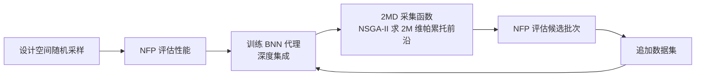

## 一句话总结

本文提出 LBN-MOBO，一种能一次性提出上万个样本的大批量贝叶斯优化框架，用贝叶斯神经网络做代理模型、用融合多样性探索与信息高效利用的新型采集函数，充分榨干现代并行计算与实验能力，从而更快、更完整地发现设计过程的"性能色域"（gamut）。

## 研究背景

- 领域现状：在计算设计、机器人、制造等领域，人们常想知道一个过程"能达到的性能边界"在哪里——也就是性能色域（gamut）。色域的边界由多目标下互不支配的最优解（帕累托前沿）构成，它划出了可行与不可行的分界，对判断打印机能否复现某种颜色、机器人能否到达某个位置、构造代表性数据集等都极为关键。
- 核心痛点：随机采样在高维空间里效率极低、收敛慢；贝叶斯优化（BO）虽然样本效率高，但传统 BO 的设计哲学是"尽量少调用真实前向过程（NFP）"，偏好每轮只取一个样本、迭代很多轮。可现代高性能计算和自动化实验设备（如自主材料实验室）已经能一次并行评估上千甚至上万个样本，此时瓶颈从"评估次数"转移到了"迭代轮数"上——而文献中几乎没有能吃下超大批量、只跑少数几轮的 BO 方法。
- 本文 idea：针对超大批量 BO 的两个可扩展性瓶颈下手。其一，代理模型扩展性：用贝叶斯神经网络（BNN，具体用深度集成 Deep Ensembles 近似）替代传统高斯过程，天然带不确定性估计且能吃大批量数据。其二，采集函数扩展性：提出 2MD 采集函数，把 NSGA-II 的多样性驱动探索和 BO 的不确定性驱动利用融合起来，一次生成大批高质量、多样的候选。

## 方法

整体框架：方法名为 LBN-MOBO（Large-Batch Neural Multi-Objective Bayesian Optimization）。它沿用 BO 的主干循环，但每个环节都为"大批量、少迭代"重新设计。流程是：先在设计空间随机采样一批设计并用真实前向过程（NFP，如仿真器）评估，得到初始数据集；用这批数据训练一个 BNN 代理模型，它同时输出性能预测和认知不确定性；再用 2MD 采集函数在代理模型上一次性挑出一大批候选；把候选丢回 NFP 评估，追加进数据集后重训 BNN，如此循环若干轮。

关键设计：

1. **BNN 代理与认知不确定性分离**：采用深度集成，即 $$K$$ 个结构相同但激活函数各异的子网络。集成均值 $$F_\mu(x)$$ 作为性能预测，子网络之间预测的方差给出认知不确定性 $$F_{\sigma_E}(x)$$。深度集成的独特优势是能把认知不确定性（epistemic，源于数据不足、可通过补数据消除）与偶然不确定性（aleatoric，不可约噪声）分离开。由于本文场景噪声极小，作者干脆用普通 MSE 损失训练，只保留认知不确定性来指导探索——子网络意见一致说明该区域数据充足，意见分歧则说明是未充分探索的区域。作者还发现让集成成员使用多样化的激活函数能显著提升不确定性质量。

2. **2MD 采集函数**：这是本文核心创新。传统做法是在 $$M$$ 个性能目标上求 $$M$$ 维帕累托前沿；本文改为求一个 $$2M$$ 维帕累托前沿——其中 $$M$$ 维是性能预测（对应利用 exploitation），另外 $$M$$ 维是各目标对应的认知不确定性（对应探索 exploration）。形式上把预测向量与不确定性向量拼接 $$F(x) = F_\mu^m(x) \oplus F_{\sigma_E}^m(x)$$，然后在其上求帕累托最优解集。这样，被选中的候选要么在某个性能维度上占优（值得利用），要么在某个不确定性维度上突出（值得探索）——后者要么评估后发现真在前沿上，要么帮助填补代理与真实 NFP 之间的信息鸿沟，让代理越来越像 NFP。

3. **在代理而非 NFP 上跑 NSGA-II，且全程并行**：把 NSGA-II 用在廉价的代理模型上、而不是昂贵的 NFP 上，是采集可扩展的关键。此外，NSGA-II 本身在种群很大时会遇到规模瓶颈，作者的解法是用不同随机种子并行跑多个较小批量的 NSGA-II 再合并结果。这样采集函数完全可并行、性能几乎不随批量增大而下降——于是整个 LBN-MOBO 的唯一限制因素就变成了"能并行评估多少个 NFP 样本"这一硬件能力。

## 实验结果

作者在三个真实的工程 / 机器人问题上验证。由于 LBN-MOBO 自身开销相比 NFP 仿真时间可忽略，三种方法（随机采样、NSGA-II、LBN-MOBO）在每轮都用相同且尽可能大的批量，只保留能跟得上超大批量的竞争对手。评价指标为色域的超体积（hypervolume），越大越好。下表汇总三个主实验的设置（数字忠于原文）：

| 问题 | 设计空间维度 | 性能目标 | 每轮批量 | 迭代轮数 | NFP |
|------|------|------|------|------|------|
| 软体机器人可达域 | 40 | 末端 (x, y) 坐标 | 2,000 | 4 | PDE 约束优化 |
| 打印机颜色色域 | 44（44 种墨水） | CIE a*、b* | 20,000（初始 10,000） | 10 | 10 网络集成，训练于 344,000 色块 |
| 翼型升阻性能 | 192→5（GAN 隐空间） | $$C_L$$、$$C_L/C_D$$ | 15,000（初始 15,000） | 6 | GAN + OpenFOAM 计算流体力学 |

三个问题上结论一致：在相同计算预算（相同批量、相同轮数）下，LBN-MOBO 发现的色域超体积显著大于随机采样和 NSGA-II，且超体积随迭代上升得更快、更高。软体机器人实验尤其说明问题——到达底部区域需要高度不对称的形变（一侧大量边收缩、另一侧扩张），这类构型随机采样几乎不可能碰到，NSGA-II 也要多得多的代数才能找到，而 LBN-MOBO 在 4 代内就能发现。

消融实验（第 5.4 节）单独验证了认知不确定性的作用：去掉不确定性维度后，候选样本会扎堆聚集在局部区域，多样性和探索能力下降、发现的帕累托前沿更窄；加入不确定性后候选分布更广、前沿更完整，同时不断填补代理模型的信息缺口。

## 亮点与局限

- 亮点：
  - 视角转换到位——敏锐指出现代并行算力/实验设备让瓶颈从"评估次数"转向"迭代轮数"，并据此重新设计 BO，切中传统 BO"重样本效率、轻批量"的盲区。
  - 2MD 采集函数把探索/利用统一成一个 $$2M$$ 维帕累托问题，思路简洁优雅，且采集函数无需调参（tuning-free）。
  - 代理模型全程被优化得越来越接近 NFP，对主动学习、构造数据集有额外价值，是"顺带的红利"。
  - 在软体机器人、颜色色域、翼型三个差异很大的真实问题上都验证，覆盖仿真与实验两类并行场景。

- 局限：
  - 主实验的定量对比主要以超体积曲线（图）呈现，正文未给出精确数值表，横向比较的绝对数字不够透明。
  - 主实验的性能目标维度基本是 2 维（更高维度分析放在补充材料），核心场景的目标数偏低。
  - 方法本身依赖"增大批量不显著增加单次评估成本、但迭代昂贵"这一前提，不满足该前提的问题收益有限；作者也坦承尚未处理设计约束、以及高噪声数据下的鲁棒性。
  - 认知不确定性的质量依赖深度集成和多样化激活等经验技巧，其可靠性缺乏理论保证。

## 延伸思考

- 该方法本质是"用可并行的廉价代理 + 多目标进化搜索，去逼近昂贵的黑箱前向过程"，这套范式与逆向设计、材料发现、自主实验室（self-driving lab）高度契合，值得迁移到更多"实验昂贵、并行充裕"的领域。
- 作者提出的三个未来方向都很实在：显式处理设计约束、面向高噪声数据增强鲁棒性、以及给采集函数引入可调的探索/利用权重（当前是通过帕累托支配隐式平衡的）。其中"可调权重 vs 无参帕累托"的取舍，值得对比研究——无参很省心，但在特定预算下手动偏置探索或许能更快收敛。
- 用 $$2M$$ 维帕累托前沿统一表达探索与利用是个通用技巧，或可反哺其他多目标 BO / 主动学习场景；但随目标数 $$M$$ 增大，$$2M$$ 维帕累托前沿的解数会急剧膨胀，如何在高维目标下保持采集的有效性与多样性是一个开放问题。
