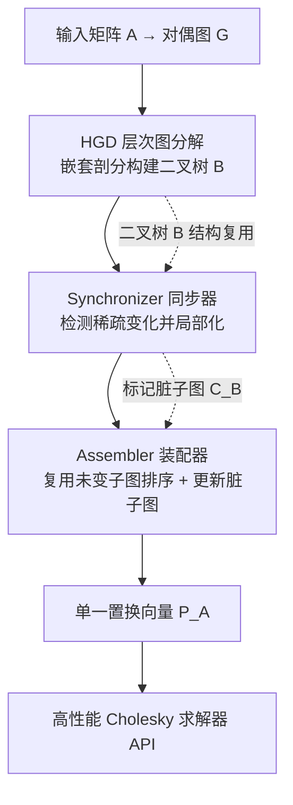

## 一句话总结

提出 Parth：一个能在稀疏模式动态变化（接触模拟、局部重网格）时，自适应"局部复用"填充缩减排序（fill-reducing ordering）的模块，只需三行代码即可接入 MKL、CHOLMOD、Apple Accelerate 等主流稀疏 Cholesky 求解器，实现最高 255× 的排序加速与最高 5.89× 的整体求解加速，且不损失数值质量。

## 研究背景

图形与科学计算中大量操作（求解偏微分方程、最小化变分能量）最终归结为求解稀疏线性方程组 $Ax=b$，而稀疏 Cholesky 求解器是核心工具。一次 Cholesky 求解通常分两步：

- **符号分析（symbolic analysis）**：分析矩阵稀疏结构，其中最关键的一步是计算**填充缩减排序**——一个置换 $P$，用于最小化分解过程中产生的填充项（fill-in），直接决定后续求解的速度。
- **数值计算（numerical computation）**：利用符号信息高效算出数值解。

在**静态稀疏模式**下，符号分析只需算一次、后续反复复用，因此不是瓶颈。但在**稀疏模式动态变化**的应用里（例如带接触的弹性体模拟 IPC，或带局部重网格的几何处理），每次调用稀疏结构都在变，符号分析必须反复重算，反而成了主瓶颈。作者的实测显示：

- 在 IPC 基准中，符号分析最高占 Cholesky 求解总时间的 **78%**；
- 在重网格流水线中，符号分析占比高达 **82%**；
- 进一步细分，填充缩减排序占符号分析时间的比例在三个求解器上平均分别为 **62.32%（MKL）、81.05%（Accelerate）、86.06%（CHOLMOD）**，是符号分析里最大的瓶颈。

关键观察：填充缩减排序是 NP-hard 问题，实践中用 METIS、AMD、Scotch 等启发式算法求解，这些算法带随机性，对同一输入会产生多个高质量排序。当两次调用间稀疏模式只是**局部、渐进**变化时，存在一个与上一次排序高度相似的高质量解——这意味着可以**局部更新**旧排序而非从头重算。这正是 Parth 的出发点：复用符号分析（而非像已有工作那样复用数值分解），且不假设变化发生的位置与数量。

## 方法

Parth 直接替换稀疏 Cholesky 求解器的填充缩减排序模块（Accelerate、MKL、CHOLMOD 都提供这样的接口）。它在矩阵的**对偶图** $G$（把 $A$ 重新解释为邻接矩阵，行/列为节点、非零项为边）上工作，由三个模块组成。

### 1. HGD：层次图分解（Hierarchical Graph Decomposition）

基于**嵌套剖分（nested dissection）**递归构建一棵二叉树 $B$（以数组存储）。每次调用 `computeMinSeparator` 把当前子图分成三部分：一个分隔集 $g_s$（移除后把图切成两块）和两个近似等大的子图 $g_l$、$g_r$。递归直到达到 `max_level`。二叉树的叶子是细粒度子图，中间节点是分隔集。相邻兄弟子图与其分隔集合并即可"粗化"为粗粒度子图，一直合并到根就还原整个 $G$——这体现了分解的层次性。分隔集本身通常很小（相对左右子图），这是后续能高效局部化的基础。

### 2. Synchronizer：同步器（五步局部化）

负责跨调用检测 $G$ 的变化并把影响**约束在尽量小的子图内**：

1. **同步增删节点**：通过 `map` 数组（当前调用节点索引 → 上一调用同一节点索引）识别节点的增加、删除、索引变化。重网格器通常本就会生成这个 map。
2. **检测增删边**：对比新旧图得到变化边集 $E_G$，再映射为二叉树上的子图间连接变化 $E_B$。
3. **检测脏子图**：把 $E_B$ 分成细粒度脏子图 $D_F$ 与粗粒度脏子图 $D_C$。细粒度子图只需更新排序信息、无需重新分解；粗粒度子图若分隔集特性被破坏（本应被分隔集隔开的两块现在连通了），则需用 HGD 重新分解。判定规则很精妙：分隔集与其相邻子图之间新增边**不违反**分隔条件（可忽略），只有让本被隔开的两个子图直接连通的边才触发重分解。
4. **过滤冗余**：由于每个变化独立评估，一些小的脏子图会被更大的脏子图包含，可从 $D_F$、$D_C$ 中移除，避免重复工作。
5. **重新分解**：对 $D_F$ 只在 $C_B$ 数组里标记；对 $D_C$ 用 HGD 局部重分解，替换掉失效的子树，得到新的合法二叉树 $B$，并把新生成的细粒度子图标记为脏。

针对一个棘手情形——只有一条边连接了共享根分隔集的两个子图，会导致粗粒度子图膨胀到整个图、复用率归零——作者设计了 **"Aggressive Reuse"（激进复用）** 启发式：把构成问题边的一个节点移入对应分隔集，让分隔集适度扩张，从而即便在这种场景也能保持高复用。

### 3. Assembler：装配器

复用各子图的局部置换向量 $P_l$，拼装出整体置换 $P_A$，共三步：

- **Step 1 计算位置**：按嵌套剖分要求，分隔集的排序要放在左右子图之后，等价于按二叉树的**后序遍历**放置各 $P_l$。由于二叉树结构在模拟中不变，后序只需算一次，各子图的 `offset` 由累加节点数得到。
- **Step 2 计算并映射 $P_l$**：依据 $C_B$，只对被标记为脏的子图重算 $P_l$（可用 AMD、METIS、Morton Code 等任意排序算法，Parth 现支持 METIS 与 AMD），未变子图的 $P_l$ 直接复用，然后按 offset 插入图置换向量 $P_G$。
- **Step 3 映射 $P_G$ 到 $P_A$**：对 $DIM=1$ 的情形 $P_G$ 即 $P_A$；对更高维（如三维模拟 $DIM=3$），Parth 把连续 $DIM$ 行/列压缩为一个图节点（它们在 $G$ 中构成团，不损质量），故 $P_G$ 比 $P_A$ 小 $DIM$ 倍，最后按下式展开：

$$P_A[j \cdot DIM + d] = P_G[j] \cdot DIM + d$$

这种压缩也是 Parth 在三维模拟中取得极高加速的原因之一。

## 实验结果

**评测规模**：在超过 175,000 个线性系统上评测，覆盖物理模拟与几何处理。集成到三个最主流、最高性能的稀疏 Cholesky 库：Intel MKL Pardiso、SuiteSparse CHOLMOD、Apple Accelerate。为公平起见，还给三个库都加了"稀疏模式不变时复用符号分析"的逻辑，使报告的加速只反映稀疏模式**确实变化**的情形。

**IPC 基准**：来自 Li et al. 2020 的六个最具挑战的可变形体序列（超过 96% 的迭代存在稀疏变化），共 143.5K 个连续线性系统。规模从 Dolphin Funnel（24K 维、50 万非零）到 Arma Roller（201K 维、480 万非零）。

排序加速（相对最快的竞品，图示）：六个模拟从 (1) 到 (6) 分别为 **8.04×、11.66×、2.29×、2.75×、3.70×、9.79×**。若与"每次求解都挑三者中最快"的假想最优对手逐次比较，Parth 单次求解加速范围为 **1.5× 到 255×**。

填充质量：与三库中最稀疏因子相比，Parth 生成因子的非零数偏差 $(t_p - t_{best})/t_{best}$ 中位数接近零，绝大多数落在 **±5%**（逐迭代细看在 ±6%）以内——即以极高加速换来几乎无损的排序质量。

符号分析加速（集成后）：CHOLMOD / Accelerate / MKL 的最高加速分别为 **8.05× / 5.69× / 3.14×**，中位数 **4.9× / 3.5× / 2.2×**，最低 **1.9× / 1.4× / 1.2×**。

整体 Cholesky 求解加速：Accelerate / MKL / CHOLMOD 最高 **2.95× / 2.28× / 1.97×**，中位 **1.5× / 1.54× / 1.43×**。具体到 Arma Roller + CHOLMOD（Intel 平台），1.45× 的求解加速意味着**节省 7.86 小时**运行时间。作者也验证 Parth 越是接入更优化的求解器（Accelerate、MKL），越能榨出更大加速。

**重网格基准**：在 Botsch–Kobbelt 重网格上求解全局离散 Laplacian，patch 大小覆盖 1%、5%、10%、20% 的面，$DIM=1$（不使用压缩）。瓶颈分析显示大网格上填充缩减排序占符号分析比例从小网格的 57% 升到 82%（MKL）。结果：patch 越小、时间相干性越强、复用越多——1% patch 时 CHOLMOD 达到数量级加速；20% patch 时仍有最高 3.36× 符号加速。整体求解上，相对 Accelerate / CHOLMOD / MKL 最高加速 **5.89× / 3.55× / 2.82×**（1% patch，Accelerate 中位约 4.6×）。teaser 中 2% patch 时可复用 92% 的先前排序计算，带来 5.5× 的 Cholesky 求解加速。

## 亮点与局限

**亮点**

- 抓对了瓶颈：在动态稀疏场景下，指出被忽视的符号分析（尤其填充缩减排序）才是真瓶颈，而非被反复优化的数值阶段，并给出清晰的量化证据。
- 复用符号分析而非数值分解，且**不假设变化的位置与数量**，能处理多处局部变化，比低秩更新、复用超节点等方法更通用（后者常引入近似误差或无法应对维度变化）。
- 工程友好：只需三行代码接入现有高性能求解器 API，无需调参、无需重构流水线，且已开源。
- 质量几乎无损：置换质量与三库最优相当（±5%），却带来数量级的排序加速。
- 层次分解 + 脏子图检测 + 激进复用的设计使局部化既精确又鲁棒。

**局限**

- **适用域受限**：只在填充缩减排序确实是瓶颈时才有收益；瓶颈在别处（如数值阶段、CCD）时 Parth 无能为力。
- **依赖变化的局部性**：若变化遍布整个域（如 Mat Twist 中大量分布式自碰撞），局部性丧失，Parth 在某些帧无法提供复用收益。
- **长期质量退化**：高质量排序本质需要全局信息，随着网格持续变形复用质量会下降。实验显示平均在 94 次（1% patch）重网格后性能跌破基线 85%，中位在约 64% 的网格被改动后需要重置以重算全局排序。
- **需要 map 信息**：当矩阵行/列数变化时需要节点映射数组（重网格器一般本就提供，但对其他应用可能是额外要求）。

## 延伸思考

- Parth 的核心范式——"把动态变化局部化 + 复用未变部分的预计算"——不止适用于填充缩减排序。作者已把复用更多符号分析步骤、以及基于低开销符号信息构建更快数值阶段列为未来工作；这套层次分解 + 脏区检测的思路，或许能推广到其他需要跨帧重算、但变化具时间相干性的图算法（如超节点构建、调度、稀疏三角求解的分析）。
- "以质量换速度但保证质量几乎无损"的定位很务实：它不与领域专用迭代求解器竞争，而是让广大只想稳定用直接求解器的实践者零成本受益，这种"模块化、可插拔"的加速哲学在工程落地上很有价值。
- 长期退化实验揭示了一个本质张力：局部复用无法无限维持全局最优排序。何时"重置"是一个有趣的自适应决策问题——能否根据累计变形量或质量监控自动触发重排序，而非依赖固定阈值，值得进一步研究。
- 越接入更优化的底层求解器、Parth 相对收益越大，这反过来说明数值阶段被优化得越好，符号阶段的相对占比就越突出——预示随着硬件与数值内核持续进步，符号分析复用的重要性只会上升。
