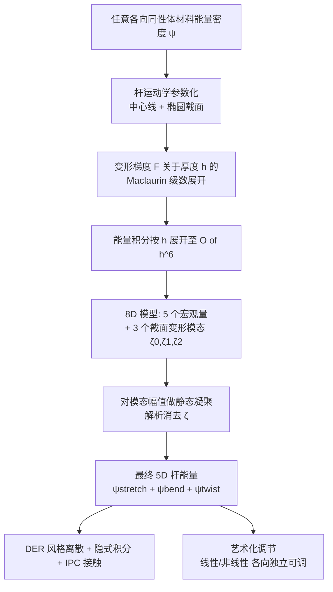

# ANIME-Rod: Adjustable Nonlinear Isotropic Materials for Elastic Rods

## 一句话总结

从任意 3D 各向同性非线性体材料出发，通过"截面趋于零"的极限过程解析推导出一个用中心线宏观量（纵向拉伸、径向缩放、两个弯曲曲率、扭转）表达的弹性杆能量，使得"任意超弹性材料的杆"（Stable Neo-Hookean 杆、StVK 杆等）都能被统一模拟，并可让艺术家独立调节拉伸/弯曲/扭转的线性与非线性行为。

## 研究背景

杆（rod）是图形学与工程中模拟发丝、缆绳、绳结、网状结构等细长物体的常用降维模型：只用中心线属性模拟，避免了完整体积模型的高昂代价。但既有图形学杆能量存在一个长期被忽视的局限——它们几乎都源自体积模型在**小应变线性化假设**下的推导，材料本质上被限定为单一的线性 Hooke 定律。

这带来两个问题：

- 无法表达材料的**非线性差异**。现实中不同超弹性材料（StVK、Neo-Hookean、Symmetric Dirichlet 等）即便有相同的杨氏模量 $E$ 与泊松比 $\nu$（即相同的小变形行为），在大变形下的表现也截然不同，而传统杆模型无法体现这种"材料风味"。
- 几何非线性处理不当。杆拉伸时截面会因泊松效应收缩，弯曲/扭转时截面会发生面内与面外的翘曲（warping）。若忽略这些效应，除 $\nu=0$ 外体积保持都是错的，弯曲与扭转常数即便在小变形下也不正确。

Kirchhoff 杆（截面刚性）和 2-director Cosserat 杆（截面仅允许线性变形）都无法得到正确的线性行为。力学界的高阶均质化方法（如 Le Clézio 等）虽同时考虑几何与材料非线性，但公式复杂、需要求解大量优化子问题作为预处理，且截面/材料一旦改变就要重跑，还不可微，难以用于反问题。本文要回答的核心问题是：能否推导一个用标准中心线参数表达、既匹配杆的非线性体积弹性、又能清晰分离并独立调节拉伸/弯曲/扭转的杆能量？

## 方法

### 整体流程

### 关键设计

**1. 从体材料到杆的"压扁"极限过程。** 杆内一点用曲线坐标 $(u,\xi_1,\xi_2)$ 参数化，未变形位置为

$$X(u,\xi_1,\xi_2) = Y(u) + h\,(\xi_1 N_1(u) + \xi_2 N_2(u))$$

其中 $h$ 是截面尺度，$N_1,N_2$ 是两个法向 director。杆总能量是体能量密度在整个体积上的积分，可分离为沿中心线的 1D 能量密度：

$$E = \int_{u_{\min}}^{u_{\max}} \psi_{\mathrm{1D}}(u)\,\Gamma(u)\,du, \qquad \psi_{\mathrm{1D}}(u) = \frac{1}{\Gamma(u)}\int_{S}\psi(F)\,\vert G\vert \,d\xi_1 d\xi_2$$

**2. 截面变形建模——本文的核心洞见。** 变形位置在中心线项之外，引入了径向各向同性缩放 $\rho(u)$（用于建模泊松效应导致的截面收缩/膨胀），以及一个 $O(h^2)$ 的截面翘曲修正：

$$x(u,\xi_1,\xi_2) = y(u) + h\rho(u)(\xi_1 n_1 + \xi_2 n_2) + h^2 q(u)\sum_{i=0}^{2}\zeta_i(u)\,\eta_i(\xi_1,\xi_2)$$

其中 $\eta_0,\eta_1,\eta_2$ 是**由线性理论解析计算出的**扭转与两个方向弯曲所诱导的截面变形场（对椭圆截面有闭式解，见下），$\zeta_i(u)$ 是它们的幅值（参与模拟的自由度）。这类似模型缩减中用线性模态基去逼近大变形，但对杆更适用，因为截面翘曲本身是 $O(h^2)$ 的次要效应。

**3. 按厚度 $h$ 展开并分离物理项。** 将变形梯度 $F$ 与被积函数展开为 $h$ 的幂级数至 $O(h^6)$，利用椭圆截面的对称性，奇次项积分为零，最终得到（直线未变形、弧长参数化情形）：

$$\psi_{\mathrm{1D}} = \pi h^2 ab\,\psi_{\text{stretch}} + \frac{\pi}{8}h^4 ab\,(\psi_{\text{bend}} + \psi_{\text{twist}}) + O(h^6)$$

拉伸项随 $h^2$ 缩放（要拉伸的"纤维"数量正比于截面积 $O(h^2)$），弯曲与扭转项随 $h^4$ 缩放（越细的杆越易弯易扭）。这种对 $h$ 的显式幂次展开是本文相对力学界工作的关键优势——它清晰地识别出拉伸、弯曲、扭转各项。

**4. 静态凝聚消去模态。** 三个能量项都是关于 $\zeta_0,\zeta_1,\zeta_2$ 的二次型，可解析求出使能量最小的最优幅值并代回，得到凝聚后的弯曲与扭转能量。例如凝聚扭转能量：

$$\psi_{\text{twist}}^{\text{condensed}} = \left((a^2+b^2)K_1 - \frac{(a^2-b^2)^2 K_2^2}{(a^2+b^2)K_1}\right)\rho^2\omega_0^2$$

这把 8D 模型压缩为仅依赖 5 个宏观量的最终模型。本文还指出一个 $O(h^4)$ 中依赖径向缩放导数 $\rho'$ 的项对正确体积保持至关重要（Viper [Angles et al. 2019] 曾隐含建模但缺乏物理原理）。

**5. 与线性理论及既有模型的关系。** 在线性区，本文能量简化为与 Bergou 等 Kirchhoff 杆模型几乎相同的形式，唯一差别是扭转常数：Bergou 用 Coulomb 扭转理论（假设截面刚性，人为加硬扭转），而本文推导得到的是物理正确的 Saint-Venant 扭转常数（与 Panetta 等一致）。

**6. 艺术化材料设计。** 本文识别出一个物理固有局限：直到 $O(h^6)$，弯曲与扭转能量**总是**关于曲率 $\omega_i$ 二次的，无论底层材料 $\psi$ 如何，因此**无法通过选材料让弯曲/扭转变得更非线性**。为满足图形学的艺术需求，本文提出"放松物理"：
- 小变形层面，可通过缩放 $E$、$h$、$G/E$（泊松比）分别独立调节拉伸/弯曲/扭转刚度。
- 大变形拉伸非线性，通过向体能量加入 $\psi_{\text{nonlin}} = p_{\text{stretch}}\sum_i(\lambda_i-1)^4$（不改变 $E,\nu$）。
- 大变形弯曲/扭转非线性，通过将 $\omega_i^2$ 替换为 $\omega_i^2 + p_{\text{bend}}\omega_i^4$（及扭转对应项）——虽非物理正确，但让艺术家用两个参数即可独立控制六个材料维度。

**7. 离散与时间积分。** 采用 DER 风格离散（Bergou 2008），自由度为顶点位置、每条边的扭转角 $\theta_i$、以及每顶点的径向缩放 $\rho_i$；用隐式后向欧拉 + Newton-Raphson 求解，Pardiso 解线性系统，碰撞与自碰撞用 IPC。梯度与 Hessian 由 Matlab 符号计算生成 C/C++ 代码。

## 实验结果

**与体积 FEM 对比（精度）。** 在拉伸圆柱、悬挂龙、Möbius 带、弯曲动力学等实验中，本文方法在大拉伸、大曲率、大扭转下均与体积 FEM"真值"非常接近，而图形学常用方法（如 Bergou 2010）会明显偏离。悬臂测试（Romero 等）也顺利通过：当 $\Gamma_{\text{cantilever}} < 1000$ 时各材料曲线重合（拉伸 < 2%），超过 1000 后材料差异开始显现。

**与 ground truth 的能量误差（Table 4）。** 随机采样 1000 组应变（$0.5\le\lambda\le1.5$，$-50\le\omega_i\le50$，$h=0.01$），相对于 Le Clézio 等真值的 1D 杆能量密度相对误差（百分比）：

| 指标 | 本文方法 | Viper | Kirchhoff |
| --- | --- | --- | --- |
| 最小误差 | 0.0006 | 0.051 | 6.14 |
| 最大误差 | 7.33 | 52.6 | 55.9 |
| 平均误差 | 1.52 | 11.9 | 25.2 |
| 误差标准差 | 1.44 | 9.74 | 10.2 |

本文平均误差 1.52%，远优于 Viper 的 11.9% 与 Kirchhoff 的 25.2%，验证了 $\eta_i$ 截面变形场的重要性。

**性能（Table 2、Table 3）。** 单步模拟时间（秒，含全部 Newton 迭代）。例如 plectoneme（200 顶点）总耗时 1.058s，braid（4000 顶点）18.848s，hairy ball（2520 顶点）2.31s。与 DER 和体积 FEM 对比：

| 场景 | 本文 #DoFs | 本文时间 | DER #DoFs | DER 时间 | FEM #DoFs | FEM 时间 |
| --- | --- | --- | --- | --- | --- | --- |
| Möbius | 4999 | 0.963 | 3999 | 0.645 | 183000 | 20.07 |
| beam | 499 | 0.055 | 399 | 0.030 | 18300 | 1.17 |
| pendulum | 5011 | 0.877 | 4011 | 0.576 | 183012 | 17.56 |
| bending dynamics | 499 | 0.096 | 399 | 0.065 | 18300 | 2.19 |

本文因额外自由度与 $\psi_{\mathrm{1D}}$ 复杂度，比 Bergou 2010 约慢 50%，但比体积 FEM（截面分辨率 20/50/100）快约 22×、192×、1285×。

**材料风味展示。** Figure 1 显示三种材料下 plectoneme 的自缠绕数（writhe，$W=\frac{1}{4\pi}\oint\oint(dr_1\times dr_2)\cdot\frac{r_1-r_2}{|r_1-r_2|^3}$）随非线性强弱变化：材料非线性 StVK > SNH > SymDir，而 writhe 反向 SymDir > SNH > StVK。此外还展示了重力下螺旋杆的螺旋反转、辫子编织、随材料变化的扭转频率、椭圆截面屈曲方向差异等。

## 亮点与局限

**亮点：**

- 从第一性原理统一推导：拉伸、弯曲、扭转都源自同一个体积弹性极限过程，避免了以往对三种能量的临时拼凑与手工调参。
- 对厚度 $h$ 的显式幂次展开，使各能量项物理意义清晰、可独立调节，这是相对力学界均质化方法的关键优势。
- 无需预处理、无需求解子问题，改截面几何/尺寸/材料都很容易，且方法可微，天然适合反问题。
- 支持任意各向同性体材料、任意（非直、非弧长参数化）未变形形状、任意椭圆截面、任意大变形。
- 诚实地指出了杆物理的固有局限（弯扭能量至 $O(h^6)$ 恒为二次），并给出"放松物理"的艺术化控制方案。

**局限：**

- 能量截断在 $O(h^6)$，忽略更高阶几何效应；理论上极端变形下可能出现负应变能，但实践中未观测到（$h$ 小时 $h^4$ 项也小，自然抑制异常）。
- 仅建模椭圆（且沿杆恒定）未变形截面；其他形状虽可解析或数值处理，但本文未实现。
- 强非线性材料带来剧烈非线性，需要线搜索保证稳定性。
- 未研究各向异性体材料。
- 只用了三个模态（两弯一扭），更多模态可进一步提升精度。
- 弯曲/扭转的大变形非线性调节仅针对直线未变形杆推导。

## 延伸思考

本文最有启发性的一点是把"模型缩减"思想引入截面翘曲：用线性理论算出的少数变形模态作为基去逼近大变形下的截面行为，在精度（平均误差 1.52%）与效率（无预处理、可微）之间取得了很好的平衡。这种"用线性模态张成的低维空间近似非线性响应"的策略，与体积模拟中的子空间方法一脉相承，可能推广到壳、膜甚至更一般的降维弹性体。

另一个值得玩味的是本文对"物理正确"与"艺术可控"边界的坦诚划定。它先证明了体积理论无法让弯扭更非线性这一负面结论，再提供越界的工程手段。对图形学而言，这种"先讲清物理天花板、再给出受控违反"的做法，比盲目堆参数更可信，也为后续在物理约束下做艺术化材料设计提供了范式。

结尾提到的反问题方向尤其诱人：因为能量源自体积弹性且可微，理论上可从真实世界对杆施加的力/力矩/拉伸/曲率/扭转观测中反解出 3D 体材料参数，这为"从现实标定超弹性材料"打开了一条路径。
