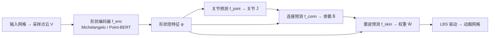

## 一句话总结

本文构建了包含 23 万个带专家级绑定与蒙皮标注的 3D 资产大规模数据集 Anymate，并基于它提出一个由关节预测、连接预测、蒙皮权重预测三个模块串联的学习式自动绑定框架，能从任意 3D 网格自动生成骨骼与蒙皮，从而让用户通过操纵骨架完成动画。

## 研究背景

- 领域现状：3D 动画在游戏、影视和 AR/VR 中已成刚需，但把一个静态模型变成可动画版本要经过两步——绑定（rigging，用骨骼等稀疏可解释的控制手柄勾勒运动意图）和蒙皮（skinning，定义网格如何随骨骼运动而稠密形变）。这两步都高度依赖专家手工，耗时费力。
- 核心痛点：传统自动绑定方法（如 Pinocchio）依赖几何启发式和预定义模板骨架，只能覆盖人形或四足等有限类别，遇到复杂几何就失效；近来的数据驱动方法（如 RigNet）泛化性更好，但受限于训练数据规模——现有公开绑定数据集最大的也只有 3.3K 资产，模型难以扩展。
- 本文 idea：既然 Objaverse-XL 这类超大规模 3D 资产库里其实藏着大量艺术家精心制作的动画信息，就把它们挖出来、统一格式，组建一个比现有数据集大约 70 倍的绑定数据集；再在其上系统地设计和评测多种架构，为自动绑定与蒙皮建立强基线和统一的比较基准。

## 方法

### 整体框架

方法分两条线。数据侧：从 Objaverse-XL 的千万级资产中筛出含骨架与蒙皮的模型，经过滤、去重、增广和格式统一，得到 23 万条「网格 + 骨骼 + 逐顶点蒙皮权重」的数据。模型侧：先用点云编码器把输入网格编成形状隐特征 $$\phi$$，再串联三个模块——关节预测 $$f_{joint}$$ 输出一组 3D 关节，连接预测 $$f_{conn}$$ 把关节两两连成骨骼，蒙皮预测 $$f_{skin}$$ 给出每个顶点对每根骨的权重。动画则沿用经典的线性混合蒙皮（LBS）。

### 关键设计

- **统一表示与数据处理**：给定网格顶点 $$V \subset \mathbb{R}^3$$，每根骨用一对头/尾关节 $$J_b^{head}, J_b^{tail}$$ 表示，骨骼间共享关节形成运动学树；形变用线性混合蒙皮 $$V_i'(\xi)=\left(\sum_{b=1}^{B} w_{i,b} G_b(\xi) G_b(\xi^*)^{-1}\right) V_i$$，其中 $$w_{i,b}$$ 是顶点 $$V_i$$ 对骨 $$b$$ 的蒙皮权重。数据处理上，只保留顶点数在 $$(128, 65535)$$、骨骼数在 $$(8, 64)$$ 区间的资产，按骨架相似度去重，剔除骨架大部分（超过 70%）落在网格外的样本，并用同一资产的不超过三个额外关键帧姿态做增广；每个网格重采样 8192 个点并用重心插值重算蒙皮权重。最终 23 万余条数据中随机留 5.6K 作测试集，其余 225K 训练，另构建 14K 的小集（Anymate-small）做消融。

- **关节预测的三类架构**：作者把关节预测当作「数量可变、顺序无关」的点集生成问题，探索三条路线。回归式用单层 perceiver transformer 加 96 个可学习查询 token 直接回归关节坐标，用 Chamfer 距离监督，再对原始预测做聚类得到最终关节数；扩散式（借鉴 Point-E 的拼接式与 Point-Infinity 的交叉注意力式）用去噪 transformer 从高斯噪声采样关节，好处是推理时可让用户指定任意关节数；体素式把任务转成「空间某点是否靠近关节」的概率场，分别用隐式神经场和 tri-plane（EG3D + StyleGAN2）实现，再阈值化并聚类提取关节。

- **连接预测的对称设计**：模块输出一个 $$K \times K$$ 的连接矩阵 $$\hat{C}$$，元素 $$\hat{c}_{i,j}$$ 表示关节 $$i$$（头）与 $$j$$（尾）由骨连接的概率，用二元交叉熵监督。利用 Blender 中「每根骨最多一个父骨」的约束——连接矩阵每列之和为 1（有父）或 0（根，此时对角置 1）——推理时对每列取 argmax 即可确定根关节或找出头关节，从而拼出运动学链。架构上提出 token-conditioned 与 two-branch 两种，都用「点积」高效生成整张连接矩阵，避免 RigNet 那种对每对关节都过一遍 MLP 的 $$O(K^2)$$ 开销。

- **蒙皮权重预测**：模块预测每个顶点对每根骨的权重矩阵 $$\hat{W} \in \mathbb{R}^{\vert V\vert  \times B}$$，用与真值的余弦相似度损失训练。提出拼接式与交叉注意力式两种架构，都是先得到逐点 token 与逐骨 token，再借助连接预测里的点积技巧加 softmax（在所有骨上归一化）产生权重。相比 RigNet 只对最近的五根骨预测权重（关节预测有误时常不够用），本文对全部骨骼建模更稳健。

## 实验结果

三个模块分别在 Anymate-small（14K）和 Anymate-train（225K）上训练、在 Anymate-test 上评测。核心结论是：作者提出的架构随数据规模增大而显著提升，而 RigNet 等旧方法扩展性差、数据变多反而可能退化。下面以蒙皮权重预测（主实验之一，指标最完整）为例，对比 225K 训练下的表现：

| 方法 | CE ↓ | Cos ↑ | MAE ↓ | 训练数据 |
|------|------|-------|-------|----------|
| GeoVoxel（几何法） | 3.569 | 0.407 | 0.056 | 无需训练 |
| RigNet | 1.521 | 0.693 | 0.028 | 225K |
| Bert-Cross（本文） | 0.741 | 0.915 | 0.014 | 225K |

其余实验的关键数字：关节预测上，Bert-Regress 在 225K 训练下 Chamfer 距离从 14K 的 0.091 降到 0.077，明显优于 Pinocchio（0.198）和 RigNet（0.089）；连接预测上，Bert-2Branch 从 14K 时的 Precision 61.6% 跃升到 225K 时的 84.6%，而 RigNet 在大数据上反而跌到 47.9%（欠拟合）。定性对比中，商业工具 Maya、Animate Anything 依赖模板骨架、对复杂几何泛化差，RigNet 即便在大数据集上重训仍会产生严重形变，本文模型则能在一分钟内给出更合理的骨架、蒙皮与动画。

## 亮点与局限

- 亮点：
  - 数据集规模是现有公开绑定数据集的约 70 倍（23 万 vs 3.3 万级），且类别通用（从人形、动物到家具、机械等日常物体），为数据驱动自动绑定提供了此前缺失的基础。
  - 把绑定拆成关节、连接、蒙皮三个清晰子任务，每个子任务都系统枚举回归/扩散/体素、token/双分支、拼接/交叉注意力等多种架构做成强基线，为后续研究提供了统一可比的基准。
  - 用点积生成连接矩阵与蒙皮矩阵，比逐对过 MLP 高效；扩散式关节预测还允许用户在推理时指定任意关节数。
- 局限：
  - 三个模块是顺序串联的，前一步（关节、连接）的误差会传导到后续蒙皮，缺乏端到端联合优化。
  - 数据筛选把顶点数、骨骼数限制在固定区间，且要求骨架大部分落在网格内，可能排除了极大/极复杂或非标准结构的资产。
  - 蒙皮沿用线性混合蒙皮，本身在关节大幅弯折处存在体积塌陷等固有问题；对无绑定先验的全新类别泛化能力论文未充分验证。

## 延伸思考

- 本文与同期的 RigAnything、MagicArticulate 等自回归绑定模型思路不同，后者强调自回归生成，本文则聚焦「数据集 + 基准 + 基线」的定位，二者可互补——大数据集正好能喂养各类生成式绑定模型。
- 三模块串联的误差累积问题，值得探索端到端或带反馈的联合训练，或让蒙皮阶段对关节/连接误差更鲁棒。
- 该数据集把 Objaverse-XL 里被忽视的动画信息系统化挖掘出来，这一思路也可推广到提取其他「隐藏标注」（如材质、物理属性、装配关系），为更多 3D 理解与生成任务提供监督。
- 与当前 3D 生成大模型结合，有望形成「生成静态资产 → 自动绑定蒙皮 → 直接可动画」的完整流水线，是文本/图像到可动画 3D 内容的重要一环。
