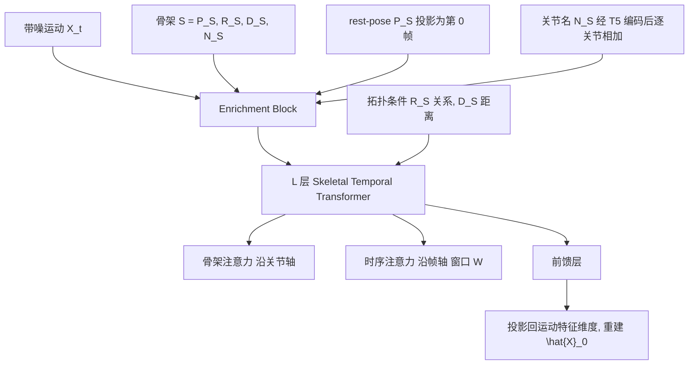

## 一句话总结

本文提出 AnyTop，一个只用骨架结构（关节连接关系与关节名称）作为输入的扩散模型，能为拓扑各异的角色（双足、四足、多足节肢、无肢生物等）生成自然的运动，且无需针对每种拓扑做专门调整。

## 研究背景

角色动画是电影、游戏、虚拟现实等行业的基础任务。传统动画流水线里，每个角色都有独一无二的骨架，动画师需要在其上手工雕琢运动，耗时且高度依赖技巧。

近年基于神经网络的方法在运动生成与编辑上取得了不错进展，但大多受限于单一拓扑：要么只能处理同一套骨架，要么只允许骨骼比例不同（同构骨架），要么依赖骨架间的同胚关系。少数能处理多骨架的方法又缺乏可扩展性，往往需要给每个骨架加专门的功能模块，甚至为每个骨架训练一个独立模型。

作者指出任意骨架运动生成长期无人问津的两个根本原因：

- 数据的不规则性。骨架在关节数量和连接方式上各不相同，挑战了标准的处理与分析方法。
- 数据集匮乏。缺少涵盖多样拓扑的运动数据集，使数据驱动方法难以施展。

论文按骨架可变性把生成式运动模型分为四类，可变性依次递增：

- 单一（Single）：顶点、连接、骨骼长度完全相同。
- 同构（Isomorphic）：顶点与边相同，仅骨骼比例可能不同。
- 同胚（Homeomorphic）：结构可变但源自同一 primal 图（通过边细分得到），运动链数量与末端执行器数量相同。
- 非同胚（Non-homeomorphic）：结构不同且没有共同的 primal 图。

AnyTop 面向最难的非同胚骨架，是目前唯一能接受任意输入拓扑（包括训练中未见过的拓扑）并据此生成运动的基于骨架的方法。

## 方法

### 整体框架

AnyTop 是一个去噪扩散概率模型（DDPM）。输入是带噪运动 $$X_t$$ 与骨架描述 $$S = \{P_S, R_S, D_S, N_S\}$$，模型直接预测干净运动 $$\hat{X}_0$$ 而非噪声。它由两大部件构成：Enrichment Block（富化模块）把骨架信息注入带噪运动；Skeletal Temporal Transformer Block（骨架-时序变换器模块）沿关节轴与时间轴分别做注意力，并把拓扑信息嵌入骨架注意力图。

### 运动与骨架表示

运动表示为三维张量 $$X \in \mathbb{R}^{N \times J \times D}$$，其中 $$N$$、$$J$$ 分别是数据集中最大帧数与最大关节数，运动会在帧与关节两个维度上补零对齐。采用冗余表示：每个关节（根关节除外）由根相对位置 $$p_j \in \mathbb{R}^3$$、6D 旋转 $$r_j \in \mathbb{R}^6$$、线速度 $$v_j \in \mathbb{R}^3$$、足部接触标签 $$fc_j \in \{0, 1\}$$ 组成，合计 $$D = 13$$。与 HumanML3D 把整帧关节拼成一个 token 不同，AnyTop 把每个关节独立编码，每帧产生 $$J$$ 个 token，从而既能捕捉骨架内关节交互，也能学习跨骨架的通用关节行为。

骨架用四项描述：$$P_S$$ 是转换成运动帧格式的 rest-pose；$$R_S \in \mathbb{N}_0^{J \times J}$$ 记录关节对之间的关系类型，共六种（child、parent、sibling、no-relation、self、end-effector，后两者仅在 $$i = j$$ 时有效，end-effector 标记叶子关节）；$$D_S \in \mathbb{N}_0^{J \times J}$$ 记录两关节在图上的拓扑距离，截断到最大距离 $$d_{max}$$；$$N_S$$ 是关节的文本描述（常见于 bvh、fbx 等资产格式）。

### 关键设计：拓扑条件注入

这是全文核心。以往方法把注意力或卷积限制在骨架层级的相邻关节；AnyTop 让每个关节都能关注所有其他关节以捕捉长程关系，再通过把拓扑信息注入注意力图来找回局部结构先验，使关节在关注全局的同时优先靠近拓扑更近的关节。

具体做法借鉴图领域的相对位置编码，但把它从判别式任务迁移到运动生成，并重新定义了适配骨架的边类型、引入了时间轴。为距离与关系分别学习 query/key 嵌入 $$E^D_q, E^D_k \in \mathbb{R}^{(d_{max}+1) \times F}$$ 和 $$E^R_q, E^R_k \in \mathbb{R}^{6 \times F}$$，对关节对 $$i, j$$ 构造两张附加注意力图：

$$a^D_{ij} = q_i \cdot E^D_q[D_{ij}] + k_j \cdot E^D_k[D_{ij}]$$

$$a^R_{ij} = q_i \cdot E^R_q[R_{ij}] + k_j \cdot E^R_k[R_{ij}]$$

再把它们加到标准注意力图上并缩放：

$$a_{ij} = \frac{q_i \cdot k_j + a^D_{ij} + a^R_{ij}}{\sqrt{F}}$$

最后按行做 softmax 得到注意力分数。此外，Enrichment Block 把 $$P_S$$ 投影到隐特征维度 $$F$$ 后作为第 0 帧拼接，把 $$N_S$$ 经 T5 编码并投影到长度 $$F$$ 后加到各帧对应关节上，从而在不同骨架之间搭起"相似功能部位"的语义桥梁。

### 训练

用 Balancing Sampler 缓解数据不平衡：给定 $$k$$ 种骨架类型、类型 $$i$$ 有 $$n_i$$ 个样本时，每个样本被采样的概率为 $$1/(n_i \cdot k)$$。骨架增强包括随机删除 10% 到 30% 的关节、在已有边中点添加新关节。

训练目标以简单重建损失为主：

$$L_{simple} = E_{t \sim [1, T]} \|AnyTop(X_t, t, S) - X_0\|_2^2$$

由于旋转的均方误差不直接对应旋转空间的距离，对 6D 旋转额外施加测地损失 $$L_{rot}$$（先用 Gram-Schmidt 转成旋转矩阵再算测地距离）。最终目标为 $$L = L_{simple} + \lambda_{rot} L_{rot}$$。

## 实验结果

数据集为 Truebones Zoo，含 70 种骨架（哺乳类、鸟类、昆虫、恐龙、鱼、蛇等），每种骨架 3 到 40 段运动，共 1219 段、147,178 帧。作者对齐了朝向、平均骨骼长度、首帧位置等，贡献了一份与 HumanML3D 表示对齐的处理版数据。

实现上用 $$T = 100$$ 个扩散步、$$L = 4$$ 层 STT、隐维度 $$F = 128$$，单张 NVIDIA RTX A6000 训练 24 小时。评测基准从累计帧数在 600 到 1200 之间的骨架中随机选 30 个，按数据集比例含 43% 四足、17% 双足、23% 飞行、17% 昆虫。

四个指标：coverage（覆盖率，衡量真值时间窗被复现的比例，评价保真）、local diversity（局部多样性）、inter diversity（生成样本间多样性）、intra diversity diff（内部多样性差异，评价保真，越低越好）。理想结果是高保真且高多样。

主实验与两个改造后的基线对比（MDM 逐帧嵌入的单人骨架模型、SinMDM 每骨架单独训练）：

| 模型 | Coverage ↑ | Local Div. ↑ | Inter Div. ↑ | Intra Div. Diff. ↓ | 参数量（M）↓ |
| --- | --- | --- | --- | --- | --- |
| MDM∗ | 71.3±31 | 0.168±0.12 | 0.139±0.13 | 0.177±0.08 | 5.96 |
| SinMDM∗ | 89.3±15 | 0.080±0.13 | 0.280±0.13 | 0.144±0.09 | 176.1（5.87 × 30）|
| AnyTop（本文）| 80.5±20 | 0.252±0.14 | 0.312±0.17 | 0.118±0.07 | 2.28 |

AnyTop 在所有指标上超过 MDM，除 coverage 外全面超过 SinMDM（SinMDM 每个骨架单独训练，coverage 高在预期之内）。多样性指标差距显著，且 AnyTop 只用一个模型、参数量最少（2.28M），推理更快。

消融实验（去掉关键组件后性能下降）：

| 模型 | Coverage ↑ | Local Div. ↑ | Inter Div. ↑ | Intra Div. Diff. ↓ |
| --- | --- | --- | --- | --- |
| 去掉图属性嵌入（D, R）| 76.8±23 | 0.249±0.14 | 0.303±0.17 | 0.127±0.11 |
| 去掉 rest-pose token | 77.2±25 | 0.250±0.14 | 0.292±0.18 | 0.130±0.09 |
| 去掉关节名嵌入 | 82.3±17 | 0.218±0.12 | 0.276±0.15 | 0.113±0.06 |
| AnyTop（本文）| 80.5±20 | 0.252±0.14 | 0.312±0.17 | 0.118±0.07 |

去掉拓扑信息（D, R）后所有指标退化，说明模型难以按层级关系区分关节优先级；去掉 rest-pose 会丢失关节偏移与骨骼长度信息；去掉关节名会提高 coverage 但降低多样性——关节名本质是在"骨架内泛化"与"跨骨架泛化"之间权衡，作者选择保留关节名以增强跨骨架与未见骨架泛化，接受 coverage 的轻微下降。

泛化方面，作者用图特征上的 Wasserstein 距离量化未见骨架的分布外程度：Crab（分布内）、Centipede（中度分布外）、Cobra（高度分布外）。结果显示分布内的未见骨架表现稳健，随着偏离训练分布性能逐步下降。

## 亮点与局限

亮点：

- 提出了"由多样骨架结构控制运动生成"的新问题范式，是首个能接受任意输入拓扑（含未见拓扑）并生成运动的基于骨架的方法。
- 把图领域的相对位置编码迁移到生成式运动任务，用关系与拓扑距离两种节点亲和度注入注意力图，让全局注意力与局部结构先验共存。
- 引入 T5 编码的关节名，在不同骨架间建立语义对应，展现三种泛化：骨架内（时序与空间组合出新姿态）、跨骨架（迁移他者运动母题）、未见骨架（零样本推理）。
- 隐空间信息丰富，其 DIFT 扩散特征可直接用于关节对应、时序分割、运动编辑（补间、身体部位编辑）等下游任务。
- 模型参数少、单模型覆盖数十种非同胚骨架，仅需每种拓扑三个训练样本即可较好泛化。

局限：

- 依赖输入数据质量，清洗后仍有部分数据瑕疵未能解决。
- 数据增强过程计算开销大，复杂度为 $$O(J^2)$$。
- 空间对应中存在轻微的左右混淆，这是特征提取的常见问题。

## 延伸思考

AnyTop 把"骨架拓扑"当作一等条件输入，用图注意力 + 文本关节名把不同物种的运动统一到一个流形上，这个思路很有想象空间。作者提出的未来方向包括骨架重定向、多角色交互、文本与音乐驱动动画，以及一个特别有意思的点——通过修改关节的文本标签来编辑动画。

值得关注的是关节名文本先验的作用：它像一座跨物种的语义桥，把"猴子的手臂"和"狐狸的前肢"对齐。这提示我们，运动生成中语言模态或许不只是条件信号，而可以成为跨结构知识迁移的媒介。另一方面，DIFT 特征在运动域的成功也说明扩散模型的中间激活蕴含高质量的语义描述子，把它当作通用特征提取器用于分割、对应、检索等任务，可能比重新训练判别模型更划算。
