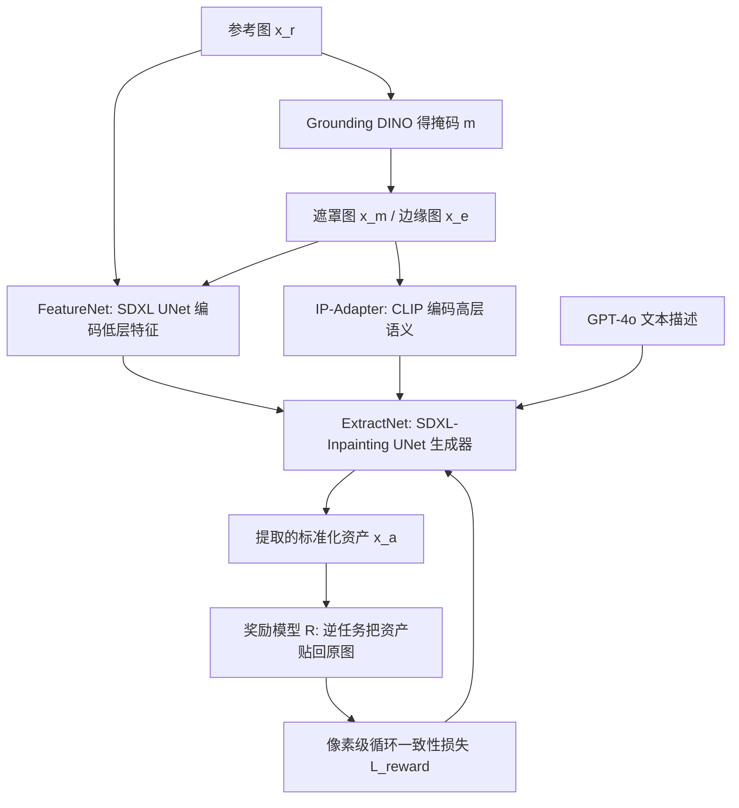

## 一句话总结

AssetDropper 提出首个"资产提取"生成框架：从用户框选的真实图像区域中，提取出去畸变、去遮挡的标准化正面资产，并用一个"把资产贴回原图"的生成式奖励模型做闭环反馈优化，从而显著提升提取结果与参考图的一致性和保真度。

## 研究背景

- 领域现状：扩散模型在"生成成品图像"上已经很成熟，但设计师在真实工作流里更需要的是标准化素材库（asset library）。把生成模型和标准化资产库结合仍是空白地带。
- 核心痛点：想从真实照片里抠出可复用的素材，目前只能靠 Photoshop 手工描贝塞尔曲线、做分割，费力且高度依赖美工水平，产出常带畸变和遮挡。现有可控生成方法（ControlNet、IP-Adapter）或通用编辑方法（InstructPix2Pix、OmniGen）在这种"含畸变/遮挡"的提取任务上表现都不够好。
- 本文 idea：把资产提取建模为"基于样例的图像修复（inpainting）"任务，训练一个专用扩散模型，从源图 + 掩码中生成标准化正面资产；同时用一个执行"逆任务"（把资产重新贴回原图）的生成式奖励模型提供闭环监督，缓解幻觉、增强一致性。这是首次用生成模型充当图像扩散模型的奖励模型。

## 方法

整体框架分两大部分：主生成网络 AssetDropperNet，以及提供反馈的奖励模型 R（结构与主网络相同，但执行逆任务）。输入参考图 $$x_r$$ 先经 Grounding DINO 得到资产掩码 $$m$$，进而得到遮罩图 $$x_m$$ 与边缘图 $$x_e$$，GPT-4o 生成资产文本描述，最终估计标准化资产 $$x_a$$。

关键设计：

1. 三分支条件编码。FeatureNet（冻结的 SDXL UNet 编码器）把源图、掩码、边缘图在通道维拼接后编码低层特征（输入卷积层扩到 6 通道）；IP-Adapter 用冻结 CLIP 图像编码器抽取遮罩图的高层语义；ExtractNet（SDXL-Inpainting UNet）作为主生成器，FeatureNet 特征注入自注意力层，IP-Adapter 与文本特征进入交叉注意力层。

2. 合成数据集 SAP（Standardized Asset Palette）。收集/生成 1 万多张标准化资产，在 Blender 中用 HDRI 模拟真实光照，通过 UV 投影把资产贴到日常网格（含平面与不同曲率曲面）上，再从前半球随机视角渲染，得到含畸变/遮挡的真实感配对数据；结合 VTON 数据集共构成 20 万配对样本。基准 SAP 共 212,557 条图-指令-掩码样本，训练/测试划分为 191,301 / 21,256。

3. 生成式奖励模型。假设"好的资产"应能被无缝贴回原图，据此训练一个执行逆任务的扩散模型作为奖励模型 R，用像素空间循环一致性损失约束提取结果。

4. 高效奖励微调策略。借鉴 ControlNet++ 的单步策略，用单步采样从含噪数据估计干净资产 $$x'_{a,0}$$：

$$x'_{a,0} = \frac{x_{a,t} - \sqrt{1-\alpha_t}\,\epsilon_\theta(x_{a,t}, x_r, m, x_e, c, t)}{\sqrt{\alpha_t}}$$

再单步估计干净参考图 $$y'_{r,0}$$，得奖励损失 $$L_{reward} = L(x_r, R(x'_{a,0}, y_{r,t_c}))$$。为保证监督有效，仅当时间步足够小（$$t \le t_{thres}$$）时加入奖励项：

$$L_{total} = L_{train} + \lambda \cdot L_{reward}\ \ (t \le t_{thres}),\quad L_{total} = L_{train}\ \ (\text{otherwise})$$

## 实验结果

在 SAP-Syn（合成）与 SAP-Real（真实）测试集上，用 FID、KID、CLIP-I 三项指标各取 1000 样本评测，与 T2I-Adapter、InstructPix2Pix、ControlNet 对比，并做边缘图 / 奖励机制的消融：

| Method | Dataset | FID ↓ | KID ↓ | CLIP-I ↑ |
| --- | --- | --- | --- | --- |
| T2I-Adapter | SAP-Syn | 106.19 | 0.0274 | 0.9164 |
| InstructPix2Pix | SAP-Syn | 142.24 | 0.0590 | 0.8966 |
| ControlNet | SAP-Syn | 105.09 | 0.0300 | 0.9141 |
| Ours w/o Reward & w/o Edge map | SAP-Syn | 62.41 | 0.0019 | 0.9707 |
| Ours w/o Reward & w/ Edge map | SAP-Syn | 60.33 | 0.0017 | 0.9634 |
| Ours w/ Reward & w/ Edge map | SAP-Syn | 50.36 | 0.0016 | 0.9729 |
| T2I-Adapter | SAP-Real | 96.12 | 0.0278 | 0.9164 |
| InstructPix2Pix | SAP-Real | 132.75 | 0.0592 | 0.8970 |
| ControlNet | SAP-Real | 93.68 | 0.0312 | 0.9150 |
| Ours w/o Reward & w/o Edge map | SAP-Real | 49.78 | 0.0015 | 0.9625 |
| Ours w/o Reward & w/ Edge map | SAP-Real | 49.48 | 0.0014 | 0.9639 |
| Ours w/ Reward & w/ Edge map | SAP-Real | 48.71 | 0.0013 | 0.9673 |

完整版（含边缘图与奖励）在两个数据集上均取得最优 FID/KID/CLIP-I。此外 25 人用户研究中，本文完整方法在一致性和质量两项打分上均高于各基线。

## 亮点与局限

- 亮点：首次把"资产提取"作为独立生成任务提出并建立数据集与基准；首次用生成式模型（而非判别式模型）作为扩散模型的奖励模型，通过"贴回原图"的逆任务闭环缓解幻觉；单步奖励微调策略让多步扩散奖励模型的端到端训练变得可行。
- 局限：作者指出模型在严重遮挡、或视角导致信息大量丢失的情况下仍会失效。

## 延伸思考

- 用生成模型充当奖励模型这一思路，本质上是把"可逆性/循环一致性"当作监督信号，未来或可推广到其他"提取-重建"对偶任务（如去光照、去阴影、材质分离）。
- 论文结论提出借助视频模型的时间先验来补齐单图信息缺失，这对处理严重遮挡是自然的方向；结合多视角一致性约束可能进一步提升 3D 纹理化应用的稳定性。
