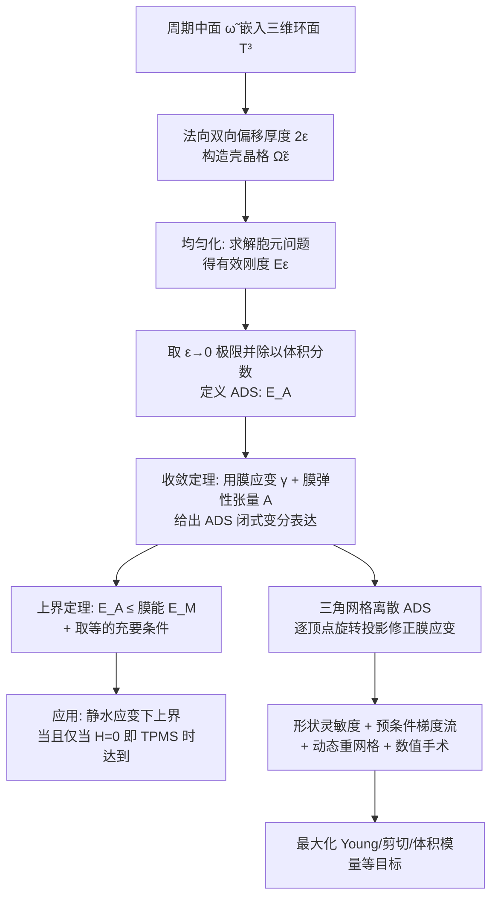

## 一句话总结

本文基于 Ciarlet 壳理论对壳晶格超材料做渐近分析，提出"渐近方向刚度"（ADS）这一新度量来刻画中面几何如何决定有效刚度，并首次严格证明了 TPMS（三周期极小曲面）为何具有极高体积模量，同时给出一套三角网格离散与形状优化框架来直接设计高刚度中面。

## 研究背景

TPMS 型壳晶格超材料在过去十年被广泛用于轻质高强结构设计，大量仿真与实验都表明它们具有出色的刚度与强度。但这些结论几乎全是"经验性的"：来自对有限几类 TPMS 的数值仿真与物理试验，缺乏严格理论支撑。因此有两个根本问题一直悬而未决：

- TPMS 为什么会表现出如此优异的力学性能？其内在机理是什么？
- 这些优势是否对所有 TPMS（包括尚未被发现的）都成立？

由于 TPMS 通常充当壳晶格的中面（middle surface），弄清"中面几何如何影响有效刚度"就成为理论研究的自然切入点。已有的均匀化理论与壳理论都不能直接套用：壳晶格是周期性闭合曲面（拓扑非平凡，无法用单一坐标图覆盖），边界条件与经典壳方程不同，而且本文关心的是一个标量（刚度）的收敛，而非位移场向量的收敛。这些差异要求对经典理论做实质性的技术改造。

## 方法

### 核心概念：从有效刚度到 ADS

壳晶格由一张光滑周期中面 $\tilde{\omega}$ 在代表体元（RVE，取为三维环面 $\mathbb{T}^3$）内沿法向双向偏移厚度 $2\epsilon$ 得到。在宏观应变 $\varepsilon$ 下，通过均匀化理论求解胞元问题得到有效刚度能量 $E_\epsilon(\tilde{\omega};\varepsilon)$。由于厚度趋零时该能量本身也趋零，作者定义**渐近方向刚度（ADS）**，抽取其领头阶行为——即刚度与体积分数之比的极限：

$$E_A(\tilde{\omega};\varepsilon) := \lim_{\epsilon \to 0} \frac{E_\epsilon(\tilde{\omega};\varepsilon)}{\rho_\epsilon(\tilde{\omega})}$$

其中 $\rho_\epsilon$ 是 RVE 内固体的体积分数。ADS 剥离了厚度效应，只反映中面几何与有效刚度的内在关系。

### 收敛定理与上界

作者证明 ADS 由中面上的一个变分问题决定（收敛定理，Theorem 1）：

$$E_A(\tilde{\omega};\varepsilon) = \frac{1}{\vert \tilde{\omega}\vert }\int_{\tilde{\omega}} (e_{\tilde{\omega}} + \gamma(\bar{u})) : A_{\tilde{\omega}} : (e_{\tilde{\omega}} + \gamma(\bar{u}))$$

其中 $A_{\tilde{\omega}}$ 是膜弹性张量，$e_{\tilde{\omega}}$ 是宏观应变在中面上的切向分量，$\gamma$ 是膜应变，$\bar{u}$ 是松弛位移场（求解相应变分方程得到）。膜应变由两部分构成：切向运动引起的面内拉伸，以及法向偏移因中面外曲率导致法向不平行而产生的拉伸：

$$\gamma(\eta) := \mathrm{Sym}[\nabla \eta_{\tilde{\omega}}] - \eta_3 b$$

进一步，把变分解代回得到 ADS 的紧凑形式，并证明**上界定理**（Theorem 2）：

$$E_A(\tilde{\omega};\varepsilon) \le E_M(\tilde{\omega};\varepsilon)$$

$E_M$ 是"齐次膜能"，只依赖中面法向分布。物理直觉是：曲面受宏观应变时先做仿射变形得到能量 $E_M$，随后借助 RVE 内的空腔进一步松弛，把能量降到最终值 $E_A$；当且仅当不发生松弛（$\bar{u}=0$）时取等。

### TPMS 的最优性：首个严格解释

作者给出取等的等价充要条件（Theorem 3，仅涉及中面几何、无需解方程），并证明能对**所有**应变都取等的光滑曲面只有平面（Theorem 4）。但若只针对**静水应变** $\varepsilon = \tfrac13 I$，情况不同。定义**渐近体积模量（ABM）** $K_A(\tilde{\omega}) := E_A(\tilde{\omega};\tfrac13 I)$，作者证明静水载荷下齐次膜能是常数，从而给出关键结论（Theorem 5）：

$$K_A(\tilde{\omega}) \le \frac{4}{9}(\lambda_0 + \mu), \quad \text{当且仅当 } \tilde{\omega} \text{ 为 TPMS 时取等}$$

原因是：静水载荷下松弛力是与平均曲率 $H$ 成正比的法向力；平均曲率消失（$H=0$，即极小曲面 TPMS）时不发生松弛，ADS 达到上界。作者还说明该结论与经典 Hashin–Shtrikman 上界的关系——HS 上界要求立方对称，而本文只要求光滑周期中面，因此更一般：任何立方 TPMS 壳晶格在低体积分数下体积模量都逼近 HS 上界，即使无立方对称本定理仍成立。

### 离散化与形状优化

为在一般曲面上优化 ADS，作者用三角网格离散中面。直接的平面应力单元会产生剧烈震荡、不合物理的位移解，缺失曲率信息。改进思路是逼近第二基本形式并修正切向应变：关键是用**逐顶点投影**代替统一投影——先把顶点切空间旋转对齐到面片平面再投影位移，得到精度显著提升的膜应变离散格式：

$$\gamma(u)\vert _f \approx \mathrm{Sym}[\nabla u_\tau] - u_3 b_f$$

离散后变分方程化为线性系统 $K_h u_h = f_h$，即可计算渐近弹性张量。优化上，作者推导了 ADS 关于法向速度的形状灵敏度，并巧妙利用变分方程**消去高阶导数**（第二基本形式的协变导数、法向速度的二阶导数），得到易于在三角网格离散的灵敏度公式。关键工程技巧包括：

- **Laplacian 预条件梯度**：解决 $L^2$ 梯度导致线搜索步长过小的问题，允许更大时间步、加速收敛。
- **动态重网格**：借用已有算法维持网格质量，避免优化停滞。
- **数值手术（numerical surgery）**：基于主曲率检测颈缩奇点、尖点、褶皱等，切除后用 CGAL 补洞并做双 Laplacian 光顺，每四次迭代执行一次。

## 实验结果

**收敛性验证**：在同时缩小网格尺寸 $h$ 和厚度 $\epsilon$ 时，本文离散的渐近弹性张量与 ABAQUS 有限元仿真结果的相对误差趋于零；与旋转面半解析解对比，收敛速率达到线性甚至更好。

**TPMS 最优性验证**：对 15 类 TPMS 用 Surface Evolver 生成，随厚度减小逼近 $C_A$ 计算 ABM，结果均非常接近理论上界（本文设定下 $K_A^* \approx 0.3174$），即使体积分数达到近 20% 仍然贴近。对由 Schwarz P/D、IWP、Gyroid 扰动得到的 1000 个非 TPMS 曲面，$K_A/K_A^* \le 1$ 恒成立，且扰动越强（越偏离 TPMS）该比值越低，与理论预测吻合。

**优化效果**：在多个目标下显著提升刚度。剪切模量优化中，得益于手术操作移除拓扑障碍，$C^{1212}_A$ 从 0.0428 提升到 0.3723、$C^{1313}_A$ 从 0.0637 提升到 0.3114；体积模量优化中曲面自发收敛为 TPMS 形态，$K_A$ 从约 0.04–0.07 提升到约 0.31（逼近上界 0.3174）；任意应变下 $E_A$ 可从 0.53 提升到 3.5、从 0.76 提升到 4.45 等。

**有效刚度一致性**（Table 1）：优化中面 ADS 确实能提升实际有厚度壳晶格的有效刚度，二者趋势一致。$H^r_{2\epsilon}$（有效刚度提升相对于渐近刚度提升的归一化比例）随厚度增大而下降但仍显著：例如 Fig.17[110] 在 $2\epsilon=0.02/0.05/0.1/0.15$ 下分别为 98%/96%/94%/92%，多数曲面在薄壳（$2\epsilon=0.02$）时保持 85%–99%。

**效率优势**：相比 Reissner–Mindlin 板单元每节点 5 个自由度，本文格式每节点仅 3 个自由度，线性系统更小；相比 NURBS/Bézier 参数化方法，更易处理复杂拓扑的周期曲面。

## 亮点与局限

**亮点**：

- 首次为 TPMS 壳晶格的高体积模量提供**严格数学解释**（$H=0$ 时 ADS 达上界），把长期停留在经验层面的观察上升为定理。
- ADS 度量将中面几何与厚度**解耦**，优化只针对中面，因此设计出的结构在一系列厚度下都有理论保证的高性能，特别适合厚度未定的设计场景。
- 离散格式的逐顶点旋转投影修正是关键工程贡献，配合预条件梯度、动态重网格、数值手术形成完整可用的优化管线。

**局限**：

- ADS **不刻画弯曲刚度**：纯弯曲变形位于不可拉伸位移空间（$\ker\gamma$），而壳对这类变形抵抗弱。作者提出可通过求解特征值问题、最大化最小特征值来抑制弯曲、增强抗屈曲能力，但留待未来。
- 不适合设计**指定弹性张量或最小化刚度**的目标（如负泊松比）：追求柔顺会让曲面起皱，破坏网格光滑性、使逼近失准。
- **拓扑受初始形状限制**：手术只能简化拓扑，无法从低亏格生成高亏格曲面；实验中还观测到自交，违反嵌入假设并带来制造问题（封闭腔体）。
- 实现未做性能优化，未集成 Nesterov/Anderson 加速或几何多重网格求解器。

## 延伸思考

这项工作的价值在于把图形学里常靠"采样—仿真—经验总结"的超材料设计，拉回到可证明的理论轨道上。ADS 把"厚度"这个恼人的自由度从设计中剥离，使得"设计一张好的中面"成为一个干净的几何优化问题，这种解耦思路对其他厚度/尺度相关的结构设计（如板晶格、桁架—壳混合结构）可能同样适用。作者的姊妹工作已将同一渐近分析框架延伸到壳晶格的热传导（thermal lattice），说明这套"标量量的渐近收敛"分析范式有较强可迁移性，未来或可扩展到声学、扩散、电磁等多物理场的超材料设计。

另一个值得关注的方向是弯曲/屈曲：ADS 只管膜刚度，而真实薄壳的失效往往由屈曲主导。作者指出让 $\ker\gamma$ 退化为零可增强稳定性，这暗示"高膜刚度"与"抗屈曲"之间存在可量化的几何权衡，若能把二者统一进一个优化目标，将更贴近工程实用。此外，用隐式表示（如水平集）替代显式网格来处理拓扑变化、引入排斥能避免自交、加入制造约束（悬垂角等），都是让该方法从理论走向可打印超材料的自然下一步。
