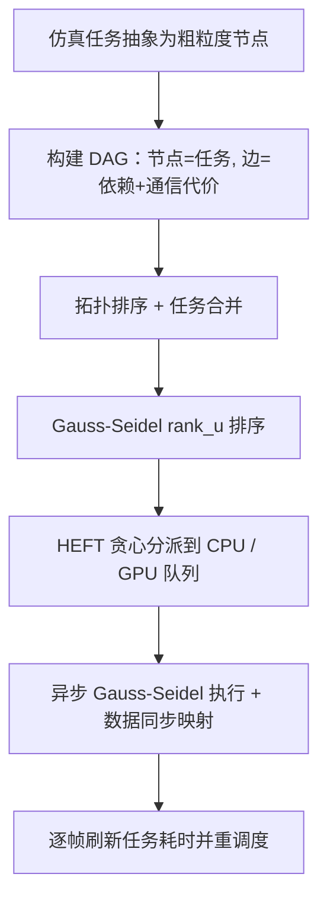

## 一句话总结

面向 CPU 与 GPU 集成于同一芯片（如 Apple M 系列）的 SoC 设备，本文把布料与可变形体仿真的迭代任务建模成有向无环图，用改进的 HEFT 调度算法把任务自动分派到 CPU 和 GPU 协同计算，并配套一套异步 Gauss-Seidel 方法，让混合计算相比只用 GPU 提速 30%~60%。

## 研究背景

- 领域现状：布料与可变形体仿真长期以来主要在单一计算单元（纯 CPU 或纯 GPU）上做并行，跨异构单元协同计算这一方向研究很少。原因是这类仿真包含大量需要频繁数据同步的迭代任务，而传统主板上各计算单元相互隔离、互联带宽有限，同步开销往往盖过并行带来的收益。
- 核心痛点：随着 IoT 推动 SoC 设计普及，Apple M 系列、AMD Ryzen 这类芯片把多个计算单元集成到单芯片并共享统一内存，大幅缓解了单元间带宽瓶颈，于是"异构协同仿真"重新变得可行。但真正的难点转移到了任务调度：不同架构单元算力和数据传输成本各异，如何在保证任务依赖与收敛性的前提下均衡分配负载，本身是一个 NP 完全问题。
- 本文 idea：把仿真流程抽象成粗粒度任务的 DAG，借用异构计算领域成熟的 HEFT（Heterogeneous Earliest Finish Time）静态调度算法并针对仿真场景改造，自动生成 CPU-GPU 协同的调度方案；同时针对 Gauss-Seidel 这类串行性强、难并行的迭代任务，设计异步 Gauss-Seidel 方法来释放跨单元并行度。

## 方法

整体框架：把一帧仿真里的各项操作（更新包围盒、宽/窄相碰撞检测、拉伸/弯曲约束求解、碰撞处理等）抽象成粗粒度任务节点，边表示依赖关系并带上通信代价，构成一个 DAG。对该 DAG 做拓扑排序与 $$rank_u$$ 排序后，用贪心策略把任务插入 CPU/GPU 各自的执行队列，使总完成时间最短。在此调度框架之上，再用异步 Gauss-Seidel 方法解决迭代任务的跨单元并行问题。

关键设计：

1. **HEFT 调度与任务合并**：HEFT 用 DAG 表示任务，节点记录各设备上的计算时间，边记录通信代价；先按依赖做拓扑排序，再从终端节点反向广度优先计算每个任务的 $$rank_u$$，其规则为 $$rank_u[i] = \mathrm{avg}(costs) + \max_{j \in successors}(rank_u[j] + comm[i][j])$$ ，然后按 $$rank_u$$ 降序用贪心算法为每个任务选"预计完成最早"的设备槽位。问题在于迭代仿真的任务往往被切成很细的小块（如拉伸计算常分成 5~8 个串行块），细任务容易整批被塞给同一设备，造成另一设备闲置。为此作者提出任务合并：把连续的小任务合并成大的粗粒度任务，使得合并后满足"放到更快设备上更划算"的条件（如四个弯曲块合并后满足 $$4t_2 > t_c + 4t_1$$ ，就能整体交给 GPU），把总时间从 $$8t_2$$ 降到 $$t_c + 8t_1$$ 。

2. **Gauss-Seidel $$rank_u$$ 排序**：异步 Gauss-Seidel 里同一次迭代内的任务遵循 GS 顺序，但跨迭代的任务顺序可能被打乱，导致收敛变差甚至不收敛。作者提出给更靠后迭代的任务赋予更小的 $$rank_u$$ 值，从而在排序中强制保持同类任务跨迭代的正确先后次序，让形变任务与碰撞任务能正确交错、更早通信，改善收敛。

3. **异步 Gauss-Seidel**：统一内存下多设备无法直接跑传统 GS。作者让每个设备内部按 GS 顺序执行，设备之间则以 Jacobi 方式独立并行、不做即时通信，最后按加权平均同步结果。为弥补缺少设备间通信带来的收敛损失，引入设备间数据同步机制：当一个 GPU 任务要执行时，取用最近完成的本设备任务数据和另一设备最近任务的数据。这里采用"跨迭代异步 + 迭代内同步"策略（取 $$n=2$$ 迭代并发），并把碰撞约束放在迭代末尾（Asyn-Serial Collision），收敛表现最优。

4. **基于displacement的数据同步与丢弃策略**：合并两个设备的结果时，直接对位置做平均（如 $$x = (x_a + x_c)/2$$ ）会破坏收敛、甚至产生穿透。作者改用"显式起点 + 位移合并"：借助调度图预先算好一张数据同步映射，为同步指定明确的起始位置，从而支持比简单平均更优的合并策略。同时采用丢弃策略——一个 CPU 任务若拿到了 GPU 数据就丢弃上一个 CPU 任务的数据，保证每个 CPU 任务只接收来自单一 GPU 任务的信息，避免陈旧数据干扰，让 GPU 作为主设备维持一致的数据流。正是这种带丢弃的频繁数据通信，使该方法收敛甚至优于传统同步 GS 的 XPBD。

方法还被推广到多种迭代求解器：XPBD（约束级 GS）、Vertex Block Descent（顶点级 GS）、Second-order Stencil Descent（混合 Jacobi-GS）、以及 Jacobi 预条件梯度下降（顶点级 Jacobi），说明其通用性。

## 实验结果

主实验在 Apple M3 Max 芯片上用 XPBD 仿真，对比纯 CPU、纯 GPU 与本文的 CPU-GPU 混合方案（时间单位毫秒，取每帧平均）。相较纯 GPU，混合方案执行时间提速普遍超过 30%、帧率提速超过 40%；相较纯 CPU 提速更为显著。

| 场景 | 顶点数 | 纯 CPU 帧耗时 | 纯 GPU 帧耗时 | 混合帧耗时 | 相对 GPU 时间提速 | 相对 GPU 帧率提速 |
|------|--------|--------------|--------------|-----------|------------------|------------------|
| Dress（多层裙装） | 104 K | 815.9 | 268.6 | 174.5 | 35% | 54% |
| Jersey（篮球服） | 69 K | 506.1 | 173.1 | 122.2 | 29% | 42% |
| Pillows（枕头落布） | 176 K | 2.18 K | 813.5 | 463.8 | 43% | 75% |
| Funnel（漏斗三层布） | 132 K | 2.21 K | 935.6 | 528.5 | 44% | 77% |
| Letters（字母入碗） | 190 K | 1.49 K | 368.9 | 266.0 | 27% | 38% |

其余实验用文字补充：在 M2 Max 上把方法应用到 VBD、SOSD、JPGD 三种求解器，相对纯 GPU 的时间提速分别为 18%、22%、35%，帧率提速 22%、28%、53%，表明方法对不同迭代范式普遍有效。收敛性对比显示，带 $$rank_u$$ 排序的异步 GS 明显优于串行 GS，而不带 $$rank_u$$ 的异步 GS 甚至无法收敛；位移平均相比位置平均能正确处理碰撞、避免穿透。调度器本身开销很低，每帧调度用时不到 0.1 ms，且运行时性能与调度前的理论预测高度吻合。

## 亮点与局限

- 亮点：
  - 首次把异构计算领域成熟的 HEFT 调度算法引入布料/可变形体仿真的迭代任务调度，思路新颖且落地为可用的 Metal/C++ 混合实现并开源。
  - 任务合并、Gauss-Seidel $$rank_u$$ 排序、带丢弃的位移同步等设计针对性强，既提并行度又保收敛；甚至因频繁通信让收敛优于传统同步 GS。
  - 通用性好，覆盖 XPBD、VBD、SOSD、JPGD 等 Jacobi / Gauss-Seidel / 混合范式；调度器开销极低，运行时表现贴合理论预测。

- 局限：
  - 设备间固有通信开销仍在；面向多个加速器扩展时存在可扩展性挑战。
  - 对高度非线性仿真或复杂约束场景，提速收益下降。
  - 架构无关的调度器虽通用，但实现验证只覆盖特定 GPU 配置，且需为不同平台分别手工实现，工作量大。

## 延伸思考

这项工作的价值在于把 SoC 统一内存这一硬件趋势与仿真调度问题接上了：当 CPU-GPU 共享内存、互联带宽不再是瓶颈，"让闲置的 CPU 核也参与进来"就从得不偿失变成净收益。作者自己指出的方向——用 LuisaCompute 这类 DSL 做跨平台实现——很关键，因为当前"每个平台手写一套"是落地的最大摩擦点，若能由编译器统一生成多后端代码，调度框架的通用性才真正兑现。另一个值得追问的点是动态负载：论文已做到逐帧更新任务耗时并重调度，但面对接触模式剧烈变化的场景，静态 HEFT + 逐帧刷新是否足够，还是需要更强的在线自适应调度，值得进一步验证。此外，把 TPU/NPU 等更多异构单元纳入同一 DAG 调度，以及异步 GS 在更强非线性材料下的收敛保证，都是自然的下一步。
