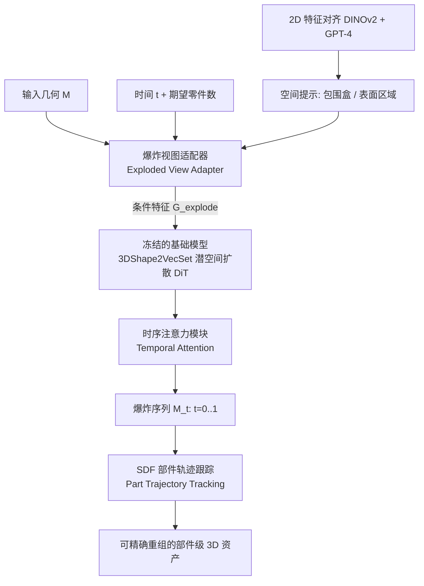

## 一句话总结

BANG 把一个整体 3D 网格通过"生成式爆炸动力学"（Generative Exploded Dynamics）平滑地拆解成语义连贯的零件序列，用一个轻量级适配器微调大规模潜空间扩散模型，从而在生成的同时完成部件级理解、可控拆分与逐件细节增强。

## 研究背景

人类创造 3D 内容的天性来自"拆解—重组"：像小孩拆玩具车、拼积木一样，通过分解与再造去理解物体结构。但当前主流 3D 工具很难复现这一过程，部件级的拆分与调整需要大量美术专业能力和手工劳动。

作者指出，2D 图像与文本领域已经通过"生成即理解"（如下一个 token 预测、DALL-E 3 + GPT-4）打通了生成与推理，而 3D 领域却存在割裂：

- 3D 生成近两年从蒸馏（DreamFusion）、多视图方法，发展到 3D 原生表示（3DShape2VecSet、CLAY、TRELLIS），但大多**只生成整体一块网格**，缺乏灵活的部件级操控能力。
- 3D 理解虽然在部件分割、结合大模型对话推理上有进展，但往往只关注**可见外表面**，忽略被遮挡的内部结构，难以建立物体内部的空间与语义联系。

因此需要一种更自然的方式来桥接 3D 生成与推理。受"大爆炸"理论启发——奇点爆发为恒星、行星与生命——作者提出 BANG，让 3D 物体通过平滑、一致的"爆炸"过程被拆分与重组，在生成中解构、在理解中重建。

## 方法

BANG 的核心是"生成式爆炸动力学"：给定输入几何 $M$ 与时间序列 $t\in\{t_1,\dots,t_T\}$，生成一组水密网格序列 $\{M_t\}$，让原始网格的各个零件从完全组装态（$t=0$）连续、径向地过渡到完全分离态（$t=1$）。它采用"预训练—适配"（pretrain-then-adaptation）范式。

关键设计：

**基础生成模型预训练。** 沿用 3DShape2VecSet / CLAY 的思路，基础模型由几何 VAE 与潜空间扩散模型（LDM）组成。从网格表面采样点云 $X$，编码为潜码 $Z\in\mathbb{R}^{L\times C}$：

$$Z = E(X) = \mathrm{CrossAttn}(\mathrm{PosEmb}(\tilde{X}), \mathrm{PosEmb}(X))$$

再用扩散 Transformer（DiT）去噪，VAE 解码器结合查询点 $p$ 输出 SDF 值：

$$D(Z, p) = \mathrm{CrossAttn}(\mathrm{PosEmb}(p), \mathrm{SelfAttn}_{24}(Z))$$

在约 50 万个水密化 Objaverse 几何上训练，得到强几何先验。

**爆炸视图适配器（Exploded View Adapter）。** 冻结基础模型，只训练轻量适配器，把来自 $M$ 与时间 $t$ 的条件信号注入。适配器先把 $M$ 的表面点云 $S$（$N=20480$，下采样因子 10）编码成几何特征 $G$：

$$G = \mathrm{CrossAttn}(\mathrm{PosEmb}(\tilde{S}), \mathrm{PosEmb}(S))$$

再经过带自适应 LayerNorm（adaLN）的轻量 Transformer 融入时间条件与期望零件数，得到条件特征 $G_{explode}$，通过并行 cross-attention 注入 DiT 主干。适配器学习对齐目标爆炸态：

$$\epsilon(Z_t + \epsilon_\tau, \tau, G_{explode}) \rightarrow Z_t$$

这样只训练轻量适配器就能保留大模型的几何先验，显著降低对爆炸数据量的需求。

**时序注意力模块（Temporal Attention）。** 借鉴视频扩散思路，在每个 DiT block 内加入跨帧自注意力，保证爆炸序列平滑连贯。引入帧级时间嵌入 TimeEmb(t)，类似大语言模型的 RoPE，只加到注意力的 query 与 key：

$$q \leftarrow q \oplus \mathrm{TimeEmb}(t), \quad k \leftarrow k \oplus \mathrm{TimeEmb}(t)$$

把 token 维与帧维合并为 $T\times L$ 个 token 做多头自注意力，让模型同时建立帧内一致性与帧间过渡。

**数据集构建。** 对 Objaverse 做严格筛选：保留零件数在 2～30、顶点数在 1e3～1e6 之间、无动画蒙皮的资产，并用 GPT-4 从多视图剔除扫描件、残缺件与复杂场景，同时标注对称性、多边形密度、视觉复杂度。对每个网格，优化各部件的平移向量模拟径向爆炸，最小化包围盒碰撞并约束过度平移，从 $t=0$ 到 $t=1$ 插值形成平滑序列。最终得到约 **20k** 高质量爆炸动力学资产。

**部件轨迹跟踪（Part Trajectory Tracking）。** 生成后需把完全爆炸态 $M_{t=1}$ 中通过连通分量识别出的各部件 $\{P_i\}$ 与原始几何对应起来。采用线性参数化 $p_i^t = p_i^0 + v_i(1-t)$，用 SDF 值作为对齐度量（对齐良好的部件在边界处 SDF 接近 0）：

$$\{v_i\} \leftarrow \arg\min \sum_t \sum_i \left\vert  \mathrm{QuerySDF}(M_t, \tilde{P}_i + v_i(1-t)) \right\vert $$

针对部件重叠问题，提出"停止重叠点梯度"（Stop Overlapped Point Gradients）：把落入其他部件内部（SDF 为负）的采样点掩掉，只让真实边界的"前沿"点提供梯度，从而得到正确的优化方向、更准的轨迹跟踪。

**可控生成。** 提供两类空间提示：3D 包围盒（可为无内部结构的几何指定体积区域，例如只建了外表面的抽屉桌）和表面区域（精确隔离表面细节区域）。通过扩展适配器中的 Prompt Transformer 分支，用交错 cross-attention 与几何特征交互。还加入一个辅助二值 token 指示"是否所有部件都由包围盒指定"或"未选区域是否仍自动爆炸"。此外重用 VAE 解码器产出与 DINOv2 对齐的几何特征：

$$L_{align} = \sum \left\| D_{feature}(Z, p_{depth}) - \mathrm{DINOv2}(I_{RGB}) \right\|^2$$

从而实现 2D→3D 的语义对应，用户可在渲染图或草图上用 SAM2 圈选区域，映射到 3D 网格，并可结合 GPT-4、Florence-2 做对话式部件理解与控制。

## 实验结果

**训练配置。** 基础模型 VAE 潜码大小 2048×64，编码器 1 层 cross-attention、解码器 24 层 self-attention + 1 层 cross-attention，特征维 512；LDM 为 24 层 Transformer，隐藏维 2560、20 个注意力头。基础模型用 AdamW（学习率 1e-5、batch 512）在 128 张 GPU 上训 1600 epoch。爆炸视图适配器为 4 层 Transformer、隐藏维 512，训 3000 epoch。推理时采样 5 帧，$\{t\}=\{0,0.25,0.5,0.75,1\}$，50 步扩散、DDPM 调度器、CFG 引导尺度 7。

**分割对比与用户研究。** 由于没有完全对标的部件感知生成基线，作者与两种领先表面分割方法 SAMesh、SAMPart3D 对比。50 位参与者在 10 个生成资产上评估，**65.5% 用户偏好 BANG**，26.2% 选 SAMesh，8.3% 选 SAMPart3D。同时 BANG 计算成本显著更低：平均每个资产 **45 秒**，而 SAMesh 为 386 秒、SAMPart3D 为 940 秒。分割方法只能隔离面区域、无法保留部件的体积完整性，而 BANG 能生成有意义的体积级部件分解。

**消融（部件轨迹跟踪指标，见下表）。** 在 PartObjaverse-Tiny 选 50 个未见过的物体，以真值包围盒为条件生成，评估加权 IoU（wIoU，越高越好）和 SDF 目标（越低越好）：

| 变体 | Weighted IoU ↑ | SDF Objective ↓ |
| --- | --- | --- |
| 去掉时序注意力 | 0.6874 | 0.0124 |
| 去掉停止梯度 | 0.7665 | 0.0092 |
| 完整方法 | **0.8163** | **0.0085** |

引入时序注意力使 wIoU 提升 18.8%、SDF 目标下降 31.5%，说明跨帧信息共享增强了时序一致性与爆炸线性度；停止重叠点梯度进一步提升了拟合精度。

**帧数评估。** 真值序列在 3 帧后两项指标即快速收敛；生成序列则持续改善到 5 帧。由于训练受 GPU 显存限制最多 5 帧，超过后性能自然下降，且计算成本随帧数略快于线性增长，因此 5 帧是精度与效率的平衡点。

**零件数控制。** 通过调整"期望零件数"嵌入可做粗粒度控制：请求更少零件时模型合并功能相关部件，请求更多时产生更细的结构分解，且不破坏语义一致性；但精确控制确切数量对扩散模型仍有挑战。

## 亮点与局限

亮点：

- 把"部件级 3D 拆分"重新表述为一个**连续的生成式爆炸过程**，而非静态表面分割，从而能揭示被遮挡的内部体积结构与部件边界。
- "预训练大模型 + 轻量适配器"的范式，只用约 20k 爆炸数据就能微调，充分复用大规模几何先验。
- 统一框架同时支撑逐件细节增强、多模态对话式理解、以及面向 3D 打印的可组装结构生成（含程序化互锁/可动关节），落地场景丰富。

局限（作者自述）：

- 对结构定义不清、极其复杂的物体仍力不从心，需扩充更多真实机械结构数据。
- 缺乏显式的逐件几何监督，加上潜码 token 长度受限，爆炸视图与原始几何在高细节区域存在明显偏差、局部细节丢失。
- 目前是面向视觉表现的"美术流水线"，不满足真实机械装配、物理约束的工程需求。
- 只处理几何，忽略材质属性（柔性、重量分布、兼容性）与外观（颜色、纹理），限制了真实拆装任务的适用性。

## 延伸思考

BANG 最有意思的地方在于它把"理解"编码进了"生成"——不需要显式分割标签，而是让扩散模型学会"如何把物体炸开"，爆炸的轨迹本身就隐含了部件的语义与空间依赖关系。这与"生成即理解"的思路在 3D 上形成呼应。

几个值得关注的方向：一是把逐件几何监督和更长的潜表示引入，缓解细节漂移，这可能需要层级化或部件级 latent；二是补上材质与外观维度后，BANG 有望从"美术拆解"走向"可制造/可维修"的工程拆解，与物理仿真结合去约束装配可行性；三是"递归爆炸再增强"的多层流水线（论文封面的机械人形就是这样生成的）提示了一种自上而下、逐层细化的 3D 内容生产范式，或可与 agent/多模态大模型的规划能力进一步耦合，做到真正对话驱动的部件级创作。
