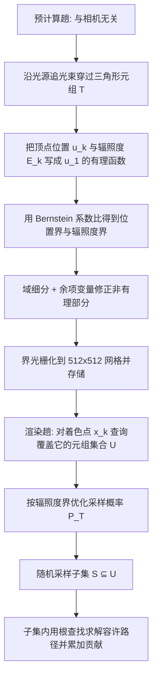

## 一句话总结

通过把镜面焦散路径的位置与辐照度表达成有理函数，并借助 Bernstein 多项式基获得保守而紧致的上下界，从而以"有界的方差"随机采样三角形元组，把复杂焦散渲染的效率提升约一个数量级。

## 研究背景

高频焦散（caustics）长期是物理渲染中的硬骨头。要无偏地捕捉镜面路径，需要在满足镜面约束（Fermat 原理）的前提下，找到连接两个非镜面端点（光源点与漫反射着色点）的容许路径。现有方法大体分两条路线：

- 在整场景的镜面流形上做随机游走（manifold walk），通用性强，但其点采样本质导致收敛难以保证，复杂场景中方差可能极高。
- 系统性方法在每个三角形元组内求解镜面路径（如 Path Cuts、Specular Polynomials），思路更稳健，但整体效率高度依赖如何挑选三角形元组。它们目前依靠区间算术（interval arithmetic）来剪枝无贡献区域，界既松、又是确定性的、还不考虑能量分布。

确定性枚举能得到像素级完美结果，但计算代价巨大；实际中随机采样才是高效无偏解的关键，前提是方差可控。而传统的 path guiding 等从点样本拟合能量分布的方式存在固有缺陷：点样本容易漏掉部分区域导致方差极高，且在线训练仍需一个（通常均匀的）初始分布。作者指出：一个可靠（误差有界）、自包含、方差理论可控的镜面路径采样方案，是一处明显的空白。

本文的核心洞见是：如果能为每个三角形元组在给定着色点处贡献的辐照度求得一个保守的界，就能据此构造总辐照度的随机估计器，并让其方差可控。低贡献元组被赋予极小概率，高贡献元组被重点采样，整体方差仍然很低。关键难题在于如何高效地得到尽量紧致且正确的界。

## 方法

整体分两趟：一个与相机无关的预计算趟（precomputation），沿光源方向追踪穿过每个镜面三角形元组的光束，计算并存储位置界与辐照度界；一个渲染趟（rendering），对每个着色点查询覆盖它的元组集合，按辐照度界优化采样概率并随机选取子集，再在子集内做根查找求解容许路径。

### 关键设计一：有理函数的 Bernstein 界

对定义在 $[0,1]^m$ 上的多元函数用 Bernstein 基展开，其系数天然给出函数在有限区间上的范围界。对有理函数 $f(x)=p(x)/q(x)$，在同阶 Bernstein 系数 $b_i(p)$、$b_i(q)$ 下（要求所有 $b_i(q)$ 同号且非零），可用系数比的极值夹逼函数范围：

$$\min_{i}\frac{b_i(p)}{b_i(q)} \le f(x) \le \max_{i}\frac{b_i(p)}{b_i(q)}$$

直观上，Bernstein 基相当于把函数建模为 Bézier 曲面并对控制点做运算，保留了变量间的相关性，因此比区间算术更紧。当分母系数不同号时，取倒数处理；两者都不满足时界退化为全集 $(-\infty,+\infty)$，通常出现在掠射角与焦点附近。Bernstein 界对区间长度具有二次收敛性，因此可通过域细分不断收紧，形成分段常数近似。

### 关键设计二：顶点位置与辐照度的有理化

位置沿用 Specular Polynomials 的有理坐标映射，用重心坐标表示顶点、法线与顶点差，逐顶点递推。折射方向中含有平方根项 $\sqrt{\beta_i}$ 并非有理，这里引入余项变量（remainder variable）$\xi_i$ 来补偿有理近似 $r(\beta_i)$ 的误差：

$$\tilde r(\beta_i,\xi_i)=r(\beta_i)+(1-\xi_i)\underline{\delta_i}+\xi_i\overline{\delta_i}$$

其中 $\underline{\delta_i}$、$\overline{\delta_i}$ 是近似误差的界。余项变量额外增加一维但保证界的正确性（保守性），并随域无限收缩收敛到真值。

辐照度由若干独立因子组成，忽略不大于 1 的可见性 $V$ 与 Fresnel 项 $F$ 后仍是正确的上界：

$$E_k(u_1)=I_0\,\frac{d\Omega_0}{dA_k}\,V(\bar x)F(\bar x)$$

其中广义几何项（GGT）$d\Omega_0/dA_k$ 用链式法则展开，核心是雅可比 $|\partial u_1/\partial u_k|$。作者给出两种求法：显式微分（explicit）简单但在近全内反射时因 $\beta_i\to 0$ 相对误差趋于无穷、界极松；隐式微分（implicit）通过多元镜面多项式约束 $F$、$G$ 求偏导，避免在特定顶点上对折射角做近似，把 2D 流形扩到 4D 超集，界或许更松但仍有效，在困难情形下更稳健。

### 关键设计三：界驱动的元组采样与方差优化

单个元组的总辐照度贡献是元组内所有容许路径贡献之和，其上界取各细分片中覆盖着色点的最大辐照度界乘以解数 $m$（实验中因"小三角形至多一解"假设取 $m=1$，且即使超出也不会引入偏差，只会增加方差）。

采样不再是"选哪一个元组"，而是允许多个元组被选中、逐个决定是否选取，用估计器

$$\langle E\rangle=\sum_{T\in S}\frac{E(T)}{P_T}$$

只要所有 $E(T)>0$ 的元组满足 $P_T>0$，估计器就无偏，无需防御性采样。其二阶矩（方差上界）可只用界 $\tilde E(T)$ 与概率 $P_T$ 表达：

$$\sigma^2\le \overline{\mu_2}=\sum_{T\in U}\frac{\tilde E^2(T)}{P_T}$$

在期望采样数 $W=\mathbb{E}[|S|]$ 约束下最小化该二阶矩，据 KKT 条件解得最优概率

$$P_T=\min\big(\gamma\,\tilde E(T),\,1\big)$$

其中 $\gamma$ 为常数参数。与连续情形关键不同在于必须显式处理 $P_T\le 1$ 约束。为把复杂度从 $O(|U|)$ 降到 $O(|S|\log|U|)$，作者用装箱（bin-packing）把概率和不超过 1 的元组打包，箱内做重要性采样，采用近似比为 2 的首次适配贪心。

工程细节还包括：BVH 遍历增量构造元组、界光栅化到 512×512 纹理网格、按面积/界比/深度三种停止准则递归四分细分、对超过约 40 阶的高阶多项式做降阶（再引入新余项变量保界），以及通过为 $x_0$ 增加变量把方法推广到面光源。

## 实验结果

方法实现于 Mitsuba 0.6，预计算部分用 Numba JIT，测试于 Intel Core i9-13900KF。对比涵盖确定性搜索（Specular Polynomials、Path Cuts）、流形采样（SMS、MPG）、光子类（SPPM、UPSMCMC）与常规蒙特卡洛（PT、BDPT、PPG、MEMLT）。指标为 RelMSE（越低越好）。

单次散射等时对比：

- Plane 场景（30 秒，预计算 2.1 秒）：本文 RelMSE 0.0009 / 40 spp，SP 0.0080 / 1 spp，MPG 0.6611 / 2 spp，SMS 0.3733 / 2 spp，UPSMCMC 0.0177 / 21 spp。
- Sphere 场景（40 秒，预计算 2.4 秒）：本文 0.0053 / 12 spp，SP 0.0403 / 1 spp，MPG 5.7010 / 5 spp，SMS 7.2111 / 5 spp，UPSMCMC 0.0374 / 19 spp。

双次散射等时对比：

- Slab 场景（30 秒，含预计算 23 秒）：本文 +Det 0.0099 / 2 spp、+Stoc 0.0147 / 2 spp，MPG 0.0498 / 8 spp，SMS 0.1374 / 8 spp，Path Cuts* 0.1398 / 26 spp，UPSMCMC 0.0341 / 25 spp，SPPM 0.0366 / 130 spp。
- Diamonds 场景（50 秒，含预计算 25 秒）：本文 +Det 0.0393 / 32 spp、+Stoc 0.0474 / 28 spp，MPG 5.8434 / 11 spp，SMS 9.1171 / 9 spp，Path Cuts* 0.4143 / 12 spp，UPSMCMC 0.3247 / 27 spp，SPPM 0.3436 / 204 spp。

面光源场景（Plane，30 秒等时，预计算 11 秒）：本文 0.0051 / 29 spp，SP 0.0120 / 1 spp，PT 0.0518 / 1030 spp，BDPT 0.0107 / 620 spp，PPG 0.0325 / 328 spp，MEMLT 0.0068 / 325 spp。首图 Dragon 场景（0.35M 三角形）本文两种预算分别达 RelMSE 0.0098 / 912 spp 与 0.2211 / 12 spp，显著优于对比方法。

其他验证与统计：界与真值之比 $\tilde E/E$ 几乎全部大于等于 1（无红色区域即无违反保守性），且以浅蓝（较紧）为主；解数统计中约 94.78% 元组为 0 解、5.21% 为 1 解、约 0.01% 为 2 解，佐证 $m=1$ 假设合理。双次散射时每个 $T_1$ 出射光平均只与 10 到 20 个 $T_2$ 相交，有效抑制了组合爆炸。网格细分实验显示，随三角形数增加（如 Plane 从 7K 到 458K），预计算时间、渲染时间与内存均呈亚线性增长，RelMSE 稳定在约 0.003 到 0.004；双折射球随三角形从 80 增至 5120，元组数呈线性增长而非朴素组合的二次增长。

## 亮点与局限

亮点：

- 提出焦散位置与辐照度的 Bernstein 界，把"点采样拟合能量"换成"在有限区间上对函数做保守分析"，界天然可靠且保守。
- 界驱动采样器无需防御性采样即内在无偏，可与多种无偏/有偏根查找方法组合，方差通过 $\gamma$ 单参数直观可控。
- 余项变量优雅地把非有理的平方根、降阶误差、乃至面光源等不确定性纳入统一的保界框架。
- 等时条件下相较现有无偏采样方法取得超过一个数量级的方差下降。

局限（作者明确列出）：

- 复杂度随链长快速增长，实用上仅适合一到两次弹射；长链会导致有理函数阶数高、降阶后界更松。
- 界的收敛率与紧致性尚无理论保证；三角形相交等情形界极松，需大量细分。
- 预计算中忽略可见性与 Fresnel 项，且假设单个小光源与纯镜面表面，预计算代价随光源数线性增长。
- 依赖若干细分参数；用均匀网格存储位置界，对非平面接收面性能退化。
- 在确定性搜索本已处理良好的场景（如浅水 Pool、每着色点相关元组少），本方法优势不明显。

## 延伸思考

这项工作的价值不止于焦散渲染本身，更在于展示了一条"用可靠界替代点采样统计"的思路。作者指出这套界或许可外推到流形采样与通用 path guiding。余项变量的强表达力也暗示了向近镜面顶点、非平面三角形、三角形聚合等方向扩展的可能——一旦复杂度从"三角形数"解耦为"实际几何复杂度"，就有望摆脱对场景细分粒度的敏感。另一个自然方向是把位置界从纹理网格改为带向量辐照度的体素界并引入空间层次结构，以摆脱对接收面配置的依赖。整体而言，这是把计算机辅助设计中成熟的 Bernstein/Bézier 数值工具引入光传输采样的一次成功跨界，值得关注其在更一般路径空间中的后续演化。
