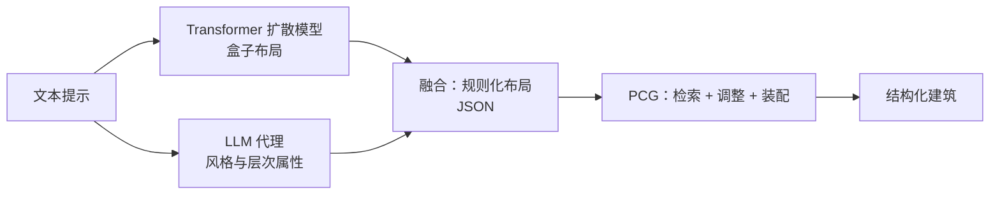

## 一句话总结

BuildingBlock 用"生成式扩散模型出布局 + 大语言模型补风格 + 程序化内容生成（PCG）搭实体"的三段式混合流程，从文本提示生成既多样又层次分明、可局部编辑的结构化三维建筑。

## 研究背景

- 领域现状：三维建筑生成在游戏、虚拟现实、数字孪生里需求很大。传统程序化内容生成（PCG）能按预定义规则自动化造楼，近年的文本驱动生成式模型也让"一句话出楼"成为可能。
- 核心痛点：PCG 靠规则堆细节，局部精致但缺少全局控制，很难保证各部件之间协调一致；而端到端的生成式模型虽然全局连贯，输出却是"一整块"缺乏结构化的层次信息（如楼层数、部件从属关系），既难挑选也难编辑。现有室内布局方法（如自回归的 ATISS、扩散式的 DiffuScene）又存在两个障碍：无序部件与卷积/自回归架构不匹配、缺少可用的建筑布局数据集。
- 本文 idea：把三者的长处拼起来——先用去掉位置编码的 Transformer 扩散模型生成"盒子布局"（全局一致），再让 LLM 把盒子布局扩写成带风格与层次的规则化布局，最后交给 PCG 落成高质量、可局部定制的结构化建筑。

## 方法

整体框架分两个阶段：布局生成阶段（Layout Generation Phase, LGP）与建筑构建阶段（Building Construction Phase, BCP）。LGP 是双分支：扩散分支生成部件包围盒，LLM 分支为部件补风格信息，二者融合成"风格化规则布局"；BCP 再据此用 PCG 检索、调整、装配部件，生成最终建筑。

关键设计：

1. **把盒子布局当点云来生成。** 每栋建筑被表示为不超过 $$N$$ 个部件盒的无序集合，每个盒子记为 $$C_i=[l_i, s_i, c_i]$$，分别是位置、尺寸和类别。作者沿用 DiffuScene 的思路用"空类别"把盒子数量补齐到固定的 $$N$$，但改进为 PadReal——即根据非空盒子随机赋予空盒子的位置/尺寸，训练更稳定。因为盒子无序、重排不改变语义，方法把布局生成看成点云式的无序序列生成任务。

2. **去位置编码的 Transformer 扩散网络。** 在 DiffuScene 的扩散框架上，用 Point·E 里的 Transformer 替换原来的 1D U-Net，让无序部件之间充分交互；引入 DiT 的自适应层归一化（AdaLN），并用 BERT 文本特征经交叉注意力做文本控制。关键是去掉了原有的位置编码以彻底摆脱序列顺序依赖，改用一个单层 MLP 的"空间编码"，把盒子的三维空间位置显式注入 Transformer 输入。训练损失是标准的噪声预测损失，另加一项对任意两盒子交并比的 IoU 损失：

   $$L = \mathbb{E}_{C_0,\epsilon,t}\left[\lVert \epsilon - \epsilon_\theta(C_t, t)\rVert_2^2\right]$$

   （建筑生成中墙与其他部件天然嵌套，训练时不在墙与其他部件之间计算 IoU 损失。）

3. **LLM 把盒子布局扩写成规则化布局。** 规则布局用 JSON 表达，信息容量和灵活性都高于纯包围盒——不仅含空间与类别，还能定制部件属性类型、表达层次结构。做法是：先由盒子布局加各类别的布局模板生成初始规则布局，再把建筑文本提示作为先验交给 LLM，让它推理每个盒子的风格属性（比如"现代办公楼"会推断出金属框的透明/反光玻璃窗），覆盖写回初始布局。该结构以墙为中心，能据相对位置判定门窗等部件的从属关系，形成两级层次信息供 PCG 使用。

4. **PCG 落地为实体建筑。** BCP 对规则布局里的每个部件，先按类别、再按风格检索候选，最后选尺寸比例最接近的资产；随后调用 Foundation SDK（每个功能是 Python 函数）做细节调整，例如用几何布尔运算在墙上开洞再嵌入窗、用 CGAL 合并重叠墙、用几何缩放函数处理部件拉伸（窗户先按窗棂方向单向拉伸再组合，窗棂数量随尺寸动态决定）。最后按布局层次把调整好的部件装配到位，并迭代对齐同一节点下的部件。

## 实验结果

主实验是无条件布局生成的定量对比，用 FID 和 KID 衡量生成布局的真实性与多样性（数值越低越好）。在自建的建筑布局数据集上，BuildingBlock 大幅领先各基线；在室内 3D-FRONT 卧室子集上同样取得最好结果，且生成速度约为 DiffuScene 的三倍。

| 方法 | 建筑 FID↓ | 建筑 KID↓ | 室内 FID↓ | 室内 KID↓ |
|------|-----------|-----------|-----------|-----------|
| 本文（Ours） | 6.00 | 0.30 | 16.76 | 0.29 |
| DiffuScene | 20.95 | 1.95 | 17.21 | 0.70 |
| ATISS | 30.93 | 3.34 | 18.60 | 1.72 |
| LayoutGPT（零样本） | 94.60 | 10.05 | 45.13 | 9.89 |

消融实验表明 PadReal 与空间编码单独使用只带来轻微提升（FID 从 13.33 分别降到 12.38 与 12.22），二者结合才把 FID 大幅拉到 6.00、KID 拉到 0.30，说明两项设计存在协同效应。定性上，ATISS、DiffuScene 常出现错位或悬空部件（如飘在空中的窗），而本文布局部件协调、复杂度与连贯性更高；与 Meshy、Rodin Gen-1.5 相比，本文生成的建筑结构清晰、立面干净、细节丰富，而后两者分别有噪声/空洞和过度平滑的卡通感问题。数据集方面，作者构建了首个三维建筑布局数据集：约 1.2k 栋建筑、42k 个部件盒、13 个部件类别，配 9.6k 张八视角渲染图与描述。

## 亮点与局限

- 亮点：
  - 三段式混合范式把生成模型的全局一致、LLM 的语义推理、PCG 的局部精细各取所长，回避了纯生成"缺结构"和纯 PCG"缺全局"的两难。
  - 去位置编码 + 空间编码的设计契合布局"无序"的本质，指标提升显著且推理更快。
  - 产出是带层次的规则化布局，天然支持局部增删/改风格的增量编辑，且不影响其他部件——这是端到端方法难以做到的。
  - 补上了领域空白：首个成对的三维建筑布局数据集。

- 局限：
  - LGP 对训练集中缺失、结构显著偏离常规的建筑（如埃菲尔铁塔）难以生成理想布局，泛化受数据分布约束。
  - PCG 依赖有限的部件资产库，遇到不支持的风格时 LLM 只能挂上最接近的可用风格，导致生成风格与目标风格错位。

## 延伸思考

这套"扩散出结构骨架 + LLM 补语义 + 程序化引擎落地"的分工，本质上是把"可控性"拆到不同环节：需要全局一致的地方交给生成模型，需要常识推理的地方交给 LLM，需要精确几何和可编辑性的地方交给规则引擎。这种模式对其他强调"全局控制 + 高层约束 + 局部可调"的结构化生成任务（室内场景、城市街区、机械装配等）都有借鉴意义。作者也指出两条自然的改进路径：用自动标注扩展数据以提升对未见建筑形态的泛化，以及引入更多生成模型动态扩充资产、纹理与贴花库，从而摆脱对固定资产库的依赖。一个值得追问的点是，当规则布局与资产库风格不匹配时，能否让生成式资产按需即时合成，形成布局与资产互相驱动的闭环。
